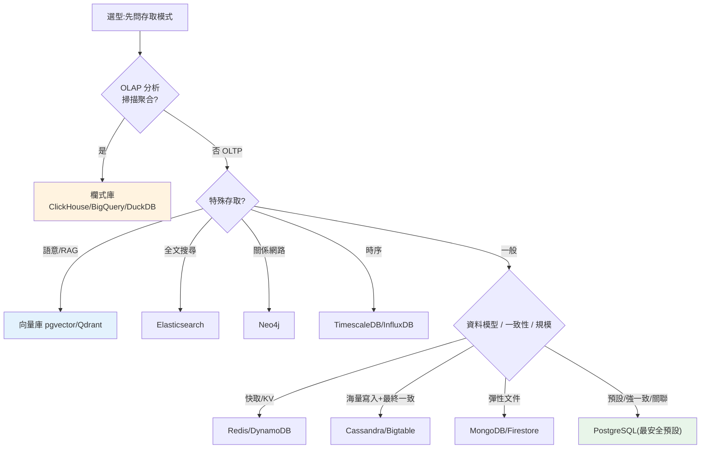

# NoSQL 家族與資料庫選型

> 前九章講的都是**關聯式資料庫**的原理。但今天的資料庫地貌遠不止於此:文件庫、鍵值庫、寬表、圖庫、時序庫、搜尋引擎、**向量庫**、欄式分析庫……這章帶你**看懂整片地貌**——每個 NoSQL 家族的資料模型、它為了擴展**放棄了什麼**、以及最實用的問題:**「這個場景該選哪種資料庫?」** 你會學到 OLTP vs OLAP 的第一個分岔、CAP 對選型的影響、以及一個關鍵心法:**PostgreSQL 是最安全的預設,別急著上一堆專用庫**。這是 Part 15 的收尾,把「懂原理」變成「會選型」。

## 💡 白話導讀(建議先讀)

先糾正一個普遍誤解:**NoSQL 不是「比 SQL 新、比 SQL 好」**——它是「**為了特定場景,故意放棄關聯式的某些能力**」換來的取捨。放棄了什麼(join、強一致、彈性查詢),換到什麼(水平擴展、彈性 schema),想清楚才能選。

選型第一問永遠是:**OLTP 還是 OLAP?**

- **OLTP(交易)**:頻繁的小讀寫(下單、查帳)→ 行式關聯庫(PostgreSQL/MySQL)。
- **OLAP(分析)**:大範圍聚合(月報表掃百萬列)→ 欄式倉儲(ClickHouse/BigQuery)。

NoSQL 四大家族,各自的「放棄與換得」:

| 家族 | 代表 | 一句話 |
|------|------|--------|
| 文件 | MongoDB | 彈性 JSON,放棄強 join |
| 鍵值 | Redis | 極速 key→value,放棄複雜查詢 |
| 寬表 | Cassandra | 海量寫入,放棄彈性查詢 |
| 圖 | Neo4j | 關係查詢之王,擴展較難 |

(加碼新板塊:**向量庫**——AI/RAG 的檢索引擎,[Part 28](../28-llm-genai/07-vector-databases.md)。)

兩條實務鐵律帶走:

1. **PostgreSQL 是最安全的預設**——靠擴充能兼任文件(JSONB)、時序、向量庫;「先用 Postgres,真撐不住再上專用庫」。
2. **每多一種資料庫=多一份維運、備份、一致性負擔**——別為了「理論上更適合」就開雜貨店。

## Why(為什麼)

「資料庫 = MySQL/PostgreSQL」是過時的認知。真實工程要面對:

- **不同資料與存取模式,適合不同資料庫**:存使用者交易(要 ACID、關聯查詢)、存商品目錄(彈性欄位)、做快取(超低延遲 KV)、算報表(掃描聚合)、做語意搜尋(向量)——**用一種資料庫硬扛所有場景,會處處彆扭**。懂家族分類,才能為每個需求選對工具。
- **NoSQL 不是「比 SQL 新/好」,是「不同取捨」**:很多人以為 NoSQL 是升級版——錯。NoSQL 為了**擴展性、彈性、特定存取模式**,**放棄**了關聯式的某些能力(強一致、join、彈性查詢、schema 約束)。不懂它放棄了什麼,選型就會踩坑(如拿最終一致的庫存金流)。
- **AI 時代多了向量庫這個新成員**:RAG、語意搜尋讓**向量資料庫**成為新顯學([Part 28](../28-llm-genai/07-vector-databases.md))。它是資料庫地貌的新板塊,懂它才跟得上。
- **選型錯誤的代價極高**:資料庫是系統的地基,選錯之後**極難搬遷**(資料量大、耦合深)。一個好的選型決策,勝過事後無數優化。這也是系統設計面試的高頻考點。

**這章給你一張「資料庫世界地圖」與一套選型決策框架**——把前九章的原理知識,轉化成真實專案裡「該用哪個資料庫」的判斷力。

## Theory(理論:為什麼有 NoSQL、OLTP vs OLAP)

**NoSQL 興起的動機**:2000 年代網際網路規模爆炸,關聯式資料庫在**超大規模水平擴展**([ch09](09-replication-sharding.md))時遇到瓶頸——join、強一致、固定 schema 在分片環境下代價高昂。NoSQL(「Not Only SQL」)放寬這些約束換取擴展性與彈性:

```text
關聯式(SQL)                    NoSQL(通稱)
├─ 固定 schema、強型別           ├─ 彈性 / 無 schema
├─ 強一致(ACID)               ├─ 常為最終一致(BASE)
├─ join、複雜查詢               ├─ 針對特定存取模式優化(常無 join)
├─ 垂直擴展為主                 ├─ 為水平擴展而生
└─ 通用                         └─ 專用(選對場景才強)
```

> **BASE**(Basically Available, Soft state, Eventual consistency)是相對 ACID 的一種取向——優先可用與擴展,容忍暫時不一致。這直接呼應 [CAP 定理](../22-distributed-systems/01-distributed-intro-cap.md)。

**OLTP vs OLAP——選型的第一個分岔**:

| | OLTP(交易處理) | OLAP(分析處理) |
|--|-----------------|------------------|
| 工作 | 頻繁的小讀寫(下單、查帳) | 少量大範圍聚合(報表、分析) |
| 查詢 | 點查、改幾列 | 掃百萬列、GROUP BY |
| 儲存 | **行式**([ch04](04-storage-engine.md)) | **欄式**(壓縮好、只讀需要的欄) |
| 代表 | PostgreSQL、MySQL | ClickHouse、BigQuery、Snowflake |

**先問「這是 OLTP 還是 OLAP」**——決定了行式交易庫還是欄式分析庫,這是最粗但最關鍵的分類。

## Specification(規範:資料庫家族全覽)

**NoSQL 四大家族 + 專用庫**:

| 家族 | 資料模型 | 放棄了什麼 | 適合 | 代表 |
|------|----------|-----------|------|------|
| **文件(Document)** | JSON/BSON 文件、可巢狀 | 強 join、跨文件交易 | 彈性 schema、內容管理、目錄 | MongoDB、Firestore、Couchbase |
| **鍵值(Key-Value)** | key → value | 複雜查詢(只能靠 key) | 快取、session、排行榜 | Redis、DynamoDB、Memcached |
| **寬表(Wide-Column)** | 列族、稀疏大表 | join、彈性查詢 | 超大寫入、時序/事件 | Cassandra、Bigtable、ScyllaDB |
| **圖(Graph)** | 節點 + 邊 | 水平擴展較難 | 關係查詢(社群、推薦、詐欺) | Neo4j、Neptune |
| **時序(Time-Series)** | 時間戳 + 度量 | 通用查詢 | 監控、IoT、金融行情 | InfluxDB、TimescaleDB、Prometheus |
| **搜尋(Search)** | 倒排索引 | 強一致、交易 | 全文檢索、日誌分析 | Elasticsearch、OpenSearch |
| **向量(Vector)** ⭐ | 高維向量 + ANN | 精確查詢 | 語意搜尋、RAG、推薦 | pgvector、Qdrant、Milvus、Pinecone |
| **欄式分析(OLAP)** | 欄式儲存 | 高頻小寫入 | 大規模聚合分析 | ClickHouse、DuckDB、BigQuery |
| **分散式 SQL(NewSQL)** | 關聯式 + 水平擴展 | 部分單機延遲 | 要 SQL+ACID 又要全球規模 | CockroachDB、Spanner、TiDB |

**選型速記表**:

| 需求 | 選 |
|------|-----|
| 一般業務系統(預設) | **PostgreSQL** |
| 彈性 schema / 巢狀文件 | MongoDB / Firestore |
| 快取 / session / 排行榜 | **Redis** |
| 超大寫入 / 時序事件 | Cassandra / Bigtable |
| 關係網路查詢 | Neo4j |
| 監控 / IoT 時序 | TimescaleDB / InfluxDB |
| 全文搜尋 / 日誌 | Elasticsearch |
| **AI 語意搜尋 / RAG** | **pgvector** / Qdrant / Milvus |
| 大規模分析報表 | ClickHouse / BigQuery / Snowflake |
| SQL + 全球水平擴展 | CockroachDB / Spanner |

## Implementation(底層:選型決策與 polyglot 陷阱)

**核心心法一:PostgreSQL 是最安全的預設**。今日的 PostgreSQL 靠擴充能**一庫多用**:JSONB(當文件庫)、TimescaleDB(時序)、pgvector(向量)、PostGIS(地理)、全文檢索——加上完整 ACID、關聯查詢、成熟生態。主流建議是:**「先用 PostgreSQL,遇到它真的解不了的規模/場景,再引入專用庫。」** 這避免了過早引入複雜度。

**核心心法二:polyglot persistence(多元持久化)的陷阱**。「為每個場景用最適合的資料庫」聽起來很美(polyglot persistence),但**每多一種資料庫 = 多一份維運、監控、備份、一致性、團隊學習成本**。三個資料庫的系統,運維負擔遠超一個。**原則:有明確、無法用現有庫解決的理由,才引入新資料庫**。不是「這場景理論上更適合 X」,而是「現有的真的撐不住/做不到」。

**核心心法三:選型看四個維度**:

```text
1. 資料模型:結構化關聯?文件?KV?圖?→ 決定家族
2. 存取模式:OLTP 點查/OLAP 掃描聚合?讀多寫多?查詢多變還是固定?
3. 一致性需求:必須強一致(金流)還是可最終一致(讚數)?→ 呼應 CAP
4. 規模與擴展:資料量、寫入量、是否需水平擴展到單機以上?
+ 團隊熟悉度、生態、營運成本(常被低估但很關鍵)
```

**CAP 對選型的影響**([Part 22](../22-distributed-systems/01-distributed-intro-cap.md)):分散式資料庫在網路分區時,只能在一致性(C)與可用性(A)間選一個。**金流/庫存**要 C(寧可不可用也不能算錯);**社群動態/購物車**可選 A(暫時不一致沒關係,要一直能用)。選型時把「這份資料錯了會怎樣」想清楚,決定一致性需求。下面用 Python 實作一個資料庫選型決策器,把這套框架程式化。

## Code Example(可執行的 Python 範例)

```python
# db_selection.py — 資料庫選型決策器(純標準庫)
from __future__ import annotations

from dataclasses import dataclass


@dataclass
class Workload:
    data_model: str      # "relational" | "document" | "keyvalue" | "graph" | "timeseries"
    access: str          # "oltp" | "olap" | "search" | "semantic"
    strong_consistency: bool
    huge_write_scale: bool
    relationship_heavy: bool = False


def recommend_db(w: Workload) -> str:
    """依工作負載推薦資料庫家族(回傳建議 + 理由)。"""
    # 分析型優先分流(OLTP/OLAP 是第一個分岔)
    if w.access == "olap":
        return "欄式分析庫(ClickHouse / BigQuery / DuckDB)- OLAP 掃描聚合"
    if w.access == "semantic":
        return "向量庫(pgvector / Qdrant)- 語意搜尋 / RAG"
    if w.access == "search":
        return "搜尋引擎(Elasticsearch)- 全文檢索"
    # OLTP 內依資料模型與需求細分
    if w.relationship_heavy or w.data_model == "graph":
        return "圖庫(Neo4j)- 關係網路查詢"
    if w.data_model == "timeseries":
        return "時序庫(TimescaleDB / InfluxDB)- 時間序列"
    # 海量寫入 + 可最終一致 → 寬表(先於一般 KV 判斷)
    if w.huge_write_scale and not w.strong_consistency:
        return "寬表(Cassandra / Bigtable)- 超大寫入、可最終一致"
    if w.data_model == "keyvalue":
        return "鍵值庫(Redis / DynamoDB)- 快取 / 低延遲 KV"
    if w.data_model == "document" and not w.strong_consistency:
        return "文件庫(MongoDB / Firestore)- 彈性 schema"
    # 預設:關聯式(最安全)
    return "關聯式(PostgreSQL)- 通用預設、ACID、可擴充 JSONB/向量/時序"


def polyglot_warning(db_count: int) -> str:
    """多元持久化的營運成本警示。"""
    if db_count <= 1:
        return "單一資料庫:營運簡單"
    ops_load = db_count * (db_count + 1) // 2  # 粗略:種類越多,整合/一致性負擔越重
    return (f"{db_count} 種資料庫:營運/一致性負擔約 {ops_load} 單位——"
            f"確定每種都有『現有庫解不了』的明確理由嗎?")


def main() -> None:
    cases = [
        ("使用者/訂單(金流)", Workload("relational", "oltp", True, False)),
        ("商品目錄(彈性欄位)", Workload("document", "oltp", False, False)),
        ("熱門排行榜", Workload("keyvalue", "oltp", False, False)),
        ("IoT 感測資料", Workload("timeseries", "oltp", False, True)),
        ("好友推薦", Workload("relational", "oltp", False, False, relationship_heavy=True)),
        ("每日營運報表", Workload("relational", "olap", False, False)),
        ("文件語意搜尋(RAG)", Workload("document", "semantic", False, False)),
        ("點擊事件流(海量寫入)", Workload("keyvalue", "oltp", False, True)),
    ]
    print("資料庫選型:")
    for name, w in cases:
        print(f"  {name}: {recommend_db(w)}")

    print("\nPolyglot persistence 警示:")
    for n in (1, 3, 5):
        print(f"  {polyglot_warning(n)}")


if __name__ == "__main__":
    main()
```

**預期輸出**:

```pycon
$ python db_selection.py
資料庫選型:
  使用者/訂單(金流): 關聯式(PostgreSQL)- 通用預設、ACID、可擴充 JSONB/向量/時序
  商品目錄(彈性欄位): 文件庫(MongoDB / Firestore)- 彈性 schema
  熱門排行榜: 鍵值庫(Redis / DynamoDB)- 快取 / 低延遲 KV
  IoT 感測資料: 時序庫(TimescaleDB / InfluxDB)- 時間序列
  好友推薦: 圖庫(Neo4j)- 關係網路查詢
  每日營運報表: 欄式分析庫(ClickHouse / BigQuery / DuckDB)- OLAP 掃描聚合
  文件語意搜尋(RAG): 向量庫(pgvector / Qdrant)- 語意搜尋 / RAG
  點擊事件流(海量寫入): 寬表(Cassandra / Bigtable)- 超大寫入、可最終一致

Polyglot persistence 警示:
  單一資料庫:營運簡單
  3 種資料庫:營運/一致性負擔約 6 單位——確定每種都有『現有庫解不了』的明確理由嗎?
  5 種資料庫:營運/一致性負擔約 15 單位——確定每種都有『現有庫解不了』的明確理由嗎?
```

逐段解說:

- **`recommend_db` 的決策順序 = 選型思路**:先看**存取模式**(OLAP/語意/搜尋這些「非典型 OLTP」優先分流到專用庫)→ 再看**資料模型 + 一致性 + 規模**細分。這對映「先問 OLTP 還 OLAP,再談資料模型」的框架。
- **金流走 PostgreSQL(強一致)**:即使「訂單」可以塞文件庫,但**需要 ACID 強一致**——決策器落到關聯式預設。這體現「一致性需求」這個維度的決定性。
- **同是海量寫入,結果不同**:「IoT 感測資料」是時序 → 時序庫;「點擊事件流」是 KV 模型 + 海量寫入 + 可最終一致 → 寬表(Cassandra)。**資料模型 + 一致性一起決定家族**。
- **RAG 走向量庫**:`access="semantic"` 直接分流到 pgvector/Qdrant——呼應 [Part 28](../28-llm-genai/07-vector-databases.md) 的 AI 檢索。
- **`polyglot_warning` 把「多庫成本」量化**:1 種庫簡單;但 3 種、5 種時,整合/一致性/維運負擔隨種類數快速上升(這裡用 `n(n+1)/2` 粗略表達「兩兩之間都要處理一致性/資料流」)。這把心法「別過早引入多庫」變成看得見的警示——**每引入一種都要問「現有的真的解不了嗎」**。
- **PostgreSQL 作為預設的價值**:很多「看起來要專用庫」的場景(彈性欄位→JSONB、向量→pgvector、時序→TimescaleDB),其實 PostgreSQL 靠擴充就能扛——決策器的 fallback 也點出這點。
- **要點**:先分 OLTP/OLAP;NoSQL 各家族為特定存取模式放棄關聯式某些能力(強一致/join/彈性查詢);選型看資料模型 + 存取模式 + 一致性 + 規模 + 團隊/營運成本;PostgreSQL 是最安全預設、能一庫多用;polyglot persistence 要有明確理由,別過早引入多庫。

## Diagram(圖解:資料庫選型決策樹)



## Best Practice(最佳實踐)

- **PostgreSQL 當預設起點**:通用、ACID、可靠、靠擴充一庫多用(JSONB/pgvector/TimescaleDB);撐不住再換。
- **先分 OLTP / OLAP**:交易用行式關聯、分析用欄式倉儲;別用同一庫硬扛兩頭。
- **依「資料模型 + 存取模式 + 一致性 + 規模」選型**,並把團隊熟悉度與營運成本納入。
- **一致性需求想清楚**:金流/庫存要強一致;讚數/動態可最終一致([CAP](../22-distributed-systems/01-distributed-intro-cap.md))。
- **克制 polyglot persistence**:有「現有庫真的解不了」的明確理由才引入新庫;每種都是持續成本。
- **NoSQL 要清楚放棄了什麼**:別拿最終一致的庫做金流、別期待 KV 庫做複雜查詢。
- **向量需求先試 pgvector**:已在 Postgres 就不必另立向量庫,除非規模需要專用庫。
- **選型是長期決定**:資料庫難搬遷,前期多想勝過後期優化;做 PoC 驗證再定案。

## Common Mistakes(常見誤解)

- **以為 NoSQL 比 SQL 新/好**:是不同取捨,不是升級;放棄了強一致/join/彈性查詢換擴展。
- **拿最終一致的庫做金流/庫存**:超賣、算錯錢;強一致場景用關聯式/NewSQL。
- **過早上一堆專用庫(polyglot 陷阱)**:維運/一致性負擔爆炸;先用 PostgreSQL 一庫多用。
- **用 OLTP 庫跑大分析或反之**:行式掃聚合慢、欄式做點查慢;分清 OLTP/OLAP。
- **KV 庫期待複雜查詢**:只能靠 key 存取;需要查詢就選對家族。
- **跟風選型**:因為「大廠用 X」就用,不看自己的資料模型/規模/團隊。
- **忽略營運成本與團隊熟悉度**:理論最適 ≠ 實際最好;會維運才是能用。
- **以為選了就不能變**:能變但代價極高;所以選型要慎重、先 PoC。

## Interview Notes(面試重點)

- **能講 NoSQL 的本質**:為擴展/彈性/特定存取模式,放棄關聯式的強一致/join/彈性查詢(不是「更好」)。
- **能列四大家族 + 專用庫**:文件/KV/寬表/圖,加時序/搜尋/向量/欄式 OLAP/NewSQL,各自資料模型與適用。
- **(高頻)能講 OLTP vs OLAP**:小讀寫行式 vs 掃描聚合欄式;選型第一個分岔。
- **能做選型決策**:依資料模型 + 存取模式 + 一致性 + 規模 + 團隊,給出合理推薦與理由。
- **能講 PostgreSQL 當預設的理由**:通用 + ACID + 可擴充一庫多用;先用它撐不住再換。
- **能講 polyglot persistence 的取捨**:最適工具 vs 營運複雜度;有明確理由才引入多庫。
- **能連 CAP 到選型**:一致性需求(金流強一致 vs 動態最終一致)決定分散式庫的選擇([Part 22](../22-distributed-systems/01-distributed-intro-cap.md))。
- **能連向量庫到 AI**:RAG/語意搜尋的檢索引擎([Part 28](../28-llm-genai/07-vector-databases.md))。

---

➡️ 進入實作篇:[DB-API 規範](11-db-api.md)(開始用 Python 操作資料庫)

[⬆️ 回 Part 15 索引](README.md)
