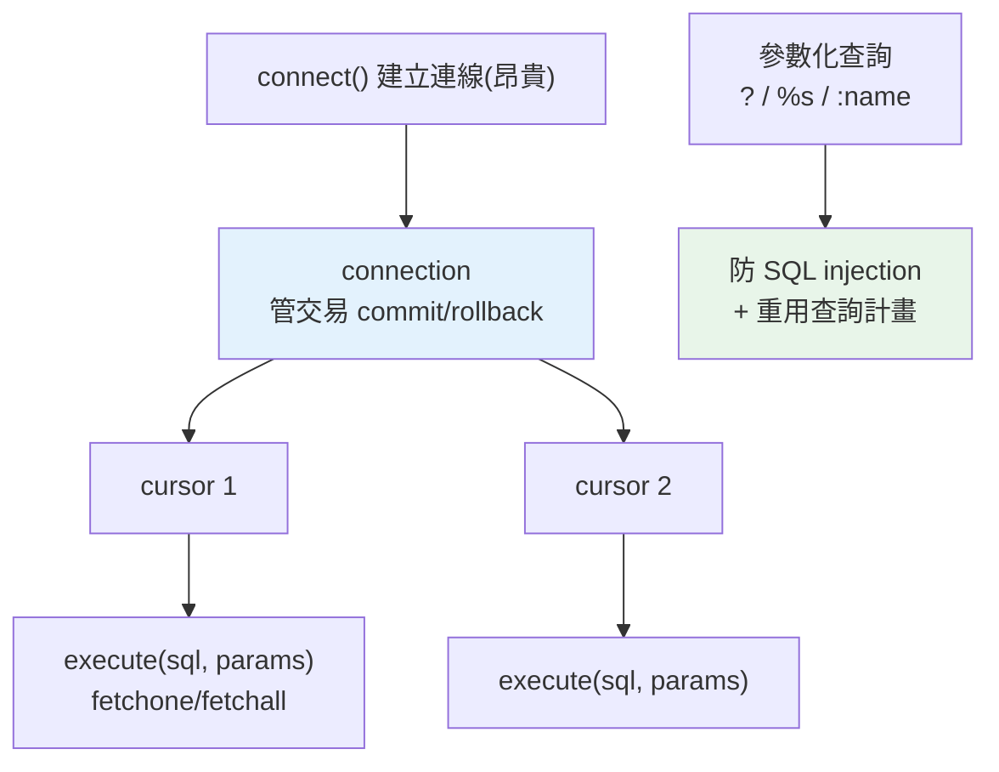

# DB-API 規範

> Python 存取任何關聯式資料庫，底層都是同一套介面——PEP 249 DB-API 2.0。搞懂 connection、cursor、參數化查詢，你就掌握了所有 DB 驅動的共通語言，換資料庫時也不慌。

## Why（為什麼）

Python 要連 PostgreSQL、MySQL、SQLite、Oracle——每種資料庫的驅動套件不同（`psycopg`、`mysqlclient`、內建 `sqlite3`…）。如果每個驅動的用法都不一樣，你換資料庫就得重學一遍。**PEP 249（DB-API 2.0）** 是 Python 官方定義的「資料庫存取標準介面」——**所有驅動都遵循同一套 API**（`connect()`、`cursor()`、`execute()`、`fetchone()`…）。學會它，你就會用「所有」關聯式資料庫的驅動；換資料庫時，商業邏輯幾乎不用改。即使你平常用 SQLAlchemy ORM（見 [SQLAlchemy ORM](14-sqlalchemy-orm.md)），它底層也是走 DB-API——理解這層讓你在出問題時知道發生什麼。

## Theory（理論：connection 與 cursor 模型）

DB-API 的核心是兩個物件：**connection（連線）** 與 **cursor（游標）**。

- **connection**：代表「與資料庫的一條連線」。負責 **transaction 邊界**（commit/rollback，見 [transaction](16-transactions.md)）與關閉連線。建立連線成本高（TCP 握手、認證），所以實務上會用連線池重用（見 [連線池](15-connection-pool.md)）。
- **cursor**：代表「一次查詢的執行與結果游標」。你用 cursor `execute()` SQL、用 `fetchone()`/`fetchall()` 取結果。一條連線可開多個 cursor。

為什麼分兩層？因為「連線」是昂貴、長生命週期的資源（一條 TCP 連線），而「查詢」是短暫、頻繁的操作。分開讓一條連線能重複執行多個查詢、管理一致的 transaction。這個模型幾乎所有語言的資料庫 API 都採用（Java JDBC、Go database/sql 同理）。

## Specification（規範：PEP 249 核心 API）

```python
import sqlite3   # 任何 DB-API 驅動用法都類似（psycopg、mysql.connector...）

# 1. 建立連線
conn = sqlite3.connect("app.db")

# 2. 取得 cursor
cur = conn.cursor()

# 3. 執行 SQL（參數化！）
cur.execute("INSERT INTO users (name, age) VALUES (?, ?)", ("Alice", 30))

# 4. 查詢與取結果
cur.execute("SELECT id, name FROM users WHERE age > ?", (18,))
row = cur.fetchone()        # 取一列 → tuple 或 None
rows = cur.fetchall()       # 取全部剩餘 → list[tuple]
# for row in cur:           # cursor 可迭代（省記憶體）

# 5. 提交交易（寫入才生效）
conn.commit()

# 6. 關閉
cur.close()
conn.close()
```

**DB-API 標準元素**：

| 元素 | 說明 |
|------|------|
| `connect(...)` | 模組層級函式，建立 connection |
| `conn.cursor()` | 建立 cursor |
| `cur.execute(sql, params)` | 執行單一 SQL（帶參數） |
| `cur.executemany(sql, seq)` | 批次執行（多組參數） |
| `cur.fetchone()` / `fetchall()` / `fetchmany(n)` | 取結果 |
| `conn.commit()` / `conn.rollback()` | 交易控制 |
| `cur.rowcount` / `cur.lastrowid` | 影響列數 / 最後插入 id |
| `paramstyle` | 該驅動的參數風格（`qmark`/`format`/`named`…） |

## Implementation（參數化、fetch、批次、context manager）

### 🔴 參數化查詢：絕不要字串拼接

**這是資料庫最重要的安全規則**：SQL 的值一律用**參數化**傳入，**絕不用字串格式化拼進 SQL**——否則會有 **SQL injection（SQL 注入）** 漏洞（見 [SQL injection](../20-security-system-design/02-injection.md)）：

```python
# 🔴 危險：字串拼接 → SQL injection 漏洞
name = "'; DROP TABLE users; --"
cur.execute(f"SELECT * FROM users WHERE name = '{name}'")   # 災難！

# ✅ 安全：參數化（驅動負責跳脫）
cur.execute("SELECT * FROM users WHERE name = ?", (name,))  # 值被當純資料
```

參數化不只防注入，還讓資料庫能**重用查詢計畫**（prepared statement）、正確處理型別（日期、None→NULL）。**永遠參數化**——這是初階與資深的分水嶺。

注意不同驅動的 **`paramstyle`**（參數佔位符不同）：

```python
# sqlite3: qmark 風格 → ?
cur.execute("... WHERE id = ?", (1,))
# psycopg (PostgreSQL): format 風格 → %s
cur.execute("... WHERE id = %s", (1,))
# 也有 named 風格 → :name
cur.execute("... WHERE id = :id", {"id": 1})
```

### fetch 的三種方式

```python
cur.execute("SELECT id, name FROM users")

cur.fetchone()      # 取一列（tuple），沒有則 None
cur.fetchmany(10)   # 取 n 列（list[tuple]）
cur.fetchall()      # 取全部剩餘（list[tuple]）—— 大結果集小心記憶體

# 最省記憶體：直接迭代 cursor（一次一列，不全載入）
for row in cur:
    print(row)
```

**大結果集用迭代或 `fetchmany`**，別無腦 `fetchall()`（可能一次載入百萬列爆記憶體，見 [記憶體與效能](../18-performance/README.md)）。

### `executemany`：批次操作

插入多筆時用 `executemany` 比迴圈 `execute` 快得多（減少往返）：

```python
users = [("Alice", 30), ("Bob", 25), ("Cara", 35)]
cur.executemany("INSERT INTO users (name, age) VALUES (?, ?)", users)
conn.commit()
```

### 用 context manager 管理

DB-API 物件配合 `with`（見 [context manager](../06-error-handling/06-context-manager.md)）自動管理——但注意各驅動語意略有不同：

```python
import sqlite3

# sqlite3：connection 當 context manager 管理「交易」（自動 commit/rollback），不關連線
with sqlite3.connect("app.db") as conn:
    conn.execute("INSERT INTO users (name) VALUES (?)", ("Dave",))
    # 區塊正常結束 → 自動 commit；拋例外 → 自動 rollback

# cursor 用 closing 確保關閉
from contextlib import closing
with closing(conn.cursor()) as cur:
    cur.execute("SELECT * FROM users")
    rows = cur.fetchall()
```

`with sqlite3.connect(...)` 管的是**交易**（不是關連線，這點常被誤解）——區塊成功 commit、出錯 rollback。要關連線仍需 `conn.close()`。

## Code Example（可執行的 Python 範例）

```python
# db_api_demo.py — 用內建 sqlite3 展示 DB-API（可獨立執行）
from __future__ import annotations

import sqlite3


def demo() -> None:
    # 用記憶體資料庫（:memory:），不落地、適合示範/測試
    conn = sqlite3.connect(":memory:")
    conn.execute("CREATE TABLE users (id INTEGER PRIMARY KEY, name TEXT, age INTEGER)")

    # 1. 參數化插入（安全）
    cur = conn.cursor()
    cur.execute("INSERT INTO users (name, age) VALUES (?, ?)", ("Alice", 30))
    print(f"插入 Alice，lastrowid = {cur.lastrowid}")

    # 2. 批次插入
    cur.executemany(
        "INSERT INTO users (name, age) VALUES (?, ?)",
        [("Bob", 25), ("Cara", 35), ("Dave", 17)],
    )
    conn.commit()

    # 3. 參數化查詢（防注入）
    cur.execute("SELECT name, age FROM users WHERE age >= ? ORDER BY age", (18,))
    print("成年使用者：")
    for name, age in cur:  # 迭代 cursor（省記憶體）
        print(f"  {name}: {age}")

    # 4. 示範 injection 防護：惡意輸入被當純資料
    evil = "'; DROP TABLE users; --"
    cur.execute("SELECT COUNT(*) FROM users WHERE name = ?", (evil,))
    print(f"\n查詢惡意字串當作純資料（找到 {cur.fetchone()[0]} 筆，資料表沒被 DROP）")
    cur.execute("SELECT COUNT(*) FROM users")
    print(f"users 表仍有 {cur.fetchone()[0]} 筆資料")

    conn.close()
    print("\n重點：connection 管交易、cursor 執行查詢、參數化防 SQL injection")


if __name__ == "__main__":
    demo()
```

**預期輸出**：

```pycon
$ python db_api_demo.py
插入 Alice，lastrowid = 1
成年使用者：
  Bob: 25
  Alice: 30
  Cara: 35

查詢惡意字串當作純資料（找到 0 筆，資料表沒被 DROP）
users 表仍有 4 筆資料

重點：connection 管交易、cursor 執行查詢、參數化防 SQL injection
```

## Diagram（圖解：connection 與 cursor）



## Best Practice（最佳實踐）

- **永遠用參數化查詢**（`?`/`%s`/`:name`），**絕不字串拼接 SQL**——防 SQL injection（見 [SQL injection](../20-security-system-design/02-injection.md)）。這是最重要的一條。
- **connection 管交易、cursor 執行查詢**：一條連線可開多 cursor、跑多查詢。
- **明確 `commit()`**：寫入操作沒 commit 不生效（多數驅動預設不自動提交）。
- **大結果集用迭代或 `fetchmany`**，別無腦 `fetchall()`（記憶體）。
- **批次用 `executemany`**：比迴圈 execute 快。
- **用 `with` / `closing` 管理資源**：確保 commit/rollback 與關閉——注意各驅動 `with` 語意（sqlite3 的 `with conn` 管交易不關連線）。
- **實務用連線池**（見 [連線池](15-connection-pool.md)）：連線昂貴，別每次查詢都新建。
- **知道底層**：即使用 ORM，理解 DB-API 幫你 debug。

## Common Mistakes（常見誤解）

- **字串拼接 SQL（f-string/`%`/`+`）**：SQL injection 頭號漏洞——一律參數化。
- **忘記 `commit()`**：寫入沒生效卻以為成功（尤其 PostgreSQL/MySQL）。
- **無腦 `fetchall()` 大表**：一次載入爆記憶體；用迭代/`fetchmany`。
- **以為 `with sqlite3.connect()` 會關連線**：它管交易，不關連線（要 `close()`）。
- **每次查詢都 `connect()`**：連線昂貴；用連線池。
- **把 `%s` 當 Python 字串格式化**：`cur.execute("... %s", (v,))` 的 `%s` 是驅動的參數佔位符，不是 f-string——別自己先格式化。
- **共用一個 cursor 跨執行緒**：cursor/connection 通常非執行緒安全；每執行緒/請求各自取得。

## Interview Notes（面試重點）

- **能說出 PEP 249 DB-API 2.0 是 Python 統一的資料庫存取介面**，所有驅動都遵循（換 DB 邏輯不用大改）。
- **能解釋 connection（管交易、昂貴、長生命週期）vs cursor（執行查詢、短暫）的分工**。
- **最重要：知道必須參數化查詢防 SQL injection**，能說出「值當純資料傳、驅動負責跳脫、還能重用查詢計畫」；能指出不同 `paramstyle`（`?`/`%s`/`:name`）。
- 知道 `commit`/`rollback` 交易控制、`executemany` 批次、大結果集用迭代/`fetchmany`。
- 知道即使用 ORM，底層仍是 DB-API；連線昂貴要用連線池。

---

⬅️ 上一章：[NoSQL 家族與資料庫選型](10-nosql-selection.md)(資料庫原理篇結束,由此進入實作篇)

➡️ 下一章：[sqlite3](12-sqlite3.md)

[⬆️ 回 Part 15 索引](README.md)
