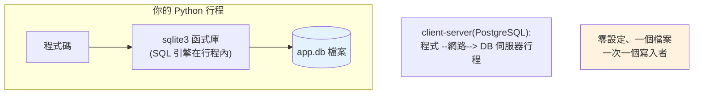

# sqlite3

> SQLite 是「檔案就是資料庫」的零設定關聯式資料庫，內建於 Python。它是學 SQL、寫測試、做小工具、甚至中小型正式服務的最佳起點——不用架伺服器，一個檔案搞定。

## 💡 白話導讀（建議先讀）

想練 SQL、寫個帶儲存的小工具——難道要先架一台 PostgreSQL 伺服器？

**SQLite 的答案：資料庫就是一個檔案。**

一般資料庫是「**中央檔案室**」：獨立的伺服器行程、要安裝設定、透過網路連線。
SQLite 是「**隨身筆記本**」：引擎是個函式庫、直接跑在你的程式裡、整個資料庫就是硬碟上的一個 `.db` 檔——**沒有伺服器這回事**。

而且 **Python 內建**（`import sqlite3`，免安裝），遵循[上一章的 DB-API](11-db-api.md)——學的東西直接通用。

先破除「玩具」印象：**SQLite 是世界上部署最廣的資料庫**——每支手機、每個瀏覽器裡都有它。

何時用它、何時換，一張表：

| 場景 | 選 |
|------|-----|
| 學 SQL、單元測試（`:memory:` 記憶體庫）、桌面/CLI 工具、嵌入式 | **SQLite** ✓ |
| 多人高併發寫入、網路服務多實例共用 | client-server（PostgreSQL）|

關鍵限制記一條：**寫入一次只能一個人**（檔案鎖）——讀可以很多人，寫會排隊。單機工具無感，高併發服務就是換庫的訊號。

本書的[練習題](../../exercises/part15/)與範例全用它——零安裝就能動手。

## Why（為什麼）

想學資料庫、寫個帶儲存的小工具、或給測試一個真的資料庫——架 PostgreSQL/MySQL 太重（要安裝、設定、跑 daemon）。**SQLite** 是「嵌入式」資料庫：**整個資料庫就是一個檔案**，不需要伺服器行程，而且 **Python 內建 `sqlite3` 模組**（免安裝）。它遵循 DB-API（見 [DB-API](11-db-api.md)），是練習 SQL、寫單元測試、做桌面/CLI 應用的理想選擇。SQLite 不是玩具——它是世界上部署最廣的資料庫（每支手機、每個瀏覽器裡都有）。理解它的能力與限制，你就知道何時它夠用、何時該換成 client-server 資料庫。

## Theory（理論：嵌入式 vs client-server）

一般資料庫（PostgreSQL、MySQL）是 **client-server 架構**——中央檔案室：獨立的 DB 伺服器行程，程式透過網路連上去。

SQLite 是**嵌入式（embedded）**——隨身筆記本：**資料庫引擎就是一個函式庫，直接跑在你的行程內，讀寫一個本地檔案**。沒有伺服器、沒有網路。

| | SQLite（嵌入式） | PostgreSQL/MySQL（client-server） |
|--|-----------------|----------------------------------|
| 架構 | 函式庫 + 一個檔案 | 獨立伺服器行程 + 網路 |
| 設定 | 零（免安裝伺服器） | 需安裝、設定、維運 |
| 併發寫入 | 一次一個寫入者（檔案鎖） | 高併發（MVCC，見 [transaction](16-transactions.md)） |
| 適合 | 學習、測試、單機工具、嵌入式 | 多人服務、高併發 |

SQLite 不是玩具——它是**部署最廣**的資料庫（手機、瀏覽器內建）。理解它的能力與限制，就知道何時夠用、何時該換。

## Specification（規範：sqlite3 常用 API）

```python
import sqlite3

# 連線：檔案 or 記憶體
conn = sqlite3.connect("app.db")        # 檔案（持久）
conn = sqlite3.connect(":memory:")      # 記憶體（測試用，關閉即消失）

# 讓查詢結果可用欄名存取（預設是 tuple）
conn.row_factory = sqlite3.Row

# 執行 SQL
conn.execute("CREATE TABLE IF NOT EXISTS t (id INTEGER PRIMARY KEY, name TEXT)")
cur = conn.execute("SELECT * FROM t WHERE id = ?", (1,))
row = cur.fetchone()
print(row["name"])                       # 用欄名（因為 row_factory = Row）

conn.commit()
conn.close()

# 常用 PRAGMA（設定）
conn.execute("PRAGMA foreign_keys = ON")   # 啟用外鍵約束（預設關！）
conn.execute("PRAGMA journal_mode = WAL")  # WAL 模式：改善併發讀寫
```

## Implementation（row_factory、型別、外鍵、WAL、記憶體 DB）

### `sqlite3.Row`：用欄名存取

預設查詢回傳 tuple（`row[0]`、`row[1]`），可讀性差。設 `row_factory = sqlite3.Row` 後能用**欄名**存取：

```python
conn.row_factory = sqlite3.Row
row = conn.execute("SELECT id, name, age FROM users WHERE id = ?", (1,)).fetchone()

print(row["name"], row["age"])    # 用欄名（清楚）
print(row[0])                      # 仍可用索引
dict(row)                          # 可轉 dict：{'id':1, 'name':..., 'age':...}
```

**一律設 `row_factory = sqlite3.Row`**——用欄名比魔術索引清楚太多、且欄位順序改變不會出錯。

### SQLite 的型別系統：動態型別

SQLite 型別系統特殊——它是**動態型別（type affinity）**：欄位宣告的型別只是「建議」，實際可存任何型別。它有 5 種儲存類別：`NULL`、`INTEGER`、`REAL`、`TEXT`、`BLOB`。

Python 型別對應：

| Python | SQLite |
|--------|--------|
| `None` | NULL |
| `int` | INTEGER |
| `float` | REAL |
| `str` | TEXT |
| `bytes` | BLOB |

**注意**：SQLite 沒有原生 `bool`、`datetime`、`Decimal` 型別。`bool` 存成 0/1；`datetime` 要自己轉字串（ISO 格式）或存 timestamp。日期建議存 ISO 字串（`"2026-07-02"`）或 Unix timestamp，查詢時再轉。

### 外鍵約束預設是關的（陷阱）

**SQLite 預設不強制外鍵約束**——這是超常見的坑。要每條連線都手動開啟：

```python
conn = sqlite3.connect("app.db")
conn.execute("PRAGMA foreign_keys = ON")   # 必須！否則外鍵形同虛設

# 之後才會擋：插入指向不存在的父列、刪除被引用的父列
```

不開的話，你以為有外鍵保護（刪 user 時該擋住有訂單的），實際 SQLite 根本沒檢查。**每條連線都要設 `PRAGMA foreign_keys = ON`**。

### WAL 模式：改善併發

預設 SQLite 用 rollback journal，寫入時鎖住整個資料庫（連讀都擋）。**WAL（Write-Ahead Logging）模式**讓「讀」和「寫」能同時進行（讀者不擋寫者、寫者不擋讀者）：

```python
conn.execute("PRAGMA journal_mode = WAL")   # 設定一次即持久（存進 DB 檔）
```

WAL 大幅改善併發讀寫效能，是 SQLite 用於稍高併發場景的關鍵設定。但仍是「一次一個寫入者」。

### 記憶體資料庫：測試利器

`:memory:` 建立純記憶體資料庫——**極快、關閉即消失**，是單元測試的完美選擇（見 [fixture](../12-testing/04-fixtures.md)）：

```python
import pytest
import sqlite3

@pytest.fixture
def db():
    conn = sqlite3.connect(":memory:")
    conn.row_factory = sqlite3.Row
    conn.execute("CREATE TABLE users (id INTEGER PRIMARY KEY, name TEXT)")
    yield conn
    conn.close()   # 測試結束自動清掉（記憶體 DB 消失）

def test_insert(db):
    db.execute("INSERT INTO users (name) VALUES (?)", ("Alice",))
    assert db.execute("SELECT COUNT(*) FROM users").fetchone()[0] == 1
```

每個測試拿到全新、乾淨、隔離的資料庫，不互相污染、跑得飛快。

## Code Example（可執行的 Python 範例）

```python
# sqlite3_demo.py — 展示 sqlite3 實用特性（可獨立執行）
from __future__ import annotations

import sqlite3


def demo() -> None:
    conn = sqlite3.connect(":memory:")
    conn.row_factory = sqlite3.Row  # 用欄名存取
    conn.execute("PRAGMA foreign_keys = ON")  # 啟用外鍵（預設關！）

    # 建表（含外鍵）
    conn.executescript("""
        CREATE TABLE users (id INTEGER PRIMARY KEY, name TEXT NOT NULL);
        CREATE TABLE orders (
            id INTEGER PRIMARY KEY,
            user_id INTEGER NOT NULL,
            amount INTEGER,
            FOREIGN KEY (user_id) REFERENCES users(id)
        );
    """)

    # 插入
    conn.execute("INSERT INTO users (id, name) VALUES (1, 'Alice')")
    conn.execute("INSERT INTO orders (user_id, amount) VALUES (1, 100)")
    conn.execute("INSERT INTO orders (user_id, amount) VALUES (1, 250)")
    conn.commit()

    # 用欄名存取結果
    print("Alice 的訂單：")
    for row in conn.execute("SELECT id, amount FROM orders WHERE user_id = 1"):
        print(f"  訂單 #{row['id']}: {row['amount']} 元")  # 欄名存取

    # JOIN 查詢
    row = conn.execute("""
        SELECT u.name, COUNT(o.id) AS cnt, SUM(o.amount) AS total
        FROM users u JOIN orders o ON o.user_id = u.id
        WHERE u.id = 1 GROUP BY u.id
    """).fetchone()
    print(f"\n{row['name']} 共 {row['cnt']} 筆訂單，總額 {row['total']} 元")

    # 外鍵保護：插入指向不存在的 user 會被擋
    try:
        conn.execute("INSERT INTO orders (user_id, amount) VALUES (999, 50)")
    except sqlite3.IntegrityError as e:
        print(f"\n外鍵約束擋下無效訂單: {e}")

    conn.close()
    print("\n重點：row_factory=Row 用欄名、PRAGMA foreign_keys=ON 啟外鍵、:memory: 測試")


if __name__ == "__main__":
    demo()
```

**預期輸出**：

```pycon
$ python sqlite3_demo.py
Alice 的訂單：
  訂單 #1: 100 元
  訂單 #2: 250 元

Alice 共 2 筆訂單，總額 350 元

外鍵約束擋下無效訂單: FOREIGN KEY constraint failed

重點：row_factory=Row 用欄名、PRAGMA foreign_keys=ON 啟外鍵、:memory: 測試
```

## Diagram（圖解：SQLite 嵌入式架構）



## Best Practice（最佳實踐）

- **一律設 `row_factory = sqlite3.Row`**：用欄名存取，清楚且抗欄位順序變動。
- **每條連線設 `PRAGMA foreign_keys = ON`**：SQLite 預設不強制外鍵（大坑）。
- **稍高併發用 `PRAGMA journal_mode = WAL`**：讀寫可並行、效能更好。
- **測試用 `:memory:` 資料庫**：快、隔離、免清理（配 pytest fixture）。
- **日期/時間存 ISO 字串或 timestamp**：SQLite 無原生 datetime 型別。
- **參數化查詢**（見 [DB-API](11-db-api.md)）：防 SQL injection。
- **知道 SQLite 的定位**：測試、單機 app、讀多寫少的中小服務適合；高併發寫入、多使用者用 client-server（PostgreSQL）。
- **`executescript`** 一次跑多條 SQL（建 schema 方便）。

## Common Mistakes（常見誤解）

- **忘了 `PRAGMA foreign_keys = ON`**：以為有外鍵保護，其實 SQLite 沒檢查——資料完整性漏洞。
- **不設 `row_factory`**：用 `row[0]`、`row[1]` 魔術索引，難讀又脆弱。
- **拿 SQLite 扛高併發寫入**：一次一個寫入者，多使用者同時寫會 `database is locked`；改用 client-server。
- **以為欄位型別是強制的**：SQLite 動態型別，宣告 INTEGER 也能塞字串（type affinity）。
- **存 `datetime` 物件卻沒轉換**：無原生型別；存 ISO 字串/timestamp。
- **正式服務仍用單一 SQLite 檔跨多機**：SQLite 是本地檔案、不能網路共享；多機要 client-server。
- **不 `commit`**：寫入沒生效（見 [DB-API](11-db-api.md)）。

## Interview Notes（面試重點）

- **能對比嵌入式（SQLite：函式庫+檔案、零設定、一次一個寫入者）vs client-server（PostgreSQL：獨立伺服器、高併發）**，並說出各自適用場景。
- **知道 SQLite 常見陷阱：外鍵預設關（要 `PRAGMA foreign_keys = ON`）、動態型別、寫入併發限制**。
- 知道 `row_factory = sqlite3.Row`（欄名存取）、`WAL` 模式改善併發、`:memory:` 適合測試。
- 知道 SQLite 遵循 DB-API（見 [DB-API](11-db-api.md)）、是部署最廣的資料庫、無原生 datetime 型別。
- 能說出「何時該從 SQLite 換成 PostgreSQL」：多使用者高併發寫入、需要網路存取、需要進階功能。

---

➡️ 下一章：[SQLAlchemy Core](13-sqlalchemy-core.md)

[⬆️ 回 Part 15 索引](README.md)
