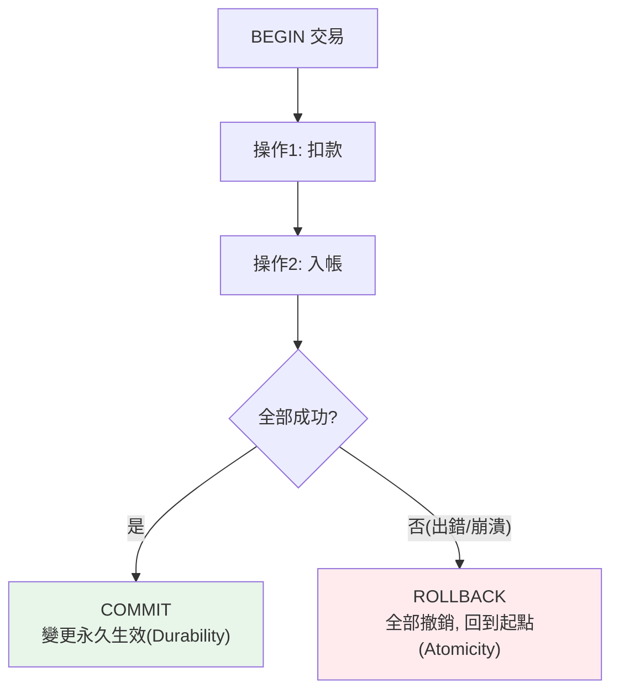

# transaction 交易

> 「轉帳」要嘛兩個帳戶都改成功、要嘛都不動——絕不能扣了款卻沒入帳。交易（transaction）就是保證「一組操作全成功或全失敗」的機制。理解 ACID 與隔離級別，你才能寫出資料不會錯亂的程式。

## 💡 白話導讀（建議先讀）

轉帳 = 兩步：A 扣 100、B 加 100。**做到一半斷電**——錢憑空消失？

交易（transaction）就是為這種事存在的：**把多步操作綁成「全做或全不做」的一包**：

```python
with conn:                    # 開始交易
    扣_A_100()
    加_B_100()
# 全部成功 → commit 生效;任一步爆炸 → 自動 rollback,像沒發生過
```

教科書的 **ACID** 四字訣，白話一遍：

- **A 原子性**——全有或全無（上面的轉帳）。
- **C 一致性**——做完帳要平（約束都滿足）。
- **I 隔離性**——多筆交易同時跑，互不偷看對方做到一半的狀態。
- **D 持久性**——說了 commit 就算斷電也不反悔。

其中「隔離」有**程度之分**——像包廂的隔音等級:全隔音（Serializable）最安全但最貴;多數資料庫預設中等（Read Committed:聽不到隔壁「還沒定案」的話）。
等級不夠時會漏音:髒讀、不可重複讀、幻讀——對照表章內給（[原理篇 ch07](07-transactions-concurrency.md) 已講過機制,這章是 Python 實操視角）。

Python 端的莊家規則一條:**多數驅動預設不自動 commit**——寫入後忘了 `conn.commit()`,資料就是沒進去。用 `with` 管交易邊界最穩。

## Why（為什麼）

想像轉帳：從 A 扣 100、給 B 加 100。如果扣款成功後程式崩潰，B 卻沒加到——錢憑空消失。資料庫的 **交易（transaction）** 就是解決這個：**把多個操作綁成一個「不可分割的單元」，要嘛全部成功（commit）、要嘛全部撤銷（rollback）**，中間狀態絕不會留下。這是任何涉及「多步驟資料一致性」的系統（金流、庫存、訂單）的根基。而多個使用者同時操作時，交易的 **隔離級別（isolation level）** 決定他們會不會互相干擾、看到彼此的中間狀態。搞懂交易與 ACID，是寫出正確資料庫程式與通過面試的必備。

## Theory（理論：ACID 與隔離級別）

交易的保證用 **ACID** 概括：

- **A — Atomicity（原子性）**：交易內的操作「全做或全不做」。任一步失敗，整個交易 rollback，回到起點。
- **C — Consistency（一致性）**：交易讓資料庫從一個「合法狀態」轉到另一個「合法狀態」（滿足所有約束：外鍵、唯一、check）。
- **I — Isolation（隔離性）**：並發的交易互不干擾，彷彿一個接一個執行（實際由隔離級別調控程度）。
- **D — Durability（持久性）**：一旦 commit，資料就永久保存（即使斷電），靠寫入磁碟/日誌（WAL）保證。

**隔離級別**是「並發交易能看到彼此多少」的取捨——隔離越強越正確但越慢（鎖多）。SQL 標準四級，對應會發生的並發異常：

| 隔離級別 | Dirty Read | Non-repeatable Read | Phantom Read |
|---------|:---------:|:-------------------:|:------------:|
| Read Uncommitted | ✅ 可能 | ✅ | ✅ |
| Read Committed（多數 DB 預設） | ❌ | ✅ | ✅ |
| Repeatable Read（MySQL 預設） | ❌ | ❌ | ✅* |
| Serializable（最強） | ❌ | ❌ | ❌ |

- **Dirty read（髒讀）**：讀到別的交易「還沒 commit」的資料（對方可能 rollback）。
- **Non-repeatable read（不可重複讀）**：同一交易內讀同一列兩次，值不同（別人 commit 了 UPDATE）。
- **Phantom read（幻讀）**：同一查詢兩次，列數不同（別人 commit 了 INSERT/DELETE）。

## Specification（規範：交易控制）

```python
# --- 原生 DB-API ---
conn = sqlite3.connect("app.db")
try:
    conn.execute("UPDATE accounts SET balance = balance - 100 WHERE id = 1")
    conn.execute("UPDATE accounts SET balance = balance + 100 WHERE id = 2")
    conn.commit()                 # 兩步都成功才提交
except Exception:
    conn.rollback()               # 任一步失敗，全部撤銷
    raise

# --- SQLAlchemy：engine.begin() 自動交易 ---
with engine.begin() as conn:      # 區塊成功自動 commit、出錯自動 rollback
    conn.execute(update(accounts).where(accounts.c.id == 1).values(...))
    conn.execute(update(accounts).where(accounts.c.id == 2).values(...))

# --- SQLAlchemy ORM Session ---
with Session(engine) as session:
    with session.begin():         # 自動交易邊界
        session.add(order)
        account.balance -= 100
    # 區塊結束自動 commit（出錯 rollback）

# --- 設隔離級別 ---
engine = create_engine(url, isolation_level="SERIALIZABLE")
# 或每連線：conn.execution_options(isolation_level="REPEATABLE READ")
```

## Implementation（原子轉帳、commit/rollback、隔離、死鎖）

### 原子性：轉帳範例

交易的經典場景——轉帳必須原子：

```python
def transfer(conn, from_id: int, to_id: int, amount: int) -> None:
    try:
        # 檢查餘額
        balance = conn.execute(
            "SELECT balance FROM accounts WHERE id = ?", (from_id,)
        ).fetchone()[0]
        if balance < amount:
            raise ValueError("餘額不足")   # 拋錯 → 觸發 rollback

        conn.execute("UPDATE accounts SET balance = balance - ? WHERE id = ?", (amount, from_id))
        conn.execute("UPDATE accounts SET balance = balance + ? WHERE id = ?", (amount, to_id))
        conn.commit()                       # 兩步都成功 → 提交
    except Exception:
        conn.rollback()                     # 任何失敗 → 全撤銷（錢不會消失）
        raise
```

關鍵：**扣款與入帳綁在同一交易**。若入帳前崩潰/出錯，`rollback` 把扣款也撤銷——絕不會「扣了沒入」。

### 用 context manager 自動管理

手動 try/except/rollback 容易忘。用 SQLAlchemy 的 `engine.begin()` 或 `session.begin()`（見 [context manager](../06-error-handling/06-context-manager.md)）自動處理：

```python
# 區塊成功 → 自動 commit；拋例外 → 自動 rollback
with engine.begin() as conn:
    conn.execute(update(accounts).where(accounts.c.id == 1).values(balance=accounts.c.balance - 100))
    conn.execute(update(accounts).where(accounts.c.id == 2).values(balance=accounts.c.balance + 100))
    # 這裡拋錯的話，上面的 UPDATE 都會被 rollback
```

這是**推薦做法**——把交易邊界綁到 `with` 區塊，不會忘記 commit/rollback。

### 隔離級別的實際影響

以「不可重複讀」為例——為什麼隔離重要：

```python
# Read Committed（預設）下，同交易內兩次讀可能不同
with engine.connect() as conn:
    price1 = conn.execute(select(products.c.price).where(products.c.id == 1)).scalar()
    # ... 此時另一交易 commit 了 UPDATE price ...
    price2 = conn.execute(select(products.c.price).where(products.c.id == 1)).scalar()
    # price1 != price2！（不可重複讀）

# 若需要「同交易內讀到一致的值」→ 用 Repeatable Read 或更高
engine_rr = create_engine(url, isolation_level="REPEATABLE READ")
```

**選擇原則**：多數 OLTP 應用用預設（Read Committed）就好；需要「交易內讀取一致」用 Repeatable Read；需要「完全序列化正確性」（如財務對帳）用 Serializable（代價是更多鎖/重試）。

### 悲觀鎖 vs 樂觀鎖

處理並發更新同一列（如搶票、扣庫存）有兩種策略：

- **悲觀鎖（pessimistic）**：`SELECT ... FOR UPDATE` 讀取時就鎖住該列，別的交易得等。適合衝突頻繁：

  ```python
  # SELECT ... FOR UPDATE：鎖住列直到交易結束
  stmt = select(Product).where(Product.id == 1).with_for_update()
  product = session.scalars(stmt).one()
  product.stock -= 1        # 期間其他交易無法改這列
  session.commit()
  ```

- **樂觀鎖（optimistic）**：不鎖，讀時記下版本號，更新時檢查版本沒變（`WHERE version = old_version`），變了就重試。適合衝突少（見 [並發控制](../22-distributed-systems/README.md)）。

### 死鎖

兩個交易互相等對方的鎖（A 鎖了 row1 等 row2，B 鎖了 row2 等 row1）→ **死鎖（deadlock）**。資料庫會偵測並強制其中一個 rollback（拋錯）。防範：**所有交易以相同順序取得鎖**（如都先鎖 id 小的），並準備好重試死鎖失敗的交易。

### 交易要短

**交易期間持有鎖，會阻塞別人**——所以交易要盡量短：別在交易中間做慢操作（呼叫外部 API、等使用者輸入、跑重運算）。開啟交易 → 快速讀寫 → 立刻 commit。長交易會拖垮並發。

## Code Example（可執行的 Python 範例）

```python
# transaction_demo.py — 用 sqlite3 展示交易原子性（可獨立執行）
from __future__ import annotations

import sqlite3


def setup() -> sqlite3.Connection:
    conn = sqlite3.connect(":memory:")
    conn.execute("CREATE TABLE accounts (id INTEGER PRIMARY KEY, name TEXT, balance INTEGER)")
    conn.executemany(
        "INSERT INTO accounts VALUES (?, ?, ?)",
        [(1, "Alice", 1000), (2, "Bob", 500)],
    )
    conn.commit()
    return conn


def transfer(conn: sqlite3.Connection, from_id: int, to_id: int, amount: int) -> None:
    """原子轉帳：全成功或全撤銷。"""
    try:
        balance = conn.execute("SELECT balance FROM accounts WHERE id = ?", (from_id,)).fetchone()[0]
        if balance < amount:
            raise ValueError(f"餘額不足（有 {balance}，要轉 {amount}）")
        conn.execute("UPDATE accounts SET balance = balance - ? WHERE id = ?", (amount, from_id))
        conn.execute("UPDATE accounts SET balance = balance + ? WHERE id = ?", (amount, to_id))
        conn.commit()
    except Exception:
        conn.rollback()  # 撤銷所有變更
        raise


def balances(conn: sqlite3.Connection) -> dict[str, int]:
    return {name: bal for name, bal in conn.execute("SELECT name, balance FROM accounts")}


def demo() -> None:
    conn = setup()
    print(f"初始: {balances(conn)}")

    # 成功轉帳（原子提交）
    transfer(conn, 1, 2, 300)
    print(f"Alice 轉 300 給 Bob: {balances(conn)}")

    # 失敗轉帳（餘額不足 → rollback，金額不變）
    try:
        transfer(conn, 2, 1, 99999)
    except ValueError as e:
        print(f"轉帳失敗（{e}）→ rollback")
    print(f"失敗後餘額不變: {balances(conn)}")

    total = sum(balances(conn).values())
    print(f"\n總額守恆: {total}（1500，交易保證錢不會憑空增減）")
    print("重點：交易原子性—全成功或全撤銷，中間狀態絕不留下")
    conn.close()


if __name__ == "__main__":
    demo()
```

**預期輸出**：

```pycon
$ python transaction_demo.py
初始: {'Alice': 1000, 'Bob': 500}
Alice 轉 300 給 Bob: {'Alice': 700, 'Bob': 800}
轉帳失敗（餘額不足（有 800，要轉 99999））→ rollback
失敗後餘額不變: {'Alice': 700, 'Bob': 800}

總額守恆: 1500（1500，交易保證錢不會憑空增減）
重點：交易原子性—全成功或全撤銷，中間狀態絕不留下
```

## Diagram（圖解：交易的 commit/rollback）



## Best Practice（最佳實踐）

- **相關的多步驟操作綁在同一交易**（轉帳、下單扣庫存）：保證原子性。
- **用 `with engine.begin()` / `session.begin()` 自動管理交易邊界**：成功 commit、出錯 rollback，不會忘。
- **交易要短**：別在交易中做慢操作（外部 API、等輸入）——持鎖阻塞別人。
- **依需求選隔離級別**：多數用預設（Read Committed）；需交易內讀一致用 Repeatable Read；財務嚴格正確用 Serializable。
- **並發更新同列用鎖策略**：衝突多用悲觀鎖（`FOR UPDATE`）、衝突少用樂觀鎖（版本號）。
- **防死鎖**：所有交易以相同順序取鎖、準備重試。
- **理解 ACID**：知道每個字母的保證與它靠什麼實現（WAL 保 durability 等）。

## Common Mistakes（常見誤解）

- **多步驟操作沒放同一交易**：中途失敗留下不一致狀態（扣了沒入帳）。
- **忘記 commit**：變更沒生效（見 [DB-API](11-db-api.md)）；或忘記 rollback 導致連線卡在失敗交易。
- **交易開太久**：中間做慢操作、持鎖阻塞並發、易死鎖。
- **以為隔離級別越高越好**：越高越慢（鎖多/重試多）；依需求選。
- **不知道預設隔離級別**：以為有防幻讀其實沒有（Read Committed 仍有不可重複讀/幻讀）。
- **並發扣庫存不加鎖**：兩交易同時讀到 stock=1 都扣 → 超賣；用 `FOR UPDATE` 或原子 UPDATE。
- **死鎖不重試**：偶發死鎖直接失敗；應捕捉並重試。

## Interview Notes（面試重點）

- **能完整解釋 ACID**（Atomicity 全做或全不做、Consistency 合法狀態、Isolation 並發不干擾、Durability 提交即持久）並舉轉帳例子。
- **能說出四個隔離級別與對應的並發異常**（dirty read / non-repeatable read / phantom read），知道多數 DB 預設 Read Committed、MySQL 預設 Repeatable Read。
- **知道並發更新的悲觀鎖（`SELECT FOR UPDATE`）vs 樂觀鎖（版本號）** 及各自適用（衝突多/少）。
- 知道死鎖成因與防範（相同順序取鎖、重試）、交易要短（持鎖阻塞）。
- 知道用 `with engine.begin()`/`session.begin()` 管理交易邊界、commit/rollback 語意。

---

➡️ 下一章：[migration 與 Alembic](17-migration.md)

[⬆️ 回 Part 15 索引](README.md)
