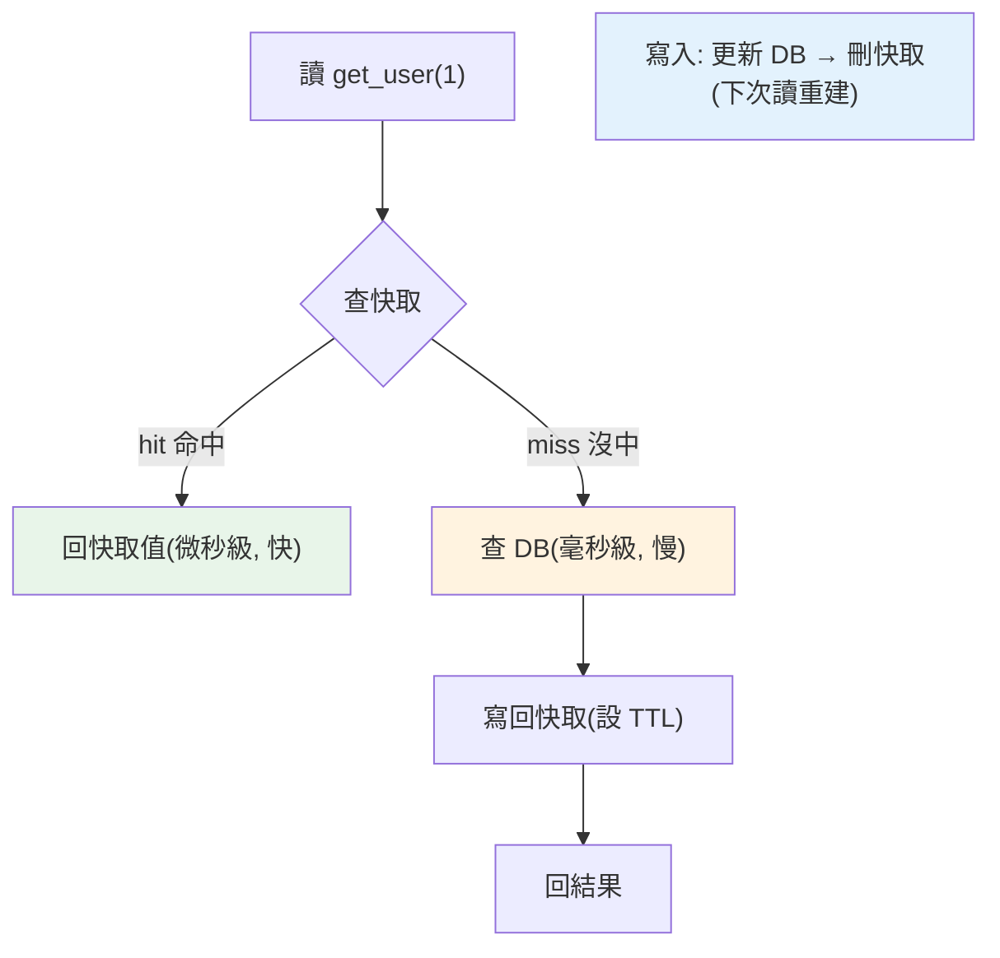

# Redis 與快取

> 資料庫查詢慢、負載重時，快取把熱門資料放進記憶體，讓讀取快上百倍。Redis 是最流行的記憶體資料儲存——不只是快取，還能當 session store、佇列、排行榜。這章講快取的核心概念與陷阱。

## Why（為什麼）

資料庫（尤其複雜查詢、JOIN、聚合）可能耗時數十到數百毫秒，而且每次查詢都打 DB 會讓資料庫成為瓶頸。很多資料「讀遠多於寫」（商品資訊、使用者資料、熱門文章）——每次都重新查 DB 很浪費。**快取（cache）** 把這些熱門資料放進**記憶體**（讀取以微秒計，快 DB 上百倍），大幅降低延遲與資料庫負載。**Redis（Remote Dictionary Server）** 是最流行的記憶體資料儲存——不只是 key-value 快取，還支援豐富資料結構（list、set、sorted set、hash），能當 **session store、任務佇列、排行榜、限流器、分散式鎖**（見 [分散式鎖](../22-distributed-systems/README.md)）。理解快取模式與陷阱（一致性、雪崩、穿透），是打造高效能系統的關鍵。

## Theory（理論：快取模式與失效）

快取的本質是**用「可能過時」換「快」**——所以核心問題永遠是：**資料變了，快取怎麼辦？** 這就是「快取失效」，被戲稱為電腦科學兩大難題之一。

最常見的快取模式：

- **Cache-Aside（旁路快取，最常用）**：應用自己管快取。讀：先查快取，命中就回；沒中（miss）就查 DB、寫回快取、再回。寫：更新 DB 後，**刪除**（或更新）快取。
- **Read-Through / Write-Through**：由快取層代理讀寫（應用只跟快取講話，快取負責同步 DB）。
- **Write-Behind**：先寫快取，非同步批次寫回 DB（快但有遺失風險）。

**TTL（Time To Live，存活時間）**：給快取項設過期時間，到期自動刪除——即使沒主動失效，資料也不會無限過時。這是快取一致性的重要安全網。

## Specification（規範：redis-py 常用操作）

```python
import redis

r = redis.Redis(host="localhost", port=6379, decode_responses=True)

# --- String（最基本的 key-value）---
r.set("user:1:name", "Alice")
r.set("session:abc", "user_1", ex=3600)   # ex=TTL 秒數
name = r.get("user:1:name")                # "Alice"，不存在則 None
r.delete("user:1:name")
r.expire("session:abc", 1800)              # 設/改 TTL
r.ttl("session:abc")                       # 剩餘秒數

# --- 數值原子操作（計數器/限流）---
r.incr("page:views")                       # 原子 +1
r.incrby("score", 10)

# --- Hash（存物件）---
r.hset("user:1", mapping={"name": "Alice", "age": "30"})
r.hgetall("user:1")                        # {'name': 'Alice', 'age': '30'}

# --- List（佇列）---
r.lpush("queue", "task1")
r.rpop("queue")

# --- Set / Sorted Set（去重 / 排行榜）---
r.sadd("tags", "python", "redis")
r.zadd("leaderboard", {"Alice": 100, "Bob": 85})
r.zrevrange("leaderboard", 0, 9, withscores=True)   # 前 10 名
```

## Implementation（cache-aside、TTL、序列化、快取問題）

### Cache-Aside 模式（最常用）

應用自己協調快取與 DB：

```python
import json
import redis

r = redis.Redis(decode_responses=True)

def get_user(user_id: int) -> dict:
    key = f"user:{user_id}"

    # 1. 先查快取
    cached = r.get(key)
    if cached is not None:
        return json.loads(cached)          # 命中（cache hit）→ 直接回

    # 2. 沒中（miss）→ 查 DB
    user = db_query_user(user_id)          # 慢查詢

    # 3. 寫回快取（設 TTL 當安全網）
    r.set(key, json.dumps(user), ex=300)   # 快取 5 分鐘
    return user

def update_user(user_id: int, data: dict) -> None:
    db_update_user(user_id, data)          # 先更新 DB
    r.delete(f"user:{user_id}")            # 再刪快取（下次讀重建）
```

**寫時「刪快取」而非「更新快取」**是常見選擇——避免更新快取與 DB 之間的競態導致不一致，讓下次讀自然重建。

### TTL：一致性的安全網

即使你在寫入時主動失效快取，仍**建議都設 TTL**——防「漏刪」「跨服務更新」導致快取永久過時。TTL 讓過時資料最多存活 TTL 秒：

```python
r.set(key, value, ex=300)      # 最多過時 5 分鐘（可接受的陳舊度依業務定）
```

TTL 長短是**新鮮度 vs 命中率**的取捨：短 TTL 更新鮮但命中率低（常回 DB）、長 TTL 命中率高但可能較舊。

### 序列化：物件怎麼存

Redis 值是字串/位元組——存物件要**序列化**（見 [序列化](../11-stdlib/12-pickle.md)）。常用 **JSON**（跨語言、可讀、安全）：

```python
r.set(key, json.dumps(data))              # 存：物件 → JSON 字串
data = json.loads(r.get(key))             # 取：JSON 字串 → 物件
```

**別用 `pickle` 存跨信任邊界的快取**（反序列化不可信資料可執行任意程式碼，見 [序列化](../11-stdlib/12-pickle.md) 的安全警告）——JSON 較安全。

### 三大快取問題

生產快取要防三個經典問題：

1. **快取穿透（cache penetration）**：大量查「不存在」的 key（查了 DB 也沒有→不寫快取→每次都打 DB）。惡意攻擊常用。**解**：把「不存在」也快取（存 null + 短 TTL）、或用布隆過濾器（Bloom filter）。

2. **快取雪崩（cache avalanche）**：大量 key **同時過期**（如都設一樣的 TTL），瞬間全部 miss、洪水般打向 DB，可能壓垮。**解**：TTL 加隨機抖動（`ex=300 + random(0, 60)`），錯開過期時間。

3. **快取擊穿（cache breakdown / hotspot）**：某個**熱門 key** 過期瞬間，大量並發請求同時 miss、同時重建（都打 DB）。**解**：用鎖（只讓一個請求重建，其他等）、或熱點 key 不過期 + 後台更新。

### Redis 不只是快取

Redis 的資料結構讓它遠不只快取：

- **session store**：存 Web session（見 [CORS/session](../14-web/14-cors-cookie-session.md)），多實例共享。
- **限流器（rate limiter）**：`INCR` + TTL 計數。
- **任務佇列**：`LPUSH`/`BRPOP`（Celery/RQ 底層，見 [事件驅動](../16-architecture/10-event-driven-mq.md)）。
- **排行榜**：sorted set。
- **分散式鎖**：`SET key value NX EX`（見 [分散式](../22-distributed-systems/README.md)）。
- **pub/sub**：跨實例訊息（見 [WebSocket](../14-web/13-websocket.md) 的多實例廣播）。

**注意 Redis 是記憶體儲存**——資料量受記憶體限制，需考慮持久化（RDB/AOF）與淘汰策略（`maxmemory-policy`，如 LRU）。

## Code Example（可執行的 Python 範例）

```python
# cache_demo.py — 模擬 cache-aside 與快取問題（可獨立測試，不需真 Redis）
from __future__ import annotations

import time


class FakeCache:
    """模擬帶 TTL 的記憶體快取。"""

    def __init__(self) -> None:
        self.store: dict[str, tuple[str, float | None]] = {}

    def get(self, key: str) -> str | None:
        if key not in self.store:
            return None
        value, expire_at = self.store[key]
        if expire_at is not None and time.monotonic() > expire_at:
            del self.store[key]  # 過期
            return None
        return value

    def set(self, key: str, value: str, ex: float | None = None) -> None:
        expire_at = time.monotonic() + ex if ex is not None else None
        self.store[key] = (value, expire_at)

    def delete(self, key: str) -> None:
        self.store.pop(key, None)


class Database:
    """模擬慢資料庫，記錄查詢次數。"""

    def __init__(self) -> None:
        self.data = {1: "Alice", 2: "Bob"}
        self.query_count = 0

    def get_user(self, user_id: int) -> str | None:
        self.query_count += 1  # 每次查 DB 計數
        return self.data.get(user_id)


def get_user_cached(cache: FakeCache, db: Database, user_id: int) -> str | None:
    key = f"user:{user_id}"
    cached = cache.get(key)
    if cached is not None:
        return cached  # cache hit
    user = db.get_user(user_id)  # miss → 查 DB
    if user is not None:
        cache.set(key, user, ex=300)  # 寫回快取
    return user


def demo() -> None:
    cache, db = FakeCache(), Database()

    # 第一次查：miss，打 DB
    print(f"查 user 1: {get_user_cached(cache, db, 1)}（DB 查詢 {db.query_count} 次）")
    # 再查同一個：hit，不打 DB
    for _ in range(3):
        get_user_cached(cache, db, 1)
    print(f"再查 user 1 三次後: DB 查詢仍是 {db.query_count} 次（都命中快取）")

    # 更新 → 刪快取 → 下次讀重建
    db.data[1] = "Alice2"
    cache.delete("user:1")
    print(f"\n更新並刪快取後查 user 1: {get_user_cached(cache, db, 1)}（DB 查詢 {db.query_count} 次，重建）")

    print("\n重點：cache-aside 先查快取、miss 才打 DB、寫時刪快取；TTL 當安全網")


if __name__ == "__main__":
    demo()
```

**預期輸出**：

```pycon
$ python cache_demo.py
查 user 1: Alice（DB 查詢 1 次）
再查 user 1 三次後: DB 查詢仍是 1 次（都命中快取）

更新並刪快取後查 user 1: Alice2（DB 查詢 2 次，重建）

重點：cache-aside 先查快取、miss 才打 DB、寫時刪快取；TTL 當安全網
```

## Diagram（圖解：cache-aside 讀取流程）



## Best Practice（最佳實踐）

- **讀多寫少的熱門資料才快取**：不是所有東西都該快取。
- **用 cache-aside 模式**：讀先查快取、miss 查 DB 寫回；寫時更新 DB 後**刪快取**（避免競態）。
- **一律設 TTL** 當安全網：防漏失效導致永久過時；TTL 加隨機抖動防雪崩。
- **序列化用 JSON**（跨語言、安全），別用 pickle 存不可信快取（見 [序列化](../11-stdlib/12-pickle.md)）。
- **防三大問題**：穿透（快取 null）、雪崩（TTL 抖動）、擊穿（鎖/熱點不過期）。
- **key 命名有規範**（`user:1:profile`）：好管理、好除錯。
- **理解 Redis 不只快取**：session、佇列、限流、排行榜、分散式鎖。
- **考慮記憶體限制與淘汰策略**（`maxmemory-policy` LRU）：Redis 是記憶體儲存。

## Common Mistakes（常見誤解）

- **快取不設 TTL**：漏失效或跨服務更新導致資料永久過時。
- **寫入時更新快取而非刪除**：更新順序競態→不一致；多數場景刪快取更安全。
- **所有 key 同一 TTL**：同時過期→雪崩→壓垮 DB；加隨機抖動。
- **不處理快取穿透**：查不存在的 key 每次打 DB，易被攻擊；快取 null 值。
- **用 pickle 存快取**：反序列化不可信資料的安全風險；用 JSON。
- **快取一切**：低命中率資料快取反增複雜度與不一致；只快取熱門讀多資料。
- **忽略 Redis 記憶體上限**：塞爆或觸發淘汰導致意外 miss；設淘汰策略、監控記憶體。
- **強一致場景還依賴快取**：快取本質是最終一致；金流等強一致別讀快取。

## Interview Notes（面試重點）

- **能解釋快取為何存在（記憶體讀取快 DB 百倍、降 DB 負載）與 cache-aside 模式**（讀先查快取、miss 查 DB 寫回、寫時刪快取）。
- **知道快取一致性的難處**：資料變了快取怎麼辦——寫時失效 + TTL 安全網，本質是最終一致。
- **能說出快取三大問題與解法**：穿透（快取 null/布隆過濾器）、雪崩（TTL 抖動）、擊穿（鎖/熱點不過期）。
- **知道 Redis 不只快取**：session store、限流、任務佇列、排行榜（sorted set）、分散式鎖、pub/sub。
- 知道序列化用 JSON（別 pickle 不可信）、Redis 是記憶體儲存（記憶體上限、持久化 RDB/AOF、LRU 淘汰）。

---

➡️ 下一章：[async 資料庫存取](19-async-database.md)

[⬆️ 回 Part 15 索引](README.md)
