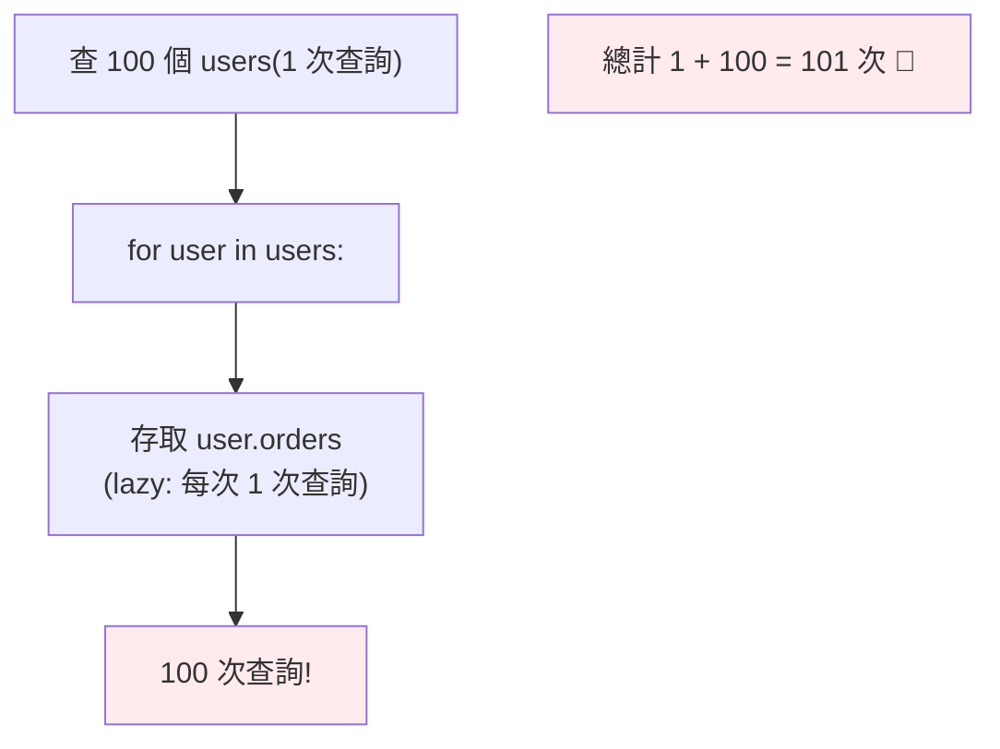
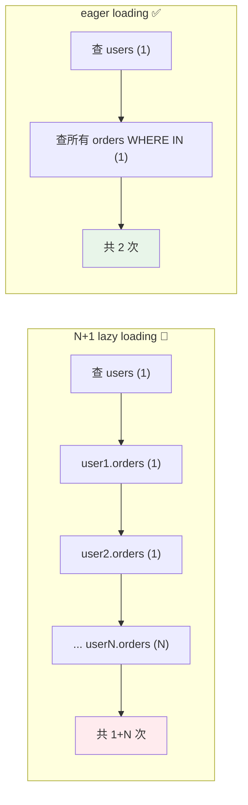

# N+1 問題與 eager / lazy loading

> ORM 讓你用 `user.orders` 存取關聯，方便到讓你忘了它背後在打 DB。一個迴圈裡存取關聯，就從 1 個查詢暴增成 N+1 個——這是 ORM 最常見、最致命的效能陷阱。搞懂它與 eager loading，是資深工程師的分水嶺。

## Why（為什麼）

ORM 的關聯（`user.orders`，見 [ORM](14-sqlalchemy-orm.md)）方便到讓人忘記它是資料庫查詢。你寫一個「列出每個使用者及其訂單數」的迴圈——看起來無害的幾行，實際對資料庫發了 **101 次查詢**（1 次查使用者 + 100 次查各自訂單）。這就是 **N+1 問題**：ORM 最常見的效能殺手，也是慢 API 的頭號原因。它在開發時（資料少）不明顯，上線後（資料多）突然爆炸。面試常考、code review 必抓。理解 N+1 與解法（**eager loading**），能讓你的查詢從 101 次降到 2 次——效能天差地別。這是「會用 ORM」和「懂 ORM」的分水嶺。

## Theory（理論：lazy vs eager loading）

ORM 載入關聯資料有兩種策略：

- **Lazy loading（延遲載入，多數 ORM 預設）**：關聯資料**到你存取時才查**。`user.orders` 被存取的那一刻，ORM 才發一個 `SELECT * FROM orders WHERE user_id = ?`。方便，但**每次存取都是一次查詢**。
- **Eager loading（急切載入）**：**一開始就把關聯一起載入**（用 JOIN 或一次額外查詢）。查使用者時就順便把所有訂單載好，之後存取 `.orders` 不再打 DB。

**N+1 的成因**：lazy loading + 迴圈。你查了 N 個使用者（1 次查詢），然後迴圈中對每個存取 `.orders`（各 1 次 = N 次），總共 **1 + N** 次查詢。資料越多，N 越大，慢得越誇張。



## Specification（規範：載入策略）

```python
from sqlalchemy import select
from sqlalchemy.orm import selectinload, joinedload, lazyload

# 🔴 N+1：lazy loading（預設）+ 迴圈
users = session.scalars(select(User)).all()          # 1 次查詢
for user in users:
    print(user.name, len(user.orders))               # 每次 +1 次查詢 → N 次

# ✅ eager loading：selectinload（額外一次 IN 查詢載入所有關聯）
users = session.scalars(
    select(User).options(selectinload(User.orders))  # 1 次查 users + 1 次查所有 orders
).all()
for user in users:
    print(user.name, len(user.orders))               # 已載入，不再打 DB → 共 2 次

# ✅ eager loading：joinedload（用 JOIN 一次查回）
users = session.scalars(
    select(User).options(joinedload(User.orders))    # 1 次 JOIN 查詢
).unique().all()

# 也可在 relationship 定義預設策略
# orders: Mapped[list["Order"]] = relationship(lazy="selectin")
```

## Implementation（重現 N+1、兩種 eager、選擇、偵測）

### 重現 N+1 並看到問題

```python
# 假設有 100 個 user，每個有若干 orders
# 🔴 N+1 版本
users = session.scalars(select(User)).all()   # SELECT * FROM users  → 1 次
result = []
for user in users:
    # 每次存取 user.orders 觸發：SELECT * FROM orders WHERE user_id = ?
    result.append((user.name, len(user.orders)))   # → 100 次
# 總共 101 次查詢！開 echo=True 會看到 101 行 SELECT
```

開 `create_engine(url, echo=True)` 就能在 log 看到滿滿的重複 `SELECT`——這是偵測 N+1 的直接方法。

### 解法一：selectinload（推薦多數情況）

`selectinload` 用**額外一次查詢**（`WHERE user_id IN (...)`）載入所有關聯：

```python
from sqlalchemy.orm import selectinload

users = session.scalars(
    select(User).options(selectinload(User.orders))
).all()
# 產生 2 次查詢：
#   SELECT * FROM users
#   SELECT * FROM orders WHERE user_id IN (1, 2, ..., 100)
for user in users:
    print(user.name, len(user.orders))   # 全部已載入，0 額外查詢
```

**101 次 → 2 次**。`selectinload` 適合「一對多」關聯，不會像 JOIN 那樣讓結果列數暴增。

### 解法二：joinedload（用 JOIN）

`joinedload` 用一個 `JOIN` 一次查回主體與關聯：

```python
from sqlalchemy.orm import joinedload

users = session.scalars(
    select(User).options(joinedload(User.orders))
).unique().all()
# 產生 1 次查詢：SELECT ... FROM users LEFT JOIN orders ON ...
```

**1 次查詢**，但注意：一對多 JOIN 會讓主體資料**重複**（一個 user 有 3 個 order → 結果 3 列），需 `.unique()` 去重、且傳輸較多資料。

### selectinload vs joinedload 怎麼選

| | selectinload | joinedload |
|--|-------------|-----------|
| 查詢數 | 2（主體 + IN 查詢） | 1（JOIN） |
| 適合 | 一對多、多對多（避免列爆炸） | 多對一、一對一 |
| 資料重複 | 無 | 一對多會重複主體 |
| 大量關聯 | 較好（IN 不爆列數） | 列數 = 主體 × 關聯，可能爆 |

**經驗法則**：**一對多/多對多用 `selectinload`、多對一/一對一用 `joinedload`**。不確定就先 `selectinload`。

### 何時 lazy loading 反而好

eager loading 不是永遠對——如果你**根本不會存取關聯**，eager 就白載入了多餘資料。lazy 適合「不一定用到關聯」的情況。**原則**：**會用到關聯（尤其在迴圈裡）就 eager；不一定用到就 lazy**。

### async 的特別注意

async 下（見 [async DB](19-async-database.md)）**不能隱式 lazy loading**（存取未載入關聯會拋 `MissingGreenlet`）——所以 async **必須顯式 eager loading**。這讓 async 反而「強迫你避免 N+1」。

### 也要小心「查太多欄」

N+1 是「查太多次」，另一個相關問題是「查太多資料」——`SELECT *` 載入不需要的欄、載入不需要的關聯。只查需要的欄位（`select(User.id, User.name)`）、只 eager load 會用到的關聯。

## Code Example（可執行的 Python 範例）

```python
# n_plus_1_demo.py — 模擬 N+1 與 eager loading 的查詢次數差異（可獨立測試）
from __future__ import annotations

from dataclasses import dataclass, field


@dataclass
class QueryCounter:
    """記錄對 DB 發出的查詢次數。"""

    count: int = 0

    def query(self, sql: str) -> None:
        self.count += 1


@dataclass
class User:
    id: int
    name: str
    order_amounts: list[int] = field(default_factory=list)


def load_users_n_plus_1(counter: QueryCounter, users: list[User]) -> list[tuple[str, int]]:
    """lazy loading：迴圈中存取關聯 → N+1 次查詢。"""
    counter.query("SELECT * FROM users")  # 1 次查 users
    result = []
    for user in users:
        counter.query(f"SELECT * FROM orders WHERE user_id = {user.id}")  # 每次 +1
        result.append((user.name, sum(user.order_amounts)))
    return result


def load_users_eager(counter: QueryCounter, users: list[User]) -> list[tuple[str, int]]:
    """eager loading（selectinload）：1 次查 users + 1 次 IN 查所有 orders。"""
    counter.query("SELECT * FROM users")  # 1 次
    ids = ",".join(str(u.id) for u in users)
    counter.query(f"SELECT * FROM orders WHERE user_id IN ({ids})")  # 1 次（全部）
    return [(u.name, sum(u.order_amounts)) for u in users]


def demo() -> None:
    users = [User(i, f"user{i}", [10, 20, 30]) for i in range(1, 101)]  # 100 個 user

    # N+1 版本
    c1 = QueryCounter()
    load_users_n_plus_1(c1, users)
    print(f"lazy loading（N+1）: {c1.count} 次查詢（1 + 100）")

    # eager 版本
    c2 = QueryCounter()
    load_users_eager(c2, users)
    print(f"eager loading（selectinload）: {c2.count} 次查詢")

    print(f"\n減少了 {c1.count - c2.count} 次查詢（{c1.count} → {c2.count}）")
    print("重點：N+1 = lazy + 迴圈；eager loading（selectinload/joinedload）解決")


if __name__ == "__main__":
    demo()
```

**預期輸出**：

```pycon
$ python n_plus_1_demo.py
lazy loading（N+1）: 101 次查詢（1 + 100）
eager loading（selectinload）: 2 次查詢

減少了 99 次查詢（101 → 2）
重點：N+1 = lazy + 迴圈；eager loading（selectinload/joinedload）解決
```

## Diagram（圖解：N+1 vs eager loading）



## Best Practice（最佳實踐）

- **會在迴圈存取關聯就用 eager loading**（`selectinload`/`joinedload`）：避免 N+1。
- **一對多/多對多用 `selectinload`、多對一/一對一用 `joinedload`**：避免列爆炸或善用 JOIN。
- **開發時開 `echo=True` 觀察查詢**：看到滿屏重複 SELECT 就是 N+1。
- **不一定用到的關聯保持 lazy**：別過度 eager 載入多餘資料。
- **async 一律顯式 eager loading**（不能隱式 lazy load，見 [async DB](19-async-database.md)）。
- **只查需要的欄位/關聯**：別無腦 `SELECT *` 與載入用不到的關聯。
- **可在 relationship 設預設載入策略**（`lazy="selectin"`）但仍以查詢層 `.options()` 為主（更靈活）。
- **監控慢查詢與查詢次數**：把「每請求查詢數」納入觀測（見 [監控](../19-cloud-native/08-observability.md)）。

## Common Mistakes（常見誤解）

- **迴圈中存取 lazy 關聯 → N+1**：最常見效能陷阱；用 eager loading。
- **開發時沒發現（資料少）**：N 小時不明顯，上線資料多才爆；用 echo 觀察查詢數。
- **一對多用 joinedload 導致列爆炸**：主體重複 × 關聯數；一對多改 selectinload。
- **忘了 `.unique()` 配 joinedload**：一對多 JOIN 有重複列。
- **過度 eager loading**：載入根本不用的關聯，浪費；只 eager 會用到的。
- **async 下依賴隱式 lazy**：拋 `MissingGreenlet`；顯式 eager。
- **以為 ORM 會自動優化**：ORM 忠實地按你寫的方式查，N+1 是你的責任。

## Interview Notes（面試重點）

- **能清楚解釋 N+1 問題**：lazy loading + 迴圈存取關聯 → 1 次查主體 + N 次查各關聯 = 1+N 次查詢；資料多時效能災難。
- **能說出解法：eager loading**——`selectinload`（額外一次 IN 查詢，適合一對多/多對多）、`joinedload`（JOIN，適合多對一/一對一）。
- **能對比 selectinload vs joinedload**（查詢數、列爆炸、適用關聯類型）並給選擇原則。
- **知道 lazy 也有適用場景**（不一定用到的關聯）、async 必須顯式 eager（不能隱式 lazy）。
- 知道用 `echo=True` 偵測 N+1、把每請求查詢數納入觀測；ORM 不會自動幫你優化。

---

➡️ 下一章：[索引與查詢優化基礎](21-indexing.md)

[⬆️ 回 Part 15 索引](README.md)
