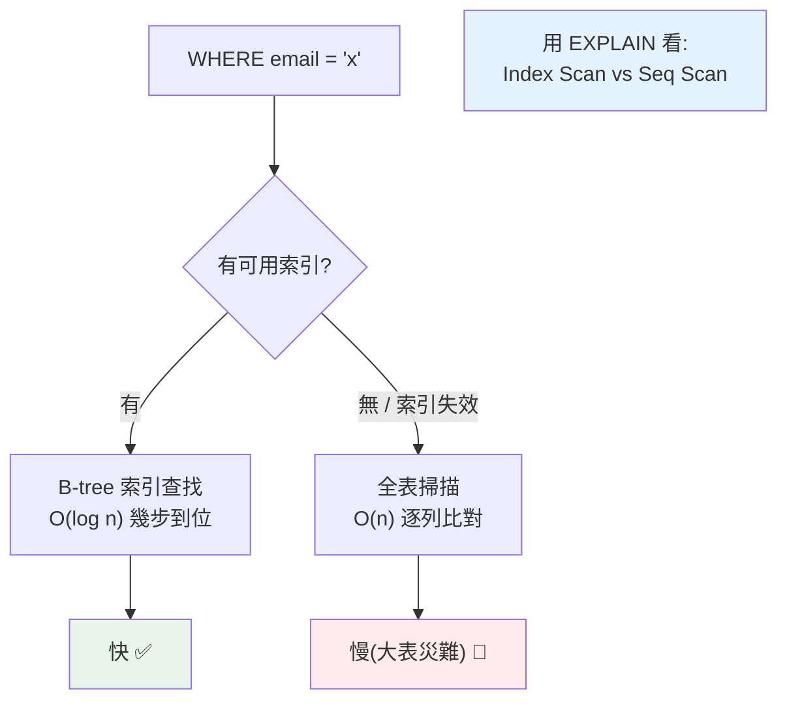

# 索引與查詢優化基礎

> 資料一多，沒索引的查詢就像沒目錄的字典——一頁頁翻。索引讓資料庫直接跳到目標，把「掃全表」變成「查目錄」，查詢快上千倍。但索引不是免費的，也不是加了就有用。這章講索引的原理與用對它的方法。

## Why（為什麼）

一張 100 萬列的表，查 `WHERE email = 'x@y.com'` 若沒索引，資料庫得**逐列掃描全表**（full table scan）比對——慢到不可接受。**索引（index）** 就像書的目錄：資料庫在索引裡快速定位到目標列，不用翻遍全表。加對一個索引，查詢可能從數秒變數毫秒（快上千倍）。這是資料庫效能優化最基本、最有效的手段。但索引不是萬能：它**佔空間、拖慢寫入**（每次寫要更新索引），而且**加了不代表會被用到**（寫法不對、選擇性差都會讓索引失效）。理解索引的原理（B-tree）、何時該加、為何失效、如何用 `EXPLAIN` 驗證，是每個後端工程師與面試的必備。

## Theory（理論：B-tree 與索引原理）

多數關聯式資料庫的索引用 **B-tree（B 樹，平衡多路搜尋樹）** 結構。關鍵特性：

- **有序**：索引把欄位值排序存放，形成一棵平衡樹。
- **對數時間查找**：查一個值走 `O(log n)` 而非 `O(n)`——100 萬列只需約 20 步，不是 100 萬步。
- **支援範圍查詢**：因為有序，`WHERE age BETWEEN 20 AND 30`、`ORDER BY`、`>`/`<` 都能利用索引。

沒索引 = **全表掃描 O(n)**；有索引 = **索引查找 O(log n)**。這就是為什麼大表差異巨大。

代價（沒有免費的午餐）：

- **佔額外儲存空間**（索引是資料的副本 + 樹結構）。
- **拖慢寫入**：每次 `INSERT`/`UPDATE`/`DELETE` 都要維護索引（重新平衡樹）。索引越多，寫越慢。
- **所以**：索引是「**用寫入變慢 + 空間，換讀取變快**」的取捨。讀多寫少的欄位值得，寫多讀少的要謹慎。

## Specification（規範：建立與使用索引）

```sql
-- 建立索引
CREATE INDEX idx_users_email ON users (email);

-- 唯一索引（兼具約束與加速）
CREATE UNIQUE INDEX idx_users_email ON users (email);

-- 複合索引（多欄，順序很重要！）
CREATE INDEX idx_orders_user_created ON orders (user_id, created_at);

-- 刪除索引
DROP INDEX idx_users_email;

-- 分析查詢計畫（看有沒有用到索引）
EXPLAIN SELECT * FROM users WHERE email = 'a@b.com';
EXPLAIN QUERY PLAN SELECT ...;    -- SQLite
EXPLAIN ANALYZE SELECT ...;       -- PostgreSQL（實際執行並計時）
```

```python
# SQLAlchemy 定義索引
from sqlalchemy import Index

class User(Base):
    __tablename__ = "users"
    id: Mapped[int] = mapped_column(primary_key=True)
    email: Mapped[str] = mapped_column(index=True)          # 單欄索引
    name: Mapped[str]
    __table_args__ = (
        Index("idx_name_email", "name", "email"),           # 複合索引
    )
```

## Implementation（該加哪、複合索引、失效、EXPLAIN）

### 該對哪些欄位加索引

- **常用於 `WHERE` 條件的欄位**：查詢過濾的欄。
- **`JOIN` 的鍵**：外鍵欄位（`user_id`）——JOIN 頻繁，通常該加。
- **`ORDER BY` / `GROUP BY` 的欄位**：索引有序，可省排序。
- **主鍵**：資料庫自動建索引（`PRIMARY KEY`）。
- **唯一約束欄位**（email、帳號）：`UNIQUE` 索引兼具約束與加速。

**別對所有欄位都加**——每個索引拖慢寫入、佔空間。只加「查詢真的會用、且選擇性好」的。

### 選擇性（selectivity）：低選擇性索引沒用

**選擇性**＝欄位不同值的比例。**高選擇性**（如 email，幾乎每列不同）索引效果好；**低選擇性**（如 `gender` 只有 2、3 種值、`is_active` 布林）索引幾乎沒用——因為即使用索引也要掃一大半資料，資料庫乾脆全表掃描。

**原則**：對高選擇性欄位加索引；低選擇性欄位（布林、少數列舉值）加索引通常浪費。

### 複合索引：順序與最左前綴

複合索引（多欄）的**欄位順序至關重要**，遵循**最左前綴（leftmost prefix）原則**：索引 `(user_id, created_at)` 能加速：

- `WHERE user_id = ?` ✅（用最左欄）
- `WHERE user_id = ? AND created_at > ?` ✅（用兩欄）
- `WHERE created_at > ?` ❌（跳過最左欄 user_id，用不到此索引）

```sql
CREATE INDEX idx_orders_user_created ON orders (user_id, created_at);

-- ✅ 用得到（符合最左前綴）
SELECT * FROM orders WHERE user_id = 1;
SELECT * FROM orders WHERE user_id = 1 AND created_at > '2026-01-01';
-- 🔴 用不到（沒用最左的 user_id）
SELECT * FROM orders WHERE created_at > '2026-01-01';
```

**設計複合索引時，把最常單獨查詢/選擇性高的欄放最左**。

### 索引失效：加了也沒用的情況

即使有索引，某些寫法會讓它**用不到**：

```sql
-- 🔴 對索引欄做運算/函式 → 失效
WHERE YEAR(created_at) = 2026        -- 改成 created_at >= '2026-01-01' AND < '2027-01-01'
WHERE age + 1 = 30                   -- 改成 age = 29

-- 🔴 前綴萬用字元的 LIKE → 失效
WHERE name LIKE '%son'               -- 開頭 % 無法用 B-tree（結尾 % 'son%' 可以）

-- 🔴 型別不符的隱式轉換 → 可能失效
WHERE phone = 12345                  -- phone 是字串欄卻傳數字

-- 🔴 複合索引跳過最左欄（見上）
```

記住：**別在索引欄位上包函式/運算、避免前置萬用字元 LIKE、注意型別一致**。

### 用 EXPLAIN 驗證

**不要猜索引有沒有被用——用 `EXPLAIN` 看查詢計畫**：

```sql
EXPLAIN ANALYZE SELECT * FROM users WHERE email = 'a@b.com';
```

看輸出裡是 **`Index Scan`/`Index Seek`（用了索引，好）** 還是 **`Seq Scan`/`Full Table Scan`（掃全表，可能該加索引）**。`EXPLAIN ANALYZE`（PostgreSQL）還會實際執行並顯示耗時與掃描列數。這是查詢優化的核心工具——**先量測、再優化**（見 [效能優化](../18-performance/README.md)）。

### 其他優化手段

索引之外的常見優化：

- **只查需要的欄**（`SELECT id, name` 而非 `SELECT *`）：少傳資料、可能用到覆蓋索引。
- **覆蓋索引（covering index）**：索引本身就含查詢要的所有欄，連表都不用回查。
- **分頁用 keyset/seek 而非大 OFFSET**：`OFFSET 100000` 要掃過前 10 萬列，改用 `WHERE id > last_id`。
- **避免 N+1**（見 [N+1](20-n-plus-1.md)）：這是查詢「次數」的優化。
- **慢查詢日誌**：開啟資料庫的 slow query log 找出該優化的查詢。

## Code Example（可執行的 Python 範例）

```python
# indexing_demo.py — 模擬索引（有序查找）vs 全表掃描的差異（可獨立測試）
from __future__ import annotations

import bisect


class Table:
    """模擬一張表：全表掃描 vs B-tree 索引查找。"""

    def __init__(self, rows: list[tuple[int, str]]) -> None:
        self.rows = rows  # [(id, email), ...]
        self.scan_steps = 0
        # 建立「索引」：依 email 排序（模擬 B-tree 有序結構）
        self.index_emails = sorted(email for _, email in rows)

    def full_scan(self, target_email: str) -> bool:
        """全表掃描：逐列比對 O(n)。"""
        self.scan_steps = 0
        for _, email in self.rows:
            self.scan_steps += 1
            if email == target_email:
                return True
        return False

    def index_lookup(self, target_email: str) -> bool:
        """索引查找：二分搜尋 O(log n)（模擬 B-tree）。"""
        self.scan_steps = 0
        lo, hi = 0, len(self.index_emails)
        while lo < hi:
            self.scan_steps += 1
            mid = (lo + hi) // 2
            if self.index_emails[mid] == target_email:
                return True
            if self.index_emails[mid] < target_email:
                lo = mid + 1
            else:
                hi = mid
        return False


def demo() -> None:
    n = 1_000_000
    # 造 100 萬列，查最後一個 email（全表掃描的最壞情況）
    rows = [(i, f"user{i}@example.com") for i in range(n)]
    table = Table(rows)
    target = f"user{n - 1}@example.com"

    table.full_scan(target)
    scan_steps = table.scan_steps
    print(f"全表掃描: {scan_steps:,} 步（逐列比對 O(n)）")

    table.index_lookup(target)
    index_steps = table.scan_steps
    print(f"索引查找: {index_steps} 步（二分搜尋 O(log n)）")

    print(f"\n索引快了約 {scan_steps // index_steps:,} 倍（{n:,} 列）")
    print(bisect.__doc__.splitlines()[0] if bisect.__doc__ else "")
    print("重點：索引把全表掃描 O(n) 變成 O(log n)；用 EXPLAIN 驗證是否用到")


if __name__ == "__main__":
    demo()
```

**預期輸出**：

```pycon
$ python indexing_demo.py
全表掃描: 1,000,000 步（逐列比對 O(n)）
索引查找: 20 步（二分搜尋 O(log n)）

索引快了約 50,000 倍（1,000,000 列）
Bisection algorithms.
重點：索引把全表掃描 O(n) 變成 O(log n)；用 EXPLAIN 驗證是否用到
```

## Diagram（圖解：索引 vs 全表掃描）



## Best Practice（最佳實踐）

- **對常用於 `WHERE`/`JOIN`/`ORDER BY` 的高選擇性欄位加索引**：外鍵、email、查詢過濾欄。
- **別對所有欄位加索引、別對低選擇性欄位加**（布林、少數列舉值）：拖慢寫入、佔空間又沒用。
- **複合索引把選擇性高/常單獨查的欄放最左**（最左前綴原則）。
- **避免索引失效寫法**：別在索引欄包函式/運算、避免前置 `%` 的 LIKE、注意型別一致。
- **用 `EXPLAIN`/`EXPLAIN ANALYZE` 驗證索引是否被用**：別靠猜，看 Index Scan vs Seq Scan。
- **先量測再優化**（慢查詢日誌找目標，見 [效能優化](../18-performance/README.md)）：別過早/盲目加索引。
- **善用覆蓋索引、只查需要的欄、避免大 OFFSET 分頁**。
- **索引變更也走 migration**（見 [migration](17-migration.md)），大表建索引注意鎖表。

## Common Mistakes（常見誤解）

- **大表查詢欄位不加索引**：全表掃描、上線後慢爆。
- **對所有欄位都加索引**：寫入變慢、空間爆、維護成本高。
- **對低選擇性欄位加索引**（性別、布林）：資料庫仍走全表掃描，索引白加。
- **索引欄位上包函式/運算**（`YEAR(date)`、`age+1`）：索引失效；改寫成範圍條件。
- **前置萬用字元 LIKE `'%x'`**：B-tree 用不到；只有 `'x%'` 可用。
- **複合索引順序錯 / 跳過最左欄**：用不到索引。
- **靠猜而不用 EXPLAIN**：以為有索引就會用，其實失效了。
- **過早優化**：資料量小時索引意義不大，先量測熱點再加。

## Interview Notes（面試重點）

- **能解釋索引原理**：B-tree 讓查找從全表掃描 O(n) 變 O(log n)、支援範圍查詢；代價是佔空間 + 拖慢寫入（用寫換讀）。
- **知道該對哪些欄位加索引**（WHERE/JOIN/ORDER BY 的高選擇性欄）、**低選擇性欄位加索引沒用**。
- **能講複合索引的最左前綴原則**（欄位順序、跳過最左欄用不到）。
- **能列舉索引失效情況**：索引欄包函式/運算、前置 `%` LIKE、型別不符、跳最左欄。
- **知道用 `EXPLAIN`/`EXPLAIN ANALYZE` 驗證查詢計畫**（Index Scan vs Seq Scan）、先量測再優化；能連結 [N+1](20-n-plus-1.md)（查詢次數優化）與覆蓋索引、keyset 分頁。

---

➡️ 下一章：[PostgreSQL 專屬功能與實戰](22-postgresql-features.md)

[⬆️ 回 Part 15 索引](README.md)
