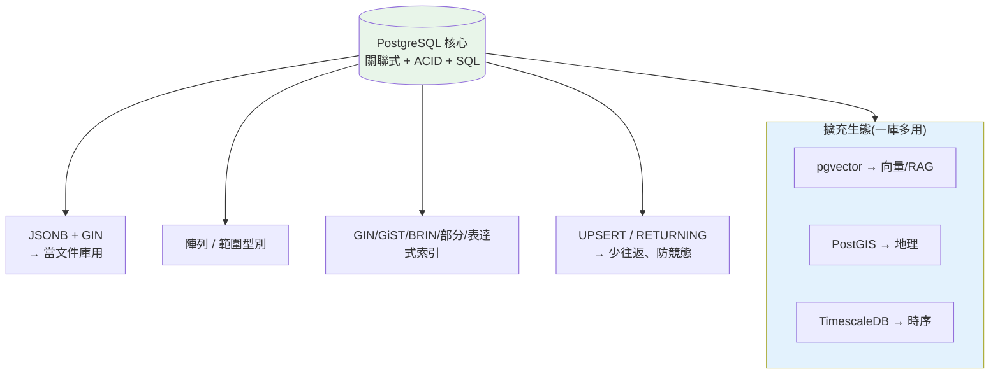

# PostgreSQL 專屬功能與實戰

> 前面的實作章用 SQLite + SQLAlchemy,刻意抽象掉「特定資料庫」。但真實後端最常用的是 **PostgreSQL**——而它遠不只是「一個 SQL 資料庫」。這章專講 PostgreSQL 讓人選它當預設的**殺手級功能**:**JSONB**(在關聯式裡塞半結構化資料還能索引)、**陣列型別**、**UPSERT / `RETURNING`**、**進階索引(GIN/GiST/部分索引/表達式索引)**、**`EXPLAIN ANALYZE`**、以及**擴充生態**(pgvector、PostGIS、TimescaleDB)。學完你會知道為什麼「先用 Postgres,一庫多用」是主流建議,以及這些功能各自解決什麼問題。

> 🧪 範例用 stdlib `sqlite3` 示範「概念相通、SQLite 也支援」的功能(JSON 查詢、`ON CONFLICT` UPSERT、`RETURNING`、部分索引、`EXPLAIN`),**真正 PostgreSQL 專屬**的(JSONB 二進位型別、陣列、GIN/GiST)以 SQL **示意**呈現並標註。原理承接 [ch04 儲存](04-storage-engine.md)、[ch05 索引](05-index-internals.md)、[ch06 優化器](06-query-processing.md)。

## Why(為什麼)

「關聯式資料庫只能存規規矩矩的表格」是過時印象。PostgreSQL 打破它:

- **半結構化資料不必另立 NoSQL**:很多場景資料**大部分結構化、一小塊彈性**(如訂單的固定欄位 + 一包會變的 metadata)。以前要嘛硬塞成一堆稀疏欄位、要嘛另架 MongoDB。PostgreSQL 的 **JSONB** 讓你在關聯式表裡塞 JSON、**還能對它建索引查詢**——[ch10](10-nosql-selection.md) 說的「PostgreSQL 一庫多用」就靠這些。
- **少寫應用層樣板**:`UPSERT`(插入或更新)、`RETURNING`(寫入同時拿回結果)這些讓你**一句 SQL 做完**原本要「先查再判斷再寫」的事——更少往返、更少競態、更少程式碼。
- **索引不只 B-tree**:半結構化(JSONB)、全文檢索、地理資料、範圍查詢——各需要不同索引結構(GIN/GiST/BRIN)。懂它們,你才能讓這些進階查詢也走索引而非全表掃描([ch05](05-index-internals.md))。
- **`EXPLAIN ANALYZE` 是效能調校的核心工具**:[ch06](06-query-processing.md) 講了優化器原理,這章教你**實際讀 PostgreSQL 的執行計畫**、看出瓶頸。
- **擴充生態是護城河**:pgvector(向量/RAG)、PostGIS(地理)、TimescaleDB(時序)——同一個 Postgres 靠擴充變身多種資料庫,省下引入多套系統的維運成本。

**這章讓你從「會用通用 SQL」升級到「用得動 PostgreSQL 的真本事」**——這是後端工程的高頻實戰技能。

## Theory(理論:關聯式 + 半結構化的融合)

PostgreSQL 的核心哲學是**「關聯式的嚴謹 + 文件庫的彈性,兩者兼得」**:

```text
傳統關聯式:  嚴格 schema,彈性資料難處理
純文件庫:    彈性 schema,失去 join / 交易 / 約束
PostgreSQL:  結構化欄位(嚴謹)+ JSONB 欄位(彈性)+ 完整 ACID + join
             → 同一張表、同一個交易裡,兩全其美
```

**JSONB vs JSON(型別選擇)**:

- **`json`**:存**原始文字**,保留空白與鍵順序,寫入快、查詢慢(每次要 parse)。
- **`jsonb`**:存**解析後的二進位**,寫入稍慢(要 parse),但**查詢快、可建 GIN 索引、可用 `@>` 包含運算子**。**幾乎總是用 `jsonb`**。

**為什麼 JSONB 能被索引**:它是解析後的結構化二進位,PostgreSQL 能對「鍵/值」建 **GIN 索引**(倒排索引),讓 `WHERE data @> '{"status":"active"}'` 這種查詢走索引而非掃全表——這是它勝過「把 JSON 存成純 text」的關鍵。

## Specification(規範:PostgreSQL 招牌功能)

**半結構化與陣列**:

```sql
-- JSONB:關聯表裡的彈性欄位
CREATE TABLE orders (
    id      bigserial PRIMARY KEY,
    total   numeric NOT NULL,          -- 結構化
    meta    jsonb                       -- 彈性:{"coupon":"X","tags":["vip"]}
);
SELECT * FROM orders WHERE meta @> '{"coupon":"X"}';   -- 包含查詢(可走 GIN 索引)
SELECT meta ->> 'coupon' FROM orders;                   -- ->> 取值為 text
CREATE INDEX idx_meta ON orders USING gin (meta);       -- GIN 索引 JSONB

-- 陣列型別(PostgreSQL 專屬)
CREATE TABLE posts (id int, tags text[]);
SELECT * FROM posts WHERE 'python' = ANY(tags);         -- 陣列成員查詢
```

**UPSERT 與 RETURNING**:

```sql
-- UPSERT:插入,若主鍵衝突就改為更新(一句解決「有就更新、沒有就插入」)
INSERT INTO users (id, name, login_count) VALUES (1, 'Alice', 1)
ON CONFLICT (id) DO UPDATE SET login_count = users.login_count + 1;

-- RETURNING:寫入的同時拿回結果(免再 SELECT 一次)
INSERT INTO orders (total) VALUES (99) RETURNING id, created_at;
UPDATE users SET active = true WHERE id = 1 RETURNING id;
```

**進階索引**(承 [ch05](05-index-internals.md)):

| 索引 | 適用 | 例 |
|------|------|-----|
| **B-tree**(預設) | 等值、範圍、排序 | 一般欄位 |
| **GIN** | 多值:JSONB、陣列、全文檢索 | `USING gin (meta)` |
| **GiST** | 幾何、範圍、最近鄰 | 地理、`tsrange` |
| **BRIN** | 超大、物理有序的表(如時序) | 只存區塊摘要,極省空間 |
| **部分索引(partial)** | 只索引符合條件的列 | `WHERE status='active'` |
| **表達式索引** | 對運算/函式結果建索引 | `(lower(email))` |

## Implementation(底層:JSONB 索引、UPSERT 原子性、EXPLAIN ANALYZE)

**部分索引與表達式索引為何省又快**(承 [ch05](05-index-internals.md)「對欄運算用不到索引」):

- **部分索引**:若你只查 `status='active'`(90% 是 archived),對**只有 active 的列**建索引——索引小得多、更新更省。`CREATE INDEX ON orders (created_at) WHERE status='active'`。
- **表達式索引**:[ch05](05-index-internals.md) 說 `WHERE lower(email)=...` 用不到普通索引;PostgreSQL 讓你**直接對 `lower(email)` 建索引**,這類查詢就能走索引:`CREATE INDEX ON users (lower(email))`。

**UPSERT 的原子性價值**:「先 `SELECT` 看在不在、不在就 `INSERT`」在並發下有**競態**——兩個請求同時查到「不在」、都去 `INSERT`,一個爆主鍵衝突。`INSERT ... ON CONFLICT` 把「插入或更新」變成**單一原子操作**,由資料庫保證正確([ch07 並發](07-transactions-concurrency.md))——少一個 bug 來源。

**`EXPLAIN ANALYZE` 實戰讀法**(承 [ch06](06-query-processing.md)):

```text
EXPLAIN ANALYZE SELECT * FROM orders WHERE meta @> '{"coupon":"X"}';

情況 A(沒 GIN 索引):
  Seq Scan on orders  (cost=... rows=100000) (actual time=... rows=3)
  Filter: (meta @> '{"coupon":"X"}')
  Rows Removed by Filter: 99997    ← 掃 10 萬列只留 3 列 = 缺索引警訊!

情況 B(建了 GIN 索引後):
  Bitmap Heap Scan on orders  (actual rows=3)
    Recheck Cond: (meta @> '{"coupon":"X"}')
    -> Bitmap Index Scan on idx_meta   ← 走索引,只碰 3 列
```

**看 `EXPLAIN ANALYZE` 的重點**:(1) `Seq Scan` vs `Index Scan`;(2) `Rows Removed by Filter` 很大 = 缺索引;(3) 估計 `rows` 與 `actual rows` 差很多 = 統計過期要 `ANALYZE`。下面用 stdlib `sqlite3` 跑一個可驗證的 demo,示範 JSON 查詢、UPSERT、RETURNING、部分索引與 EXPLAIN(這些 SQLite 也支援),PostgreSQL 專屬語法在上面以示意呈現。

## Code Example(可執行的 Python 範例)

```python
# pg_features_demo.py — 用 stdlib sqlite3 示範共通功能(JSON/UPSERT/RETURNING/部分索引/EXPLAIN)
from __future__ import annotations

import json
import sqlite3


def demo() -> None:
    conn = sqlite3.connect(":memory:")
    conn.execute("""
        CREATE TABLE orders (
            id INTEGER PRIMARY KEY,
            total REAL NOT NULL,
            status TEXT NOT NULL,
            meta TEXT               -- SQLite 用 TEXT 存 JSON;PostgreSQL 用 jsonb
        )
    """)

    # 1. UPSERT(ON CONFLICT):插入或更新,一句搞定、原子
    def upsert(oid: int, total: float, status: str, meta: dict) -> None:
        conn.execute(
            """INSERT INTO orders (id, total, status, meta) VALUES (?,?,?,?)
               ON CONFLICT(id) DO UPDATE SET total=excluded.total,
                                             status=excluded.status,
                                             meta=excluded.meta""",
            (oid, total, status, json.dumps(meta)),
        )

    upsert(1, 100.0, "active", {"coupon": "X", "tags": ["vip"]})
    upsert(2, 50.0, "archived", {"tags": ["normal"]})
    upsert(1, 120.0, "active", {"coupon": "X", "tags": ["vip", "gold"]})  # 衝突→更新

    # 2. JSON 查詢(SQLite json_extract ≈ PostgreSQL ->> )
    rows = conn.execute(
        "SELECT id, json_extract(meta, '$.coupon') AS coupon FROM orders "
        "WHERE json_extract(meta, '$.coupon') = 'X'"
    ).fetchall()
    print("有 coupon=X 的訂單:", rows)

    # 3. RETURNING:寫入同時拿回結果(免再 SELECT)
    cur = conn.execute(
        "INSERT INTO orders (id, total, status, meta) VALUES (3, 88, 'active', '{}') "
        "RETURNING id, total"
    )
    print("RETURNING 插入結果:", cur.fetchone())

    # 4. 部分索引:只索引 active 的列(archived 不進索引)
    conn.execute("CREATE INDEX idx_active_total ON orders(total) WHERE status='active'")
    plan = conn.execute(
        "EXPLAIN QUERY PLAN SELECT * FROM orders WHERE status='active' AND total>90"
    ).fetchall()
    print("EXPLAIN(是否用到部分索引):",
          "USING INDEX" if any("idx_active_total" in str(r) for r in plan) else "SEQ SCAN")

    # 5. 更新 total,示範 total=120 已生效(UPSERT 的更新)
    total = conn.execute("SELECT total FROM orders WHERE id=1").fetchone()[0]
    print("訂單 1 經 UPSERT 後 total:", total)


if __name__ == "__main__":
    demo()
```

**預期輸出**:

```pycon
$ python pg_features_demo.py
有 coupon=X 的訂單: [(1, 'X')]
RETURNING 插入結果: (3, 88.0)
EXPLAIN(是否用到部分索引): USING INDEX
訂單 1 經 UPSERT 後 total: 120.0
```

逐段解說:

- **UPSERT(`ON CONFLICT`)**:`upsert(1, ...)` 呼叫兩次——第一次插入、第三次因 id=1 衝突而**自動改為更新**(`total` 從 100 變 120)。**一句 SQL 完成「有就更新、沒有就插入」,且原子**——省掉「先查再判斷」的競態 bug。`excluded` 是「本來要插入的那列」(PostgreSQL 也用 `excluded`)。
- **JSON 查詢**:`json_extract(meta, '$.coupon')` 從 JSON 欄位取值查詢——SQLite 的 `json_extract` 對應 PostgreSQL 的 `meta ->> 'coupon'`。**關聯表裡也能查半結構化資料**。PostgreSQL 用 `jsonb` + GIN 索引時,`meta @> '{"coupon":"X"}'` 還能走索引(SQLite 這裡是全表掃 JSON)。
- **`RETURNING`**:插入的**同時**拿回 `id, total`,不用再 `SELECT` 一次——少一次往返、拿自動產生的值(如 serial id、`created_at`)特別有用。
- **部分索引**:只對 `status='active'` 的列建索引;`EXPLAIN QUERY PLAN` 確認查詢**走了這個索引**(`USING INDEX`)。archived 的列不佔索引空間——大表且只查某狀態時省很多。
- **對映 PostgreSQL**:這些概念在 PostgreSQL 完全一致,只是 PG 更強——`jsonb` 二進位 + GIN 索引讓 JSON 查詢也快、陣列型別、更豐富的索引種類。SQLite 讓我們**可驗證地**跑通觀念。
- **要點**:PostgreSQL(及 SQLite 部分支援)讓關聯式表能存/查半結構化資料(JSONB)、用 UPSERT/RETURNING 減少往返與競態、用 GIN/GiST/部分/表達式索引讓進階查詢走索引;`EXPLAIN ANALYZE` 是驗證這些有沒有生效的工具。

## Diagram(圖解:PostgreSQL 一庫多用)



## Best Practice(最佳實踐)

- **半結構化用 `jsonb`(不是 `json`)+ GIN 索引**:可索引、可用 `@>` 包含查詢;純 `json` 只在要保留原文時用。
- **結構化的欄位就用真欄位**:別把該當欄位的資料全塞 JSONB(失去約束、型別、易查性);JSONB 放「真的彈性」的部分。
- **用 UPSERT 取代「先查再寫」**:`ON CONFLICT` 原子完成、避免競態。
- **用 `RETURNING` 拿寫入結果**:免多一次 `SELECT`,特別是自動產生的 id/時間戳。
- **選對索引種類**:JSONB/陣列/全文用 GIN、地理/範圍用 GiST、超大有序表用 BRIN。
- **善用部分索引與表達式索引**:只索引熱門子集、對函式結果建索引(解 [ch05](05-index-internals.md) 的「函式查詢用不到索引」)。
- **用 `EXPLAIN ANALYZE` 驗證**:看 Seq Scan、`Rows Removed by Filter`、估計 vs 實際列數;大量寫入後 `ANALYZE` 更新統計。
- **需要向量/地理/時序先想擴充**:pgvector/PostGIS/TimescaleDB,別急著另立系統([ch10](10-nosql-selection.md))。

## Common Mistakes(常見誤解)

- **用 `json` 而非 `jsonb`**:失去索引與高效查詢;預設用 `jsonb`。
- **什麼都塞 JSONB**:該結構化的欄位也塞進去,失去約束/型別/易查;只放彈性部分。
- **JSONB 不建 GIN 索引卻抱怨慢**:`@>` 查詢會全表掃;建 `USING gin`。
- **用「先 SELECT 再 INSERT」處理 upsert**:並發競態;用 `ON CONFLICT`。
- **寫入後再 SELECT 拿 id**:多一次往返;用 `RETURNING`。
- **對函式結果查詢卻用普通索引**:用不到;建表達式索引([ch05](05-index-internals.md))。
- **不看 `EXPLAIN ANALYZE` 瞎調效能**:先看執行計畫找真瓶頸。
- **以為 PostgreSQL 只是「另一個 MySQL」**:忽略 JSONB/陣列/豐富索引/擴充生態這些選它的理由。

## Interview Notes(面試重點)

- **能講 JSONB vs JSON**:jsonb 二進位、可 GIN 索引、`@>` 包含查詢;json 保留原文但慢。用 PostgreSQL 當文件庫的關鍵。
- **能講 UPSERT(`ON CONFLICT`)解決什麼**:原子的「插入或更新」,避免「先查再寫」的並發競態。
- **能講 `RETURNING`**:寫入同時拿回結果(尤其自動產生的 id/時間戳),省一次往返。
- **能講進階索引**:GIN(JSONB/陣列/全文)、GiST(地理/範圍)、BRIN(超大有序表)、部分/表達式索引各自場景。
- **能講表達式索引解「函式查詢用不到索引」**:對 `lower(email)` 建索引([ch05](05-index-internals.md))。
- **能讀 `EXPLAIN ANALYZE`**:Seq Scan、Rows Removed by Filter、估計 vs 實際列數([ch06](06-query-processing.md))。
- **能講 PostgreSQL 一庫多用**:pgvector/PostGIS/TimescaleDB,呼應 [ch10 選型](10-nosql-selection.md)「先用 Postgres」。

---

➡️ 下一章:[多資料庫上手與語法對照](23-multi-db-guide.md)

[⬆️ 回 Part 15 索引](README.md)
