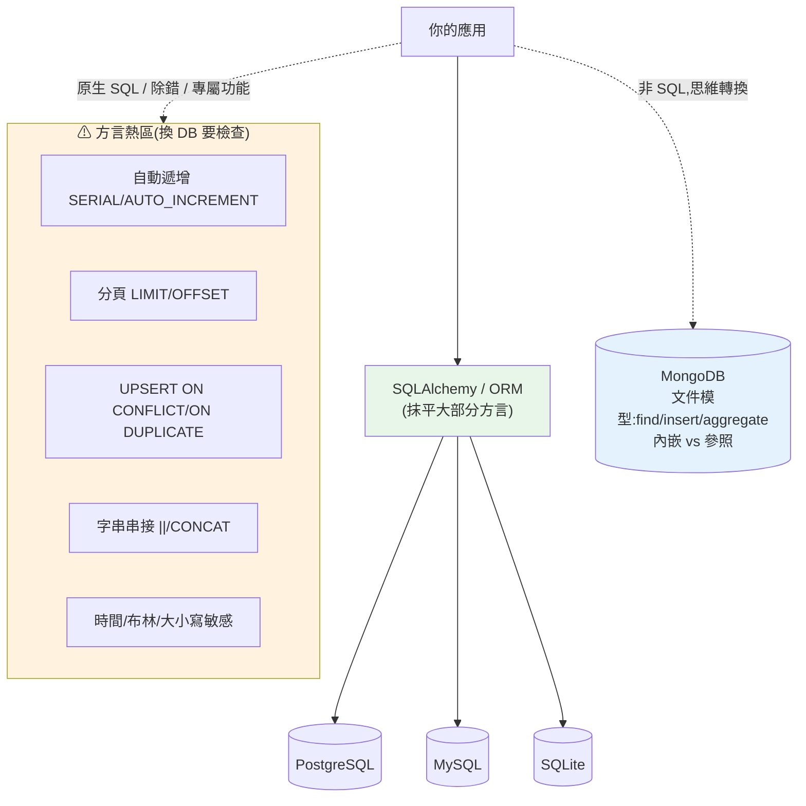

# 多資料庫上手與語法對照

> [ch10](10-nosql-selection.md) 教你「該選哪個資料庫」,但真到現場你會發現:每個資料庫**連線方式不同、CLI 不同、連「插入一筆」的語法都有微妙差異**。從 PostgreSQL 換到 MySQL,`自動遞增主鍵`、`分頁`、`字串串接`、`目前時間`、`UPSERT` 全都不一樣;而 MongoDB 根本不是 SQL。這章是一份**實用對照速查**:四大常用資料庫(**PostgreSQL / MySQL / SQLite / MongoDB**)的連線、CLI、與最常踩雷的語法差異,讓你換 DB 時不慌、跨團隊看得懂別人的 SQL。這是 Part 15 的實戰收尾。

> 🧭 定位:這章是**上手 + 對照速查**,不深入單一 DB 的所有功能。原理見 [原理篇 01-10](README.md);PostgreSQL 進階功能見 [ch22](22-postgresql-features.md);選型見 [ch10](10-nosql-selection.md)。範例用 Python 實作一個「語法對照查詢器」,可驗證。

## Why(為什麼)

「我會 SQL 就會所有資料庫」是危險的半真半假:

- **SQL 有標準,但方言(dialect)差異處處是坑**:`LIMIT`(MySQL/PostgreSQL/SQLite)vs `TOP`(SQL Server)vs `FETCH FIRST`(標準);自動遞增是 `SERIAL`(PG)/`AUTO_INCREMENT`(MySQL)/`AUTOINCREMENT`(SQLite);字串串接是 `||`(標準/PG)vs `CONCAT()`(MySQL)。**換 DB 時這些細節會讓你的 SQL 直接報錯**。
- **UPSERT 每家寫法不同**:PostgreSQL/SQLite 用 `ON CONFLICT`、MySQL 用 `ON DUPLICATE KEY UPDATE`——同一個需求四種寫法。
- **連線與 CLI 完全不同**:`psql`、`mysql`、`sqlite3`、`mongosh` 各有一套指令;連線字串格式也不同。上手新 DB 的第一道門檻常卡在「怎麼連進去、怎麼看資料」。
- **MongoDB 是另一個世界**:不是 SQL——用 `find()`/`insertOne()`/`aggregate()`,思維是文件而非表。從關聯式過來要轉換心智([ch10](10-nosql-selection.md))。
- **SQLAlchemy 幫你抹平大部分方言**,但你仍需在寫原生 SQL、讀他人程式、除錯、調效能時懂差異。**抽象層不是不懂底層的藉口**。

**這章給你一張「跨 DB 對照地圖」**——不必背死每家語法,但知道差異在哪、去哪查,換 DB 或看別人的 code 時心裡有底。

## Theory(理論:SQL 標準與方言)

**SQL 是標準,但沒有資料庫 100% 遵循**。存在一份 ISO SQL 標準,但每家實作有自己的**方言(dialect)**——標準的子集 + 自家擴充:

```text
        ┌──────────── ISO SQL 標準(共同核心)────────────┐
        │  SELECT/INSERT/UPDATE/DELETE, JOIN, WHERE,      │
        │  GROUP BY, 交易, 基本型別...(大家都一樣)       │
        └──────────────────────────────────────────────────┘
   PostgreSQL 擴充    MySQL 擴充      SQLite 簡化     (各自方言)
   jsonb/陣列/CTE    AUTO_INCREMENT  動態型別
   RETURNING         ON DUPLICATE    檔案式
```

**關聯式 vs MongoDB(文件)的思維差異**:

```text
關聯式(SQL)                    MongoDB(文件)
表 table                    →   集合 collection
列 row                      →   文件 document(JSON/BSON)
欄 column                   →   欄位 field
SELECT * FROM t WHERE x=1   →   db.t.find({x: 1})
INSERT INTO t VALUES(...)   →   db.t.insertOne({...})
JOIN                        →   $lookup(較弱)或內嵌文件
```

## Specification(規範:四大 DB 對照速查)

**連線與 CLI**:

| | PostgreSQL | MySQL | SQLite | MongoDB |
|--|-----------|-------|--------|---------|
| **CLI** | `psql` | `mysql` | `sqlite3` | `mongosh` |
| **連線** | `psql "postgres://user:pw@host:5432/db"` | `mysql -u user -p -h host db` | `sqlite3 app.db` | `mongosh "mongodb://host:27017/db"` |
| **Python 驅動** | `psycopg` / `asyncpg` | `mysqlclient` / `PyMySQL` | 內建 `sqlite3` | `pymongo` / `motor` |
| **列出表/集合** | `\dt` | `SHOW TABLES;` | `.tables` | `show collections` |
| **看結構** | `\d 表名` | `DESCRIBE 表名;` | `.schema 表名` | (無固定 schema) |

**SQL 方言差異速查(最常踩雷)**:

| 需求 | PostgreSQL | MySQL | SQLite |
|------|-----------|-------|--------|
| **自動遞增主鍵** | `id SERIAL` / `bigint GENERATED ...` | `id INT AUTO_INCREMENT` | `id INTEGER PRIMARY KEY AUTOINCREMENT` |
| **分頁** | `LIMIT 10 OFFSET 20` | `LIMIT 20, 10` 或 `LIMIT 10 OFFSET 20` | `LIMIT 10 OFFSET 20` |
| **UPSERT** | `ON CONFLICT (id) DO UPDATE` | `ON DUPLICATE KEY UPDATE` | `ON CONFLICT (id) DO UPDATE` |
| **字串串接** | `a || b` | `CONCAT(a, b)` | `a || b` |
| **目前時間** | `NOW()` / `CURRENT_TIMESTAMP` | `NOW()` | `CURRENT_TIMESTAMP` |
| **布林** | 原生 `boolean` | `TINYINT(1)` | 用 `0/1` |
| **大小寫敏感(字串)** | 預設敏感 | 預設不敏感(依 collation) | 依設定 |
| **回傳寫入列** | `RETURNING` | (無,需 `LAST_INSERT_ID()`) | `RETURNING`(新版) |

**MongoDB 基本操作(對照 SQL)**:

```javascript
// 插入(≈ INSERT)
db.users.insertOne({ name: "Alice", age: 30, tags: ["vip"] })
// 查詢(≈ SELECT ... WHERE)
db.users.find({ age: { $gt: 26 } })              // WHERE age > 26
db.users.find({ tags: "vip" })                    // 陣列成員查詢
// 更新(≈ UPDATE)
db.users.updateOne({ name: "Alice" }, { $set: { age: 31 } })
// 聚合(≈ GROUP BY)
db.orders.aggregate([{ $group: { _id: "$status", n: { $sum: 1 } } }])
```

## Implementation(底層:方言差異從何而來、如何應對)

**為什麼會有這些差異**:資料庫各自獨立演化幾十年,在標準成形前就有了自己的做法(如 MySQL 的 `AUTO_INCREMENT`、`LIMIT offset,count`),之後為相容不能貿然改。**差異多集中在「標準沒規定或規定得晚」的地方**——分頁、自動遞增、UPSERT、字串函式、日期處理。核心的 `SELECT/JOIN/WHERE/交易` 反而高度一致。**所以換 DB 時,先檢查這幾個「方言熱區」**。

**應對策略**:

- **用 ORM / 查詢建構器(如 SQLAlchemy)抹平方言**:你寫 `select(User).limit(10)`,SQLAlchemy 針對目標 DB 產生正確方言。**大部分 CRUD 不必碰方言差異**——這是 [ch13/14 SQLAlchemy](13-sqlalchemy-core.md) 的價值之一。
- **寫原生 SQL 時對準目標 DB**:效能關鍵查詢、DB 專屬功能([ch22 JSONB](22-postgresql-features.md))仍要寫原生 SQL,此時要用對方言。
- **可攜性 vs 專屬功能的取捨**([ch10](10-nosql-selection.md)):只用標準 SQL 最可攜但放棄專屬威力;用 PG 專屬功能綁定但更強。明智取捨。

**MongoDB 的思維轉換**:別把 MongoDB 當「沒有 schema 的 SQL」。它的建模核心是**「內嵌 vs 參照(embed vs reference)」**——把常一起讀的資料**內嵌**成一份文件(單次讀取拿全部,反正規化),把大的/共享的用 **`_id` 參照**(類似外鍵但要應用層 join)。這是文件建模的關鍵決策,與關聯式的正規化([ch03](03-normalization.md))思路相反。下面用 Python 實作一個「跨 DB 語法對照查詢器」,把速查表變成可查詢、可驗證的工具。

## Code Example(可執行的 Python 範例)

```python
# multi_db_guide.py — 跨 DB 語法對照查詢器 + SQLite 實跑 UPSERT 方言(純標準庫)
from __future__ import annotations

import sqlite3

# 各操作在不同方言的語法對照(節錄常踩雷的)
DIALECT: dict[str, dict[str, str]] = {
    "auto_increment": {
        "postgresql": "id SERIAL PRIMARY KEY",
        "mysql": "id INT AUTO_INCREMENT PRIMARY KEY",
        "sqlite": "id INTEGER PRIMARY KEY AUTOINCREMENT",
    },
    "paginate": {
        "postgresql": "LIMIT 10 OFFSET 20",
        "mysql": "LIMIT 20, 10",
        "sqlite": "LIMIT 10 OFFSET 20",
    },
    "upsert": {
        "postgresql": "INSERT ... ON CONFLICT (id) DO UPDATE SET ...",
        "mysql": "INSERT ... ON DUPLICATE KEY UPDATE ...",
        "sqlite": "INSERT ... ON CONFLICT (id) DO UPDATE SET ...",
    },
    "string_concat": {
        "postgresql": "a || b",
        "mysql": "CONCAT(a, b)",
        "sqlite": "a || b",
    },
    "returning": {
        "postgresql": "INSERT ... RETURNING id",
        "mysql": "INSERT ...; SELECT LAST_INSERT_ID()",
        "sqlite": "INSERT ... RETURNING id",
    },
}


def syntax_for(operation: str, dialect: str) -> str:
    """查某操作在某方言的寫法。"""
    if operation not in DIALECT:
        raise KeyError(f"未知操作: {operation}")
    variants = DIALECT[operation]
    if dialect not in variants:
        raise KeyError(f"未知方言: {dialect}")
    return variants[dialect]


def differs_across(operation: str) -> bool:
    """該操作是否跨方言有差異(值不全相同)。"""
    variants = set(DIALECT[operation].values())
    return len(variants) > 1


def main() -> None:
    print("跨 DB 語法對照:")
    for op in ("auto_increment", "paginate", "upsert", "string_concat"):
        flag = "⚠ 三家不同" if differs_across(op) else "≈ 相近"
        print(f"  [{op}] {flag}")
        for db in ("postgresql", "mysql", "sqlite"):
            print(f"      {db:11}: {syntax_for(op, db)}")

    # 實跑:SQLite 的 UPSERT 方言(PostgreSQL 同語法、MySQL 用 ON DUPLICATE KEY)
    print("\n實跑 SQLite UPSERT(與 PostgreSQL 同方言):")
    conn = sqlite3.connect(":memory:")
    conn.execute("CREATE TABLE kv (k TEXT PRIMARY KEY, hits INT)")
    for _ in range(3):
        conn.execute(
            "INSERT INTO kv (k, hits) VALUES ('a', 1) "
            "ON CONFLICT(k) DO UPDATE SET hits = hits + 1"
        )
    print("  UPSERT 'a' 三次後 hits =",
          conn.execute("SELECT hits FROM kv WHERE k='a'").fetchone()[0])


if __name__ == "__main__":
    main()
```

**預期輸出**:

```pycon
$ python multi_db_guide.py
跨 DB 語法對照:
  [auto_increment] ⚠ 三家不同
      postgresql : id SERIAL PRIMARY KEY
      mysql      : id INT AUTO_INCREMENT PRIMARY KEY
      sqlite     : id INTEGER PRIMARY KEY AUTOINCREMENT
  [paginate] ⚠ 三家不同
      postgresql : LIMIT 10 OFFSET 20
      mysql      : LIMIT 20, 10
      sqlite     : LIMIT 10 OFFSET 20
  [upsert] ⚠ 三家不同
      postgresql : INSERT ... ON CONFLICT (id) DO UPDATE SET ...
      mysql      : INSERT ... ON DUPLICATE KEY UPDATE ...
      sqlite     : INSERT ... ON CONFLICT (id) DO UPDATE SET ...
  [string_concat] ⚠ 三家不同
      postgresql : a || b
      mysql      : CONCAT(a, b)
      sqlite     : a || b

實跑 SQLite UPSERT(與 PostgreSQL 同方言):
  UPSERT 'a' 三次後 hits = 3
```

逐段解說:

- **`DIALECT` 是一張可查詢的方言對照表**:把「同一操作在不同 DB 的寫法」結構化。`syntax_for("upsert", "mysql")` 立刻告訴你 MySQL 用 `ON DUPLICATE KEY UPDATE`——換 DB 時的速查。
- **`differs_across` 標出「方言熱區」**:auto_increment、paginate、upsert、string_concat **四個都標 ⚠**——這正是換 DB 最容易報錯的地方。注意 PostgreSQL 與 SQLite 的 UPSERT/串接**相同**(都 `ON CONFLICT`、`||`),但 MySQL 不同——所以「⚠ 三家不同」其實是「MySQL 與另兩家不同」。這解釋了為什麼從 SQLite 開發、部署到 PostgreSQL 相對順(方言接近),換 MySQL 要多注意。
- **實跑 SQLite UPSERT**:對同一個 key `'a'` UPSERT 三次,`hits` 累加到 3——驗證 `ON CONFLICT ... DO UPDATE` 的「插入或更新」語意實際運作。**這段在 PostgreSQL 語法完全一樣**(SQLite 刻意相容 PG 的 UPSERT 語法),換 MySQL 才要改成 `ON DUPLICATE KEY UPDATE`。
- **實務用法**:這個對照器可以擴充成團隊的「換 DB 檢查清單」——列出所有方言熱區,遷移前逐一確認。真實專案更常用 SQLAlchemy 讓它自動處理,但懂差異才能在寫原生 SQL 與除錯時不踩雷。
- **要點**:SQL 有標準但方言差異集中在分頁/自動遞增/UPSERT/字串/日期等「熱區」;PostgreSQL 與 SQLite 方言接近、MySQL 較不同;MongoDB 是文件模型(find/insert/aggregate,思維為內嵌 vs 參照);用 ORM 抹平方言,但寫原生 SQL/除錯仍要懂。

## Diagram(圖解:方言熱區與抽象層)



## Best Practice(最佳實踐)

- **用 SQLAlchemy/ORM 抹平方言**:大部分 CRUD 不必手寫方言,換 DB 改設定即可([ch13](13-sqlalchemy-core.md))。
- **換 DB 前檢查「方言熱區」**:自動遞增、分頁、UPSERT、字串/日期函式、布林、大小寫敏感。
- **開發用 SQLite、部署用 PostgreSQL 要小心差異**:方言接近但非完全相同(如型別、大小寫、並發);關鍵路徑用真的目標 DB 測。
- **寫原生 SQL 就對準目標 DB 方言**,並在註解標明依賴的 DB 專屬功能。
- **上手新 DB 先學 CLI**:`psql`/`mysql`/`sqlite3`/`mongosh` 的連線、列表、看結構、跑查詢——最快建立手感。
- **MongoDB 用文件思維建模**:先決定內嵌 vs 參照(依存取模式),別照搬關聯式正規化。
- **可攜 vs 專屬要明智取捨**:只用標準 SQL 最可攜但弱;用 PG 專屬([ch22](22-postgresql-features.md))更強但綁定。
- **連線字串與憑證進密鑰管理**,不寫死([Part 31](../31-cloud-platform-deployment/07-secrets-config-network.md))。

## Common Mistakes(常見誤解)

- **以為 SQL 完全可攜**:方言熱區(分頁/自動遞增/UPSERT/字串)換 DB 就報錯。
- **SQLite 開發、PostgreSQL 部署卻不測差異**:型別、大小寫敏感、並發語意有別,上線才爆。
- **MySQL 用 `ON CONFLICT`**:MySQL 是 `ON DUPLICATE KEY UPDATE`;寫錯方言直接語法錯。
- **把 MongoDB 當無 schema 的 SQL**:忽略內嵌 vs 參照的建模,做出難查難維護的文件。
- **依賴 ORM 卻完全不懂底層方言**:除錯、調效能、寫原生 SQL 時卡住。
- **忽略大小寫敏感差異**:MySQL 字串預設不敏感、PostgreSQL 敏感,查詢結果不同。
- **MySQL 分頁誤用 `LIMIT 10 OFFSET 20` 的相反寫法**:`LIMIT 20, 10` 是 `offset, count`,順序易搞反。
- **連線字串寫死在程式**:換環境要改碼、憑證外洩;用環境變數/密鑰管理。

## Interview Notes(面試重點)

- **能講 SQL 標準 vs 方言**:核心一致,差異集中在分頁/自動遞增/UPSERT/字串/日期等熱區。
- **能對照四大 DB 的自動遞增/分頁/UPSERT 寫法**:SERIAL/AUTO_INCREMENT/AUTOINCREMENT;`ON CONFLICT` vs `ON DUPLICATE KEY UPDATE`。
- **能講 ORM 如何抹平方言**、以及何時仍要懂底層(原生 SQL/除錯/效能/專屬功能)。
- **能講 MongoDB 對照 SQL**:collection/document/field、find/insert/aggregate;**內嵌 vs 參照**的建模(對比正規化)。
- **能講 SQLite 開發、PostgreSQL 部署的注意事項**:方言接近但型別/大小寫/並發有別。
- **能講可攜 vs 專屬的取捨**:標準 SQL 可攜 vs PG 專屬功能([ch22](22-postgresql-features.md))更強但綁定。
- **知道各 DB 的 CLI 與 Python 驅動**:psql/mysql/sqlite3/mongosh;psycopg/PyMySQL/內建/pymongo。

---

➡️ 下一章:[MySQL 專屬功能與實戰](24-mysql-features.md)

[⬆️ 回 Part 15 索引](README.md)
