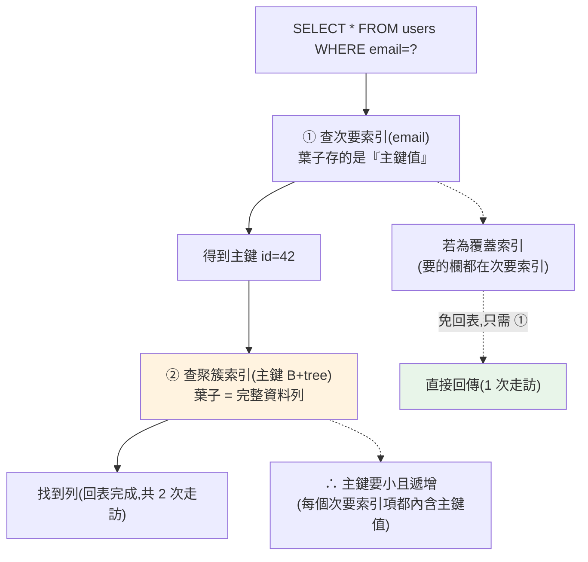

# MySQL 專屬功能與實戰

> [ch22](22-postgresql-features.md) 講了 PostgreSQL 的招牌功能,這章對應地講 **MySQL**——它仍是部署最廣的開源資料庫(WordPress、LAMP、無數既有系統),你幾乎一定會遇到。MySQL 的引擎細節和 PostgreSQL **有幾個關鍵差異**,不懂會踩坑:**InnoDB 的聚簇索引架構**(次要索引查詢要「兩次跳」)、惡名昭彰的 **utf8mb4 陷阱**(用錯字元集存不了 emoji)、**`ON DUPLICATE KEY UPDATE`** 等專屬 UPSERT 語法、**AUTO_INCREMENT 的跳號**、以及以 **binlog** 為核心的複製。這章讓你在 MySQL 現場不慌,也看懂它和 PostgreSQL 的取捨。

> 🧪 範例用**純 Python 模擬** MySQL 特有的引擎行為(InnoDB 聚簇索引的兩次查找、utf8mb4 位元組檢查、AUTO_INCREMENT 跳號),CI 可驗證、不需 MySQL。原理承接 [ch04 儲存](04-storage-engine.md)、[ch05 索引](05-index-internals.md)、[ch07 交易](07-transactions-concurrency.md)、[ch09 複製](09-replication-sharding.md)。

## Why(為什麼)

即使新專案多選 PostgreSQL([前面聊過](10-nosql-selection.md)),MySQL 的**存量巨大**、你遲早會碰——而它的幾個特性正是真實事故的來源:

- **InnoDB 聚簇索引和 PostgreSQL heap 不一樣**:MySQL 的 InnoDB 把**整張表依主鍵實體排序**(表本身就是主鍵的 B+tree),次要索引的葉子存的是**主鍵值**而非直接指向列。這代表「用次要索引查詢要跳兩次」(次要索引→主鍵→聚簇索引找列),也代表**主鍵的選擇對效能影響巨大**(該小、該遞增)。不懂這個,你會做出很慢的 schema。
- **utf8mb4 陷阱是經典生產事故**:MySQL 歷史上的 `utf8` 其實是「**utf8mb3**」——最多 3 個位元組,**存不了 emoji 和部分 CJK 字**(那些要 4 位元組)。用了 `utf8` 存 emoji 會**報錯或截斷**,是無數「為什麼存表情符號就壞掉」的根因。正確要用 **`utf8mb4`**。
- **UPSERT 與大小寫語法和 PostgreSQL 不同**:MySQL 用 `ON DUPLICATE KEY UPDATE`(不是 `ON CONFLICT`)、字串預設**大小寫不敏感**(依 collation)、`AUTO_INCREMENT` 會**跳號**(rollback/刪除後不回收)。這些差異換 DB 或看 MySQL code 時要懂([ch23 方言對照](23-multi-db-guide.md))。
- **複製靠 binlog**:MySQL 的主從複製、時間點還原、CDC(變更資料擷取)都建在 **binary log(binlog)** 上——理解它才懂 MySQL 的高可用與資料同步怎麼運作([ch09](09-replication-sharding.md))。

**這章補齊「用得動 MySQL」的實戰知識**,並把它和 PostgreSQL 的差異講清楚——這是維護既有系統、跨團隊協作的高頻需求。

## Theory(理論:儲存引擎與 InnoDB 聚簇架構)

**MySQL 的「可插拔儲存引擎」**是它的獨特設計——同一個 MySQL,不同表可用不同引擎:

| 引擎 | 特性 | 現況 |
|------|------|------|
| **InnoDB**(預設) | ACID 交易、行鎖、MVCC、聚簇索引、崩潰恢復 | **標準選擇** |
| **MyISAM**(舊) | 無交易、表鎖、較快的純讀 | 已過時,避免 |
| Memory | 記憶體表、重啟消失 | 暫存 |

**幾乎一律用 InnoDB**——MyISAM 沒有交易與行鎖,是歷史遺留。

**InnoDB 的聚簇索引架構(和 PostgreSQL heap 的關鍵差異)**:

```text
PostgreSQL(heap 表):
  資料列堆放在 heap;所有索引(含主鍵)葉子都存「指向列的指標(ctid)」
  次要索引查詢:次要索引 → ctid → 直接找到列(1 次跳)

MySQL InnoDB(聚簇索引表):
  表『本身』就是主鍵的 B+tree,葉子 = 完整資料列(依主鍵物理排序)
  次要索引葉子存的是『主鍵值』,不是列指標
  次要索引查詢:次要索引 → 主鍵值 → 再查聚簇索引找列(2 次跳!回表)
```

**這個差異的後果**:

- **主鍵要小且遞增**:次要索引都內含主鍵值,主鍵大 → 所有次要索引都變胖;主鍵隨機(如 UUID)→ 插入時聚簇索引到處分裂、效能差。**用遞增整數主鍵**(或有序 UUID)。
- **次要索引查詢有「回表」成本**:除非是覆蓋索引([ch05](05-index-internals.md)),否則要多跳一次去聚簇索引拿完整列。
- **主鍵範圍查詢極快**:資料實體依主鍵排序、相鄰。

## Specification(規範:MySQL 招牌語法與設定)

**UPSERT 與插入變體**:

```sql
-- UPSERT:主鍵/唯一鍵衝突就更新(MySQL 專屬,對應 PG 的 ON CONFLICT)
INSERT INTO users (id, name, login_count) VALUES (1, 'Alice', 1)
ON DUPLICATE KEY UPDATE login_count = login_count + 1;

INSERT IGNORE INTO users (id, name) VALUES (1, 'Alice');  -- 衝突就『忽略』(不報錯)
REPLACE INTO users (id, name) VALUES (1, 'Bob');           -- 衝突就『先刪再插』(慎用!)
```

> ⚠️ `REPLACE` 是「delete + insert」,會觸發外鍵串連刪除、換掉 AUTO_INCREMENT id——通常該用 `ON DUPLICATE KEY UPDATE`。

**字元集與定序(collation)——utf8mb4 是重點**:

```sql
-- ✅ 正確:utf8mb4 支援完整 Unicode(含 emoji、罕見 CJK)
CREATE TABLE posts (
    content TEXT
) CHARACTER SET utf8mb4 COLLATE utf8mb4_unicode_ci;
-- ❌ 陷阱:MySQL 的 "utf8"(=utf8mb3)最多 3 bytes,存不了 emoji
```

- **`utf8mb4`**:真正的 UTF-8(4 bytes),**永遠用它**。
- **collation `..._ci`**:case-insensitive(大小寫不敏感,MySQL 字串比較預設如此);`..._bin` 或 `..._cs` 才敏感。

**其他常見設定**:`AUTO_INCREMENT`(自動遞增,**跳號不回收**)、隔離級別預設 **REPEATABLE READ**(比 PostgreSQL 的 Read Committed 高,見 [ch07](07-transactions-concurrency.md))、`EXPLAIN`(看執行計畫,MySQL 8 有 `EXPLAIN ANALYZE`)。

## Implementation(底層:兩次查找、utf8mb4、binlog、gap lock)

**次要索引的「兩次查找(回表)」**(承 [ch05](05-index-internals.md)):在 InnoDB,`SELECT * FROM users WHERE email=?`(email 有次要索引)實際上:

```text
1. 查 email 次要索引 → 找到對應的『主鍵值』(如 id=42)
2. 拿 id=42 去查『聚簇索引』(主鍵 B+tree)→ 找到完整資料列
→ 兩次 B+tree 走訪。若是覆蓋索引(要的欄都在次要索引裡)則省第 2 步。
```

這解釋了為什麼 InnoDB **覆蓋索引特別划算**(免回表),也是為什麼**主鍵值不能太大**(每個次要索引項都帶著它)。

**utf8mb4 的位元組真相**:UTF-8 編碼下,ASCII 是 1 byte、多數 CJK 是 3 bytes、**emoji 與部分罕見字是 4 bytes**。MySQL 舊 `utf8`(utf8mb3)每字元上限 3 bytes,遇到 4-byte 字元就**存不下**(報 `Incorrect string value` 或截斷)。這是「使用者暱稱打 emoji 就 500 錯誤」的經典 bug——解法就是全用 `utf8mb4`。

**binlog 與複製**(承 [ch09](09-replication-sharding.md)):MySQL 把所有變更寫進 **binary log(binlog)**。主從複製 = 複本讀主庫的 binlog 並重放;binlog 也用於**時間點還原(PITR)** 與 **CDC**(如 Debezium 擷取變更餵給 Kafka)。這對應 [ch08](08-wal-recovery.md) 的日誌概念,但注意:InnoDB 另有 **redo log**(崩潰恢復,類似 PostgreSQL 的 WAL),**binlog** 是伺服器層、供複製用——**兩份日誌各司其職**。

**gap lock(間隙鎖)**:InnoDB 在 REPEATABLE READ 下用 **next-key lock**(記錄鎖 + 間隙鎖)防止幻讀([ch07](07-transactions-concurrency.md))——它鎖住「索引記錄之間的間隙」,擋掉會落進範圍的新插入。這是 MySQL 在 RR 就大致防住幻讀的機制,但也是某些死鎖的來源。下面用純 Python 模擬這些 MySQL 特有行為。

## Code Example(可執行的 Python 範例)

```python
# mysql_features_demo.py — 模擬 InnoDB 聚簇索引兩次查找 + utf8mb4 + AUTO_INCREMENT 跳號
from __future__ import annotations

from dataclasses import dataclass, field


# ---------- InnoDB 聚簇索引:次要索引查詢要「兩次跳」 ----------
@dataclass
class InnoDBTable:
    """聚簇索引表:主鍵→完整列;次要索引:欄值→主鍵值(非列指標)。"""
    clustered: dict[int, dict] = field(default_factory=dict)   # pk -> row
    secondary: dict[str, int] = field(default_factory=dict)    # email -> pk
    traversals: int = 0

    def insert(self, pk: int, row: dict) -> None:
        self.clustered[pk] = row
        self.secondary[row["email"]] = pk   # 次要索引存的是『主鍵值』

    def find_by_email(self, email: str, covering: bool) -> dict | None:
        """covering=True 時只需次要索引(免回表);否則要兩次查找。"""
        self.traversals = 1                  # 第 1 跳:查次要索引
        pk = self.secondary.get(email)
        if pk is None:
            return None
        if covering:
            return {"email": email, "pk": pk}   # 覆蓋索引:資料都在索引裡,免回表
        self.traversals = 2                  # 第 2 跳:回聚簇索引拿完整列
        return self.clustered[pk]


# ---------- utf8mb4 陷阱:哪些字元舊 utf8(3-byte)存不下 ----------
def fits_in_utf8mb3(text: str) -> bool:
    """MySQL 舊 utf8(utf8mb3)每字元上限 3 bytes;4-byte 字元存不下。"""
    return all(len(ch.encode("utf-8")) <= 3 for ch in text)


# ---------- AUTO_INCREMENT:rollback 後跳號(不回收) ----------
@dataclass
class AutoIncrement:
    counter: int = 0

    def next_id(self) -> int:
        self.counter += 1
        return self.counter   # 即使該筆之後 rollback,號碼也不退回 → 產生間隙


def main() -> None:
    t = InnoDBTable()
    t.insert(1, {"email": "a@x.com", "name": "Alice"})
    t.insert(2, {"email": "b@x.com", "name": "Bob"})

    t.find_by_email("a@x.com", covering=False)
    print(f"次要索引查完整列: {t.traversals} 次 B+tree 走訪(回表)")
    t.find_by_email("a@x.com", covering=True)
    print(f"覆蓋索引查詢:     {t.traversals} 次 B+tree 走訪(免回表)")

    print("\nutf8mb4 陷阱(哪些字串舊 utf8 存得下):")
    for s in ["hello", "台灣繁體", "emoji 😀", "數學 𝕏"]:
        ok = fits_in_utf8mb3(s)
        print(f"  {s!r:16} -> {'utf8mb3 可' if ok else 'utf8mb3 存不下!需 utf8mb4'}")

    print("\nAUTO_INCREMENT 跳號:")
    ai = AutoIncrement()
    ids = [ai.next_id(), ai.next_id()]     # 1, 2
    _ = ai.next_id()                        # 3:假設這筆交易 rollback 了
    ids.append(ai.next_id())                # 4(不是 3!號碼不回收)
    print(f"  實際落地的 id = {ids}(中間的 3 因 rollback 成為間隙)")


if __name__ == "__main__":
    main()
```

**預期輸出**:

```pycon
$ python mysql_features_demo.py
次要索引查完整列: 2 次 B+tree 走訪(回表)
覆蓋索引查詢:     1 次 B+tree 走訪(免回表)

utf8mb4 陷阱(哪些字串舊 utf8 存得下):
  'hello'          -> utf8mb3 可
  '台灣繁體'           -> utf8mb3 可
  'emoji 😀'        -> utf8mb3 存不下!需 utf8mb4
  '數學 𝕏'           -> utf8mb3 存不下!需 utf8mb4

AUTO_INCREMENT 跳號:
  實際落地的 id = [1, 2, 4](中間的 3 因 rollback 成為間隙)
```

逐段解說:

- **InnoDB 聚簇索引的「兩次查找」**:`find_by_email(covering=False)` 花 **2 次 B+tree 走訪**——第 1 次查 email 次要索引拿到**主鍵值**,第 2 次拿主鍵去聚簇索引找**完整列**(回表)。這正是 InnoDB 的架構:**次要索引葉子存主鍵值,不是列指標**(和 PostgreSQL heap 直接存 ctid 不同)。`covering=True` 時要的欄都在次要索引裡,**省掉回表**只需 1 次——這就是為什麼 InnoDB 覆蓋索引特別划算,也是「主鍵要小」的原因(每個次要索引項都內含主鍵值)。
- **utf8mb4 陷阱**:`台灣繁體`(CJK)是 3-byte,舊 utf8 存得下;但 **emoji 😀 和罕見數學字元 𝕏 是 4-byte,舊 `utf8`(utf8mb3)存不下**——會報 `Incorrect string value`。這重現了「存 emoji 就爆」的經典事故;解法是欄位一律用 `utf8mb4`。`fits_in_utf8mb3` 用實際 UTF-8 編碼位元組數判斷,是可驗證的真相。
- **AUTO_INCREMENT 跳號**:第 3 個號碼被取用後那筆交易 rollback,但**號碼不回收**——下一筆拿到 4,中間的 3 成為**永久間隙**。所以 MySQL 的自增 id **不保證連續**(別假設 id 沒有洞、別用「最大 id」當「總筆數」)。這是 MySQL(和多數 DB 的 sequence)的正常行為。
- **對映真實 MySQL**:這些純 Python 模擬抓住了 InnoDB 的**架構語意**;真實 MySQL 還有 redo log、binlog、gap lock、buffer pool 等([ch04](04-storage-engine.md)/[ch07](07-transactions-concurrency.md)/[ch09](09-replication-sharding.md))。
- **要點**:InnoDB 聚簇索引使次要索引查詢要回表(2 次走訪)、主鍵要小且遞增、覆蓋索引免回表;MySQL 的 `utf8` 是 3-byte 的 utf8mb3、要用 `utf8mb4` 才能存 emoji;AUTO_INCREMENT 跳號不回收;UPSERT 用 `ON DUPLICATE KEY UPDATE`;複製靠 binlog。

## Diagram(圖解:InnoDB 聚簇索引查詢路徑)



## Best Practice(最佳實踐)

- **一律用 InnoDB**:要交易、行鎖、崩潰恢復;別用 MyISAM。
- **字元集一律 `utf8mb4`**:支援 emoji 與完整 Unicode;避開 utf8mb3 陷阱。連線與欄位都設 utf8mb4。
- **主鍵小且遞增**:遞增整數(或有序 UUID)——聚簇索引不亂分裂、次要索引不臃腫。避免大的隨機 UUID 當主鍵。
- **善用覆蓋索引免回表**:InnoDB 次要索引查詢要回表,把常用查詢的欄一起放進索引。
- **UPSERT 用 `ON DUPLICATE KEY UPDATE`**,慎用 `REPLACE`(它是刪+插,會動外鍵與自增 id)。
- **理解 collation**:預設大小寫不敏感(`_ci`),需要區分大小寫用 `_bin`/`_cs`。
- **別假設 AUTO_INCREMENT 連續**:會跳號;別拿它推算筆數或假設無間隙。
- **複製與備份靠 binlog**:啟用 binlog 供複製與 PITR;監控主從延遲([ch09](09-replication-sharding.md))。
- **連線字串與憑證進密鑰管理**([Part 31](../31-cloud-platform-deployment/07-secrets-config-network.md))。

## Common Mistakes(常見誤解)

- **用 `utf8` 存 emoji 就壞掉**:MySQL 的 `utf8` 是 3-byte utf8mb3;一律用 `utf8mb4`。
- **用大的隨機 UUID 當主鍵**:聚簇索引到處分裂、所有次要索引臃腫、插入慢;用遞增整數/有序 UUID。
- **以為次要索引查詢一次到位**:InnoDB 要回表(2 次走訪),除非覆蓋索引。
- **用 MyISAM**:無交易、表鎖;現在幾乎沒理由用。
- **用 `REPLACE` 當 UPSERT**:它是刪+插,觸發外鍵串連、換掉自增 id;用 `ON DUPLICATE KEY UPDATE`。
- **假設 AUTO_INCREMENT 連續無洞**:rollback/刪除會跳號;別依賴連續性。
- **忽略大小寫不敏感預設**:MySQL 字串比較預設 `_ci`,`'A'='a'` 為真,和 PostgreSQL 不同。
- **混淆 redo log 與 binlog**:redo log 給崩潰恢復(引擎層)、binlog 給複製(伺服器層);兩者不同。
- **把 MySQL 的隔離級別行為當和 PostgreSQL 一樣**:MySQL 預設 RR + gap lock,PG 預設 RC([ch07](07-transactions-concurrency.md))。

## Interview Notes(面試重點)

- **(高頻)能講 InnoDB 聚簇索引架構**:表依主鍵排序、次要索引葉子存**主鍵值**、查詢要**回表(2 次走訪)**、覆蓋索引免回表;所以**主鍵要小且遞增**。對比 PostgreSQL heap(次要索引直接存 ctid)。
- **(必考)能講 utf8mb4 陷阱**:MySQL 的 `utf8`=utf8mb3(3 bytes)存不了 emoji(4 bytes),要用 `utf8mb4`。
- **能講 MySQL 專屬 UPSERT**:`ON DUPLICATE KEY UPDATE` / `INSERT IGNORE` / `REPLACE`(刪+插的風險)。
- **能講儲存引擎**:InnoDB(交易/行鎖/聚簇,預設)vs MyISAM(舊、無交易)。
- **能講 redo log vs binlog**:引擎層崩潰恢復 vs 伺服器層複製/PITR/CDC。
- **能講 AUTO_INCREMENT 跳號**、collation 大小寫不敏感、預設 RR + gap lock([ch07](07-transactions-concurrency.md))。
- **能對比 MySQL vs PostgreSQL**:聚簇 vs heap、預設隔離級別、utf8mb4、方言差異([ch23](23-multi-db-guide.md))——展現「懂兩家取捨」。

---

➡️ 下一章:[MongoDB 與文件資料庫實戰](25-mongodb.md)

[⬆️ 回 Part 15 索引](README.md)
