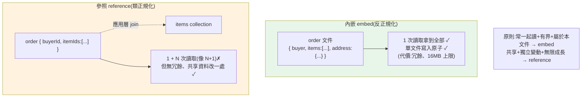

# MongoDB 與文件資料庫實戰

> 前面 24 章幾乎都在關聯式世界。這一章跨到**另一個典範**——**MongoDB**,最主流的**文件資料庫(document database)**。它不是 SQL:資料是 **JSON 般的文件**、放在 **collection** 裡、沒有固定 schema。從關聯式過來,最需要轉換的不是語法,而是**建模思維**——關聯式教你[正規化拆表](03-normalization.md),文件庫卻鼓勵你把相關資料**內嵌(embed)** 在一份文件裡。這章講清楚文件模型、CRUD 與查詢運算子、**embed vs reference 的建模抉擇**(文件庫的靈魂)、聚合管線(aggregation pipeline)、索引、PyMongo,以及何時該用/不該用它([呼應 ch10 選型](10-nosql-selection.md))。

> 🧪 MongoDB 需要伺服器,CI 不跑真的 MongoDB。範例用**純 Python 迷你文件庫**模擬其核心語意(query 運算子、陣列多鍵查詢、聚合分組、embed vs reference 的讀取成本),可離線驗證。真實 **PyMongo / mongosh** 語法以示意呈現。原理承接 [ch03 正規化](03-normalization.md)、[ch10 選型](10-nosql-selection.md)。

## 💡 白話導讀(建議先讀)

關聯式的思維是**拆**:訂單拆成 orders、order_items、addresses 三張表,查的時候 JOIN 回來。
MongoDB 的思維是**裝袋**:一筆訂單=**一份自包含的文件**——買家、品項、地址全裝在同一袋 JSON 裡,一次拿走。

```text
表 table → 集合 collection    列 row → 文件 document(可巢狀、可陣列)
JOIN     → 通常不需要(東西都在袋裡)
```

於是文件庫的**靈魂抉擇**變成:什麼該裝進袋裡(embed)、什麼該只放一張提貨單(reference)?

- **裝袋(embed)**:常一起讀、屬於這筆資料、數量有界——訂單的品項、文章的少量留言。
  → 一次讀取拿全部、單文件寫入天生原子。
- **提貨單(reference)**:被多處共享、獨立變動、可能無限長——使用者資料、商品目錄。
  → 存 id,用時再查(小心變成文件版的 [N+1](20-n-plus-1.md))。

判斷心法一句:**「這筆資料通常怎麼被一起讀?」——讀取模式決定裝袋方式**(和關聯式「先正規化」正好相反)。

查詢語言換一套(`find({age: {$gt: 26}})`、聚合管線),但概念都能對照 SQL——章內附對照表。
最後仍要說:**強一致的多實體交易(金流)還是關聯式的主場**——選型回看 [ch10](10-nosql-selection.md)。

## Why(為什麼)

關聯式很強,為什麼還要學文件庫?因為有一類問題用文件模型更自然:

- **資料天生是「巢狀文件」而非「規整表格」**:一筆訂單含買家、多個品項、配送地址、一包會變的 metadata——關聯式要拆成 orders / order_items / addresses 好幾張表,查一筆訂單要 JOIN 多表([N+1](20-n-plus-1.md) 的溫床)。文件庫把整筆訂單存成**一份自包含的文件**,一次讀取拿到全部——**讀取模式決定建模**,這是文件庫的核心優勢。
- **schema 需要彈性演化**:產品目錄裡不同類別的商品欄位差很多(書有作者、電子產品有規格),關聯式要嘛一堆稀疏欄位、要嘛複雜的 EAV。文件庫**每份文件可以有不同欄位**,加欄位不用 migration——快速迭代的產品很受用。
- **水平擴展的設計取向**:MongoDB 從設計上就為**分片(sharding)** 與**複製(replica set)** 而生([ch09](09-replication-sharding.md)),適合需要水平擴展、且存取模式適合文件的大規模應用。
- **但它不是萬能、更不是「比 SQL 好」**:文件庫**放棄**了強一致的多表交易、彈性的 ad-hoc join、schema 約束的保護([ch10](10-nosql-selection.md))。用錯場景(如金流、高度關聯的資料)會很痛。**懂它放棄了什麼,才知道何時該用。**

**這章讓你從關聯式思維切換到文件思維**,能對一個需求判斷「該用文件庫嗎、該怎麼建模」——這是現代後端的必備視野,也是選型面試的高頻題。

## Theory(理論:文件模型與思維轉換)

**MongoDB 的資料層級**(對照關聯式):

```text
關聯式(SQL)              MongoDB(文件)
資料庫 database       →   資料庫 database
表 table              →   集合 collection
列 row                →   文件 document(BSON,類 JSON)
欄 column             →   欄位 field(可巢狀、可陣列)
主鍵 primary key      →   _id(預設自動產生 ObjectId)
JOIN                  →   內嵌文件 或 $lookup(較弱)
```

一份文件長這樣(**自包含、可巢狀、可陣列**):

```json
{
  "_id": ObjectId("..."),
  "name": "Alice",
  "address": { "city": "Taipei", "zip": "100" },   // 內嵌文件
  "orders": [                                        // 內嵌陣列
    { "product": "Book", "qty": 2 },
    { "product": "Pen", "qty": 5 }
  ],
  "tags": ["vip", "early-adopter"]                   // 純陣列
}
```

**核心思維轉換:「讀取模式驅動建模」**。關聯式先正規化(消除冗餘,[ch03](03-normalization.md)),查詢時再 JOIN 組合;文件庫反過來——**先想「這筆資料通常怎麼被一起讀取」,把常一起讀的內嵌在同一份文件**,換取「一次讀取拿到全部、免 JOIN」。這是**反正規化**的取向,與關聯式相反。

## Specification(規範:CRUD、查詢運算子、聚合)

**CRUD(mongosh / PyMongo 語法)**:

```javascript
// 建立
db.users.insertOne({ name: "Alice", age: 30, tags: ["vip"] })
db.users.insertMany([{ name: "Bob", age: 25 }, { name: "Cara", age: 40 }])

// 查詢(query 運算子)
db.users.find({ age: { $gt: 26 } })                 // age > 26
db.users.find({ tags: "vip" })                       // 陣列成員(多鍵)
db.users.find({ age: { $in: [25, 30] } })            // 集合
db.users.find({ "address.city": "Taipei" })          // 巢狀欄位
db.users.find({ age: { $gt: 20 } }, { name: 1 })     // 投影:只回 name

// 更新
db.users.updateOne({ name: "Alice" }, { $set: { age: 31 } })
db.users.updateOne({ name: "Alice" }, { $inc: { loginCount: 1 } })
db.users.updateOne({ name: "Alice" }, { $push: { tags: "gold" } })  // 陣列加元素

// 刪除
db.users.deleteOne({ name: "Bob" })
```

**常用查詢運算子**:

| 運算子 | 意義 | 對應 SQL |
|--------|------|----------|
| `$gt`/`$gte`/`$lt`/`$lte` | 比較 | `>`/`>=`/`<`/`<=` |
| `$in`/`$nin` | 在/不在集合 | `IN`/`NOT IN` |
| `$and`/`$or`/`$not` | 邏輯 | `AND`/`OR`/`NOT` |
| `$exists` | 欄位存在 | (無直接對應) |
| `$regex` | 正則 | `LIKE` |

**聚合管線(aggregation pipeline)**——MongoDB 的「GROUP BY + 資料轉換」,由一連串**階段(stage)** 組成:

```javascript
db.orders.aggregate([
  { $match: { status: "paid" } },                          // ≈ WHERE
  { $group: { _id: "$customerId", total: { $sum: "$amount" } } },  // ≈ GROUP BY + SUM
  { $sort: { total: -1 } },                                 // ≈ ORDER BY DESC
  { $limit: 10 }                                            // ≈ LIMIT
])
```

## Implementation(底層:embed vs reference、原子性、索引)

**embed vs reference——文件建模的核心抉擇**(這一節是本章重點):

```text
內嵌(embed):把相關資料放進同一份文件
  order = { _id, buyer, items: [{product, qty}, ...], address: {...} }
  ✓ 一次讀取拿到全部(免 JOIN)、讀取快、單文件寫入原子
  ✗ 資料冗餘(buyer 資訊若多處內嵌)、文件可能過大(有 16MB 上限)、
    共享資料難更新(要改所有內嵌副本)

參照(reference):存 ID,分開的 collection
  order = { _id, buyerId, itemIds: [...] }   // 像外鍵
  ✓ 無冗餘、共享資料改一處、文件小
  ✗ 讀取要多次查詢(order + 各 item)= 應用層 JOIN,像 N+1
```

**決策原則**:

- **常一起讀、且屬於這份文件的、有界的** → **內嵌**(訂單的品項、文章的留言若不多)。
- **被多處共享、獨立變動、可能無限成長** → **參照**(使用者、商品目錄;訂單引用商品 ID 而非內嵌整個商品)。
- 經典:訂單**內嵌下單當下的品項快照**(價格會變,要留當時的)、但**參照商品 ID**(商品本身是共享實體)。

**原子性的邊界**:MongoDB 保證**單一文件的寫入是原子的**——這也是「把該一起改的資料內嵌在一份文件」的另一個理由(改一份文件即原子,不需交易)。跨多份文件的原子性要用**多文件交易**(MongoDB 4.0+ 支援,但較重,有效能成本,傾向少用)——這與關聯式「多表交易是家常便飯」不同([ch07](07-transactions-concurrency.md))。

**索引**:MongoDB 也用 B-tree 索引([ch05](05-index-internals.md))——單欄、複合(遵守最左前綴)、**多鍵索引(對陣列欄位,自動為每個元素建索引)**、文字索引、地理索引。`db.users.createIndex({ age: 1 })`。**不建索引的查詢會掃全集合**,和關聯式一樣。下面用純 Python 迷你文件庫模擬 query 運算子、陣列多鍵查詢、聚合,以及 embed vs reference 的讀取成本差異。

## Code Example(可執行的 Python 範例)

```python
# mongodb_demo.py — 迷你文件庫:query 運算子 + 聚合 + embed vs reference(純標準庫)
from __future__ import annotations

from typing import Any

Doc = dict[str, Any]


def matches(doc: Doc, query: Doc) -> bool:
    """模擬 MongoDB find 的比對:支援 $gt/$gte/$lt/$in、陣列多鍵、等值。"""
    for field, cond in query.items():
        val = doc.get(field)
        if isinstance(cond, dict):  # 運算子條件,如 {"$gt": 26}
            for op, operand in cond.items():
                if op == "$gt" and not (val is not None and val > operand):
                    return False
                if op == "$gte" and not (val is not None and val >= operand):
                    return False
                if op == "$lt" and not (val is not None and val < operand):
                    return False
                if op == "$in" and val not in operand:
                    return False
        elif isinstance(val, list):  # 陣列多鍵:{tags: "vip"} 比對成員
            if cond not in val:
                return False
        elif val != cond:            # 等值
            return False
    return True


def find(collection: list[Doc], query: Doc) -> list[Doc]:
    return [d for d in collection if matches(d, query)]


def group_count(collection: list[Doc], by: str) -> dict[Any, int]:
    """模擬 aggregate 的 $group + $sum:1(依欄位分組計數)。"""
    out: dict[Any, int] = {}
    for d in collection:
        out[d[by]] = out.get(d[by], 0) + 1
    return out


def read_cost_embedded(order: Doc) -> int:
    """內嵌:品項就在訂單文件裡 → 1 次讀取拿到全部。"""
    _ = order["items"]  # 已在文件內
    return 1


def read_cost_referenced(order: Doc, items_col: list[Doc]) -> int:
    """參照:訂單只存 itemIds → 1 次讀訂單 + N 次讀各品項(像 N+1)。"""
    reads = 1
    for item_id in order["itemIds"]:
        _ = find(items_col, {"_id": item_id})  # 每個品項各查一次
        reads += 1
    return reads


def main() -> None:
    users = [
        {"_id": 1, "name": "Alice", "age": 30, "tags": ["vip", "gold"]},
        {"_id": 2, "name": "Bob", "age": 25, "tags": ["normal"]},
        {"_id": 3, "name": "Cara", "age": 40, "tags": ["vip"]},
    ]

    print("find age>26:", [u["name"] for u in find(users, {"age": {"$gt": 26}})])
    print("find tags=vip(陣列多鍵):", [u["name"] for u in find(users, {"tags": "vip"})])
    print("find age in [25,40]:",
          [u["name"] for u in find(users, {"age": {"$in": [25, 40]}})])
    print("aggregate 依 age 分組計數:", group_count(users, "age"))

    # embed vs reference 讀取成本
    embedded_order = {"_id": 100, "items": [{"p": "Book", "q": 2}, {"p": "Pen", "q": 5}]}
    items_col = [{"_id": "i1", "p": "Book"}, {"_id": "i2", "p": "Pen"},
                 {"_id": "i3", "p": "Ink"}]
    referenced_order = {"_id": 101, "itemIds": ["i1", "i2", "i3"]}
    print("\n讀取成本(拿一筆訂單的所有品項):")
    print(f"  內嵌 embed:    {read_cost_embedded(embedded_order)} 次讀取(免 JOIN)")
    print(f"  參照 reference: {read_cost_referenced(referenced_order, items_col)} "
          f"次讀取(1 訂單 + 3 品項,像 N+1)")


if __name__ == "__main__":
    main()
```

**預期輸出**:

```pycon
$ python mongodb_demo.py
find age>26: ['Alice', 'Cara']
find tags=vip(陣列多鍵): ['Alice', 'Cara']
find age in [25,40]: ['Bob', 'Cara']
aggregate 依 age 分組計數: {30: 1, 25: 1, 40: 1}

讀取成本(拿一筆訂單的所有品項):
  內嵌 embed:    1 次讀取(免 JOIN)
  參照 reference: 4 次讀取(1 訂單 + 3 品項,像 N+1)
```

逐段解說:

- **`matches` 重現 MongoDB 的 query 語意**:`{"age": {"$gt": 26}}` 是運算子條件、`{"tags": "vip"}` 是**陣列多鍵比對**(文件的 `tags` 是陣列,只要**含** "vip" 就命中——這是 MongoDB 的自然行為,Alice 和 Cara 的 tags 都含 vip)。`$in` 對應集合查詢。這就是文件查詢的核心:**用一個查詢文件描述條件**。
- **陣列多鍵查詢**:`find(tags="vip")` 抓到 Alice 與 Cara——文件庫對陣列欄位的查詢很自然,對應 MongoDB 的**多鍵索引**(對陣列每個元素建索引)。關聯式要做到這個得另立關聯表。
- **`group_count` 模擬聚合**:對應 `aggregate([{$group:{_id:"$age", n:{$sum:1}}}])`——MongoDB 的聚合管線就是這類「分組 + 統計 + 轉換」的階段串接。
- **embed vs reference 的讀取成本(本章重點)**:拿「一筆訂單的所有品項」——**內嵌**只要 **1 次讀取**(品項就在訂單文件裡,免 JOIN);**參照**要 **4 次**(1 次讀訂單 + 3 次讀各品項),這正是關聯式的 **[N+1 問題](20-n-plus-1.md)** 在文件庫的翻版。**這就是為什麼「常一起讀的資料要內嵌」**——把讀取模式設計進資料結構,換取一次讀取拿全部。
- **但內嵌不是萬靈丹**:若品項是共享的商品實體(會被很多訂單引用、會獨立更新),內嵌整個商品會造成冗餘與更新惡夢——此時該**參照商品 ID**。取捨見 Best Practice。
- **要點**:MongoDB 是文件模型(collection/document/field、巢狀/陣列、_id);查詢用 query 文件 + 運算子($gt/$in…)、陣列多鍵自然;聚合管線做 GROUP BY 類轉換;**embed(常一起讀、有界、屬於本文件)vs reference(共享、獨立變動、無限成長)是核心建模抉擇**;單文件寫入原子,跨文件交易較重。

## Diagram(圖解:embed vs reference)



## Best Practice(最佳實踐)

- **讓讀取模式驅動建模**:先想「這資料通常怎麼被一起讀」,把常一起讀的**內嵌**、共享獨立的**參照**。
- **有界且屬於本文件的資料就內嵌**:訂單品項、文章的少量留言——一次讀取拿全部、寫入原子。
- **共享、獨立變動、可能無限成長的用參照**:使用者、商品目錄;避免文件無限膨脹與更新惡夢(注意 16MB 文件上限)。
- **內嵌「快照」資料**:訂單存下單當時的價格/品項快照(要留歷史值),同時參照商品 ID。
- **為查詢欄位建索引**:單欄/複合(最左前綴,[ch05](05-index-internals.md))/陣列多鍵/文字;不建索引就掃全集合。
- **善用單文件原子性**:把該一起改的放同文件,避免多文件交易(較重)。
- **需要強一致的多實體交易?重新考慮關聯式**:金流/庫存這類用 PostgreSQL 更合適([ch10](10-nosql-selection.md))。
- **用 PyMongo(同步)或 Motor(async)**;連線字串進密鑰管理([Part 31](../31-cloud-platform-deployment/07-secrets-config-network.md))。
- **schema 彈性 ≠ 無 schema 規範**:用 schema validation 或應用層(pydantic)維持文件一致性,別放任欄位亂長。

## Common Mistakes(常見誤解)

- **把 MongoDB 當「無 schema 的 SQL」**:照搬正規化拆一堆 collection、狂用 `$lookup`——失去文件庫優勢又比關聯式難用。
- **什麼都內嵌**:內嵌共享/無限成長的資料 → 文件爆 16MB、冗餘、更新惡夢;共享的用參照。
- **什麼都參照**:每次讀都要多次查詢(N+1)、失去「一次讀取」優勢;常一起讀的該內嵌。
- **拿 MongoDB 做金流/庫存等強一致多實體交易**:多文件交易較重且非其強項;這類用關聯式。
- **不建索引就查詢**:掃全集合,大資料很慢;和關聯式一樣要建索引。
- **以為文件庫沒有建模**:embed vs reference 是關鍵建模,做錯一樣難用。
- **忽略陣列與內嵌欄位的查詢/索引特性**:多鍵索引、`"address.city"` 點記法要懂。
- **放任 schema 亂長**:彈性被濫用成「每份文件欄位都不同」→ 難查難維護;要有規範。

## Interview Notes(面試重點)

- **能講文件模型 vs 關聯式**:collection/document/field、巢狀/陣列/_id;JOIN → 內嵌或 $lookup(較弱)。
- **(核心)能講 embed vs reference 的抉擇**:常一起讀+有界+屬於本文件 → embed(一次讀取、寫入原子);共享+獨立變動+無限成長 → reference(無冗餘但多次讀取,像 N+1)。並與[正規化](03-normalization.md)對比(文件庫傾向反正規化)。
- **能講讀取模式驅動建模**:先想怎麼被讀,再決定內嵌或參照。
- **能講 CRUD 與查詢運算子**:find + `$gt`/`$in`、陣列多鍵、投影;`$set`/`$inc`/`$push`。
- **能講聚合管線**:`$match`/`$group`/`$sort`/`$lookup` 對應 WHERE/GROUP BY/ORDER BY/JOIN。
- **能講原子性邊界**:單文件寫入原子、跨文件交易較重(4.0+);影響「該不該內嵌」。
- **能講索引**:單欄/複合(最左前綴)/多鍵(陣列)/文字;不建就掃全集合。
- **能講何時用/不用 MongoDB**:巢狀文件/彈性 schema/水平擴展且存取適合文件 → 用;強一致多實體交易/高度關聯 ad-hoc 查詢 → 用關聯式([ch10](10-nosql-selection.md))。

---

⬅️ 這是 Part 15 的最後一章。

[⬆️ 回 Part 15 索引](README.md) ｜ [下一 Part:架構與設計 ➡️](../16-architecture/README.md)
