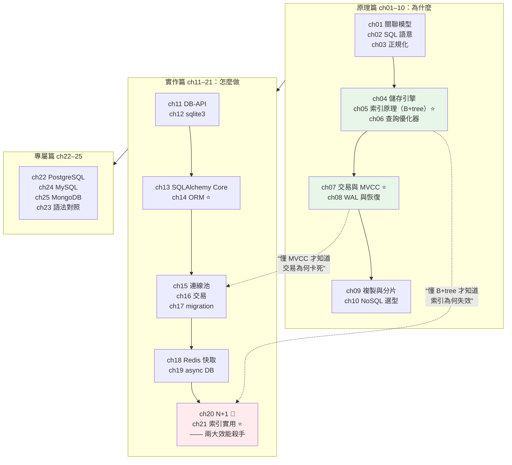

# Part 15 統整：資料庫全貌

> 把這 25 章串成一張圖——全書最長的 Part，但它其實只有**兩層**：**先懂原理（為什麼），才敢用工具（怎麼做）**。

## 🗺️ 知識地圖（這 25 章怎麼串起來）

Part 15 刻意分成**原理篇（ch01–10）** 與 **實作篇（ch11–25）**。
這個順序不是隨便排的——**沒有原理，實作只是抄咒語**：
你不懂 B+tree，就不知道為什麼索引「加了卻沒用」；
不懂 MVCC，就不知道為什麼交易會卡死。



**一句話串起來**：

**原理篇**回答「**為什麼**」：資料實際怎麼**存在磁碟上**（ch04）、
索引為什麼是 **B+tree**（ch05）、優化器**怎麼決定執行計畫**（ch06）、
交易怎麼在並發下保持正確（**MVCC**，ch07）、崩潰後怎麼救回來（**WAL**，ch08）。

**實作篇**回答「**怎麼做**」：從最底層的 [DB-API](11-db-api.md)（ch11）、
到 [SQLAlchemy](14-sqlalchemy-orm.md)（ch13–14）、
[連線池](15-connection-pool.md)（ch15）、[migration](17-migration.md)（ch17）、
[Redis 快取](18-redis.md)（ch18）。

而**兩者在最後交會**——實作篇的兩大效能殺手，
[**N+1**](20-n-plus-1.md)（ch20）與[**索引**](21-indexing.md)（ch21），
**只有懂了原理篇才真正解得掉**（下面的小實作會證明這一點）。

## ⚡ 速查表（什麼情境用什麼）

| 情境 | 怎麼做 | 章節 |
|------|--------|------|
| **查詢很慢，第一個該問什麼** | **「缺索引嗎？」** 用 **`EXPLAIN`** 看是 `SCAN`（全表掃）還是 `SEARCH ... USING INDEX` | [ch21](21-indexing.md)、[ch06](06-query-processing.md) |
| **迴圈裡在查資料庫** | 🔴 **N+1！** 改用 **JOIN** 或 **eager loading**（`selectinload`） | [ch20](20-n-plus-1.md) |
| 該對哪些欄位建索引 | `WHERE` 常用的欄、**JOIN 的外鍵**、`ORDER BY` 的欄——且要**高選擇性** | [ch21](21-indexing.md) |
| 索引加了卻沒用 | 別對欄位**套函式**（`WHERE YEAR(d)=2026`）、別用**前置 `%`** 的 LIKE、注意型別一致 | [ch21](21-indexing.md)、[ch05](05-index-internals.md) |
| 一組操作要「全有全無」 | **交易**（`with session.begin():`）——失敗自動 rollback | [ch16](16-transactions.md)、[ch07](07-transactions-concurrency.md) |
| 改 schema（加欄位、改型別） | **migration**（Alembic）——**絕不手動改正式資料庫** | [ch17](17-migration.md) |
| 每次請求都開新連線很慢 | **連線池**（共享單車站：借了要還） | [ch15](15-connection-pool.md) |
| 同一份資料被反覆查 | **Redis 快取**（cache-aside：先查快取、沒有才查 DB、**寫時刪快取**） | [ch18](18-redis.md) |
| FastAPI 用 async，DB 也要 async | `asyncpg` + `AsyncSession`——**一路 async 到底**（混同步會 `MissingGreenlet`） | [ch19](19-async-database.md) |
| 寫查詢要不要用 ORM | 一般 CRUD 用 **ORM**（好維護）；複雜報表用 **Core／原生 SQL**（好控制） | [ch13](13-sqlalchemy-core.md)、[ch14](14-sqlalchemy-orm.md) |
| **選哪個資料庫** | **預設 PostgreSQL**（一庫多用：JSONB、全文、向量）——除非有明確理由 | [ch10](10-nosql-selection.md)、[ch22](22-postgresql-features.md) |
| 資料表怎麼設計 | 正規化到 **3NF**，之後才視效能**刻意**反正規化 | [ch03](03-normalization.md) |
| 讀取量太大 | **讀寫分離**（主寫從讀）；再不夠才**分片** | [ch09](09-replication-sharding.md) |
| 半結構化資料（每筆欄位不一樣） | PostgreSQL 的 **JSONB**（別急著上 MongoDB） | [ch22](22-postgresql-features.md)、[ch25](25-mongodb.md) |
| 資料庫崩潰了，資料會不會不見 | **WAL**——先寫日誌再改資料，重啟時重放 | [ch08](08-wal-recovery.md) |
| 標準庫直接玩 SQL | `sqlite3`（零安裝，測試/原型首選） | [ch12](12-sqlite3.md) |
| MySQL / MongoDB 的坑 | utf8mb4（emoji）、embed vs reference | [ch24](24-mysql-features.md)、[ch25](25-mongodb.md)、[ch23](23-multi-db-guide.md) |
| 想懂 SQL 到底怎麼被執行 | 關聯代數 → 邏輯計畫 → 物理計畫 | [ch01](01-relational-model.md)、[ch02](02-sql-language.md) |

## 🔑 核心心智模型（帶得走的幾句話）

- **索引 ＝ 書的目錄。** 沒有它，資料庫只能**一頁頁翻**（全表掃描 O(n)）；
  有了它，直接**查目錄跳過去**（B+tree，O(log n)）。
  但**目錄要錢**：佔空間、**拖慢每一次寫入**（寫入時要同步維護索引）。
- **索引不是加了就會用。** 對欄位**套函式**、用**前置 `%`** 的 LIKE、
  **型別不一致**——都會讓索引**失效**。**永遠用 `EXPLAIN` 驗證，別靠猜。**
- **N+1 是最常見的效能災難。** 「先查 100 個 user，再對每個 user 查訂單」＝
  **101 條 SQL**。改成一條 JOIN／eager loading 就好。
  **ORM 讓你很容易「不小心」寫出 N+1**——因為它「看起來只是存取一個屬性」。
- **交易 ＝ 全有全無。** 轉帳扣了 A 卻沒加到 B，比報錯更可怕。
  而 **MVCC**（多版本並發控制）讓「讀」不必等「寫」——
  就像[圖書館的影本](07-transactions-concurrency.md)：你讀你的舊版，別人改他的新版。
- **WAL ＝ 先寫日誌，再改資料。** 這樣即使斷電，重啟時**重放日誌**就能救回來。
  （這個「先記錄意圖，再執行」的模式，在分散式系統會反覆出現。）
- **預設選 PostgreSQL。** 它能當關聯式資料庫、能存 JSONB（半結構化）、
  能做全文檢索、能裝 pgvector 做 AI 檢索——**一庫多用，省下維運多套系統的成本**。

## 🛠️ 小實作：兩大效能殺手，實測 N+1 與索引

這支腳本用純標準庫（`sqlite3`）**實測**本 Part 最重要的兩件事。

```python
# database_demo.py —— Part 15 主線：原理 → 實戰（N+1 與索引）
from __future__ import annotations

import sqlite3
import time
from collections.abc import Callable


def build(conn: sqlite3.Connection, n_users: int = 200, orders_each: int = 5) -> None:
    conn.executescript("""
        CREATE TABLE users  (id INTEGER PRIMARY KEY, name TEXT NOT NULL);
        CREATE TABLE orders (id INTEGER PRIMARY KEY, user_id INTEGER NOT NULL,
                             amount INTEGER NOT NULL,
                             FOREIGN KEY (user_id) REFERENCES users(id));
    """)
    conn.executemany(
        "INSERT INTO users (id, name) VALUES (?, ?)",
        [(i, f"user{i}") for i in range(1, n_users + 1)],
    )
    conn.executemany(
        "INSERT INTO orders (user_id, amount) VALUES (?, ?)",
        [(u, u * 10 + k) for u in range(1, n_users + 1) for k in range(orders_each)],
    )
    conn.commit()


def count_queries(conn: sqlite3.Connection, func: Callable[[], None]) -> tuple[int, float]:
    """用 set_trace_callback 數「真的送出了幾條 SQL」——N+1 無所遁形。"""
    queries: list[str] = []
    conn.set_trace_callback(queries.append)
    start = time.perf_counter()
    func()
    elapsed = time.perf_counter() - start
    conn.set_trace_callback(None)
    return len(queries), elapsed


def n_plus_one(conn: sqlite3.Connection) -> None:
    """🔴 N+1：先查 users（1 條），再對「每個」user 查 orders（N 條）。"""
    users = conn.execute("SELECT id FROM users").fetchall()
    for (uid,) in users:                                    # ← 迴圈裡查 DB ＝ 警訊
        conn.execute("SELECT amount FROM orders WHERE user_id = ?", (uid,)).fetchall()


def joined(conn: sqlite3.Connection) -> None:
    """✅ 一次 JOIN 撈完。"""
    conn.execute("""
        SELECT u.id, o.amount FROM users u
        LEFT JOIN orders o ON o.user_id = u.id
    """).fetchall()


def timed_lookup(conn: sqlite3.Connection, label: str) -> float:
    start = time.perf_counter()
    for uid in range(1, 201):
        conn.execute("SELECT * FROM orders WHERE user_id = ?", (uid,)).fetchall()
    elapsed = (time.perf_counter() - start) * 1000
    print(f"    {label:24s} {elapsed:7.1f} ms")
    return elapsed


def demo() -> None:
    conn = sqlite3.connect(":memory:")
    build(conn)

    print("【ch20 N+1 問題】200 個 user，每人 5 筆訂單")
    n_queries, n_time = count_queries(conn, lambda: n_plus_one(conn))
    j_queries, j_time = count_queries(conn, lambda: joined(conn))
    print(f"    🔴 N+1 寫法 : 送出 {n_queries:3d} 條 SQL, {n_time * 1000:6.1f} ms")
    print(f"    ✅ JOIN 寫法: 送出 {j_queries:3d} 條 SQL, {j_time * 1000:6.1f} ms")
    print(f"    → SQL 條數少了 {n_queries // j_queries} 倍")

    print("\n【ch21 索引】對 orders.user_id 建索引前後")
    before = timed_lookup(conn, "沒有索引（全表掃描）")
    plan_before = conn.execute(
        "EXPLAIN QUERY PLAN SELECT * FROM orders WHERE user_id = 1"
    ).fetchone()

    conn.execute("CREATE INDEX idx_orders_user ON orders(user_id)")

    after = timed_lookup(conn, "建了索引（索引查找）")
    plan_after = conn.execute(
        "EXPLAIN QUERY PLAN SELECT * FROM orders WHERE user_id = 1"
    ).fetchone()

    print(f"    → 快了 {before / after:.1f} 倍")
    print(f"\n    EXPLAIN 建索引前: {plan_before[-1]}")
    print(f"    EXPLAIN 建索引後: {plan_after[-1]}")

    conn.close()


if __name__ == "__main__":
    demo()
```

**預期輸出**（實測；數字依機器而異，但**趨勢完全一致**）：

```pycon
$ python database_demo.py
【ch20 N+1 問題】200 個 user，每人 5 筆訂單
    🔴 N+1 寫法 : 送出 201 條 SQL,    4.9 ms
    ✅ JOIN 寫法: 送出   1 條 SQL,    0.7 ms
    → SQL 條數少了 201 倍

【ch21 索引】對 orders.user_id 建索引前後
    沒有索引（全表掃描）           5.1 ms
    建了索引（索引查找）           0.9 ms
    → 快了 5.8 倍

    EXPLAIN 建索引前: SCAN orders
    EXPLAIN 建索引後: SEARCH orders USING INDEX idx_orders_user (user_id=?)
```

**這兩段輸出，就是資料庫效能的九成問題**：

**① N+1：`201` 條 SQL vs `1` 條。**
注意這裡的關鍵不是「快了幾毫秒」——本機 SQLite 差距很小。
**但在真實環境，每條 SQL 都要跨網路來回一次**（1~5 ms）：
201 條 = **1 秒以上**，1 條 = **幾毫秒**。這是「頁面很慢」的頭號元兇。
而 ORM 特別容易讓你**不小心**寫出它——因為 `user.orders` 看起來只是「存取一個屬性」。

**② 索引：`EXPLAIN` 從 `SCAN` 變成 `SEARCH ... USING INDEX`。**
這一行輸出比「快了 5.8 倍」更重要——
**它是唯一能證明「索引真的被用到」的證據**。
「我加了索引怎麼沒變快？」的答案，永遠在 `EXPLAIN` 裡：
如果它還是說 `SCAN`，代表你的索引**沒被用到**（可能對欄位套了函式、
或優化器判斷全掃更快）。

**永遠用 `EXPLAIN` 驗證，不要靠猜。**

## ✅ 自測清單（答不出來就回去讀）

- [ ] 索引為什麼用 B+tree 而不是雜湊表？（提示：範圍查詢）（[ch05](05-index-internals.md)）
- [ ] 索引的代價是什麼？為什麼不能每欄都建？（[ch21](21-indexing.md)）
- [ ] 什麼情況下索引會「失效」？（[ch21](21-indexing.md)）
- [ ] 複合索引的「最左前綴」原則是什麼？（[ch21](21-indexing.md)）
- [ ] N+1 問題是什麼？怎麼發現、怎麼解？（[ch20](20-n-plus-1.md)）
- [ ] ACID 各代表什麼？舉例說明「隔離性」不足會發生什麼？（[ch07](07-transactions-concurrency.md)、[ch16](16-transactions.md)）
- [ ] MVCC 解決什麼問題？它讓「讀」和「寫」的關係變成怎樣？（[ch07](07-transactions-concurrency.md)）
- [ ] WAL 是什麼？為什麼「先寫日誌」能救回崩潰的資料？（[ch08](08-wal-recovery.md)）
- [ ] 為什麼需要連線池？不用會怎樣？（[ch15](15-connection-pool.md)）
- [ ] migration 為什麼不能手動改正式資料庫？（[ch17](17-migration.md)）
- [ ] cache-aside 的讀／寫流程？為什麼寫入時是「刪快取」而不是「更新快取」？（[ch18](18-redis.md)）
- [ ] 快取雪崩／穿透／擊穿各是什麼？怎麼防？（[ch18](18-redis.md)）
- [ ] 正規化到 3NF 是什麼意思？什麼時候該刻意反正規化？（[ch03](03-normalization.md)）
- [ ] 什麼時候該選 NoSQL？（陷阱題）（[ch10](10-nosql-selection.md)）
- [ ] 讀取量太大，第一步該做什麼？（[ch09](09-replication-sharding.md)）
- [ ] ORM 和原生 SQL 各適合什麼？（[ch13](13-sqlalchemy-core.md)、[ch14](14-sqlalchemy-orm.md)）
- [ ] async DB 為什麼不能混用同步 ORM？（[ch19](19-async-database.md)）
- [ ] DB-API 是什麼？它規範了什麼？（[ch11](11-db-api.md)、[ch12](12-sqlite3.md)）
- [ ] SQL 的執行順序（FROM → WHERE → GROUP BY → … → SELECT）為什麼重要？（[ch02](02-sql-language.md)、[ch01](01-relational-model.md)）
- [ ] 查詢優化器怎麼決定用哪個索引？（[ch06](06-query-processing.md)、[ch04](04-storage-engine.md)）
- [ ] PostgreSQL 的 JSONB 能取代 MongoDB 嗎？（[ch22](22-postgresql-features.md)、[ch25](25-mongodb.md)）
- [ ] MySQL 的 utf8 為什麼存不了 emoji？（[ch24](24-mysql-features.md)、[ch23](23-multi-db-guide.md)）

## 🎯 面試速查

| 考點 | 面試官想聽到什麼 | 章節 |
|------|------------------|------|
| **索引的原理與代價？**（高頻） | 「多數用 **B+tree**——**有序**，所以支援等值、**範圍查詢**與排序，查找 **O(log n)**。代價：**佔空間**、**拖慢寫入**（每次 INSERT/UPDATE 都要維護索引）。所以只對『**查詢真的會用、且選擇性高**』的欄位建。**用 `EXPLAIN` 驗證有沒有被用到**，別靠猜。」 | [ch05](05-index-internals.md)、[ch21](21-indexing.md) |
| **什麼是 N+1？怎麼解？**（高頻） | 「查 N 筆主資料（1 條 SQL），再**對每一筆**去查關聯資料（N 條）——總共 **N+1 條**。ORM 最容易犯（`user.orders` 看起來只是存取屬性）。解法：**JOIN** 或 **eager loading**（SQLAlchemy 的 `selectinload`／`joinedload`）。我實測過：200 個 user → **201 條 SQL 變成 1 條**。」 | [ch20](20-n-plus-1.md) |
| **ACID？** | 「**A 原子性**（全有全無）、**C 一致性**（不違反約束）、**I 隔離性**（並發交易互不干擾）、**D 持久性**（commit 後斷電也不丟——靠 **WAL**）。」 | [ch07](07-transactions-concurrency.md) |
| **MVCC 是什麼？** | 「**多版本並發控制**——每筆資料保留多個版本，**讀取讀的是某個快照，不會被寫入阻塞**（讀不擋寫、寫不擋讀）。像圖書館給你一份影本：你讀舊版，別人同時改新版。這是 PostgreSQL／MySQL InnoDB 高並發的關鍵。」 | [ch07](07-transactions-concurrency.md) |
| **WAL 的作用？** | 「**Write-Ahead Log：先寫日誌，再改資料頁**。commit 時只要**日誌落盤**就算成功（順序寫，很快）。崩潰後重啟，**重放日誌**即可恢復——這同時保證了 **D（持久性）** 並讓寫入變快。」 | [ch08](08-wal-recovery.md) |
| **快取一致性怎麼處理？** | 「**cache-aside**：讀 → 先查快取，miss 才查 DB 並回填；**寫 → 先更新 DB，再「刪除」快取**（不是更新——更新容易有併發競態）。要注意**雪崩**（大量 key 同時過期 → 過期時間加隨機抖動）、**穿透**（查不存在的 key → 快取空值）、**擊穿**（熱點 key 過期 → 互斥重建）。」 | [ch18](18-redis.md) |
| **該選 SQL 還是 NoSQL？** | 「**預設 PostgreSQL**。它能做關聯式、能存 **JSONB**（半結構化，還能建 GIN 索引）、能全文檢索、能裝 pgvector 做向量檢索——**一庫多用**。除非有**明確理由**（超高寫入吞吐、真正的 schema-less、超大規模水平擴展），否則不要為了『彈性』引入 MongoDB——那個彈性通常 JSONB 就給得起。」 | [ch10](10-nosql-selection.md)、[ch22](22-postgresql-features.md) |
| **連線池為什麼重要？** | 「建立 DB 連線很貴（TCP 握手、認證，數十毫秒）。連線池**預先建好一批連線重複使用**——像共享單車站，借了要還。沒有它，每個請求都重新握手，**高並發下直接把資料庫的連線數打爆**。」 | [ch15](15-connection-pool.md) |

---

🎉 **恭喜完成 Part 15！** 這是全書最長的一個 Part，
而你現在**不只會用 ORM，還知道它底下發生了什麼**——
索引為什麼快、交易為什麼安全、N+1 為什麼致命。

到這裡，一個**能存資料的後端服務**的所有零件都齊了。
但問題來了：**這些零件該怎麼組織？**
路由、業務邏輯、資料存取全塞在一個檔案裡，能動，但改不動。

接下來 [Part 16 架構與設計](../16-architecture/README.md) 要回答這個問題——
**怎麼把程式碼組織成「三年後還改得動」的樣子。**

➡️ 下一 Part：[架構與設計 Architecture](../16-architecture/README.md)

[⬆️ 回 Part 15 索引](README.md)
