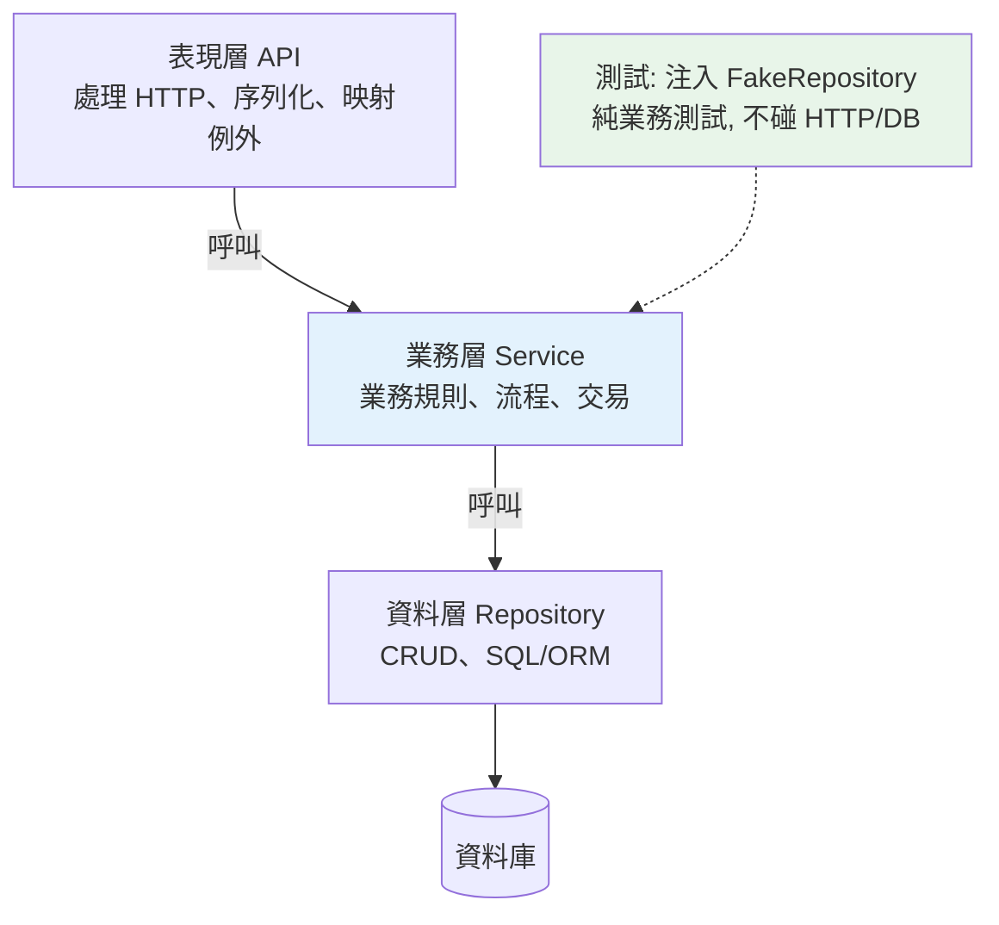

# 分層架構

> 把「處理 HTTP」「業務邏輯」「存取資料庫」全塞進一個函式，短期能動、長期是災難。分層架構把程式切成職責分明的水平層，每層只做一件事、只依賴下一層——這是最基礎、最實用的架構模式。

## 💡 白話導讀（建議先讀）

想像一間餐廳。**外場**接待客人、遞菜單、送餐；**廚房**做菜；**倉庫**管食材。
三組人各做各的事，靠固定的窗口溝通：外場把單子遞進廚房，廚房跟倉庫叫料。

現在想像另一間「一人餐廳」：同一個人接單、做菜、進貨全包。
生意小的時候還行；一忙就亂——想換菜單得同時動接單流程和進貨方式，牽一髮動全身。

程式也一樣。把「處理 HTTP」「業務邏輯」「查資料庫」全塞進一個函式，就是一人餐廳。
**分層架構（layered architecture）** 就是把程式拆成餐廳的三組人：

- **表現層**＝外場：只管收請求、回應（HTTP、JSON 格式）。
- **業務層**＝廚房：只管規則與流程（「餘額夠才能轉帳」）。
- **資料層**＝倉庫：只管存取資料（SQL、ORM）。

還有一條鐵律：**依賴只能往下**。外場可以叫廚房出菜，但倉庫不會回頭指揮外場——
所以「換一個 Web 框架」只動外場，廚房和倉庫完全不用改。
這就是分層的全部回報：**改動被關在單一層裡**。

下面正式展開每一層的職責與依賴方向。

## Why（為什麼）

初學者常把所有東西寫在一起：路由函式裡直接寫 SQL、驗證、業務規則、格式化回應。這種「大泥球（big ball of mud）」短期能跑，但很快變成災難——**改一個地方牽動一堆、無法單獨測試業務邏輯（因為綁死 HTTP 和 DB）、換資料庫或框架要大改、多人協作互相踩線**。**分層架構（layered architecture）** 是最基礎的解法：**把程式依職責切成水平層**（表現層、業務層、資料層），每層只負責一件事、只往下依賴。這讓程式**好懂、好測、好改、好換**。它是 Clean Architecture（見 [Clean Architecture](02-clean-architecture.md)）、DDD（見 [DDD](08-ddd.md)）等進階架構的基礎——先掌握分層，再談其他。

## Theory（理論：關注點分離與依賴方向）

分層架構的核心是兩個原則：

- **關注點分離（Separation of Concerns）**：每一層只負責一種職責，彼此不混。改動被侷限在單一層。
- **單向依賴（Dependency Direction）**：上層依賴下層，**下層不依賴上層**。資料層不該知道有 HTTP，業務層不該知道用哪個 Web 框架。

典型三層：

| 層 | 職責 | 例子 |
|----|------|------|
| **表現層（Presentation / API）** | 處理輸入輸出、HTTP、序列化、驗證格式 | FastAPI 路由、request/response |
| **業務層（Service / Business）** | 業務邏輯、規則、流程編排 | 「轉帳前檢查餘額」「下單扣庫存」 |
| **資料層（Repository / Data）** | 存取資料庫、外部儲存 | SQL 查詢、ORM 操作 |

依賴方向：**表現層 → 業務層 → 資料層**。關鍵好處是**業務層是純業務**——不依賴 HTTP、不依賴具體資料庫，因此**能獨立測試、能重用、能換掉上下層而不動它**。這正是 [例外處理](../14-web/16-exception-handlers.md) 那章「領域邏輯拋領域例外、Web 層映射」的架構基礎。

## Specification（規範：三層的職責邊界）

```text
┌─────────────────────────────────────┐
│ 表現層 (API / Router)                │  ← 只處理 HTTP：解析請求、呼叫 service、回應
│   - 接收 HTTP 請求、驗證輸入格式       │
│   - 呼叫業務層、把結果轉成 HTTP 回應    │
│   - 不含業務規則、不碰資料庫            │
├─────────────────────────────────────┤
│ 業務層 (Service)                     │  ← 業務邏輯核心：純 Python、不知道 HTTP/DB 細節
│   - 業務規則、流程編排、交易邊界        │
│   - 呼叫 repository 存取資料           │
│   - 不知道 HTTP、不寫 SQL             │
├─────────────────────────────────────┤
│ 資料層 (Repository)                  │  ← 只負責存取資料
│   - CRUD、查詢、ORM/SQL               │
│   - 不含業務規則                      │
└─────────────────────────────────────┘
        依賴方向：上 → 下（下層不知道上層）
```

**判斷放哪層的原則**：
- 「這是 HTTP 相關嗎？」→ 表現層。
- 「這是業務規則/流程嗎？」→ 業務層。
- 「這是存取資料嗎？」→ 資料層。

## Implementation（三層拆解、依賴方向、可測試性）

### 反例：全部混在一起

```python
# 🔴 反例：路由函式裡什麼都做
@app.post("/transfer")
def transfer(from_id: int, to_id: int, amount: int):
    conn = sqlite3.connect("bank.db")                        # 資料層的事
    balance = conn.execute("SELECT balance FROM accounts WHERE id = ?", (from_id,)).fetchone()[0]
    if balance < amount:                                     # 業務規則
        raise HTTPException(400, "餘額不足")                  # 表現層的事
    conn.execute("UPDATE accounts SET balance = balance - ? WHERE id = ?", (amount, from_id))
    conn.execute("UPDATE accounts SET balance = balance + ? WHERE id = ?", (amount, to_id))
    conn.commit()
    return {"status": "ok"}
```

問題：無法單獨測業務規則（要起 HTTP + DB）、換 DB 要改這裡、業務邏輯和 HTTP/SQL 糾纏。

### 正解：分三層

```python
# --- 資料層：Repository（只存取資料，見 Repository 模式）---
class AccountRepository:
    def __init__(self, conn) -> None:
        self._conn = conn

    def get_balance(self, account_id: int) -> int:
        row = self._conn.execute(
            "SELECT balance FROM accounts WHERE id = ?", (account_id,)
        ).fetchone()
        return row[0]

    def update_balance(self, account_id: int, delta: int) -> None:
        self._conn.execute(
            "UPDATE accounts SET balance = balance + ? WHERE id = ?", (delta, account_id)
        )


# --- 業務層：Service（純業務邏輯，不知道 HTTP、不寫 SQL）---
class InsufficientBalanceError(Exception):
    """業務例外（領域概念，非 HTTP）。"""


class TransferService:
    def __init__(self, repo: AccountRepository) -> None:
        self._repo = repo

    def transfer(self, from_id: int, to_id: int, amount: int) -> None:
        # 業務規則：餘額檢查
        if self._repo.get_balance(from_id) < amount:
            raise InsufficientBalanceError()      # 拋領域例外，不是 HTTPException
        self._repo.update_balance(from_id, -amount)
        self._repo.update_balance(to_id, amount)


# --- 表現層：API（只處理 HTTP，把領域例外映射成狀態碼）---
@app.post("/transfer")
def transfer_endpoint(from_id: int, to_id: int, amount: int):
    service = TransferService(AccountRepository(get_conn()))
    try:
        service.transfer(from_id, to_id, amount)
    except InsufficientBalanceError:
        raise HTTPException(400, "餘額不足")       # 映射成 HTTP
    return {"status": "ok"}
```

現在三層職責分明：**Repository 只碰資料、Service 只管業務、API 只處理 HTTP**。

### 可測試性：分層的最大回報

分層後，**業務層能不碰 HTTP、不碰真實 DB 就測試**——注入假 repository（見 [mock](../12-testing/06-mock.md)、[DI](03-dependency-injection.md)）：

```python
class FakeAccountRepository:
    def __init__(self, balances: dict[int, int]) -> None:
        self._balances = balances

    def get_balance(self, account_id: int) -> int:
        return self._balances[account_id]

    def update_balance(self, account_id: int, delta: int) -> None:
        self._balances[account_id] += delta


def test_transfer_insufficient_balance():
    repo = FakeAccountRepository({1: 100, 2: 0})
    service = TransferService(repo)
    with pytest.raises(InsufficientBalanceError):
        service.transfer(1, 2, 500)     # 純業務測試，不碰 HTTP/DB、飛快
```

這種**快速、隔離的業務邏輯測試**，是分層架構最有價值的回報——業務規則是最需要測試的部分。

### 依賴方向為什麼重要

**業務層不 import 表現層、不 import 具體資料庫驅動**。這樣：

- 換 Web 框架（FastAPI → Flask）：只改表現層，業務層不動。
- 換資料庫（SQLite → PostgreSQL）：只改資料層，業務層不動。
- 業務層可在非 Web 場景重用（CLI、批次、測試）。

若要讓業務層**完全不依賴具體資料層**（連介面都反轉），就進入 [依賴反轉](05-solid.md)、[Clean Architecture](02-clean-architecture.md) 的領域——業務層定義 repository 介面、資料層實作它。

## Code Example（可執行的 Python 範例）

```python
# layered_demo.py — 三層架構的職責分離（可獨立執行/測試）
from __future__ import annotations


# ===== 資料層：Repository（只存取資料）=====
class AccountRepository:
    """負責資料存取（這裡用 dict 模擬 DB）。"""

    def __init__(self, balances: dict[int, int]) -> None:
        self._balances = balances

    def get_balance(self, account_id: int) -> int:
        return self._balances[account_id]

    def update_balance(self, account_id: int, delta: int) -> None:
        self._balances[account_id] += delta


# ===== 業務層：Service（純業務邏輯，不知道 HTTP/DB 細節）=====
class InsufficientBalanceError(Exception):
    """領域例外。"""


class TransferService:
    def __init__(self, repo: AccountRepository) -> None:
        self._repo = repo

    def transfer(self, from_id: int, to_id: int, amount: int) -> None:
        if self._repo.get_balance(from_id) < amount:
            raise InsufficientBalanceError("餘額不足")
        self._repo.update_balance(from_id, -amount)
        self._repo.update_balance(to_id, amount)


# ===== 表現層：把業務結果/例外轉成「回應」（這裡用 dict 模擬 HTTP）=====
def transfer_endpoint(service: TransferService, from_id: int, to_id: int, amount: int) -> tuple[int, dict]:
    try:
        service.transfer(from_id, to_id, amount)
        return 200, {"status": "ok"}
    except InsufficientBalanceError as e:
        return 400, {"error": str(e)}  # 領域例外 → HTTP 狀態碼


def demo() -> None:
    repo = AccountRepository({1: 1000, 2: 500})
    service = TransferService(repo)

    # 成功轉帳（表現層 → 業務層 → 資料層）
    status, body = transfer_endpoint(service, 1, 2, 300)
    print(f"轉帳 300: {status} {body}，餘額={repo._balances}")

    # 失敗（業務規則擋下，表現層映射成 400）
    status, body = transfer_endpoint(service, 1, 2, 99999)
    print(f"轉帳 99999: {status} {body}，餘額不變={repo._balances}")

    print("\n重點：表現層(HTTP)→業務層(規則)→資料層(存取)，單向依賴、各司其職")


if __name__ == "__main__":
    demo()
```

**預期輸出**：

```pycon
$ python layered_demo.py
轉帳 300: 200 {'status': 'ok'}，餘額={1: 700, 2: 800}
轉帳 99999: 400 {'error': '餘額不足'}，餘額不變={1: 700, 2: 800}

重點：表現層(HTTP)→業務層(規則)→資料層(存取)，單向依賴、各司其職
```

## Diagram（圖解：分層與依賴方向）



## Best Practice（最佳實踐）

- **依職責分層**：表現層（HTTP）、業務層（規則）、資料層（存取），每層只做一件事。
- **保持單向依賴**：上層依賴下層，**下層不知道上層**（業務層不 import HTTP/框架）。
- **業務層保持純淨**：不依賴 HTTP、不寫 SQL——才能獨立測試、重用、換上下層。
- **業務例外用領域例外**（非 HTTPException），表現層負責映射（見 [例外處理](../14-web/16-exception-handlers.md)）。
- **注入依賴**（repository 傳進 service，見 [DI](03-dependency-injection.md)）：好測試、好替換。
- **測試聚焦業務層**：注入假 repository，快速隔離測最重要的業務規則。
- **別過度分層**：小專案三層足矣；層是為了管理複雜度，不是為分而分。

## Common Mistakes（常見誤解）

- **全部塞進路由函式（大泥球）**：HTTP+業務+SQL 糾纏，無法測、難改。
- **業務層 import HTTP/框架**：綁死表現層、無法重用與獨立測試——違反依賴方向。
- **資料層含業務規則**：規則散落各處、難維護；規則屬業務層。
- **表現層直接碰資料庫**：跳過業務層、規則被繞過。
- **業務層拋 HTTPException**：把 HTTP 概念洩漏進業務層；拋領域例外、表現層映射。
- **為小專案過度分層**：三個檔案的工具硬拆五層，徒增複雜；分層是為複雜度服務。
- **層與層之間傳 ORM 模型/HTTP 物件**：讓下層概念洩漏到上層或反之；必要時用 DTO 隔離。

## Interview Notes（面試重點）

- **能說出分層架構的三層與職責**（表現層 HTTP / 業務層規則 / 資料層存取）與**單向依賴原則**（下層不知道上層）。
- **能講分層的核心好處：關注點分離 + 可測試性**——業務層純淨、能不碰 HTTP/DB 獨立測試（最大回報）。
- **能指出大泥球的問題**（糾纏、難測、難改、難換）與分層如何解決。
- 知道業務層該拋領域例外（非 HTTPException）、表現層映射；依賴注入讓層可替換可測試。
- 知道分層是 Clean Architecture、DDD 的基礎；能連結依賴反轉（業務層定義介面、資料層實作）。

---

➡️ 下一章：[Clean Architecture](02-clean-architecture.md)

[⬆️ 回 Part 16 索引](README.md)
