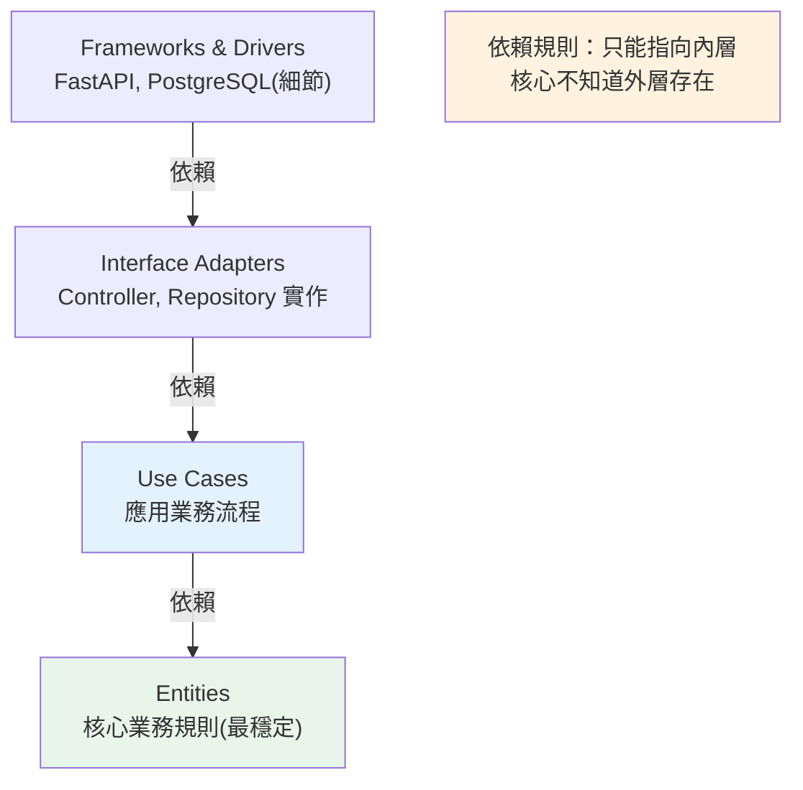

# Clean Architecture

> 分層架構讓業務依賴資料層；Clean Architecture 更進一步——讓依賴「指向核心」。業務規則是圓心，框架、資料庫、UI 都是可替換的外圍細節。核心不知道有它們的存在。這是「讓程式抵抗時間」的架構思維。

## Why（為什麼）

分層架構（見 [分層架構](01-layered-architecture.md)）業務層仍**直接依賴**具體資料層（`TransferService` import `AccountRepository`）——換掉資料庫、換掉 ORM，業務層還是會被牽動。而框架（FastAPI）、資料庫（PostgreSQL）、外部服務都是**會變的細節**：框架會過時、資料庫會換、需求會變。如果核心業務規則綁死這些細節，每次換都要動核心——風險高。**Clean Architecture（整潔架構，Robert C. Martin 提出）** 的核心洞見：**讓所有依賴都指向「業務核心」，核心不依賴任何外部細節**。業務規則是最穩定、最有價值的部分，應該被保護在圓心，框架/DB/UI 是外圍、可替換的「插件」。這讓程式**能抵抗變化與時間**——換框架、換資料庫不動核心。理解它，你就理解了現代後端架構（Hexagonal、Onion、DDD 都是同一思想的變體）。

## Theory（理論：依賴規則與同心圓）

Clean Architecture 用**同心圓**表示，由內而外：

```text
        ┌───────────────────────────────┐
        │  Frameworks & Drivers（最外）  │  Web框架、DB、外部服務（細節）
        │  ┌─────────────────────────┐  │
        │  │  Interface Adapters     │  │  Controller、Presenter、Repository 實作
        │  │  ┌───────────────────┐  │  │
        │  │  │  Use Cases        │  │  │  應用業務規則（流程編排）
        │  │  │  ┌─────────────┐  │  │  │
        │  │  │  │  Entities   │  │  │  │  核心業務規則/領域模型（最穩定）
        │  │  │  └─────────────┘  │  │  │
        │  │  └───────────────────┘  │  │
        │  └─────────────────────────┘  │
        └───────────────────────────────┘
```

**最重要的一條規則——依賴規則（Dependency Rule）**：**原始碼的依賴只能指向內層，永不指向外層**。內層（entities、use cases）**完全不知道**外層（framework、DB）的存在。

- **Entities（實體）**：企業級核心業務規則、領域物件——最穩定，不依賴任何東西。
- **Use Cases（用例）**：應用特定的業務流程（「轉帳」「下單」）——編排 entities，定義它需要的介面。
- **Interface Adapters（介面轉接）**：把外部格式轉成內層要的（controller、repository 實作、presenter）。
- **Frameworks & Drivers（框架與驅動）**：Web 框架、資料庫、外部 API——最外圍、最易變的細節。

**關鍵手法是依賴反轉（見 [SOLID](05-solid.md) 的 DIP）**：內層 use case 需要存資料，但不能依賴外層的 DB——所以 **use case 定義一個介面（port），外層的 DB 去實作它**。依賴方向因此「反轉」成指向內層。

## Specification（規範：依賴反轉讓核心不依賴細節）

```python
from abc import ABC, abstractmethod

# ===== 內層：Use Case 定義它「需要什麼」（介面/port）=====
# 注意：這個介面屬於內層，由內層擁有
class AccountRepository(ABC):
    @abstractmethod
    def get_balance(self, account_id: int) -> int: ...
    @abstractmethod
    def update_balance(self, account_id: int, delta: int) -> None: ...

# ===== 內層：Use Case（純業務，只依賴上面的抽象介面）=====
class TransferUseCase:
    def __init__(self, repo: AccountRepository) -> None:   # 依賴抽象，非具體
        self._repo = repo

    def execute(self, from_id: int, to_id: int, amount: int) -> None:
        if self._repo.get_balance(from_id) < amount:
            raise InsufficientBalanceError()
        self._repo.update_balance(from_id, -amount)
        self._repo.update_balance(to_id, amount)

# ===== 外層：具體實作介面（依賴指向內層的抽象）=====
class PostgresAccountRepository(AccountRepository):        # 實作內層的介面
    def get_balance(self, account_id: int) -> int:
        ...  # 真的查 PostgreSQL

# 內層不知道有 Postgres；外層依賴內層的抽象 → 依賴指向核心
```

## Implementation（依賴反轉、可替換性、邊界）

### 從分層到 Clean：反轉依賴

分層架構裡，業務層 **import** 具體 repository（依賴指向外/下）。Clean Architecture 把這個反轉：

```python
# 分層架構（業務層依賴具體資料層）
# service.py:  from data.repo import AccountRepository   ← 依賴具體實作 🔴

# Clean Architecture（業務層定義介面，資料層實作）
# use_cases/ports.py:   class AccountRepository(ABC): ...  ← 內層擁有的抽象
# use_cases/transfer.py: def __init__(self, repo: AccountRepository)  ← 依賴抽象 ✅
# adapters/postgres_repo.py: class PostgresAccountRepository(AccountRepository)  ← 外層實作
```

差別看似微小，效果巨大：**內層（use case）現在完全不知道資料存在哪裡**——SQLite、PostgreSQL、記憶體、REST API 都行，只要有人實作那個介面。核心被徹底保護。

### 可替換性：換 DB / 框架不動核心

因為 use case 只依賴抽象介面，**換掉外圍實作，核心一行不改**：

```python
# 正式環境：用 PostgreSQL
use_case = TransferUseCase(PostgresAccountRepository(pg_conn))

# 測試環境：用記憶體假實作（不碰 DB、飛快）
use_case = TransferUseCase(InMemoryAccountRepository({1: 1000, 2: 500}))

# 未來換成 MongoDB？只要寫 MongoAccountRepository(AccountRepository)，核心不動
```

這就是 Clean Architecture 的承諾：**框架、資料庫是「延後決定」的細節，核心業務規則不被它們綁架**。也讓測試極其容易（注入假實作）。

### 邊界與資料轉換

跨越圓的邊界時，資料要**轉換成該層自己的形式**——別讓外層的物件（ORM model、HTTP request）滲進內層。內層用自己的**領域物件 / DTO**：

```python
# 外層（adapter）：把 HTTP request 轉成 use case 要的參數
@app.post("/transfer")
def transfer_endpoint(req: TransferRequest):        # HTTP DTO（外層）
    use_case.execute(req.from_id, req.to_id, req.amount)   # 傳純值給內層
    # 內層不碰 TransferRequest（那是 Web 框架的東西）
```

這樣內層不知道 FastAPI、不知道 pydantic model——**框架換掉，內層無感**。

### 值不值得？務實看待

Clean Architecture 有成本：更多介面、更多檔案、更多間接層。**不是每個專案都該全套上**：

- **值得**：長生命週期、複雜業務規則、需要換框架/DB 的彈性、大團隊、核心邏輯需嚴格測試。
- **過度**：簡單 CRUD 應用、原型、小工具——全套 Clean Architecture 是過度工程（見 [常見設計模式](06-design-patterns.md) 的 YAGNI 精神）。

**務實原則**：抓住精神（保護核心、依賴指向內、依賴抽象），依專案複雜度決定嚴格程度。多數專案「分層 + 關鍵處依賴反轉（如 repository 介面）」就夠。

## Code Example（可執行的 Python 範例）

```python
# clean_arch_demo.py — 依賴反轉：核心不依賴細節（可獨立執行/測試）
from __future__ import annotations

from abc import ABC, abstractmethod


# ===== 內層：Use Case 定義需要的介面（port，內層擁有）=====
class AccountRepository(ABC):
    @abstractmethod
    def get_balance(self, account_id: int) -> int: ...

    @abstractmethod
    def update_balance(self, account_id: int, delta: int) -> None: ...


class InsufficientBalanceError(Exception):
    """領域例外。"""


# ===== 內層：Use Case（純業務，只依賴抽象介面）=====
class TransferUseCase:
    def __init__(self, repo: AccountRepository) -> None:
        self._repo = repo  # 依賴抽象，不知道具體是什麼 DB

    def execute(self, from_id: int, to_id: int, amount: int) -> None:
        if self._repo.get_balance(from_id) < amount:
            raise InsufficientBalanceError("餘額不足")
        self._repo.update_balance(from_id, -amount)
        self._repo.update_balance(to_id, amount)


# ===== 外層：具體實作（依賴指向內層的抽象）=====
class InMemoryAccountRepository(AccountRepository):
    """記憶體實作（測試用）。也可換成 PostgresAccountRepository。"""

    def __init__(self, balances: dict[int, int]) -> None:
        self._balances = balances

    def get_balance(self, account_id: int) -> int:
        return self._balances[account_id]

    def update_balance(self, account_id: int, delta: int) -> None:
        self._balances[account_id] += delta


def demo() -> None:
    # 注入記憶體實作（正式環境可換 Postgres 實作，use case 不變）
    repo = InMemoryAccountRepository({1: 1000, 2: 500})
    use_case = TransferUseCase(repo)

    use_case.execute(1, 2, 300)
    print(f"轉帳 300 後: {repo._balances}")

    try:
        use_case.execute(1, 2, 99999)
    except InsufficientBalanceError as e:
        print(f"轉帳失敗: {e}")

    print("\n重點：核心 use case 只依賴抽象介面，換 DB/框架不動核心（依賴指向內）")


if __name__ == "__main__":
    demo()
```

**預期輸出**：

```pycon
$ python clean_arch_demo.py
轉帳 300 後: {1: 700, 2: 800}
轉帳失敗: 餘額不足

重點：核心 use case 只依賴抽象介面，換 DB/框架不動核心（依賴指向內）
```

## Diagram（圖解：依賴規則指向核心）



## Best Practice（最佳實踐）

- **遵守依賴規則**：依賴只指向內層，核心（entities/use cases）不依賴框架/DB/UI。
- **用依賴反轉保護核心**：內層定義介面（port），外層實作——核心依賴抽象而非具體（見 [SOLID](05-solid.md) DIP）。
- **框架/資料庫當「可替換的細節」**：延後決定、能換不動核心。
- **邊界處轉換資料**：內層用自己的領域物件/DTO，別讓 ORM model/HTTP 物件滲進核心。
- **核心保持純 Python**：不 import FastAPI、SQLAlchemy——才能獨立測試與重用。
- **務實斟酌嚴格程度**：複雜長命專案值得全套；簡單 CRUD 別過度工程（抓精神即可）。
- **搭配 DI 容器/組裝根（composition root）** 在最外層注入具體實作。

## Common Mistakes（常見誤解）

- **核心 import 框架/ORM**：破壞依賴規則，核心被綁死、無法獨立測試。
- **讓 ORM model 貫穿所有層**：資料層概念滲進核心，換 DB 動核心；用領域物件/DTO 隔離。
- **簡單專案硬套全套 Clean Architecture**：過度工程、一堆無謂介面（違反 YAGNI）。
- **以為「分層」就是 Clean Architecture**：分層業務仍依賴具體資料層；Clean 靠依賴反轉讓依賴指向核心。
- **介面放錯層**：repository 介面該由內層（use case）擁有，不是資料層——否則依賴沒真的反轉。
- **在內層處理 HTTP 狀態碼/框架細節**：那是外層的事。
- **為了「純」而過度抽象**：每個東西都加介面反而難懂；只在需要替換/測試的邊界反轉。

## Interview Notes（面試重點）

- **能說出 Clean Architecture 的核心——依賴規則**：依賴只指向內層，核心業務規則不依賴框架/DB/UI（它們是可替換的細節）。
- **能解釋依賴反轉如何保護核心**：內層定義介面（port）、外層實作，依賴方向反轉成指向核心（連結 [SOLID](05-solid.md) DIP）。
- **能對比分層架構 vs Clean Architecture**：分層業務依賴具體資料層；Clean 讓業務只依賴抽象、換 DB/框架不動核心。
- **知道同心圓四層**（Entities / Use Cases / Interface Adapters / Frameworks & Drivers）與邊界資料轉換。
- **務實觀點**：知道它有成本（更多間接層），簡單專案別過度套用；Hexagonal/Onion/DDD 是同一思想的變體。

---

➡️ 下一章：[依賴注入 DI](03-dependency-injection.md)

[⬆️ 回 Part 16 索引](README.md)
