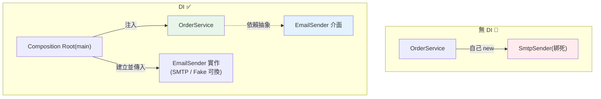

# 依賴注入 DI

> 「一個物件需要另一個物件」時，是自己去建立它，還是由外部給它？依賴注入選後者——把依賴當參數傳入。這個小改變帶來鬆耦合、可測試、可替換的巨大回報，是幾乎所有現代框架的骨幹。

## Why（為什麼）

物件常需要別的物件才能工作：`TransferService` 需要 `Repository`、`EmailSender` 需要 `SmtpClient`。**如果物件自己在內部建立依賴**（`self.repo = PostgresRepository()`），就把自己**綁死**在那個具體實作上——測試時無法換成假的（要真的連 DB）、要換實作得改原始碼、依賴關係藏在內部看不見。**依賴注入（Dependency Injection，DI）** 是個簡單但威力巨大的原則：**不要自己建立依賴，而是由外部「注入」（當參數傳入）**。這帶來鬆耦合、可測試（注入 mock）、可替換（注入不同實作）、依賴明確（看建構子就知道需要什麼）。它是 [Clean Architecture](02-clean-architecture.md)、[Repository 模式](04-repository-pattern.md)、FastAPI `Depends`（見 [Depends](../14-web/11-fastapi-depends.md)）、pytest fixture（見 [fixture](../12-testing/04-fixtures.md)）背後的共同骨幹。

## Theory（理論：控制反轉 IoC）

DI 是 **控制反轉（Inversion of Control，IoC）** 的一種形式。「控制」指的是「誰決定用哪個具體依賴」：

- **傳統（無 DI）**：物件**自己控制**——在內部 `new` 出依賴。控制權在物件自身。
- **DI（控制反轉）**：物件**放棄控制**——依賴由外部決定並傳入。控制權反轉到外部（呼叫者/容器/框架）。

為什麼反轉控制有價值？因為**「建立依賴」和「使用依賴」是兩件不同的事**。物件應該專注「使用」依賴做它的工作，不該操心「如何建立」依賴（那可能很複雜：連線設定、環境差異）。把建立的責任移到外部，物件變得單純、可重用、可測試。

DI 的三種注入方式（Python 最常用建構子注入）：

- **建構子注入（constructor injection，最推薦）**：透過 `__init__` 參數傳入。依賴明確、物件建立後即可用。
- **方法注入（method injection）**：透過方法參數傳入（每次呼叫給不同依賴）。
- **屬性注入（setter injection）**：建立後設定屬性（較少用，物件可能處於未完成狀態）。

## Specification（規範：建構子注入與依賴抽象）

```python
from abc import ABC, abstractmethod

# 依賴的抽象（介面）
class EmailSender(ABC):
    @abstractmethod
    def send(self, to: str, body: str) -> None: ...

# 🔴 無 DI：自己建立依賴（綁死）
class OrderServiceBad:
    def __init__(self) -> None:
        self.sender = SmtpEmailSender("smtp.gmail.com")   # 綁死具體實作！

# ✅ DI：依賴由外部注入（建構子注入）
class OrderService:
    def __init__(self, sender: EmailSender) -> None:      # 注入抽象
        self._sender = sender                             # 不知道也不關心具體是什麼

    def place_order(self, email: str) -> None:
        # ... 下單邏輯 ...
        self._sender.send(email, "訂單已成立")

# 組裝（在應用最外層 composition root 決定用哪個實作）
service = OrderService(SmtpEmailSender("smtp.gmail.com"))   # 正式
service = OrderService(FakeEmailSender())                   # 測試
```

## Implementation（建構子注入、可測試、DI 容器、Python 手法）

### 建構子注入：最常用

把依賴當 `__init__` 參數傳入，並**依賴抽象（介面）而非具體**（見 [SOLID](05-solid.md) DIP）：

```python
class NotificationService:
    def __init__(self, sender: EmailSender, repo: UserRepository) -> None:
        self._sender = sender      # 依賴都在建構子明確列出
        self._repo = repo          # 看 __init__ 就知道這個 service 需要什麼

    def notify(self, user_id: int, message: str) -> None:
        user = self._repo.get(user_id)
        self._sender.send(user.email, message)
```

好處：**依賴明確**（建構子就是「需求清單」）、**物件單純**（只用依賴、不建立）、**可替換**（傳不同實作）。

### 可測試性：DI 最大的回報

DI 讓測試時能注入 mock/fake（見 [mock](../12-testing/06-mock.md)），不碰真實資源：

```python
class FakeEmailSender(EmailSender):
    def __init__(self) -> None:
        self.sent: list[tuple[str, str]] = []

    def send(self, to: str, body: str) -> None:
        self.sent.append((to, body))   # 記錄而非真的寄

def test_notify():
    fake_sender = FakeEmailSender()
    fake_repo = FakeUserRepository({1: User(email="a@b.com")})
    service = NotificationService(fake_sender, fake_repo)   # 注入假依賴

    service.notify(1, "hi")

    assert fake_sender.sent == [("a@b.com", "hi")]          # 驗證行為，沒真的寄信
```

沒有 DI，這個測試得真的連 DB、真的寄信——慢、脆弱、有副作用。**DI 是可測試性的關鍵前提**。

### Composition Root：在最外層組裝

「決定用哪個具體實作」的責任集中在**應用最外層的組裝根（composition root）**——`main`、app 啟動處。裡面的物件只管使用注入的依賴：

```python
# main.py（composition root）：唯一知道所有具體實作的地方
def build_app() -> OrderService:
    config = load_config()
    db = create_engine(config.db_url)
    repo = PostgresUserRepository(db)
    sender = SmtpEmailSender(config.smtp_host)
    return OrderService(repo, sender)     # 在這裡組裝依賴圖

# 其他所有模組都不 new 具體依賴，只接收注入的
```

### 框架的 DI：FastAPI、pytest

Python 生態的 DI 常由框架提供，不一定要 DI 容器：

- **FastAPI 的 `Depends`**（見 [Depends](../14-web/11-fastapi-depends.md)）：框架幫你解析並注入依賴（DB session、當前使用者），還支援測試覆寫（`dependency_overrides`）——這就是 DI。
- **pytest fixture**（見 [fixture](../12-testing/04-fixtures.md)）：測試函式宣告需要的 fixture，pytest 注入——也是 DI。

### Python 需要 DI 容器嗎？

Java/C# 常用 DI 容器（Spring、autofac）自動組裝依賴圖。**Python 通常不需要**——因為 Python 動態、函式是一等公民，手動建構子注入 + composition root 就很清楚。有 `dependency-injector`、`punq` 等函式庫，但多數專案**手動注入就夠**，別為了「有容器」而引入複雜度。FastAPI 的 `Depends` 已覆蓋 Web 場景的多數需求。

### DI 與鴨子型別

Python 是**鴨子型別**——注入的依賴不一定要繼承抽象基底類別，只要有對的方法就行（見 [Protocol](../05-typing/06-protocol.md)）。用 `Protocol` 定義結構型介面，比 ABC 更 Pythonic：

```python
from typing import Protocol

class EmailSender(Protocol):
    def send(self, to: str, body: str) -> None: ...

# 任何有 send(to, body) 的物件都能注入，不必顯式繼承
```

## Code Example（可執行的 Python 範例）

```python
# di_demo.py — 建構子注入與可測試性（可獨立執行/測試）
from __future__ import annotations

from typing import Protocol


# 依賴的抽象（用 Protocol，Pythonic）
class EmailSender(Protocol):
    def send(self, to: str, body: str) -> None: ...


class UserRepository(Protocol):
    def get_email(self, user_id: int) -> str: ...


# 使用依賴的服務（建構子注入，只依賴抽象）
class NotificationService:
    def __init__(self, sender: EmailSender, repo: UserRepository) -> None:
        self._sender = sender
        self._repo = repo

    def notify(self, user_id: int, message: str) -> None:
        email = self._repo.get_email(user_id)
        self._sender.send(email, message)


# 具體實作（正式環境用）
class SmtpEmailSender:
    def send(self, to: str, body: str) -> None:
        print(f"  [SMTP] 寄給 {to}: {body}")


# 假實作（測試用，記錄而非真寄）
class FakeEmailSender:
    def __init__(self) -> None:
        self.sent: list[tuple[str, str]] = []

    def send(self, to: str, body: str) -> None:
        self.sent.append((to, body))


class FakeUserRepository:
    def __init__(self, emails: dict[int, str]) -> None:
        self._emails = emails

    def get_email(self, user_id: int) -> str:
        return self._emails[user_id]


def demo() -> None:
    repo = FakeUserRepository({1: "alice@example.com"})

    # 正式：注入真的 SMTP sender
    print("正式環境（注入 SmtpEmailSender）：")
    real_service = NotificationService(SmtpEmailSender(), repo)
    real_service.notify(1, "訂單已成立")

    # 測試：注入假 sender（不真的寄信，可驗證）
    print("\n測試環境（注入 FakeEmailSender）：")
    fake_sender = FakeEmailSender()
    test_service = NotificationService(fake_sender, repo)
    test_service.notify(1, "測試訊息")
    print(f"  記錄到的寄送: {fake_sender.sent}")
    assert fake_sender.sent == [("alice@example.com", "測試訊息")]

    print("\n重點：依賴由外部注入 → 鬆耦合、可測試（注入 mock）、可替換")


if __name__ == "__main__":
    demo()
```

**預期輸出**：

```pycon
$ python di_demo.py
正式環境（注入 SmtpEmailSender）：
  [SMTP] 寄給 alice@example.com: 訂單已成立

測試環境（注入 FakeEmailSender）：
  記錄到的寄送: [('alice@example.com', '測試訊息')]

重點：依賴由外部注入 → 鬆耦合、可測試（注入 mock）、可替換
```

## Diagram（圖解：控制反轉）



## Best Practice（最佳實踐）

- **用建構子注入**：依賴當 `__init__` 參數傳入——依賴明確、物件單純。
- **依賴抽象（Protocol/ABC）而非具體**（見 [SOLID](05-solid.md) DIP、[Protocol](../05-typing/06-protocol.md)）：可替換、可 mock。
- **在 composition root（main/app 啟動）組裝依賴**：唯一知道具體實作的地方。
- **DI 是可測試性的前提**：注入 fake/mock 測試，不碰真實資源（見 [mock](../12-testing/06-mock.md)）。
- **善用框架的 DI**：FastAPI `Depends`、pytest fixture——已覆蓋多數需求。
- **Python 通常不需 DI 容器**：手動注入 + composition root 就清楚；別過度引入容器。
- **用 `Protocol` 定義依賴介面**：鴨子型別 + 結構型別，比強制繼承 ABC 更 Pythonic。

## Common Mistakes（常見誤解）

- **在物件內部 `new` 具體依賴**：綁死、無法測試/替換——DI 要解決的核心問題。
- **依賴具體類別而非抽象**：換實作要改原始碼；依賴 Protocol/介面。
- **依賴散落各處自行建立**：依賴圖混亂；集中在 composition root。
- **為 Python 硬套 Java 式重量級 DI 容器**：多數專案過度工程；手動注入就好。
- **建構子塞太多依賴**：可能是類別做太多事（違反單一職責，見 [SOLID](05-solid.md)）——考慮拆分。
- **屬性注入導致物件半初始化**：忘了 set 就用 → 出錯；優先建構子注入。
- **以為 DI 一定要框架/容器**：DI 是原則（傳參數），不是工具。

## Interview Notes（面試重點）

- **能解釋 DI 是控制反轉的一種**：不自己建立依賴，由外部注入——把「建立」與「使用」分開。
- **能說出 DI 的回報：鬆耦合、可測試（注入 mock）、可替換、依賴明確**——尤其可測試性是關鍵前提。
- **知道建構子注入最常用**，且應**依賴抽象（Protocol/ABC）而非具體**（連結 SOLID 的 DIP）。
- **知道 composition root**（在最外層組裝依賴圖）、框架的 DI（FastAPI `Depends`、pytest fixture 都是 DI）。
- **知道 Python 通常不需 DI 容器**（動態語言、手動注入夠清楚），能用 `Protocol` 定義依賴介面。

---

➡️ 下一章：[Repository 模式](04-repository-pattern.md)

[⬆️ 回 Part 16 索引](README.md)
