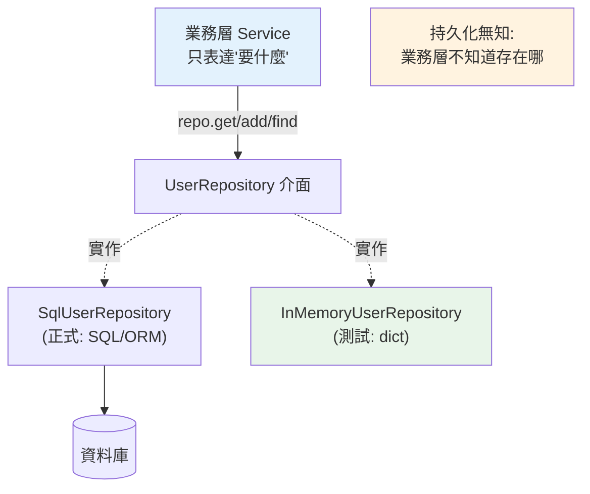

# Repository 模式

> 業務邏輯裡到處是 SQL，就等於把業務綁死在資料庫上。Repository 模式把「資料存取」藏在一個像集合（collection）的介面後面——業務層只說「給我 id=1 的使用者」，不管背後是 SQL、NoSQL 還是記憶體。這是分層與 Clean Architecture 落地的關鍵拼圖。

## 💡 白話導讀（建議先讀）

業務程式碼裡到處散落 SQL，就像廚師自己跑倉庫、記得每個架位——
倉庫改個擺法（換資料庫、改 schema），全部廚師重新受訓。

**Repository 模式**請了一位**倉管員**：業務只說「給我 42 號用戶」「把這張訂單存起來」，
至於去哪個架上拿、用 SQL 還是 Mongo，是倉管員的事。

它的手感刻意設計得像你最熟的東西——**操作一個 Python 集合**：

```python
user = repo.get(42)          # 像 users[42]
repo.add(new_user)           # 像 users.append(...)
repo.find_by_email("a@b")    # 像 list comprehension 篩選
```

業務層看到的就是這幾個方法，完全不知道背後是資料庫。這帶來兩個直接好處：

- **測試不用資料庫**：寫一個 `InMemoryUserRepo`（背後就是 dict）,業務邏輯測試毫秒級跑完。
- **資料層可換**：SQLite 換 PostgreSQL、ORM 換裸 SQL,只改 repository 實作，業務不動。

它正是前兩章的具體落地：[Clean Architecture](02-clean-architecture.md) 說「核心定義介面、外圍實作」，
repository 介面就是那個介面；[DI](03-dependency-injection.md) 說「依賴用傳的」，
傳進 service 的正是 repository。三章合起來，才是完整的一套。

## Why（為什麼）

如果業務邏輯裡直接寫 SQL（`SELECT * FROM users WHERE ...`），會有幾個問題：**業務層綁死特定資料庫與查詢語法**、**同樣的查詢散落各處難維護**、**測試業務邏輯得真的連 DB**、**換 DB 或 ORM 要改一堆業務碼**。**Repository 模式**是解法：**把資料存取封裝在一個「像記憶體集合」的介面後面**——業務層透過 `repo.get(id)`、`repo.add(user)` 操作，彷彿在操作一個 in-memory 的物件集合，**完全不知道背後是 SQL、MongoDB、REST API 還是 dict**。這讓業務層與資料存取解耦，是 [分層架構](01-layered-architecture.md)、[Clean Architecture](02-clean-architecture.md)、[DI](03-dependency-injection.md) 落地的關鍵拼圖，也讓測試能用記憶體假 repository（不碰 DB）。

## Theory（理論：集合抽象與持久化無知）

Repository 的核心比喻：**讓資料存取「看起來像操作一個記憶體中的集合」**。你對 Python `list`/`dict` 做的事（加入、取出、找、移除），repository 提供對應的方法，但背後可能是資料庫：

| 集合操作 | Repository 方法 | 背後可能是 |
|---------|----------------|-----------|
| `users[id]` | `repo.get(id)` | `SELECT ... WHERE id = ?` |
| `users.append(u)` | `repo.add(u)` | `INSERT ...` |
| `[u for u in users if ...]` | `repo.find_by_email(e)` | `SELECT ... WHERE email = ?` |
| `del users[id]` | `repo.delete(id)` | `DELETE ...` |

**核心價值——持久化無知（Persistence Ignorance）**：業務層不知道、也不需要知道資料「怎麼存、存在哪」。它只透過 repository 的介面表達「我要什麼」，不管「怎麼拿」。

這與 [DI](03-dependency-injection.md) 和 [依賴反轉](05-solid.md) 結合：**repository 的介面由業務層（內層）定義，具體實作（SQL/ORM）在外層**——依賴指向業務核心（見 [Clean Architecture](02-clean-architecture.md)）。

## Specification（規範：Repository 介面與實作）

```python
from abc import ABC, abstractmethod
from dataclasses import dataclass

@dataclass
class User:
    id: int
    name: str
    email: str

# 介面（由業務層擁有，定義「需要什麼」）
class UserRepository(ABC):
    @abstractmethod
    def get(self, user_id: int) -> User | None: ...
    @abstractmethod
    def add(self, user: User) -> None: ...
    @abstractmethod
    def find_by_email(self, email: str) -> User | None: ...
    @abstractmethod
    def list_all(self) -> list[User]: ...

# 實作一：SQL（正式環境）
class SqlUserRepository(UserRepository):
    def __init__(self, conn) -> None:
        self._conn = conn
    def get(self, user_id: int) -> User | None:
        row = self._conn.execute("SELECT id, name, email FROM users WHERE id = ?", (user_id,)).fetchone()
        return User(*row) if row else None
    # ... 其他方法 ...

# 實作二：記憶體（測試環境）
class InMemoryUserRepository(UserRepository):
    def __init__(self) -> None:
        self._users: dict[int, User] = {}
    def get(self, user_id: int) -> User | None:
        return self._users.get(user_id)
    def add(self, user: User) -> None:
        self._users[user.id] = user
```

## Implementation（介面、多實作、與 service 協作、UoW）

### 定義介面 + 多種實作

Repository 的威力來自「同一介面、多種實作」——業務層依賴介面，測試/正式各用不同實作：

```python
# 業務層依賴介面（不知道具體）
class UserService:
    def __init__(self, repo: UserRepository) -> None:    # 注入 repository（DI）
        self._repo = repo

    def register(self, name: str, email: str) -> User:
        if self._repo.find_by_email(email):              # 業務規則：email 不重複
            raise ValueError("email 已被註冊")
        user = User(id=self._next_id(), name=name, email=email)
        self._repo.add(user)
        return user

# 正式：SQL 實作
service = UserService(SqlUserRepository(db_conn))
# 測試：記憶體實作（飛快、不碰 DB）
service = UserService(InMemoryUserRepository())
```

`UserService.register` 完全不含 SQL——它只表達業務規則（email 不重複），資料存取交給 repository。這讓業務規則能獨立測試。

### 測試：記憶體 repository

```python
def test_register_duplicate_email():
    repo = InMemoryUserRepository()
    repo.add(User(1, "Alice", "a@b.com"))
    service = UserService(repo)

    with pytest.raises(ValueError, match="已被註冊"):
        service.register("Bob", "a@b.com")   # 純業務測試，不碰 DB、飛快
```

這是 Repository 模式最實際的回報：**業務邏輯測試不需要資料庫**，用記憶體實作，快又隔離。

### Repository 該多「肥」？回傳領域物件

好的 repository：

- **回傳領域物件（domain object）**，不是 ORM model 或原始 row——讓業務層拿到乾淨的物件，不洩漏持久化細節。
- **方法表達業務意圖**（`find_active_users()`、`find_by_email()`），不是通用的 `query(sql)`——否則又把 SQL 洩漏到業務層。
- **一個 aggregate 一個 repository**（見 [DDD](08-ddd.md)）：`UserRepository`、`OrderRepository`，不是一個萬能 repository。

### 與 Unit of Work 協作

Repository 管「單一類型物件的存取」，但**交易邊界**（見 [transaction](../15-database/16-transactions.md)）常跨多個 repository（下單要同時動 Order 和 Inventory）。**Unit of Work（工作單元）模式**管理這個——把多個 repository 操作包在一個交易裡，一起 commit/rollback：

```python
# Unit of Work：統一交易邊界
with unit_of_work() as uow:
    uow.orders.add(order)
    uow.inventory.reduce(product_id, qty)
    uow.commit()    # 兩個 repository 的變更一起提交（或一起 rollback）
```

SQLAlchemy 的 `Session`（見 [ORM](../15-database/14-sqlalchemy-orm.md)）本身就是一種 Unit of Work + identity map 的實作。

### ORM 已經是 Repository 嗎？

有人問：SQLAlchemy `session.query(User)` 不就是 repository 了嗎？某種程度是（它抽象了 SQL）。但**顯式的 Repository 介面仍有價值**：

- **業務層不直接依賴 ORM**（換 ORM/DB 不動業務）。
- **方法表達業務意圖**（`find_active_users` 勝過散落的 query）。
- **測試用記憶體實作**（不必用 ORM/DB）。

**務實觀點**：小專案直接用 ORM session 可能就夠；需要嚴格解耦、可測試、可換 DB 時，加一層 Repository 介面。別為簡單 CRUD 過度包裝。

## Code Example（可執行的 Python 範例）

```python
# repository_demo.py — Repository 模式：業務層不知道資料存哪（可獨立執行/測試）
from __future__ import annotations

from abc import ABC, abstractmethod
from dataclasses import dataclass


@dataclass
class User:
    id: int
    name: str
    email: str


# ===== Repository 介面（業務層擁有）=====
class UserRepository(ABC):
    @abstractmethod
    def get(self, user_id: int) -> User | None: ...

    @abstractmethod
    def add(self, user: User) -> None: ...

    @abstractmethod
    def find_by_email(self, email: str) -> User | None: ...


# ===== 記憶體實作（測試用；正式可換 SqlUserRepository）=====
class InMemoryUserRepository(UserRepository):
    def __init__(self) -> None:
        self._users: dict[int, User] = {}

    def get(self, user_id: int) -> User | None:
        return self._users.get(user_id)

    def add(self, user: User) -> None:
        self._users[user.id] = user

    def find_by_email(self, email: str) -> User | None:
        return next((u for u in self._users.values() if u.email == email), None)


# ===== 業務層（只依賴介面，不含 SQL）=====
class UserService:
    def __init__(self, repo: UserRepository) -> None:
        self._repo = repo
        self._next_id = 1

    def register(self, name: str, email: str) -> User:
        if self._repo.find_by_email(email):
            raise ValueError(f"email {email} 已被註冊")
        user = User(id=self._next_id, name=name, email=email)
        self._repo.add(user)
        self._next_id += 1
        return user


def demo() -> None:
    # 注入記憶體 repository（DI）
    service = UserService(InMemoryUserRepository())

    alice = service.register("Alice", "alice@example.com")
    print(f"註冊: {alice}")

    bob = service.register("Bob", "bob@example.com")
    print(f"註冊: {bob}")

    # 業務規則：email 不重複（不碰 SQL，純業務）
    try:
        service.register("Alice2", "alice@example.com")
    except ValueError as e:
        print(f"重複註冊被擋: {e}")

    print("\n重點：業務層透過 repo.get/add/find 操作，不知道背後是 SQL/記憶體")


if __name__ == "__main__":
    demo()
```

**預期輸出**：

```pycon
$ python repository_demo.py
註冊: User(id=1, name='Alice', email='alice@example.com')
註冊: User(id=2, name='Bob', email='bob@example.com')
重複註冊被擋: email alice@example.com 已被註冊

重點：業務層透過 repo.get/add/find 操作，不知道背後是 SQL/記憶體
```

## Diagram（圖解：Repository 隔離業務與資料）



## Best Practice（最佳實踐）

- **用 Repository 封裝資料存取**：業務層透過集合式介面（get/add/find）操作，不寫 SQL。
- **介面由業務層擁有、具體實作在外層**（依賴反轉，見 [Clean Architecture](02-clean-architecture.md)）：換 DB 不動業務。
- **回傳領域物件**（非 ORM model/raw row）：不洩漏持久化細節。
- **方法表達業務意圖**（`find_active_users`），別退化成通用 `query(sql)`（那又洩漏 SQL）。
- **一個 aggregate 一個 repository**（見 [DDD](08-ddd.md)）：別做萬能 repository。
- **測試用記憶體實作**：業務邏輯測試不碰 DB、飛快隔離。
- **跨 repository 的交易用 Unit of Work**（見 [transaction](../15-database/16-transactions.md)）：統一 commit/rollback。
- **務實斟酌**：簡單 CRUD 直接用 ORM 可能就夠；需解耦/可測/可換 DB 才加 Repository 層。

## Common Mistakes（常見誤解）

- **業務層直接寫 SQL/用 ORM query**：綁死資料庫、查詢散落、難測試——Repository 要解決的。
- **Repository 回傳 ORM model**：持久化細節（lazy loading、session 綁定）洩漏到業務層。
- **通用 `query(sql)` 方法**：等於沒封裝，SQL 又進業務層；方法要表達意圖。
- **一個萬能 repository 管所有實體**：職責不清；一個 aggregate 一個。
- **把業務邏輯塞進 repository**：repository 只管存取，業務規則屬 service。
- **忽略交易邊界**：跨多個 repository 的操作沒包在交易裡；用 Unit of Work。
- **簡單專案過度包裝**：三個欄位的 CRUD 硬加介面+多實作，過度工程。

## Interview Notes（面試重點）

- **能說出 Repository 模式：把資料存取封裝成「像記憶體集合」的介面，業務層不知道背後是 SQL/NoSQL/記憶體**（持久化無知）。
- **能講它的價值**：業務層與資料存取解耦、查詢集中、可換 DB 不動業務、**測試用記憶體實作不碰 DB**。
- **知道介面由業務層擁有、實作在外層**（依賴反轉，連結 Clean Architecture/DI），repository 回傳領域物件、方法表達業務意圖。
- **知道 Unit of Work** 管跨 repository 的交易邊界，SQLAlchemy Session 是 UoW + identity map 的實作。
- **務實觀點**：知道 ORM 某程度已是 repository，簡單 CRUD 未必需要額外一層；需嚴格解耦/可測時才加。

---

➡️ 下一章：[SOLID 原則](05-solid.md)

[⬆️ 回 Part 16 索引](README.md)
