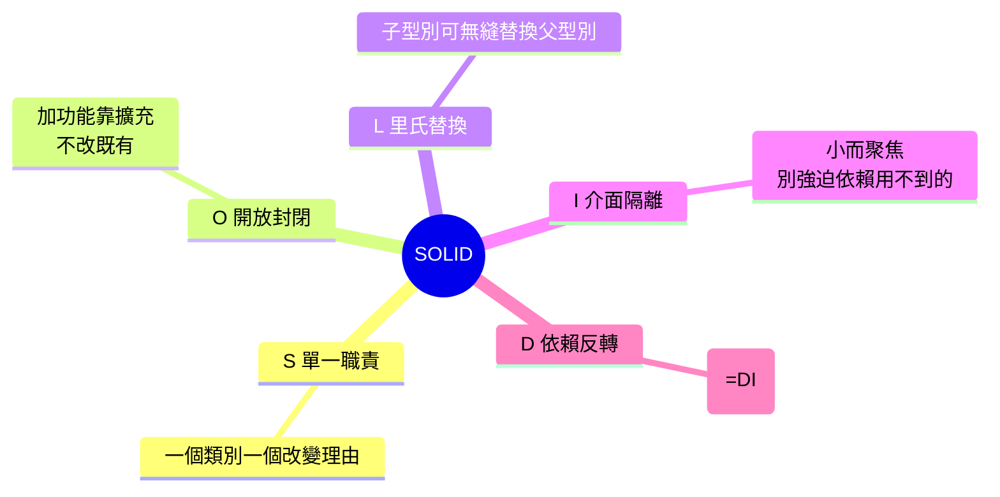

# SOLID 原則

> SOLID 是五條物件導向設計原則的縮寫，教你怎麼把類別設計得「好改、好擴充、好測試」。它們不是死規則，而是幫你避開「牽一髮動全身」「加功能要改一堆」的設計智慧。面試必考，實戰受用。

## Why（為什麼）

寫得出能動的程式不難，難的是寫出**好維護、好擴充**的程式——需求一變，你是「改一個地方」還是「動一大片」？是「加個新類別」還是「改遍現有程式」？**SOLID** 是五條物件導向設計原則（Robert C. Martin 整理），每條對應一種常見的設計壞味道，教你如何讓程式**鬆耦合、高內聚、易擴充、易測試**。它們是前幾章（[分層](01-layered-architecture.md)、[Clean Architecture](02-clean-architecture.md)、[DI](03-dependency-injection.md)、[Repository](04-repository-pattern.md)）背後的設計原則——例如 DI 就是 DIP 的實踐。理解 SOLID 讓你能說清楚「為什麼這樣設計比較好」，是面試高頻題，也是寫出經得起變化的程式的基礎。但它們是**指導原則不是教條**——過度套用會過度工程，要理解每條「解決什麼問題」。

## Theory（理論：五個原則）

| 字母 | 原則 | 一句話 | 解決的問題 |
|------|------|--------|-----------|
| **S** | Single Responsibility | 一個類別只有一個改變的理由 | 職責混雜、牽一髮動全身 |
| **O** | Open/Closed | 對擴充開放、對修改封閉 | 加功能要改現有程式 |
| **L** | Liskov Substitution | 子型別要能替換父型別 | 繼承破壞行為契約 |
| **I** | Interface Segregation | 別強迫依賴用不到的介面 | 胖介面、被迫實作無關方法 |
| **D** | Dependency Inversion | 依賴抽象，不依賴具體 | 高層綁死低層細節 |

### S — 單一職責原則（SRP）

**一個類別應該只有一個改變的理由**（只負責一件事）。若一個類別同時管「業務邏輯 + 存 DB + 發 email + 格式化報表」，任一需求變都要改它——脆弱且難測。把不同職責拆成不同類別，改動被侷限。

### O — 開放封閉原則（OCP）

**對擴充開放、對修改封閉**——加新功能應該靠「新增程式」而非「修改既有程式」。典型手法：用多型/抽象，新需求加新的子類別/實作，不動既有的。避免「每加一種類型就改一個大 if/elif」。

### L — 里氏替換原則（LSP）

**子型別必須能無縫替換父型別，不破壞程式正確性**。子類別 override 時不能違反父類別的行為契約（如不能拋父類別沒宣告的例外、不能加強前置條件）。經典反例：`Square` 繼承 `Rectangle` 卻讓 `set_width` 也改高度，破壞了「寬高獨立」的契約。

### I — 介面隔離原則（ISP）

**不該強迫客戶端依賴它用不到的方法**。胖介面（一個介面塞十個方法）讓實作者被迫實作無關方法。應拆成多個小而聚焦的介面，客戶端只依賴需要的。

### D — 依賴反轉原則（DIP）

**高層模組不依賴低層模組，兩者都依賴抽象**；抽象不依賴細節，細節依賴抽象。這正是 [DI](03-dependency-injection.md) 與 [Repository](04-repository-pattern.md) 的理論基礎——業務層依賴 repository 介面（抽象），而非具體 SQL 實作。

## Specification（規範：原則對照範例）

```python
# S — 單一職責：拆開不同職責
class OrderValidator: ...      # 只驗證
class OrderRepository: ...     # 只存取
class OrderNotifier: ...       # 只通知
# 而非一個 God class OrderManager 全包

# O — 開放封閉：加類型不改既有程式
class Discount(ABC):
    @abstractmethod
    def apply(self, price: float) -> float: ...
class BlackFridayDiscount(Discount): ...   # 加新折扣 = 加新類別，不改既有
class MemberDiscount(Discount): ...

# L — 里氏替換：子類別不破壞父契約
class Bird(ABC): ...
class Sparrow(Bird): ...    # 會飛
# Penguin 不該繼承「會飛的 Bird」（無法替換）→ 重新設計階層

# I — 介面隔離：小而聚焦
class Readable(Protocol):
    def read(self) -> bytes: ...
class Writable(Protocol):
    def write(self, data: bytes) -> None: ...
# 而非一個 File 介面強迫唯讀裝置實作 write

# D — 依賴反轉：依賴抽象
class Service:
    def __init__(self, repo: Repository) -> None:   # 抽象，非具體 SqlRepository
        self._repo = repo
```

## Implementation（逐條拆解與 Python 手法）

### SRP 實作：拆分職責

```python
# 🔴 違反 SRP：一個類別做太多
class UserManager:
    def create_user(self, ...): ...        # 業務
    def save_to_db(self, ...): ...         # 持久化
    def send_welcome_email(self, ...): ...  # 通知
    def generate_report(self, ...): ...     # 報表
    # 四種職責 → 四種改變理由 → 脆弱

# ✅ 遵守 SRP：各司其職
class UserService: ...        # 業務邏輯
class UserRepository: ...     # 持久化（見 Repository 模式）
class EmailNotifier: ...      # 通知
class ReportGenerator: ...    # 報表
```

### OCP 實作：多型取代 if/elif 大分支

```python
# 🔴 違反 OCP：每加一種付款方式就改這個函式
def process_payment(method: str, amount: float):
    if method == "credit_card": ...
    elif method == "paypal": ...
    elif method == "crypto": ...      # 加新方式要改這裡

# ✅ 遵守 OCP：加新方式 = 加新類別
class PaymentMethod(ABC):
    @abstractmethod
    def pay(self, amount: float) -> None: ...

class CreditCard(PaymentMethod): ...
class PayPal(PaymentMethod): ...
class Crypto(PaymentMethod): ...      # 加新方式，不動既有程式

def process_payment(method: PaymentMethod, amount: float):
    method.pay(amount)                # 對修改封閉、對擴充開放
```

### LSP 實作：正確的繼承階層

```python
# 🔴 違反 LSP：Penguin 不能替換「會飛的 Bird」
class Bird:
    def fly(self) -> str: return "飛"
class Penguin(Bird):
    def fly(self) -> str: raise NotImplementedError("企鵝不會飛")  # 破壞契約！

# ✅ 遵守 LSP：分離「會飛」的能力
class Bird(ABC): ...
class FlyingBird(Bird):
    def fly(self) -> str: return "飛"
class Penguin(Bird):        # 不繼承 fly，不會被當「會飛的鳥」用
    def swim(self) -> str: return "游"
```

### ISP 實作：拆分胖介面

```python
# 🔴 違反 ISP：胖介面強迫實作無關方法
class Machine(ABC):
    @abstractmethod
    def print(self): ...
    @abstractmethod
    def scan(self): ...
    @abstractmethod
    def fax(self): ...
# 老式印表機只能 print，卻被迫實作 scan/fax（拋 NotImplementedError）

# ✅ 遵守 ISP：小而聚焦的介面
class Printer(Protocol):
    def print(self) -> None: ...
class Scanner(Protocol):
    def scan(self) -> None: ...
# 多功能事務機同時實作兩者；老印表機只實作 Printer
```

### DIP 實作：就是依賴注入

```python
# 🔴 違反 DIP：高層依賴具體低層
class ReportService:
    def __init__(self):
        self._db = PostgresDatabase()      # 高層綁死具體 DB

# ✅ 遵守 DIP：高層與低層都依賴抽象
class Database(Protocol):
    def query(self, sql: str) -> list: ...

class ReportService:
    def __init__(self, db: Database):      # 依賴抽象（注入）
        self._db = db
# 這就是 DI（見 DI 章）——DIP 是原則、DI 是實踐手法
```

### Python 的味道：不是每條都要 ABC

Python 是動態語言，SOLID 的落地更輕量：

- **DIP/ISP 常用 `Protocol`**（結構型別，見 [Protocol](../05-typing/09-protocol.md)）而非強制繼承 ABC——更 Pythonic。
- **OCP 也可用函式/字典分派**（不一定要類別階層）：`handlers = {"credit": pay_credit, ...}`。
- **別為了 SOLID 而 SOLID**：小腳本不需要五層抽象。原則是為了管理「會成長、會變」的複雜度。

## Code Example（可執行的 Python 範例）

```python
# solid_demo.py — OCP + DIP：加折扣類型不改既有程式（可獨立執行/測試）
from __future__ import annotations

from abc import ABC, abstractmethod


# ===== OCP：折扣抽象，加新折扣 = 加新類別 =====
class Discount(ABC):
    @abstractmethod
    def apply(self, price: float) -> float: ...


class NoDiscount(Discount):
    def apply(self, price: float) -> float:
        return price


class PercentageDiscount(Discount):
    def __init__(self, percent: float) -> None:
        self._percent = percent

    def apply(self, price: float) -> float:
        return price * (1 - self._percent / 100)


class FixedDiscount(Discount):
    def __init__(self, amount: float) -> None:
        self._amount = amount

    def apply(self, price: float) -> float:
        return max(0, price - self._amount)


# ===== DIP：結帳依賴 Discount 抽象（不依賴具體折扣）=====
class Checkout:
    def __init__(self, discount: Discount) -> None:
        self._discount = discount  # 依賴抽象（注入）

    def total(self, price: float) -> float:
        return self._discount.apply(price)


def demo() -> None:
    price = 1000.0
    # 同一個 Checkout，注入不同折扣（OCP：加折扣不改 Checkout）
    strategies: list[tuple[str, Discount]] = [
        ("無折扣", NoDiscount()),
        ("打 8 折", PercentageDiscount(20)),
        ("折 150 元", FixedDiscount(150)),
    ]
    for name, discount in strategies:
        total = Checkout(discount).total(price)
        print(f"  {name}: {price:.0f} → {total:.0f}")

    print("\n重點：OCP(加折扣=加類別,不改既有) + DIP(Checkout 依賴 Discount 抽象)")


if __name__ == "__main__":
    demo()
```

**預期輸出**：

```pycon
$ python solid_demo.py
  無折扣: 1000 → 1000
  打 8 折: 1000 → 800
  折 150 元: 1000 → 850

重點：OCP(加折扣=加類別,不改既有) + DIP(Checkout 依賴 Discount 抽象)
```

## Diagram（圖解：SOLID 五原則）



## Best Practice（最佳實踐）

- **SRP**：一個類別/函式只做一件事、只有一個改變理由——職責混雜就拆。
- **OCP**：用多型/抽象讓「加功能 = 加程式」而非改既有——避免不斷長大的 if/elif 分支。
- **LSP**：子類別 override 不破壞父類別契約——不確定 is-a 就用組合而非繼承（見 [組合優於繼承](../04-oop/README.md)）。
- **ISP**：介面小而聚焦，用 `Protocol` 拆分——別讓實作者被迫實作用不到的方法。
- **DIP**：依賴抽象（Protocol/ABC）而非具體，用注入（見 [DI](03-dependency-injection.md)）——高層不綁死低層細節。
- **理解每條解決什麼問題**，而非死背——SOLID 是指導原則不是教條。
- **別過度套用**：小專案硬套五層抽象是過度工程；原則為「會成長的複雜度」服務。
- **Python 手法**：`Protocol`、函式分派、組合——不必事事 ABC 繼承。

## Common Mistakes（常見誤解）

- **God class（違反 SRP）**：一個類別包山包海，任何需求變都要改它。
- **不斷擴大的 if/elif 分支（違反 OCP）**：每加類型改同一函式；用多型。
- **為省事亂繼承（違反 LSP）**：子類別 override 破壞契約（企鵝不會飛卻繼承會飛的鳥）；用組合或重設階層。
- **胖介面（違反 ISP）**：一個介面十個方法，實作者被迫 `raise NotImplementedError`；拆小介面。
- **高層 new 具體低層（違反 DIP）**：綁死、難測、難換；依賴抽象 + 注入。
- **把 SOLID 當教條、過度抽象**：每個類別都加介面工廠，簡單事情複雜化——過度工程。
- **背字母不懂問題**：能背 SOLID 卻說不出每條解決什麼——面試會被追問破功。

## Interview Notes（面試重點）

- **能講出五個原則的全名與一句話**，並**說出每條解決的問題**（不是死背字母）：SRP 職責混雜、OCP 加功能改既有、LSP 繼承破壞契約、ISP 胖介面、DIP 高層綁死低層。
- **能各舉一個違反與遵守的例子**（OCP 的 if/elif → 多型、DIP 的 new 具體 → 注入抽象、LSP 的企鵝-鳥）。
- **知道 DIP 就是 DI 的理論基礎**、Repository/Clean Architecture 都是 SOLID 的實踐。
- **知道 Python 的落地手法**（Protocol、組合、函式分派），不必事事 ABC。
- **務實觀點**：SOLID 是指導原則不是教條，過度套用會過度工程；能判斷何時值得。

---

➡️ 下一章：[常見設計模式](06-design-patterns.md)

[⬆️ 回 Part 16 索引](README.md)
