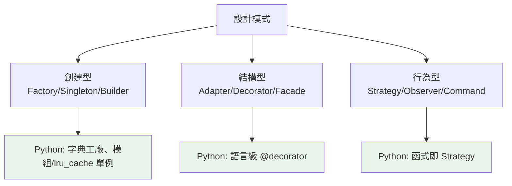

# 常見設計模式

> 設計模式是「前人踩過的坑總結出的解法範本」——面對「怎麼建立物件」「怎麼讓物件協作」等反覆出現的問題，有現成的套路。但 Python 的動態特性讓很多模式變得更輕、甚至內建。這章講最實用的幾個，並點出 Python 的 Pythonic 做法。

## Why（為什麼）

設計問題會**重複出現**：「怎麼確保全域只有一個設定物件」「怎麼在執行時切換演算法」「怎麼在不改原物件下加功能」。前人把這些常見問題的解法整理成**設計模式（design pattern）**——命名、範本化，讓工程師能用共同語言溝通（「這裡用 strategy 模式」勝過解釋一大段）。但要小心兩件事：**（1）模式是解決問題的工具，不是拿來炫技的目標**——為用而用會過度工程；**（2）很多經典模式（源自 Java/C++）在 Python 有更輕量甚至內建的做法**——Python 的一等函式、動態型別、`__` 協定讓某些模式「消失」或簡化。這章講最實用的幾個模式，並強調 Pythonic 的落地方式與「何時該用、何時是過度設計」。

## Theory（理論：三大類模式）

經典 GoF（Gang of Four）把模式分三類：

- **創建型（Creational）**：關於「如何建立物件」。Factory（工廠）、Singleton（單例）、Builder（建造者）。
- **結構型（Structural）**：關於「如何組合物件成更大結構」。Adapter（轉接）、Decorator（裝飾）、Facade（外觀）、Proxy（代理）。
- **行為型（Behavioral）**：關於「物件間如何協作與分配職責」。Strategy（策略）、Observer（觀察者）、Template Method、Command。

**Python 視角的關鍵洞見**：GoF 模式誕生於靜態、無一等函式的語言（C++/Java）。Python 有一等函式、動態型別、鴨子型別、內建協定——**許多模式因此更簡單或內建**：

- Strategy 常只需傳一個函式（不必一堆策略類別）。
- Singleton 常用模組（module 本身就是單例）取代。
- Decorator 有語言層級的 `@decorator`（見 [裝飾器](../08-functional-decorators/README.md)）。
- Iterator 是內建協定（`__iter__`，見 [迭代器](../07-iterators-generators/README.md)）。

## Specification（規範：常用模式速覽）

```python
# Strategy（策略）：把演算法參數化 —— Python 常用函式
def checkout(items, discount_fn):        # 傳函式即策略
    return discount_fn(sum(items))

# Factory（工廠）：集中物件建立邏輯
def create_notifier(kind: str) -> Notifier:
    return {"email": EmailNotifier, "sms": SmsNotifier}[kind]()

# Singleton（單例）：Python 用模組或 lru_cache
from functools import lru_cache
@lru_cache(maxsize=1)
def get_config() -> Config:
    return Config.load()      # 全程式共用一個

# Adapter（轉接）：讓不相容介面能協作
class LegacyPrinterAdapter:
    def __init__(self, legacy): self._legacy = legacy
    def print(self, text): self._legacy.print_text(text)   # 轉接舊介面

# Observer（觀察者）：一對多通知
class Subject:
    def __init__(self): self._observers = []
    def subscribe(self, fn): self._observers.append(fn)
    def notify(self, event): [fn(event) for fn in self._observers]

# Decorator（裝飾）：Python 有語言級 @（見裝飾器章）
```

## Implementation（Strategy、Factory、Singleton、Adapter、Observer）

### Strategy：Python 用函式最自然

Strategy 模式把「可替換的演算法」抽象化，執行時切換。Java 要定義策略介面 + 一堆策略類別；**Python 因為函式是一等公民，常只需傳函式**：

```python
# Java 式（類別策略）——也可以，但較重
class DiscountStrategy(ABC):
    @abstractmethod
    def apply(self, price: float) -> float: ...

# Pythonic（函式策略）——輕量
def no_discount(price: float) -> float:
    return price

def black_friday(price: float) -> float:
    return price * 0.5

def checkout(price: float, strategy=no_discount) -> float:
    return strategy(price)              # 傳函式當策略

checkout(1000, black_friday)            # 500
```

**當策略有狀態或多個方法時，才用類別**；單一函式行為，傳函式就好。這是 Python 讓模式「變輕」的典型。

### Factory：集中建立邏輯

Factory 把「決定建立哪個類別」的邏輯集中一處，呼叫者不必知道具體類別：

```python
class Notifier(Protocol):
    def send(self, msg: str) -> None: ...

class EmailNotifier: ...
class SmsNotifier: ...
class PushNotifier: ...

def create_notifier(channel: str) -> Notifier:
    factories = {                       # 字典分派（Pythonic）
        "email": EmailNotifier,
        "sms": SmsNotifier,
        "push": PushNotifier,
    }
    try:
        return factories[channel]()
    except KeyError:
        raise ValueError(f"未知通知管道: {channel}") from None
```

好處：加新管道只改工廠（符合 [OCP](05-solid.md)）、呼叫者與具體類別解耦。**Python 常用字典分派取代冗長的 if/elif 工廠**。

### Singleton：Python 用模組或快取

Singleton 確保「全程式只有一個實例」（如設定、連線池）。Java 要私有建構子 + 靜態實例。**Python 有更簡單的做法**：

```python
# 做法一：模組層級（最 Pythonic）——模組本身就是單例
# config.py
config = Config.load()          # 匯入者共用同一個

# 做法二：lru_cache（惰性、執行緒安全的單例）
from functools import lru_cache

@lru_cache(maxsize=1)
def get_config() -> Config:
    return Config.load()        # 第一次呼叫建立，之後回同一個

# 做法三：__new__（傳統 Singleton，較少用、有爭議）
```

**Singleton 常被視為反模式**（隱藏依賴、全域狀態、難測試）——多數情況用**依賴注入**（見 [DI](03-dependency-injection.md)）把單一實例注入更好。真要單例，用模組或 `lru_cache`，別手刻 `__new__`。

### Adapter：讓不相容介面協作

Adapter 包裝一個介面不合的物件，轉成你需要的介面（常用於整合舊程式/第三方）：

```python
# 第三方/舊程式的介面（不能改）
class LegacyLogger:
    def write_log(self, level: str, text: str) -> None: ...

# 你的程式期待的介面
class Logger(Protocol):
    def log(self, message: str) -> None: ...

# Adapter：把 LegacyLogger 轉成 Logger 介面
class LegacyLoggerAdapter:
    def __init__(self, legacy: LegacyLogger) -> None:
        self._legacy = legacy

    def log(self, message: str) -> None:
        self._legacy.write_log("INFO", message)   # 轉接

# 現在能把舊 logger 當標準 Logger 用
```

### Observer：一對多通知

Observer 讓多個「觀察者」訂閱一個「主題」，主題狀態變化時通知所有訂閱者（事件系統的基礎，見 [事件驅動](10-event-driven-mq.md)）：

```python
class EventEmitter:
    def __init__(self) -> None:
        self._handlers: list[Callable[[str], None]] = []

    def subscribe(self, handler: Callable[[str], None]) -> None:
        self._handlers.append(handler)

    def emit(self, event: str) -> None:
        for handler in self._handlers:      # 通知所有訂閱者
            handler(event)

emitter = EventEmitter()
emitter.subscribe(lambda e: print(f"記錄: {e}"))
emitter.subscribe(lambda e: send_alert(e))
emitter.emit("使用者註冊")                    # 兩個訂閱者都收到
```

### 別為了模式而模式（YAGNI）

**最重要的一課**：模式是**解決問題的工具**，不是設計目標。常見的過度工程：

- 用不到多型卻硬做 Factory + 一堆策略類別。
- 簡單設定硬做 Singleton class（用模組就好）。
- 到處 AbstractFactoryBuilderStrategy 把三行邏輯變三十行。

**YAGNI（You Aren't Gonna Need It）**：需求真的出現「多種可替換實作」「反覆的建立邏輯」時才引入模式。先寫簡單直接的程式，重構時再視需要導入模式。

## Code Example（可執行的 Python 範例）

```python
# patterns_demo.py — Strategy + Factory + Observer（可獨立執行/測試）
from __future__ import annotations

from collections.abc import Callable


# ===== Strategy：函式即策略（Pythonic）=====
def regular_price(price: float) -> float:
    return price


def member_price(price: float) -> float:
    return price * 0.9


def vip_price(price: float) -> float:
    return price * 0.8


# ===== Factory：字典分派建立策略 =====
def get_pricing(tier: str) -> Callable[[float], float]:
    strategies = {"regular": regular_price, "member": member_price, "vip": vip_price}
    try:
        return strategies[tier]
    except KeyError:
        raise ValueError(f"未知會員等級: {tier}") from None


# ===== Observer：一對多事件通知 =====
class OrderEvents:
    def __init__(self) -> None:
        self._handlers: list[Callable[[str], None]] = []

    def subscribe(self, handler: Callable[[str], None]) -> None:
        self._handlers.append(handler)

    def emit(self, event: str) -> None:
        for handler in self._handlers:
            handler(event)


def demo() -> None:
    # Strategy + Factory：依會員等級算價
    print("Strategy + Factory（依會員等級定價）：")
    for tier in ["regular", "member", "vip"]:
        price = get_pricing(tier)(1000)
        print(f"  {tier}: 1000 → {price:.0f}")

    # Observer：下單事件通知多個訂閱者
    print("\nObserver（下單事件通知）：")
    log: list[str] = []
    events = OrderEvents()
    events.subscribe(lambda e: log.append(f"寫 log: {e}"))
    events.subscribe(lambda e: log.append(f"發通知: {e}"))
    events.emit("訂單 #123 成立")
    for entry in log:
        print(f"  {entry}")

    print("\n重點：Python 用函式做 Strategy、字典做 Factory；模式為解決問題，別過度用")


if __name__ == "__main__":
    demo()
```

**預期輸出**：

```pycon
$ python patterns_demo.py
Strategy + Factory（依會員等級定價）：
  regular: 1000 → 1000
  member: 1000 → 900
  vip: 1000 → 800

Observer（下單事件通知）：
  寫 log: 訂單 #123 成立
  發通知: 訂單 #123 成立

重點：Python 用函式做 Strategy、字典做 Factory；模式為解決問題，別過度用
```

## Diagram（圖解：模式分類與 Python 化）



## Best Practice（最佳實踐）

- **模式是解決問題的工具**：出現「多種可替換實作/反覆建立邏輯/一對多通知」等具體問題時才用。
- **Strategy 優先用函式**（一等函式），有狀態/多方法才用類別。
- **Factory 用字典分派**取代冗長 if/elif，加新類型只改工廠（符合 [OCP](05-solid.md)）。
- **Singleton 用模組或 `lru_cache`**，別手刻 `__new__`；更常見的是用 [DI](03-dependency-injection.md) 注入單一實例。
- **Adapter 整合舊/第三方介面**：包裝轉成你要的介面。
- **Observer 做事件通知**（見 [事件驅動](10-event-driven-mq.md)）：解耦發送方與接收方。
- **善用 Python 內建的「模式」**：`@decorator`（裝飾器）、`__iter__`（迭代器）、context manager——語言已幫你實作。
- **遵守 YAGNI**：先寫簡單直接的程式，需要時重構導入模式；別預先過度抽象。

## Common Mistakes（常見誤解）

- **為用模式而用模式**：簡單問題硬套 AbstractFactory，三行變三十行——過度工程。
- **照搬 Java 式重量級寫法**：一堆策略類別，其實 Python 傳函式就好。
- **手刻 Singleton `__new__`**：隱藏依賴、全域狀態、難測試（常是反模式）；用模組/DI。
- **Factory 用長 if/elif**：難擴充；字典分派更清爽。
- **忽略 Python 內建的模式**：自己實作 iterator/decorator，其實有語言支援。
- **模式當設計目標**：以「用了幾個模式」自豪，而非「解決了什麼問題」。
- **不理解模式解決的問題就套用**：套錯場景，增加複雜度沒帶來好處。

## Interview Notes（面試重點）

- **能分類三大類模式**（創建型/結構型/行為型）並各舉代表（Factory/Adapter/Strategy）。
- **能講幾個常用模式解決的問題**：Strategy（執行時切換演算法）、Factory（集中建立邏輯）、Observer（一對多通知）、Adapter（不相容介面協作）、Singleton（唯一實例）。
- **知道 Python 讓許多模式變輕/內建**：函式即 Strategy、字典即 Factory、模組/`lru_cache` 即 Singleton、語言級 `@decorator`、內建 iterator 協定。
- **知道 Singleton 常是反模式**（全域狀態、難測），多用 DI 取代。
- **務實觀點（面試加分）**：模式是工具不是目標，強調 YAGNI、別過度工程——能說出「何時該用、何時是過度設計」。

---

➡️ 下一章：[專案結構實務](07-project-structure.md)

[⬆️ 回 Part 16 索引](README.md)
