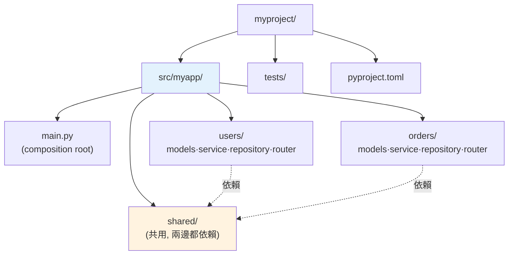

# 專案結構實務

> 檔案怎麼擺、模組怎麼切、套件怎麼組織——好的專案結構讓人一眼看懂架構、找得到東西、改得放心。這章講 Python 專案的實務結構：src layout、按功能還是按層分、循環 import 怎麼避免。

## Why（為什麼）

程式一多，「東西放哪」就成了大問題。結構糟糕的專案：**找不到檔案、不知道某功能在哪、import 一團亂、循環 import 報錯、測試和程式攪在一起、打包出問題**。好的專案結構讓**新人一眼看懂架構、功能容易定位、依賴關係清晰、好測試好打包**。這章講 Python 專案的實務結構——不是死規則，而是社群累積的慣例與取捨：`src` layout 為何較好、「按層分」還是「按功能分」、如何避免循環 import、`__init__.py` 的角色。結構是架構（[分層](01-layered-architecture.md)、[Clean Architecture](02-clean-architecture.md)）在檔案系統上的體現——好的結構讓架構「看得見」。

## Theory（理論：結構反映架構）

專案結構的核心原則：**目錄結構應該反映架構與職責**——讓人從資料夾就看出「這是什麼系統、有哪些部分、怎麼分層」。

兩種主要的組織哲學：

- **按技術層分（layer-based / technical）**：`models/`、`services/`、`repositories/`、`api/`——同類技術放一起。小專案清楚，但一個功能的程式散在多個資料夾（改一個功能要跳多處）。
- **按功能/領域分（feature-based / by domain）**：`users/`、`orders/`、`payments/`——每個功能自成一包（內含自己的 model/service/repo）。大專案更好維護（功能內聚），是 [DDD](08-ddd.md)、模組化單體、[微服務](../21-microservices/README.md) 的傾向。

**經驗法則**：**小專案按層分、大專案按功能分**（或混合：頂層按功能，功能內按層）。功能分讓「一個功能的改動集中在一個資料夾」，符合高內聚。

## Specification（規範：典型 Python 專案結構）

```text
myproject/
├── pyproject.toml          # 專案設定與依賴（見 pyproject）
├── README.md
├── .gitignore
├── src/                    # src layout：原始碼放 src/ 下（推薦）
│   └── myapp/
│       ├── __init__.py
│       ├── main.py         # 進入點 / composition root（見 DI）
│       ├── config.py       # 設定管理（見 設定管理）
│       ├── users/          # 按功能分：使用者領域
│       │   ├── __init__.py
│       │   ├── models.py       # 領域模型
│       │   ├── service.py      # 業務邏輯
│       │   ├── repository.py   # 資料存取
│       │   └── router.py       # API 端點
│       ├── orders/         # 另一個功能領域
│       │   └── ...
│       └── shared/         # 跨功能共用（工具、基底類別）
├── tests/                  # 測試與原始碼分離
│   ├── conftest.py
│   ├── test_users.py
│   └── test_orders.py
└── docs/
```

## Implementation（src layout、功能分、__init__、循環 import）

### src layout：為何較好

**src layout**（原始碼放 `src/myapp/` 而非直接 `myapp/`）看似多一層，但解決真實問題：

```text
# flat layout（原始碼在根目錄）
myproject/
├── myapp/
└── tests/

# src layout（推薦）
myproject/
├── src/myapp/
└── tests/
```

src layout 的好處（見 [打包](../13-tooling-packaging/05-packaging.md)）：

- **強制「安裝後測試」**：因為 `src/` 不在 `sys.path`，你必須把套件安裝（`pip install -e .`）才能 import——這確保你測的是「真正會被安裝的樣子」，避免「本地能跑、裝起來壞」。
- **避免意外 import 根目錄的東西**（如 `setup.py`、頂層雜物）。
- **打包更乾淨**：清楚哪些是要發布的程式。

多數現代 Python 工具（見 [uv/poetry](../13-tooling-packaging/03-uv-poetry.md)）預設用 src layout。

### 按功能組織：高內聚

大專案按功能分，每個功能是一個自包含的包：

```text
src/myapp/users/
├── __init__.py         # 對外公開的 API（如 from .service import UserService）
├── models.py           # User 領域模型
├── service.py          # UserService 業務邏輯
├── repository.py       # UserRepository 資料存取
└── router.py           # FastAPI 端點
```

好處：**一個功能的所有程式集中**（改使用者相關的東西只看 `users/`）、**功能間邊界清楚**（`users/` 不該深入 `orders/` 的內部）、**易拆分**（未來要抽成微服務，整個資料夾搬走）。這呼應 [分層](01-layered-architecture.md)——功能內仍分層（model/service/repository）。

### `__init__.py` 的角色

`__init__.py` 讓資料夾成為 Python 套件，並控制「這個包對外公開什麼」：

```python
# users/__init__.py — 定義套件的公開介面
from .service import UserService
from .models import User

__all__ = ["User", "UserService"]   # 明確公開的 API

# 外部用：from myapp.users import UserService（乾淨）
# 而非：from myapp.users.service import UserService（洩漏內部結構）
```

用 `__init__.py` 匯出「公開 API」，隱藏內部模組結構——外部依賴穩定的公開介面，內部重構不影響外部。**別在 `__init__.py` 放重邏輯或造成 import 副作用**（拖慢匯入、易循環）。

### 循環 import：成因與解法

**循環 import（circular import）** 是 Python 常見痛點：A 匯入 B、B 又匯入 A → `ImportError`。常因架構依賴混亂（層與層互相依賴）：

```python
# 🔴 循環：users/service.py 匯入 orders，orders/service.py 又匯入 users
```

解法：

- **釐清依賴方向**（見 [分層](01-layered-architecture.md)）：讓依賴單向——若 A、B 互相需要，往往是設計問題（該抽出共用部分或用依賴反轉）。
- **把共用的東西抽到 `shared/`**：兩邊都依賴 shared，而非互相依賴。
- **延遲匯入（local import）**：在函式內 import（不在模組頂層），打破載入時的循環——治標手法，能用但別濫用。
- **依賴抽象（見 [DIP](05-solid.md)）**：依賴介面而非具體模組，解開耦合。
- **`TYPE_CHECKING` 匯入**：只為型別註解的 import 放進 `if TYPE_CHECKING:`（見 [型別](../05-typing/README.md)），不造成執行期循環。

```python
from typing import TYPE_CHECKING
if TYPE_CHECKING:
    from myapp.orders.models import Order   # 只給型別檢查用，執行期不 import
```

### 測試與原始碼分離

`tests/` 與 `src/` 分開（見 [pytest](../12-testing/03-pytest-basics.md)）——測試不打包進發布物、結構清楚。`conftest.py` 放共用 fixture（見 [fixture](../12-testing/04-fixtures.md)）。

## Code Example（可執行的 Python 範例）

```python
# structure_demo.py — 用 Python 分析模組依賴、偵測循環（可獨立執行/測試）
from __future__ import annotations


def detect_cycle(deps: dict[str, list[str]]) -> list[str] | None:
    """偵測模組依賴圖中的循環（DFS）。回傳循環路徑或 None。"""
    WHITE, GRAY, BLACK = 0, 1, 2
    color = dict.fromkeys(deps, WHITE)
    path: list[str] = []

    def visit(node: str) -> list[str] | None:
        color[node] = GRAY
        path.append(node)
        for dep in deps.get(node, []):
            if color.get(dep, WHITE) == GRAY:  # 遇到灰色節點 → 循環
                return [*path[path.index(dep) :], dep]
            if color.get(dep, WHITE) == WHITE:
                cycle = visit(dep)
                if cycle:
                    return cycle
        color[node] = BLACK
        path.pop()
        return None

    for node in deps:
        if color[node] == WHITE:
            cycle = visit(node)
            if cycle:
                return cycle
    return None


def demo() -> None:
    # 良好的單向依賴（分層：router → service → repository）
    good = {
        "users.router": ["users.service"],
        "users.service": ["users.repository"],
        "users.repository": [],
    }
    print(f"良好依賴（單向）: 循環 = {detect_cycle(good)}")

    # 循環依賴（users 與 orders 互相依賴）
    bad = {
        "users.service": ["orders.service"],
        "orders.service": ["users.service"],  # 循環！
    }
    cycle = detect_cycle(bad)
    print(f"問題依賴（互相依賴）: 循環 = {' → '.join(cycle) if cycle else None}")

    print("\n重點：依賴應單向（分層）；循環 import 常是架構問題，抽 shared 或反轉依賴")


if __name__ == "__main__":
    demo()
```

**預期輸出**：

```pycon
$ python structure_demo.py
良好依賴（單向）: 循環 = None
問題依賴（互相依賴）: 循環 = users.service → orders.service → users.service

重點：依賴應單向（分層）；循環 import 常是架構問題，抽 shared 或反轉依賴
```

## Diagram（圖解：按功能組織 + src layout）



## Best Practice（最佳實踐）

- **用 src layout**（`src/myapp/`）：強制安裝後測試、打包乾淨、避免意外 import（見 [打包](../13-tooling-packaging/05-packaging.md)）。
- **小專案按層分、大專案按功能分**：功能分讓改動集中、邊界清楚、易拆分。
- **功能內仍分層**（model/service/repository/router）：呼應 [分層架構](01-layered-architecture.md)。
- **用 `__init__.py` 定義套件公開 API**（`__all__`），隱藏內部結構；別放重邏輯/副作用。
- **保持依賴單向**：避免循環 import——循環常是架構問題，抽 `shared/` 或依賴反轉（見 [DIP](05-solid.md)）。
- **型別專用 import 放 `TYPE_CHECKING`**：避免執行期循環。
- **測試與原始碼分離**（`tests/`）、共用 fixture 放 `conftest.py`。
- **結構反映架構**：讓人從資料夾看出系統怎麼組成。

## Common Mistakes（常見誤解）

- **所有程式擠在一個檔案/一個資料夾**：難定位、難維護——隨規模拆分。
- **flat layout 導致「本地能跑、安裝後壞」**：src layout 強制真實安裝測試。
- **循環 import**：層/功能互相依賴；釐清依賴方向、抽 shared、反轉依賴。
- **`__init__.py` 放重邏輯或副作用**：拖慢匯入、易循環；只放公開 API 匯出。
- **大專案硬按技術層分**：一個功能散在五個資料夾，改動要跳來跳去；按功能分。
- **測試混進原始碼目錄**：打包進發布物、結構亂；分離 `tests/`。
- **功能包互相深入對方內部**：破壞邊界；透過公開 API 互動或抽 shared。
- **過早過度切分**：三個檔案的工具硬做多層包結構——依規模演進即可。

## Interview Notes（面試重點）

- **能說出 src layout 的好處**：強制安裝後測試（測到真正會被安裝的樣子）、打包乾淨、避免意外 import。
- **能對比「按層分 vs 按功能分」**及適用（小專案按層、大專案按功能，功能分高內聚易拆分）。
- **能講循環 import 的成因與解法**：依賴方向混亂；釐清單向依賴、抽 shared、依賴反轉、`TYPE_CHECKING`/延遲 import。
- 知道 `__init__.py` 定義套件公開 API（`__all__`）、隱藏內部結構，別放副作用。
- **知道結構應反映架構**：目錄體現分層/功能邊界；結構是架構在檔案系統的落地。

---

➡️ 下一章：[DDD 領域驅動設計](08-ddd.md)

[⬆️ 回 Part 16 索引](README.md)
