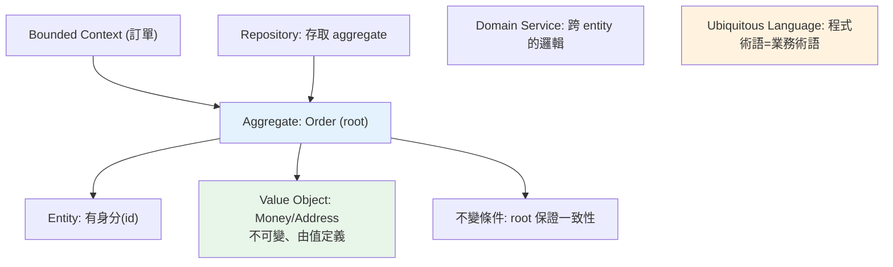

# DDD 領域驅動設計

> 複雜業務系統的最大難題不是技術，而是「搞懂業務、把業務正確映射成程式」。DDD 提供一套方法與詞彙——entity、value object、aggregate、bounded context——讓程式忠實反映領域，讓工程師與領域專家說同一種語言。

## 💡 白話導讀（建議先讀）

複雜系統最貴的 bug，往往不是技術錯，而是**工程師理解的「訂單」和業務嘴裡的「訂單」不是同一回事**。
DDD（Domain-Driven Design，領域驅動設計）整套方法就在對付這件事。核心就兩招：

**第一招：全公司說同一種語言（Ubiquitous Language）。**
業務說「結案」，程式裡就叫 `order.close()`，不要翻譯成 `set_status_to_4()`。
程式碼裡的名詞動詞＝業務術語，開會時工程師和 PM 才真的在講同一件事。

**第二招：承認同一個詞在不同部門意思不同（Bounded Context）。**
「商品」對目錄部門是「名稱＋圖片＋描述」，對倉儲部門是「SKU＋數量＋儲位」。
硬要建一個「大一統的 Product 類別」服務所有人，會變成誰都不滿意的巨獸。
DDD 說：**劃清邊界，各自建模**——這條邊界，日後正是[微服務](../21-microservices/README.md)的切分線。

邊界劃好後，才輪到戰術層的積木：**Entity**（有身分、會變的東西，如訂單）、
**Value Object**（只看值、不可變，如「金額」「地址」）、
**Aggregate**（一組必須一起維持一致的物件，改動只能從老大 aggregate root 進）。

DDD 不是每個專案都需要——CRUD 小系統用不上；但業務一複雜，它就是那套救命的思考框架。

## Why（為什麼）

技術不是複雜系統的最大挑戰——**理解業務、並把業務正確表達成程式**才是。當業務規則複雜（保險理賠、銀行交易、物流），如果程式只是一堆 CRUD 和散落各處的 if，沒人搞得懂「這段對應哪條業務規則」，改動風險極高。**領域驅動設計（Domain-Driven Design, DDD，Eric Evans 提出）** 是一套應對「複雜業務領域」的方法論：**把「領域（業務）」放在設計中心，讓程式結構忠實反映業務概念，並讓工程師與領域專家用同一套語言溝通**。它提供一組戰術工具（entity、value object、aggregate、repository、domain service）與戰略工具（bounded context、ubiquitous language），是 [Clean Architecture](02-clean-architecture.md)、[Hexagonal](09-hexagonal.md) 常搭配的思想。**注意**：DDD 是為**複雜領域**設計的，簡單 CRUD 用它是過度工程——理解「何時該用」和「用了什麼」同樣重要。

## Theory（理論：戰略與戰術）

DDD 分兩個層次：

**戰略設計（Strategic）——大方向、劃分邊界：**

- **Ubiquitous Language（統一語言）**：工程師與領域專家用**同一套詞彙**（程式裡的類別名、方法名 = 業務術語）。業務說「訂單」，程式就有 `Order`；業務說「結案」，程式就有 `order.close()`。消除翻譯落差。
- **Bounded Context（限界上下文）**：把大領域切成有明確邊界的子領域，**每個 context 內術語一致**。同一個詞在不同 context 可能意義不同（「商品」在「目錄」context 是描述，在「庫存」context 是數量）——各自建模，別硬統一。這是 [微服務](../21-microservices/README.md) 拆分邊界的理論依據。

**戰術設計（Tactical）——如何建模：**

| 概念 | 定義 | 例子 |
|------|------|------|
| **Entity（實體）** | 有唯一身分、身分不變、屬性可變 | `User`（id identifies）、`Order` |
| **Value Object（值物件）** | 無身分、由值定義、不可變 | `Money`、`Address`、`Email` |
| **Aggregate（聚合）** | 一組相關物件的一致性邊界，有 root | `Order`（root）含多個 `OrderLine` |
| **Repository** | 存取 aggregate（見 [Repository](04-repository-pattern.md)） | `OrderRepository` |
| **Domain Service** | 不屬於單一 entity 的業務邏輯 | `TransferService`（跨帳戶） |
| **Domain Event** | 領域中發生的事（見 [事件驅動](10-event-driven-mq.md)） | `OrderPlaced` |

## Specification（規範：entity vs value object vs aggregate）

```python
from dataclasses import dataclass
from decimal import Decimal

# Value Object：無身分、由值定義、不可變（frozen）
@dataclass(frozen=True)
class Money:
    amount: Decimal
    currency: str = "TWD"
    def add(self, other: "Money") -> "Money":
        if self.currency != other.currency:
            raise ValueError("幣別不符")
        return Money(self.amount + other.amount, self.currency)   # 回傳新值，不改自己

# 兩個 Money 值相同就相等（value equality）
assert Money(Decimal(100)) == Money(Decimal(100))

# Entity：有唯一身分（id），身分不變、屬性可變
class Order:
    def __init__(self, order_id: int) -> None:
        self.id = order_id            # 身分：不同 id 就是不同 order
        self._lines: list[OrderLine] = []
        self._status = "draft"

    # 兩個 Order 相等 = id 相同（identity equality），而非屬性相同
    def __eq__(self, other: object) -> bool:
        return isinstance(other, Order) and self.id == other.id

# Aggregate：Order 是 root，管理內部一致性
    def add_line(self, product: str, qty: int, price: Money) -> None:
        if self._status != "draft":
            raise ValueError("已送出的訂單不能改")     # 保護不變條件
        self._lines.append(OrderLine(product, qty, price))
```

## Implementation（value object、aggregate、不變條件、domain service）

### Value Object：不可變、由值定義

Value Object 沒有身分——**它就是它的值**。兩個 `Money(100, "TWD")` 完全相等、可互換。用 `frozen dataclass`（見 [dataclass](../04-oop/README.md)）實作，**不可變**（改變產生新物件）：

```python
@dataclass(frozen=True)
class Address:
    street: str
    city: str
    zipcode: str

# 好處：不可變 → 可安全共享、可當 dict key、無意外修改
# 用 value object 取代「一堆散裝參數」：
# 🔴 def ship(street, city, zipcode): ...
# ✅ def ship(address: Address): ...   概念清楚、可驗證、可重用
```

Value Object 讓「概念」在程式裡有名字（`Money` 而非裸 `Decimal`、`Email` 而非裸 `str`），並集中該概念的規則（幣別檢查、email 格式）。

### Aggregate：一致性邊界

**Aggregate（聚合）** 是「一組必須一起保持一致的物件」，有一個 **aggregate root**（對外唯一入口）。外部只能透過 root 操作，root 負責維護整個聚合的**不變條件（invariants）**：

```python
class Order:  # aggregate root
    def __init__(self, order_id: int) -> None:
        self.id = order_id
        self._lines: list[OrderLine] = []
        self._status = "draft"

    def add_line(self, product: str, qty: int, price: Money) -> None:
        # 不變條件：草稿才能加項目
        if self._status != "draft":
            raise ValueError("已送出訂單不能加項目")
        self._lines.append(OrderLine(product, qty, price))

    def total(self) -> Money:
        # 一致性：total 永遠等於所有項目加總
        return sum((line.subtotal() for line in self._lines), Money(Decimal(0)))

    def submit(self) -> None:
        if not self._lines:
            raise ValueError("空訂單不能送出")     # 保護不變條件
        self._status = "submitted"

# 外部不直接動 _lines（透過 root 方法），確保訂單永遠一致
```

**規則**：外部拿 root（`Order`），不直接碰內部（`OrderLine`）——所有改動經過 root 的方法，root 保證不變條件。一個交易只改一個 aggregate（跨 aggregate 用 [domain event](10-event-driven-mq.md) 最終一致）。**Repository 以 aggregate 為單位**（`OrderRepository` 存整個 Order，見 [Repository](04-repository-pattern.md)）。

### 把業務規則放進領域模型（避免貧血模型）

DDD 強調**充血模型（rich domain model）**——業務規則放在領域物件裡（`order.submit()`），而非全塞在 service。反面是**貧血模型（anemic model）**：領域物件只有 getter/setter，規則全在 service，物件淪為資料袋：

```python
# 🔴 貧血模型：Order 只是資料，規則在 service
class Order:
    status: str
    lines: list
class OrderService:
    def submit(self, order):
        if not order.lines: raise ...     # 規則在外面
        order.status = "submitted"

# ✅ 充血模型：規則在 Order 自己（封裝、內聚）
class Order:
    def submit(self) -> None:
        if not self._lines: raise ...     # 規則屬於 Order
        self._status = "submitted"
```

充血模型讓「業務規則和它保護的資料在一起」（封裝、高內聚）——這是 DDD 的核心價值之一。但**Domain Service** 仍用於「不屬於單一 entity 的邏輯」（如跨帳戶轉帳）。

### 何時用 DDD（別過度）

DDD 有成本（學習曲線、更多抽象、建模投入）。**適用**：複雜業務領域、長生命週期、需與領域專家密切協作、規則多變。**過度**：簡單 CRUD、資料驅動的報表系統、原型——用 DDD 全套是殺雞用牛刀。**務實**：即使不全套 DDD，其中的觀念（value object、把規則放進模型、統一語言、bounded context 劃分）在任何專案都受用。

## Code Example（可執行的 Python 範例）

```python
# ddd_demo.py — Value Object + Aggregate + 不變條件（可獨立執行/測試）
from __future__ import annotations

from dataclasses import dataclass
from decimal import Decimal


# ===== Value Object：不可變、由值定義 =====
@dataclass(frozen=True)
class Money:
    amount: Decimal
    currency: str = "TWD"

    def __add__(self, other: Money) -> Money:
        if self.currency != other.currency:
            raise ValueError("幣別不符")
        return Money(self.amount + other.amount, self.currency)

    def __mul__(self, qty: int) -> Money:
        return Money(self.amount * qty, self.currency)


@dataclass(frozen=True)
class OrderLine:
    product: str
    quantity: int
    unit_price: Money

    def subtotal(self) -> Money:
        return self.unit_price * self.quantity


# ===== Aggregate Root：Order 維護內部一致性與不變條件 =====
class Order:
    def __init__(self, order_id: int) -> None:
        self.id = order_id
        self._lines: list[OrderLine] = []
        self._status = "draft"

    def add_line(self, product: str, quantity: int, unit_price: Money) -> None:
        if self._status != "draft":
            raise ValueError("已送出的訂單不能加項目")  # 不變條件
        self._lines.append(OrderLine(product, quantity, unit_price))

    def total(self) -> Money:
        result = Money(Decimal(0))
        for line in self._lines:
            result = result + line.subtotal()
        return result

    def submit(self) -> None:
        if not self._lines:
            raise ValueError("空訂單不能送出")  # 不變條件
        self._status = "submitted"

    @property
    def status(self) -> str:
        return self._status


def demo() -> None:
    # Value Object 相等性（由值定義）
    print(f"Money 值相等: {Money(Decimal(100)) == Money(Decimal(100))}")

    # Aggregate：透過 root 操作，維護一致性
    order = Order(order_id=1)
    order.add_line("鍵盤", 2, Money(Decimal(1500)))
    order.add_line("滑鼠", 1, Money(Decimal(800)))
    print(f"訂單總額: {order.total().amount} {order.total().currency}")

    order.submit()
    print(f"送出後狀態: {order.status}")

    # 不變條件保護：送出後不能再改
    try:
        order.add_line("螢幕", 1, Money(Decimal(5000)))
    except ValueError as e:
        print(f"不變條件保護: {e}")

    print("\n重點：Value Object 不可變由值定義；Aggregate root 維護一致性與不變條件")


if __name__ == "__main__":
    demo()
```

**預期輸出**：

```pycon
$ python ddd_demo.py
Money 值相等: True
訂單總額: 3800 TWD
送出後狀態: submitted
不變條件保護: 已送出的訂單不能加項目

重點：Value Object 不可變由值定義；Aggregate root 維護一致性與不變條件
```

## Diagram（圖解：DDD 建構塊）



## Best Practice（最佳實踐）

- **用統一語言**：類別/方法名 = 業務術語，消除工程師與領域專家的翻譯落差。
- **用 bounded context 劃分子領域**：各 context 術語一致，別硬統一全域模型（也是微服務拆分依據）。
- **值概念用 Value Object**（不可變 `frozen dataclass`）：`Money`/`Email`/`Address` 取代裸型別，集中規則。
- **用 aggregate 劃一致性邊界**：外部透過 root 操作、root 維護不變條件、repository 以 aggregate 為單位。
- **充血模型**：業務規則放進領域物件（`order.submit()`），避免貧血模型（規則全在 service）。
- **跨 aggregate 用 domain event 最終一致**（見 [事件驅動](10-event-driven-mq.md)）：一交易改一 aggregate。
- **搭配 Clean/Hexagonal**：領域核心不依賴框架/DB（見 [Clean Architecture](02-clean-architecture.md)、[Hexagonal](09-hexagonal.md)）。
- **務實**：複雜領域才全套 DDD；簡單 CRUD 別過度——但 value object、規則入模型等觀念到處適用。

## Common Mistakes（常見誤解）

- **對簡單 CRUD 硬套全套 DDD**：過度工程、一堆無謂抽象。
- **貧血模型**：領域物件只有 getter/setter、規則全在 service——失去 DDD 封裝的價值。
- **不變條件沒放在 aggregate root**：外部直接改內部（`order._lines.append(...)`）繞過檢查，一致性破裂。
- **Value Object 可變**：失去「由值定義、可安全共享」的好處；用 `frozen`。
- **一個交易改多個 aggregate**：一致性難保證；一交易一 aggregate、跨的用事件。
- **忽略 bounded context 硬做全域統一模型**：同詞不同義硬塞一起，模型扭曲。
- **只學戰術（entity/VO）忽略戰略（統一語言/context）**：DDD 的最大價值在戰略層的溝通與邊界。

## Interview Notes（面試重點）

- **能說出 DDD 是「把業務領域放設計中心」的方法論**，核心價值是**統一語言（程式術語=業務術語）** 與 **bounded context（劃分子領域邊界）**。
- **能區分 Entity（有身分、身分定義相等）vs Value Object（無身分、由值定義、不可變）**，並各舉例（Order/User vs Money/Address）。
- **能解釋 Aggregate**：一致性邊界、透過 root 操作、root 維護不變條件、repository 以 aggregate 為單位、一交易一 aggregate。
- **知道充血 vs 貧血模型**：DDD 主張業務規則放進領域物件（封裝、內聚）。
- **務實觀點**：知道 DDD 為複雜領域設計，簡單 CRUD 是過度工程；bounded context 是微服務拆分的理論依據；能連結 Clean/Hexagonal/事件驅動。

---

➡️ 下一章：[Hexagonal / Ports & Adapters 架構](09-hexagonal.md)

[⬆️ 回 Part 16 索引](README.md)
