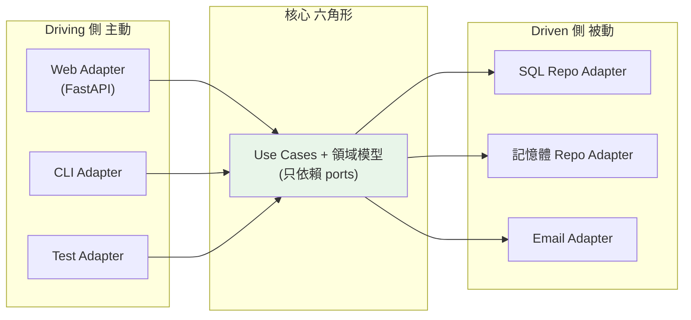

# Hexagonal / Ports & Adapters 架構

> Hexagonal 架構把應用畫成一個六角形：核心在中間，外界（Web、DB、佇列、測試）透過「ports（介面）」與「adapters（實作）」接入。核心不知道外界是什麼，因此任何外界都能插拔、替換、測試。這是 Clean Architecture 的一種具體形態。

## 💡 白話導讀（建議先讀）

想像你的業務核心是一台**主機**，機殼四周全是**標準插孔**——
HDMI、USB、網路孔。任何合規格的裝置都能插上：螢幕、鍵盤、印表機。
主機不在乎插的是哪牌螢幕；規格對了就能用。

Hexagonal（六角形）架構就這一句話：

- **主機**＝業務核心（純 Python，不 import 任何框架）。
- **插孔（Port）**＝核心定義的介面：「我需要一個能存訂單的東西」「我提供下單這個服務」。
- **插頭（Adapter）**＝介面的具體實作：FastAPI 路由、SQL repository、CLI、測試用的假物件。

插孔分兩側：**左側（driving）是外界呼叫核心**——Web、CLI 都只是「觸發用例的不同插頭」；
**右側（driven）是核心呼叫外界**——資料庫、email 都是「被核心使喚的插頭」。

聽起來眼熟？沒錯——它和 [Clean Architecture](02-clean-architecture.md) 是**同一個思想的不同畫法**：
依賴指向核心、細節可替換。六角形的貢獻是把「可插拔」畫得更直白：
**換資料庫＝換插頭；跑測試＝插上測試插頭**，主機永遠不用拆開。

這章用一個完整的 Python 範例把 port/adapter 實際組出來。

## Why（為什麼）

應用的核心業務邏輯，總得和外界打交道：接收 Web 請求、讀寫資料庫、發送訊息、呼叫外部 API。問題是——**如果核心直接依賴這些外部技術（FastAPI、SQLAlchemy、Redis），核心就被綁死**，換技術要動核心、測試要起真實服務。**Hexagonal Architecture（六角形架構，又稱 Ports & Adapters，Alistair Cockburn 提出）** 用一個生動的比喻解決：**把應用畫成六角形，核心在中央，所有與外界的互動都透過「port（埠/介面）」定義，由「adapter（轉接器）」實作**。核心只認識 ports（抽象），不認識 adapters（具體技術）。於是**任何外界都能像插頭一樣插拔**：正式用 PostgreSQL adapter、測試用記憶體 adapter、Web 用 FastAPI adapter、也能加 CLI adapter——核心一行不改。它和 [Clean Architecture](02-clean-architecture.md) 是同一思想（依賴指向核心）的具體形態，常與 [DDD](08-ddd.md) 搭配。

## Theory（理論：ports、adapters、driving vs driven）

六角形的組成：

- **核心（core / 六角形內部）**：業務邏輯、領域模型、use case——純淨、不依賴任何外部技術。
- **Port（埠）**：核心定義的**介面**，描述「核心需要什麼」或「核心提供什麼」。是核心與外界的契約。
- **Adapter（轉接器）**：port 的**具體實作**，連接真實技術（DB、Web 框架、佇列）。

Port 分兩種方向（六角形的「兩側」）：

- **Driving / Primary Port（主動側，左側）**：**外界驅動核心**。使用者/Web/CLI 透過它呼叫核心的 use case。adapter 是「呼叫者」（FastAPI router、CLI）。
- **Driven / Secondary Port（被動側，右側）**：**核心驅動外界**。核心需要存資料/發訊息時透過它。adapter 是「被呼叫者」（SQL repository、email sender）。

**關鍵依賴方向**：driven port 由**核心定義**（核心說「我需要一個能存訂單的東西」），adapter 去實作——**依賴反轉**（見 [DIP](05-solid.md)），依賴指向核心。這就是為什麼核心不依賴 DB：核心只依賴自己定義的 port。

## Specification（規範：port 與 adapter）

```python
from abc import ABC, abstractmethod

# ===== Driven Port（核心定義它需要什麼）=====
class OrderRepository(ABC):          # secondary port
    @abstractmethod
    def save(self, order: Order) -> None: ...
    @abstractmethod
    def get(self, order_id: int) -> Order | None: ...

class NotificationPort(ABC):         # secondary port
    @abstractmethod
    def notify(self, message: str) -> None: ...

# ===== 核心：Use Case（只依賴 ports）=====
class PlaceOrderUseCase:             # 也是一個 primary port 的實作
    def __init__(self, repo: OrderRepository, notifier: NotificationPort) -> None:
        self._repo = repo            # 依賴 port（抽象）
        self._notifier = notifier

    def execute(self, order: Order) -> None:
        self._repo.save(order)
        self._notifier.notify(f"訂單 {order.id} 已成立")

# ===== Driven Adapters（實作 ports，連接真實技術）=====
class SqlOrderRepository(OrderRepository):     # adapter → PostgreSQL
    def save(self, order: Order) -> None: ...  # 真的寫 DB

class EmailNotificationAdapter(NotificationPort):  # adapter → SMTP
    def notify(self, message: str) -> None: ...

# ===== Driving Adapter（呼叫核心）=====
# FastAPI router 收到 HTTP → 呼叫 PlaceOrderUseCase.execute（primary adapter）
```

## Implementation（ports/adapters 拆解、可插拔、可測試）

### Driven Port：核心定義、adapter 實作

核心需要「存訂單」，但不該知道存哪。所以**核心定義 port**，把「怎麼存」外包給 adapter：

```python
# 核心（domain/ports.py）：定義需求（依賴反轉）
class OrderRepository(ABC):
    @abstractmethod
    def save(self, order: Order) -> None: ...

# adapter（adapters/sql_repo.py）：實作需求
class SqlOrderRepository(OrderRepository):
    def __init__(self, conn) -> None:
        self._conn = conn
    def save(self, order: Order) -> None:
        self._conn.execute("INSERT INTO orders ...", ...)   # 真實 DB

# adapter（adapters/memory_repo.py）：測試用
class InMemoryOrderRepository(OrderRepository):
    def __init__(self) -> None:
        self._orders: dict[int, Order] = {}
    def save(self, order: Order) -> None:
        self._orders[order.id] = order
```

核心的 `PlaceOrderUseCase` 只認 `OrderRepository`（port）——**插哪個 adapter 都行**，核心無感。

### Driving Adapter：外界呼叫核心

主動側的 adapter「驅動」核心——不同的進入點（Web、CLI、測試）都透過同一個 use case：

```python
# Web adapter（FastAPI）
@app.post("/orders")
def create_order_endpoint(req: OrderRequest):
    use_case.execute(to_domain(req))       # HTTP → 核心

# CLI adapter（同一個核心，不同進入點）
def cli_create_order(args):
    use_case.execute(parse_args(args))     # CLI → 核心

# 測試 adapter（直接呼叫核心）
def test_place_order():
    use_case.execute(sample_order())       # 測試 → 核心
```

**一個核心、多個 driving adapter**——加 CLI/gRPC/排程觸發，核心不改。

### 可插拔：組裝在最外層

在 composition root（見 [DI](03-dependency-injection.md)）決定用哪些 adapter：

```python
# main.py（組裝）
def build_use_case(env: str) -> PlaceOrderUseCase:
    if env == "prod":
        repo = SqlOrderRepository(pg_conn)
        notifier = EmailNotificationAdapter(smtp)
    else:  # test / dev
        repo = InMemoryOrderRepository()
        notifier = FakeNotificationAdapter()
    return PlaceOrderUseCase(repo, notifier)    # 注入 adapters
```

換環境 = 換 adapter 組合，核心（`PlaceOrderUseCase`）完全不動。這就是「可插拔」的威力。

### 可測試：全部用假 adapter

Hexagonal 讓核心測試極簡單——**所有外部都插假 adapter**，純測業務邏輯：

```text
def test_place_order_notifies():
    repo = InMemoryOrderRepository()
    notifier = FakeNotificationAdapter()          # 記錄通知
    use_case = PlaceOrderUseCase(repo, notifier)

    use_case.execute(Order(id=1, ...))

    assert repo.get(1) is not None                # 有存
    assert "訂單 1 已成立" in notifier.messages    # 有通知
    # 不碰真實 DB/SMTP，飛快、隔離
```

### Hexagonal vs Clean vs 分層

這幾個架構是**同一核心思想的不同表述**（依賴指向核心、核心不依賴技術細節）：

- **分層架構**（見 [分層](01-layered-architecture.md)）：水平層，較基礎，業務仍可能依賴具體資料層。
- **Clean Architecture**（見 [Clean Architecture](02-clean-architecture.md)）：同心圓，強調依賴規則。
- **Hexagonal**：六角形 + ports/adapters，強調「核心與外界的對稱插拔」（driving/driven 兩側）。
- **Onion**：洋蔥圈，也是同心圓變體。

**別糾結名詞差異**——它們的精神一致：**保護核心、依賴反轉、可替換外部、可測試**。Hexagonal 的獨特貢獻是「ports/adapters」的清晰詞彙與「兩側對稱」的視角。

### 務實：不必全套

同 Clean Architecture/DDD——**複雜、長命、需替換外部/嚴格測試的系統值得**；簡單 CRUD 別過度。但「用 port 隔離外部依賴（DB、外部 API）」這個做法，在多數專案都能提升可測試性，值得局部採用。

## Code Example（可執行的 Python 範例）

```python
# hexagonal_demo.py — Ports & Adapters：核心透過 port 與外界解耦（可獨立執行/測試）
from __future__ import annotations

from abc import ABC, abstractmethod
from dataclasses import dataclass


@dataclass
class Order:
    id: int
    amount: int


# ===== Driven Ports（核心定義需要什麼）=====
class OrderRepository(ABC):
    @abstractmethod
    def save(self, order: Order) -> None: ...

    @abstractmethod
    def get(self, order_id: int) -> Order | None: ...


class NotificationPort(ABC):
    @abstractmethod
    def notify(self, message: str) -> None: ...


# ===== 核心 Use Case（只依賴 ports，不知道具體技術）=====
class PlaceOrderUseCase:
    def __init__(self, repo: OrderRepository, notifier: NotificationPort) -> None:
        self._repo = repo
        self._notifier = notifier

    def execute(self, order: Order) -> None:
        self._repo.save(order)
        self._notifier.notify(f"訂單 {order.id} 已成立（金額 {order.amount}）")


# ===== Adapters（實作 ports；正式可換成 SQL/SMTP）=====
class InMemoryOrderRepository(OrderRepository):
    def __init__(self) -> None:
        self._orders: dict[int, Order] = {}

    def save(self, order: Order) -> None:
        self._orders[order.id] = order

    def get(self, order_id: int) -> Order | None:
        return self._orders.get(order_id)


class FakeNotificationAdapter(NotificationPort):
    def __init__(self) -> None:
        self.messages: list[str] = []

    def notify(self, message: str) -> None:
        self.messages.append(message)


def demo() -> None:
    # 組裝：注入 adapters（換環境只改這裡，核心不動）
    repo = InMemoryOrderRepository()
    notifier = FakeNotificationAdapter()
    use_case = PlaceOrderUseCase(repo, notifier)

    # driving adapter 呼叫核心（這裡直接呼叫模擬）
    use_case.execute(Order(id=1, amount=3800))

    print(f"已存訂單: {repo.get(1)}")
    print(f"發出的通知: {notifier.messages}")

    print("\n重點：核心只依賴 ports(介面)；adapters 可插拔(SQL/記憶體、SMTP/假)、可測試")


if __name__ == "__main__":
    demo()
```

**預期輸出**：

```pycon
$ python hexagonal_demo.py
已存訂單: Order(id=1, amount=3800)
發出的通知: ['訂單 1 已成立（金額 3800）']

重點：核心只依賴 ports(介面)；adapters 可插拔(SQL/記憶體、SMTP/假)、可測試
```

## Diagram（圖解：六角形 ports & adapters）



## Best Practice（最佳實踐）

- **核心透過 ports（介面）與外界互動**：core 只依賴 port，不依賴 FastAPI/SQLAlchemy 等技術。
- **driven port 由核心定義、adapter 實作**（依賴反轉，見 [DIP](05-solid.md)）：依賴指向核心。
- **一個核心、多個 driving adapter**（Web/CLI/排程）：加進入點不改核心。
- **一個 port、多個 driven adapter**（SQL/記憶體/假）：換技術、測試只換 adapter。
- **在 composition root 組裝 adapters**（見 [DI](03-dependency-injection.md)）：依環境注入不同組合。
- **核心測試全插假 adapter**：純業務、飛快、隔離。
- **搭配 DDD 建模核心**（見 [DDD](08-ddd.md)）、與 Clean Architecture 同精神。
- **務實**：複雜系統全套值得；簡單專案至少用 port 隔離外部依賴（DB、外部 API）提升可測試性。

## Common Mistakes（常見誤解）

- **核心 import 框架/ORM**：破壞六角形核心的純淨，綁死技術、難測——最根本的錯。
- **port 由 adapter 那側定義**：依賴沒真的反轉；driven port 該由核心擁有。
- **把業務邏輯寫進 adapter**：adapter 只做技術轉接，業務屬核心。
- **糾結 Hexagonal/Clean/Onion 名詞差異**：精神相同（保護核心、依賴反轉），別為名詞內耗。
- **簡單 CRUD 硬套完整六角形**：過度工程；局部用 port 隔離即可。
- **adapter 洩漏技術細節到核心**（回傳 ORM model、拋框架例外）：用領域物件/領域例外隔離。
- **沒有 composition root，adapter 到處 new**：組裝混亂；集中在最外層注入。

## Interview Notes（面試重點）

- **能說出 Hexagonal（Ports & Adapters）的核心**：核心透過 ports（介面）與外界互動，adapters 實作 ports 連接真實技術，核心不依賴具體技術。
- **能區分 driving/primary port（外界驅動核心，如 Web/CLI）vs driven/secondary port（核心驅動外界，如 DB/email）**，且 driven port 由核心定義（依賴反轉）。
- **能講它帶來的可插拔與可測試**：一核心多進入點、一 port 多實作、測試全插假 adapter。
- **知道 Hexagonal/Clean/Onion/分層是同一思想的不同表述**（依賴指向核心），Hexagonal 的貢獻是 ports/adapters 詞彙與兩側對稱視角。
- **務實觀點**：複雜長命系統值得全套，簡單專案用 port 隔離外部依賴即受用；常與 DDD 搭配。

---

➡️ 下一章：[事件驅動與訊息佇列](10-event-driven-mq.md)

[⬆️ 回 Part 16 索引](README.md)
