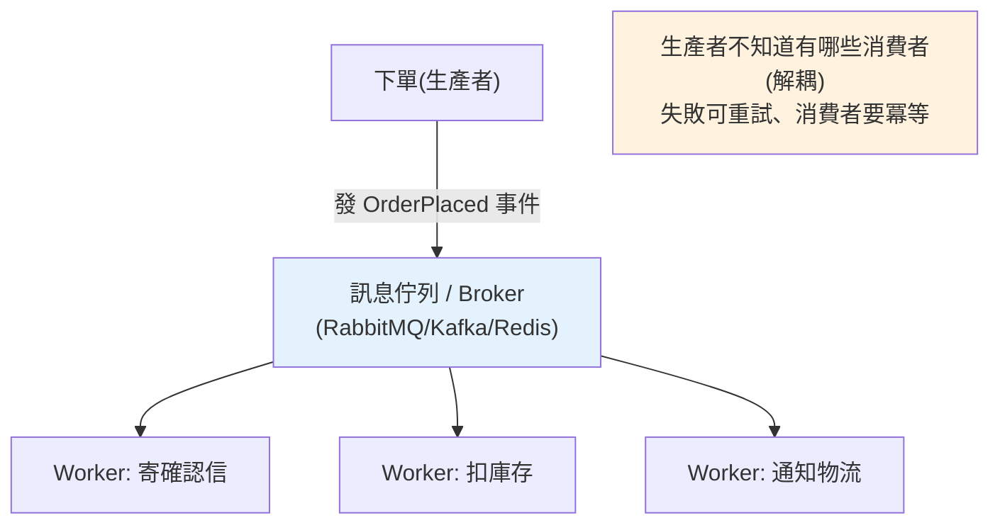

# 事件驅動與訊息佇列

> 「下單後要寄信、扣庫存、通知物流」——若全塞進下單流程同步做，會慢又脆弱（一個掛全掛）。事件驅動架構讓下單只發一個「訂單成立」事件，其他工作各自訂閱、非同步處理。訊息佇列（Celery/RabbitMQ/Kafka）是它的骨幹。

## Why（為什麼）

想像下單流程：建立訂單 → 寄確認信 → 扣庫存 → 通知物流 → 更新推薦。若**同步**依序做，使用者要等全部完成（慢），而且**任一步失敗整個下單就失敗**（寄信服務掛了，訂單也建不成——荒謬），還讓「下單」這個模組知道太多事（耦合）。**事件驅動架構（Event-Driven Architecture）** 換個思路：**下單只做核心的事，然後發出一個「訂單成立」事件；寄信、扣庫存等各自訂閱這個事件、非同步處理**。好處：**下單快（不等後續）、鬆耦合（下單不知道誰在聽）、可靠（後續失敗可重試、不影響下單）、可擴展（各處理器獨立擴展）**。**訊息佇列（message queue）**——Celery、RabbitMQ、Kafka——是這套架構的骨幹：可靠地傳遞事件/任務給獨立的 worker。這是現代分散式系統（見 [分散式](../22-distributed-systems/README.md)、[微服務](../21-microservices/README.md)）的核心模式。

## Theory（理論：非同步、解耦、pub/sub vs 佇列）

事件驅動的核心是**用「事件」解耦「發生的事」與「對它的反應」**：

- **生產者（producer）** 發出事件/訊息，不知道也不關心誰會處理。
- **訊息佇列/broker** 可靠地儲存並傳遞訊息。
- **消費者（consumer / worker）** 訂閱並處理，獨立於生產者。

兩種主要模式：

- **工作佇列（task queue / point-to-point）**：一個任務**被一個** worker 處理（分工）。多個 worker 分擔任務（負載平衡）。典型：Celery + RabbitMQ 處理背景任務（寄信、轉檔）。
- **發布訂閱（pub/sub）**：一個事件**被多個**訂閱者各自處理（廣播）。典型：Kafka——「訂單成立」事件被寄信、庫存、分析多個服務各自消費。

**同步 vs 非同步的關鍵差異**：同步是「呼叫並等結果」（緊耦合、即時、失敗即時反映）；非同步是「發出訊息就走」（鬆耦合、最終完成、失敗可重試但非即時）。事件驅動用非同步換取解耦、可靠、可擴展——代價是**最終一致性**（見 [分散式](../22-distributed-systems/README.md)）與複雜度。

## Specification（規範：Celery 任務與事件）

```python
# --- Celery：分散式任務佇列 ---
from celery import Celery

app = Celery("tasks", broker="redis://localhost:6379/0")

@app.task
def send_email(to: str, body: str) -> None:
    # 這個函式會在獨立的 worker 行程執行（非同步）
    smtp_send(to, body)

# 生產者：發任務（不等它完成，立刻返回）
send_email.delay("a@b.com", "訂單已成立")     # .delay() 排入佇列

# --- 事件驅動：發事件、多訂閱者 ---
def place_order(order: Order) -> None:
    save_order(order)                          # 核心：建立訂單
    emit_event("OrderPlaced", order.id)        # 發事件，不管誰處理

# 各處理器訂閱（獨立、非同步）
@on_event("OrderPlaced")
def send_confirmation(order_id): ...

@on_event("OrderPlaced")
def reduce_inventory(order_id): ...
```

## Implementation（任務佇列、事件、可靠性、Celery/RabbitMQ/Kafka）

### 任務佇列：背景處理

最常見的用法——把「慢、可稍後做」的工作丟給背景 worker（比 FastAPI `BackgroundTasks` 更可靠，見 [async Web](../14-web/12-async-web-background.md)）：

```python
@app.task(bind=True, max_retries=3)
def process_video(self, video_id: int) -> None:
    try:
        transcode(video_id)          # 重工作，在 worker 執行
    except TranscodeError as exc:
        raise self.retry(exc=exc, countdown=60)   # 失敗自動重試

# API 端點：立刻回應，工作丟背景
@app.post("/videos")
def upload_video(file: UploadFile):
    video_id = save(file)
    process_video.delay(video_id)    # 排入佇列，不等轉檔
    return {"id": video_id, "status": "processing"}
```

使用者立刻收到回應，轉檔在獨立 worker 進行、失敗可重試——**可靠、可監控、可獨立擴展 worker 數量**。這是重背景任務的正解（`BackgroundTasks` 只適合輕量、與請求同生命週期的工作）。

### 事件驅動：一對多解耦

用事件讓多個模組對「同一件事」各自反應，彼此不知道對方存在（[Observer](06-design-patterns.md) 模式的分散式版）：

```python
# 生產者只發事件，完全不知道有哪些訂閱者
def place_order(order: Order) -> None:
    order_repo.save(order)
    event_bus.publish(OrderPlaced(order_id=order.id, amount=order.amount))

# 各訂閱者獨立處理（可在不同服務/worker）
@subscribe(OrderPlaced)
def send_confirmation_email(event: OrderPlaced): ...

@subscribe(OrderPlaced)
def update_inventory(event: OrderPlaced): ...

@subscribe(OrderPlaced)
def notify_analytics(event: OrderPlaced): ...

# 加新反應（如「發優惠券」）= 加新訂閱者，不改 place_order（符合 OCP）
```

**解耦的威力**：新增「訂單成立要做的事」，只需加訂閱者，下單流程一行不改。這也是 [微服務](../21-microservices/README.md) 間協作的主要方式（服務發事件、其他服務訂閱）。

### 可靠性：訊息佇列要處理的難題

分散式訊息傳遞有幾個必須面對的問題：

- **至少一次投遞（at-least-once）**：broker 保證訊息不丟，但可能**重複投遞**（網路重試）——所以**消費者要冪等（idempotent）**：同一訊息處理兩次結果一樣（如用訊息 id 去重）。
- **重試與死信佇列（DLQ）**：處理失敗自動重試；反覆失敗的訊息進「死信佇列」人工檢查，不無限卡住。
- **順序**：多數佇列不保證全域順序（Kafka 在單一 partition 內保證）——設計時別假設順序。
- **背壓（backpressure）**：消費速度跟不上生產時的處理（緩衝、限流）。

**冪等性是重點**——因為「至少一次」意味著可能重複，消費者必須能安全地重複處理。

### Celery / RabbitMQ / Kafka 怎麼選

| 工具 | 定位 | 適合 |
|------|------|------|
| **Celery** | Python 的分散式任務佇列框架 | 背景任務（寄信、轉檔、定時任務），Python 生態 |
| **RabbitMQ** | 訊息 broker（AMQP） | 可靠的任務佇列、複雜路由、point-to-point |
| **Kafka** | 分散式事件串流平台 | 高吞吐事件流、pub/sub、事件溯源、多消費者重播 |
| **Redis** | 也能當輕量 broker（見 [Redis](../15-database/18-redis.md)） | 簡單佇列、Celery broker |

**經驗法則**：Python 背景任務用 **Celery**（broker 可用 RabbitMQ/Redis）；高吞吐事件串流、多消費者、需重播用 **Kafka**；簡單需求 Redis 佇列就夠。

### 別過度事件化

事件驅動增加複雜度（非同步除錯難、最終一致、要處理重複/失敗）。**不是所有東西都該事件化**：核心的、需要即時一致的操作（如「扣款必須成功才算下單」）該同步；**可稍後做、能容忍最終一致的**（寄信、通知、分析）才適合非同步事件。混用：核心同步、周邊事件驅動。

## Code Example（可執行的 Python 範例）

```python
# event_driven_demo.py — 事件匯流排 + 冪等消費者（可獨立執行/測試）
from __future__ import annotations

from collections.abc import Callable
from dataclasses import dataclass


@dataclass(frozen=True)
class OrderPlaced:
    event_id: str
    order_id: int
    amount: int


class EventBus:
    """簡易事件匯流排：發布訂閱（一對多）。"""

    def __init__(self) -> None:
        self._subscribers: dict[str, list[Callable]] = {}

    def subscribe(self, event_type: str, handler: Callable) -> None:
        self._subscribers.setdefault(event_type, []).append(handler)

    def publish(self, event_type: str, event: object) -> None:
        for handler in self._subscribers.get(event_type, []):
            handler(event)  # 各訂閱者各自處理（這裡同步模擬；真實是非同步 worker）


class IdempotentEmailHandler:
    """冪等消費者：同一事件處理兩次也只寄一次（處理至少一次投遞的重複）。"""

    def __init__(self) -> None:
        self.sent: list[int] = []
        self._processed: set[str] = set()

    def handle(self, event: OrderPlaced) -> None:
        if event.event_id in self._processed:
            return  # 已處理過，去重（冪等）
        self._processed.add(event.event_id)
        self.sent.append(event.order_id)


def demo() -> None:
    bus = EventBus()
    email = IdempotentEmailHandler()
    inventory_log: list[int] = []

    # 多個訂閱者對同一事件各自反應（解耦）
    bus.subscribe("OrderPlaced", email.handle)
    bus.subscribe("OrderPlaced", lambda e: inventory_log.append(e.order_id))

    # 下單只發事件（不知道有哪些訂閱者）
    event = OrderPlaced(event_id="evt-1", order_id=100, amount=3800)
    bus.publish("OrderPlaced", event)
    print(f"發事件後 → 寄信: {email.sent}, 扣庫存: {inventory_log}")

    # 至少一次投遞：同一事件重複投遞，冪等消費者只處理一次
    bus.publish("OrderPlaced", event)  # 重複！
    print(f"重複投遞後 → 寄信: {email.sent}（冪等，沒重複寄）")

    print("\n重點：事件解耦生產者與消費者；至少一次投遞 → 消費者要冪等")


if __name__ == "__main__":
    demo()
```

**預期輸出**：

```pycon
$ python event_driven_demo.py
發事件後 → 寄信: [100], 扣庫存: [100]
重複投遞後 → 寄信: [100]（冪等，沒重複寄）

重點：事件解耦生產者與消費者；至少一次投遞 → 消費者要冪等
```

## Diagram（圖解：事件驅動流程）



## Best Practice（最佳實踐）

- **可稍後做、能容忍最終一致的工作用事件/任務佇列**：寄信、轉檔、通知、分析——非同步、不阻塞主流程。
- **重背景任務用 Celery（+ RabbitMQ/Redis broker）**，別用 `BackgroundTasks`（見 [async Web](../14-web/12-async-web-background.md)）：可靠、可重試、可監控、可擴展。
- **消費者要冪等**：因為「至少一次投遞」可能重複——用訊息 id 去重。
- **設重試 + 死信佇列**：失敗自動重試、反覆失敗進 DLQ 人工處理。
- **用事件解耦一對多**：加新反應 = 加訂閱者，不改生產者（符合 [OCP](05-solid.md)）。
- **選對工具**：Python 背景任務 Celery、高吞吐事件流 Kafka、簡單需求 Redis 佇列。
- **別假設訊息順序/不重複**：設計成順序無關、可重複安全。
- **別過度事件化**：核心即時一致的操作同步做；周邊才事件驅動。

## Common Mistakes（常見誤解）

- **把需要即時一致的核心操作做成非同步事件**：如「扣款」丟事件，導致下單顯示成功但實際失敗——核心一致操作該同步。
- **消費者不冪等**：至少一次投遞重複處理 → 重複寄信/重複扣款；用 id 去重。
- **不處理失敗**：訊息處理失敗就丟失或無限重試卡住；設重試 + DLQ。
- **假設訊息有序/不重複**：多數佇列不保證；設計成順序無關、可重複安全。
- **重背景任務用 FastAPI `BackgroundTasks`**：與請求同生命週期、伺服器重啟丟失；用 Celery。
- **過度事件化簡單流程**：三步流程硬拆事件，除錯困難、最終一致沒必要。
- **忽略監控**：非同步任務失敗默默發生；要監控佇列長度、失敗率、DLQ。

## Interview Notes（面試重點）

- **能說出事件驅動的核心價值**：用事件解耦「發生的事」與「反應」——主流程快、鬆耦合、可靠（可重試）、可擴展；代價是最終一致與複雜度。
- **能區分工作佇列（point-to-point，一任務一 worker，分工）vs pub/sub（一事件多訂閱者，廣播）**，並各舉工具（Celery/RabbitMQ vs Kafka）。
- **知道「至少一次投遞 → 消費者要冪等」** 是關鍵，能講重試、死信佇列、順序不保證。
- **能對比 Celery/RabbitMQ/Kafka 的定位與選擇**（Python 背景任務 / 可靠佇列 / 高吞吐事件流）。
- **務實觀點**：核心即時一致操作同步、周邊非同步；別過度事件化；能連結微服務協作、分散式最終一致、Observer 模式。

---

➡️ 下一章：[設定管理與環境變數](11-config-management.md)

[⬆️ 回 Part 16 索引](README.md)
