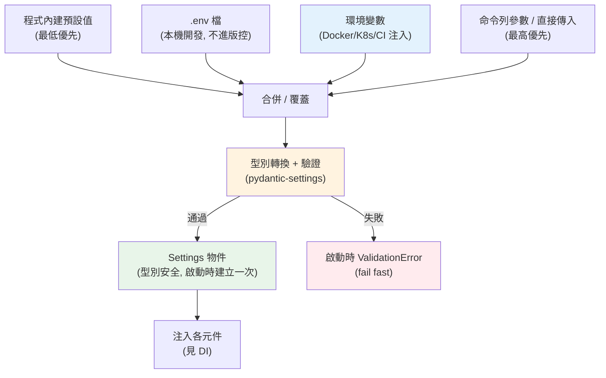

# 設定管理與環境變數

> 資料庫密碼、API 金鑰、開關參數該放哪？寫死在程式裡會出大事。這章講設定管理的核心原則——**設定與程式分離、依環境注入、用型別驗證**——以及 Python 的實務做法：`os.environ`、`.env` 檔、`pydantic-settings`。

## 💡 白話導讀（建議先讀）

程式是人，設定是**依場合換的衣服**：上班（prod）穿正裝、在家（dev）穿睡衣。
衣服要能換，就不能**紋在身上**——資料庫密碼寫死在程式碼裡，就是紋身：
想換得動手術（改碼重新部署），而且脫不掉（密碼永遠留在 git 歷史裡，洩漏就是事故）。

判斷「什麼算設定」只有一條準則：**會隨部署環境不同而不同的值,就是設定**。
連線字串、API 金鑰、log 等級——dev/staging/prod 各不同，抽出去；
業務常數（如「運費滿千免運」）不隨環境變，留在程式裡。

一個快速自檢：**「這份程式碼現在能開源嗎？」**——不能，就代表有機密紋在身上。

放哪裡？由差到好：

1. 寫死在程式碼 🔴（改要重部署、機密進版控）
2. 設定檔（怕被誤 commit、環境對應易亂）
3. **環境變數** ✅（12-factor 標準做法：程式碼同一份，環境給不同的變數）

Python 的現代標配是 **pydantic-settings**：定義一個帶型別的 Settings 類別，
自動從環境變數／`.env` 讀值、**啟動時就驗證**（少個必填值直接開機失敗，
而不是跑到半夜才炸）。這章從原則講到完整實作。

## Why（為什麼）

同一份程式，在你的筆電、測試機、正式環境要連**不同的資料庫**、用**不同的金鑰**、開**不同的除錯模式**。這些「隨環境改變的值」就是**設定（configuration）**。

沒有好的設定管理，你會遇到：

- **把密碼、金鑰寫死在程式裡**：一 push 上 GitHub，金鑰就外洩了（爬蟲幾分鐘內就會掃到）。這是最常見也最嚴重的資安事故（見 [資安](../20-security-system-design/README.md)）。
- **改設定要改程式、重新部署**：想把 log 等級從 `INFO` 調成 `DEBUG`，竟要改 code、重新打包——設定和程式綁死。
- **各環境行為不一致、難重現**：正式環境出包，本地卻復現不出來，因為設定散落各處、沒人說得清正式環境到底吃了什麼值。
- **設定沒驗證，錯到執行期才爆**：把 `PORT` 打成 `"eighty"`、忘了設 `DATABASE_URL`，程式跑到一半才 crash，而非啟動時就明確報錯。

好的設定管理讓你：**同一份不可變的程式（build 一次），靠外部注入不同設定跑遍所有環境**；密鑰不進版控；設定在**啟動時就被驗證**（型別對、必填有）。這正是 [12-factor](../19-cloud-native/README.md) 的核心主張之一，也是可部署、可維運服務的基礎。

## Theory（理論：設定與程式分離）

核心原則一句話：**設定要與程式碼嚴格分離（strict separation of config from code）**。

判斷「什麼是設定」的準則：**凡是會隨部署環境（deploy）而不同的值，就是設定**。資料庫連線字串、外部服務金鑰、開關（feature flag）、log 等級、埠號——這些在 dev/staging/prod 會不一樣，屬於設定。而「不隨環境變的東西」（如路由規則、業務常數）則屬於程式，不該塞進設定。

一個檢驗法：**「現在能不能把這份程式碼開源，而不洩漏任何機密？」** 如果不行，代表有機密寫死在程式裡——那些就該抽成設定。

設定「放哪」有幾種來源，由不推薦到推薦：

- **寫死在程式碼**：最糟。改要重新部署、機密進版控。
- **設定檔（`config.ini` / `settings.py` / `config.yaml`）**：比寫死好，但含機密的設定檔仍可能被 commit；且「哪個檔對應哪個環境」易混亂。
- **環境變數（environment variables）**：12-factor 推薦的做法。設定活在**環境**裡而非檔案裡——語言/OS 中立、不易誤入版控、部署平台（Docker、K8s、雲）原生支援。
- **祕密管理系統（secrets manager）**：機密（密碼、金鑰）進一步交給 Vault、雲端 Secrets Manager 管理，程式在啟動時取出注入環境。這是機密的最佳解（見 [資安](../20-security-system-design/README.md)）。

實務上常**分層疊加**：程式內建預設值 → 設定檔 → 環境變數 → 命令列參數，後者覆蓋前者。

## Specification（規範：Python 讀設定的介面）

Python 讀設定的核心工具：

- **`os.environ`**：一個 `dict[str, str]`，映射目前行程的環境變數。
  - `os.environ["KEY"]`：取值，不存在會 `raise KeyError`（用於「必填」設定）。
  - `os.environ.get("KEY", default)`：取值，不存在回 `default`（用於「選填」設定）。
  - `os.getenv("KEY", default)`：等同 `os.environ.get`。
  - **環境變數的值永遠是字串**——要 `int`/`bool` 得自己轉型與驗證。
- **`.env` 檔**：本機開發用的環境變數檔（`KEY=value` 每行一筆），由 `python-dotenv` 或 `pydantic-settings` 載入。**`.env` 必須列入 `.gitignore`，絕不 commit**。
- **`pydantic-settings`**（`BaseSettings`）：實務首選。定義一個帶**型別註解**的設定類別，它自動從環境變數/`.env` 讀值、**轉型、驗證**，缺必填就在啟動時明確報錯。

字串轉 `bool` 是常見陷阱：`bool("false")` 是 `True`（非空字串皆為真）！必須明確判斷字串內容，這也是為何要用 `pydantic-settings` 幫你處理。

## Implementation（底層如何運作）

### 環境變數從哪來

環境變數是**作業系統層級**的鍵值對，由父行程傳給子行程。當你 `export DATABASE_URL=...` 再啟動 Python，該行程的 `os.environ` 就會有這個值。Docker 的 `-e`/`environment:`、K8s 的 `env`/`envFrom`、CI 的 secrets、雲平台的設定面板——本質都是「在啟動行程前把值塞進環境」。程式因此**完全不需要知道值從哪來**，只管讀 `os.environ`——這就是設定與程式分離的落地方式。

### 純 stdlib 的型別化設定

不裝任何套件也能做出型別化、會驗證的設定——手動讀、轉型、驗證：

```python
import os
from dataclasses import dataclass

@dataclass(frozen=True)   # frozen：設定不可變，避免執行期被亂改
class Settings:
    database_url: str
    port: int
    debug: bool

def load_settings() -> Settings:
    try:
        database_url = os.environ["DATABASE_URL"]   # 必填，缺就 KeyError
    except KeyError:
        raise RuntimeError("缺少必要設定 DATABASE_URL") from None
    return Settings(
        database_url=database_url,
        port=int(os.getenv("PORT", "8000")),                 # 手動轉 int
        debug=os.getenv("DEBUG", "false").lower() == "true", # 手動且正確地轉 bool
    )
```

缺點：轉型/驗證都要手寫、易漏、易錯（尤其 bool）。所以實務用 `pydantic-settings`。

### `pydantic-settings`：實務首選

`pydantic-settings`（Pydantic v2 的設定套件，`pip install pydantic-settings`）讓你用**型別註解**宣告設定，其餘自動化：

```python
from pydantic import Field
from pydantic_settings import BaseSettings, SettingsConfigDict

class Settings(BaseSettings):
    model_config = SettingsConfigDict(
        env_file=".env",          # 自動載入 .env（本機開發）
        env_prefix="APP_",        # 只讀 APP_ 開頭的環境變數（避免撞名）
    )

    database_url: str                       # 必填：缺了啟動就 ValidationError
    port: int = 8000                        # 選填：有預設值
    debug: bool = False                     # 字串 "true"/"1"/"yes" 都能正確轉 bool
    secret_key: str = Field(min_length=16)  # 帶驗證規則

settings = Settings()   # 一行完成：讀環境/.env → 轉型 → 驗證
```

它自動做到：

- **從環境變數與 `.env` 讀值**（環境變數優先於 `.env`）。
- **依型別註解轉型**（字串 `"8000"` → `int` 8000、`"true"` → `bool` True，且 bool 判斷正確）。
- **驗證**：型別不符、缺必填、違反 `Field` 規則 → **啟動時**拋 `ValidationError`（fail fast），而非執行期才炸。
- **巢狀設定、`SecretStr`**（避免機密被印進 log）等進階功能。

這把「設定」變成一個**型別安全、經驗證、集中定義**的物件。

### 設定來源的優先順序

多來源時要有明確覆蓋規則。`pydantic-settings` 預設優先序（高 → 低）：

1. 初始化時直接傳入的參數
2. **環境變數**
3. `.env` 檔
4. 類別定義的**預設值**

高優先者覆蓋低優先者——所以正式環境用「環境變數」就能蓋掉 `.env` 與預設值，不必改程式。

### 設定物件怎麼給程式用

建好的 `settings` 物件應該**在啟動時建立一次**（composition root，見 [DI](03-dependency-injection.md)），再**注入**需要它的元件，而不是讓各模組各自 `os.getenv`。集中化的好處：來源單一、好測試（測試時傳入假設定）、依賴清楚（見 [專案結構](07-project-structure.md) 的 `config.py`）。

## Code Example（可執行的 Python 範例）

以下用純 stdlib 實作一個「型別化、會驗證、可分層覆蓋」的設定載入器，不需安裝任何套件即可執行，輸出可預期：

```python
# config_demo.py — 型別化設定載入與驗證（純 stdlib，可獨立執行/測試）
from __future__ import annotations

from dataclasses import dataclass


def to_bool(value: str) -> bool:
    """正確地把字串轉 bool——別用 bool(str)（非空字串永遠是 True）。"""
    return value.strip().lower() in {"1", "true", "yes", "on"}


@dataclass(frozen=True)
class Settings:
    database_url: str
    port: int
    debug: bool


def load_settings(env: dict[str, str]) -> Settings:
    """從一個「環境字典」載入設定：必填檢查 + 轉型 + 驗證。"""
    # 必填：缺就明確報錯（fail fast，啟動時就爆而非執行期）
    if "DATABASE_URL" not in env:
        raise ValueError("缺少必要設定 DATABASE_URL")

    # 選填帶預設值 + 轉型 + 驗證
    try:
        port = int(env.get("PORT", "8000"))
    except ValueError:
        raise ValueError(f"PORT 必須是整數，得到 {env.get('PORT')!r}") from None
    if not (1 <= port <= 65535):
        raise ValueError(f"PORT 超出範圍：{port}")

    return Settings(
        database_url=env["DATABASE_URL"],
        port=port,
        debug=to_bool(env.get("DEBUG", "false")),
    )


def demo() -> None:
    # 陷阱示範：bool(str) 對設定是錯的
    print(f'bool("false") = {bool("false")}   ← 錯！非空字串都是 True')
    print(f'to_bool("false") = {to_bool("false")}   ← 對')

    # 分層覆蓋：預設 ← .env ← 環境變數（後者蓋前者）
    defaults = {"PORT": "8000", "DEBUG": "false"}
    dotenv = {"DATABASE_URL": "sqlite:///dev.db", "DEBUG": "true"}
    os_environ = {"PORT": "5432"}  # 正式環境用環境變數覆蓋
    merged = {**defaults, **dotenv, **os_environ}
    settings = load_settings(merged)
    print(f"\n合併後設定：{settings}")

    # 驗證失敗：缺必填
    try:
        load_settings({"PORT": "8000"})
    except ValueError as exc:
        print(f"\n缺必填時：{exc}")

    # 驗證失敗：型別錯
    try:
        load_settings({"DATABASE_URL": "x", "PORT": "eighty"})
    except ValueError as exc:
        print(f"型別錯時：{exc}")


if __name__ == "__main__":
    demo()
```

**預期輸出**：

```pycon
$ python config_demo.py
bool("false") = True   ← 錯！非空字串都是 True
to_bool("false") = False   ← 對

合併後設定：Settings(database_url='sqlite:///dev.db', port=5432, debug=True)
缺必填時：缺少必要設定 DATABASE_URL
型別錯時：PORT 必須是整數，得到 'eighty'
```

逐段解說：

- `to_bool`：示範「字串轉 bool 必須看內容」，而非用 `bool(str)`——這是設定管理最常見的坑。
- `load_settings`：對必填做存在檢查、對選填給預設值、對每個值轉型並驗證範圍——**任何錯誤都在載入時（啟動時）明確拋出**，這就是 fail fast。
- `demo` 的合併：`{**defaults, **dotenv, **os_environ}` 展示分層覆蓋——`PORT` 最終取自 `os_environ`（5432）、`DEBUG` 取自 `dotenv`（true），對應 `pydantic-settings` 的優先序。
- 兩個 `try/except`：驗證缺必填與型別錯都會被擋下並清楚說明——正式環境絕不會「帶著錯設定默默跑起來」。

實務上把上面的手寫邏輯換成 `pydantic-settings` 的 `BaseSettings` 即可——同樣的觀念，交給套件處理轉型與驗證。

## Diagram（圖解：設定來源與優先順序）



## Best Practice（最佳實踐）

- **設定與程式嚴格分離**：凡隨環境變的值都抽成設定，靠環境變數注入（見 [12-factor](../19-cloud-native/README.md)）。
- **機密絕不進版控**：`.env` 列入 `.gitignore`；正式環境的機密用環境變數或 secrets manager（見 [資安](../20-security-system-design/README.md)）。
- **用 `pydantic-settings` 做型別化、會驗證的設定**：轉型自動、缺必填/型別錯在啟動時 fail fast。
- **設定集中定義（`config.py`）、啟動時建立一次、注入使用**（見 [DI](03-dependency-injection.md)、[專案結構](07-project-structure.md)），別讓各模組散落 `os.getenv`。
- **提供 `.env.example`**（列出所有設定鍵、不含真值）進版控，讓新人知道要設哪些。
- **選填給合理預設、必填就強制**：缺必填要明確報錯而非用危險的預設。
- **正確轉 bool**：看字串內容，別用 `bool(str)`。
- **用 `SecretStr` 之類包裝機密**：避免密碼被印進 log / traceback。

## Common Mistakes（常見誤解）

- **把金鑰/密碼寫死在程式或 commit `.env`**：最嚴重的資安事故；一旦 push 就視同外洩，要立刻輪替金鑰。
- **`bool(os.getenv("DEBUG"))` 判斷開關**：`"false"` 是非空字串 → `True`，永遠開著。要比對內容。
- **忘了環境變數都是字串**：`os.getenv("PORT") + 1` 會 `TypeError`；要先 `int(...)`。
- **設定沒驗證、錯到執行期才爆**：啟動時就該驗證（fail fast），別讓錯設定潛伏到半夜出包。
- **各模組各自 `os.getenv`**：來源散落、難測難維護；集中到一個設定物件注入。
- **不同環境用「改程式裡的 if」切換**（`if env == "prod"`）：又把設定綁回程式；用外部注入。
- **把「不該是設定」的東西塞進環境變數**：業務常數、路由規則屬程式，別過度設定化。
- **沒有 `.env.example`**：新人不知道要設哪些變數，本地跑不起來。

## Interview Notes（面試重點）

- **能說出「設定與程式分離」的原則與判準**：凡隨部署環境改變的值就是設定；檢驗法是「能否開源而不洩漏機密」。連結 [12-factor](../19-cloud-native/README.md) 的「store config in the environment」。
- **知道為何用環境變數而非設定檔**：語言/OS 中立、不易誤入版控、部署平台原生支援、同一 build 跑遍所有環境。
- **能講 `pydantic-settings` 的價值**：型別註解 → 自動轉型 + 驗證 + fail fast，勝過手寫 `os.getenv`。
- **知道字串轉 bool 的陷阱**（`bool("false") == True`）與環境變數皆為字串。
- **能講機密管理**：`.env` 進 `.gitignore`、正式環境用環境變數 / secrets manager、`SecretStr` 避免洩漏、外洩要輪替。
- **知道設定的優先順序**（預設 < .env < 環境變數 < 直接傳入）與「集中定義、啟動時建立一次、注入使用」（連結 [DI](03-dependency-injection.md)）。

---

⬅️ 這是 Part 16 的最後一章。

[⬆️ 回 Part 16 索引](README.md) ｜ [下一 Part：資料處理與科學計算 ➡️](../17-data-science/README.md)
