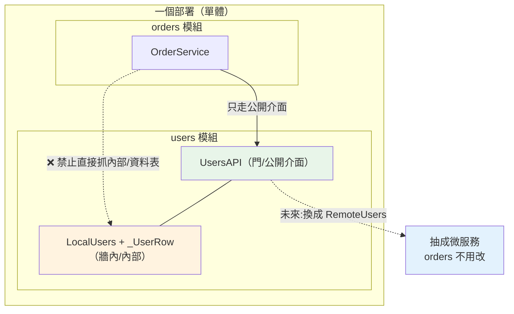

# 模組化單體 Modular Monolith

> 「先別拆微服務」大家都會說,但下一句「那要怎麼做?」常常沒人接。答案就是模組化單體:一個部署單元,內部卻切成邊界分明的模組——享受單體的簡單,又為未來拆分預留接縫。

## 💡 白話導讀（建議先讀）

你大概聽過兩種極端。一端是**大泥球單體(big ball of mud)**:所有功能糊成一團,`orders` 的程式碼直接
`import` 進 `users` 的資料表、隨手改別人的 model——改一個小地方,不知道會弄壞哪三個角落。
另一端是**微服務**:每個功能拆成獨立部署的服務,乾淨是乾淨了,但你換來一整套[分散式系統的複雜度](../21-microservices/01-microservices-intro.md)
(網路會失敗、要處理最終一致、跨服務除錯像拼圖)。

**模組化單體(modular monolith)是中間那條路,而且對絕大多數團隊是最好的起點。**

它的定義只有一句話:**「部署上是一個單體,程式碼裡卻是好幾個邊界分明的模組。」**

用一個生活比喻:**一棟有隔間的房子。** 大泥球單體是**沒有牆的大套房**——床、廚房、廁所全擠一起,
一處漏水全屋遭殃。微服務是**一整個社區的獨棟房子**——各自獨立,但你要走去鄰居家得出門、過馬路(跨網路)。
模組化單體是**一棟公寓裡的隔間**:還是同一棟(一個部署、一個行程),但每個房間有自己的牆和門
(模組邊界)——你要用廚房的東西,得走「門」(公開介面),不能直接砸穿牆壁。

那道「牆」在程式裡是什麼?就是**模組只透過對方的「公開介面」往來,絕不伸手進對方的內部**。
`orders` 想知道使用者名字,只能呼叫 `users` 模組**公開的那個函式**,不能直接 `import` `users` 的
資料表或 model 自己去撈。牆守住了,兩個好處就來了:

1. **改一個模組不會震動全屋**——因為別人只依賴你的「門」(介面),不依賴你的「傢俱擺設」(內部實作)。
2. **未來要拆微服務,接縫已經留好**——把 `users` 模組那道「門」後面的實作從「同行程直接呼叫」換成「打 HTTP」,
   `orders` **一行都不用改**。這章的可執行範例會真的示範這一點。

所以模組化單體不是「還沒進化成微服務的半成品」,它是一個**深思熟慮的選擇**:先用一個部署的簡單,
養好乾淨的模組邊界;哪天真的某個模組痛了(要獨立擴充、獨立部署),再沿著預留的接縫把它抽出去。
**「先模組化單體,痛了再拆」——這是近年業界從微服務狂熱回擺後的主流共識。**

## 🎯 什麼時候會用到

- **幾乎所有新專案的起點**:團隊還不大、領域邊界還在摸索時,別一開始就拆微服務——用模組化單體。
- **想要「單體的簡單」+「乾淨的邊界」**:一個部署、一次交易、一套除錯,但程式碼不糊成一團。
- **預期未來會長大、可能要拆**:先把模組邊界切好,把「之後要獨立的部分」預留成接縫。
- **從大泥球單體救火**:既有單體太亂,想漸進整理——先劃出模組邊界,是通往可維護(甚至可拆分)的第一步。
- **面試被問**:「你會怎麼開一個新後端專案?一開始就上微服務嗎?」——標準好答案就是它。

## Why（為什麼）

因為**「微服務的好處(邊界清楚)」和「微服務的代價(分散式複雜度)」其實可以拆開**。

- **邊界清楚**這件事,靠的是**程式碼的模組化**,不是「拆成不同行程」。你在同一個單體裡就能有清楚的模組邊界。
- **分散式複雜度**(網路失敗、最終一致、跨服務交易、分散式追蹤)是「拆成不同行程」才被迫承受的代價。

微服務把這兩件事**綁在一起賣**——你想要邊界清楚,就得連分散式複雜度一起買單。模組化單體**把它們解綁**:
**先只買「邊界清楚」,不買「分散式複雜度」**。等到某個模組真的需要獨立部署 / 擴充(這才是拆分的正當理由),
再針對**那一個**模組付出分散式的代價。

沒有模組化這一步就直接上微服務,你會得到最糟的組合:**分散式的大泥球**——邊界沒切好、又背了滿身分散式複雜度,
跨服務改一個功能要動三個 repo、還沒有交易保證。這就是 [Part 21](../21-microservices/01-microservices-intro.md) 反覆強調「先別拆」的原因。

## Theory（理論：三種形態的光譜）

```text
大泥球單體          模組化單體               微服務
─────────         ─────────               ─────────
一個部署           一個部署                 多個部署
❌ 無邊界          ✅ 強模組邊界            ✅ 服務邊界(+網路)
模組互相亂抓        模組只走公開介面          服務只走網路 API
一次交易           一次交易                 ❌ 只有最終一致
好除錯             好除錯                   ❌ 要分散式追蹤
→ 難維護           → 好維護、可演進          → 團隊自治、獨立擴充
                                          但背分散式複雜度
```

**模組化單體的四條規則**:

1. **按領域(business capability)切模組**,不是按技術層——是 `users/`、`orders/`、`payments/`,
   不是把全部 model 堆一包、全部 service 堆一包(呼應 [ch07 按功能組織](07-project-structure.md)、[ch08 DDD 的 bounded context](08-ddd.md))。
2. **每個模組有「公開介面」與「內部實作」**:公開的是幾個函式 / 一個 facade;內部的 model、資料表、
   私有類別(前底線)**外部不准碰**。
3. **模組間只透過公開介面往來**,而且最好靠 [DI](03-dependency-injection.md) 注入依賴——`orders` 依賴的是
   `UsersAPI` 這個介面([Protocol](../05-typing/06-protocol.md)),不是 `users` 的具體類別。
4. **資料也要有邊界**:可以共用一個資料庫,但**每個模組管自己的表**,不跨模組直接 `JOIN` 別人的表
   ——要別人的資料,走那個模組的公開介面。這是「未來能拆」的關鍵前提。

守住這四條,你的單體在**邏輯上**已經是一組微服務,只差還沒拆成不同行程。

## Specification（規範：邊界怎麼落實）

| 要素 | 做法 |
|------|------|
| 模組劃分 | 按領域 / bounded context(`users`、`orders`、`payments`) |
| 公開介面 | 每模組暴露一個 `Protocol` / facade / `__init__.py` 的 `__all__` |
| 內部封裝 | model、repo、私有類別放模組內,命名用前底線,別被外部 import |
| 模組間依賴 | 只依賴對方的**介面**,用 DI 注入(不直接 new 對方的類別) |
| 資料邊界 | 每模組自己的表 / schema;不跨模組 JOIN;要資料走介面 |
| 依賴方向 | 避免循環依賴(A→B→A);共用的東西下沉到 `shared`/`common` |

## Implementation（實作：那道「牆」在程式上長什麼樣)

重點只有一件事:**`orders` 取用 `users` 時,依賴的是 `UsersAPI` 這個介面,而不是 `users` 的內部**。
守住這一點,「把 `users` 抽成微服務」就只是**換一個實作**——把 `LocalUsers`(同行程)換成 `RemoteUsers`(打 HTTP),
`OrderService` 一行不動。下面範例把這條接縫做給你看。

## Code Example（可執行的 Python 範例）

```python
# modular_monolith.py —— 模組邊界:只走公開介面,抽成服務不改業務碼
from __future__ import annotations

from typing import Protocol


# ===== users 模組 =====
class UsersAPI(Protocol):
    """users 模組的公開介面——其他模組只能依賴這個。"""

    def get_user_name(self, user_id: int) -> str: ...


class _UserRow:
    """模組私有(前底線):內部怎麼存資料是 users 自己的事,外部不該 import。"""

    def __init__(self, uid: int, name: str) -> None:
        self.uid = uid
        self.name = name


class LocalUsers:
    """模組化單體:同行程直接呼叫(實作 UsersAPI)。"""

    def __init__(self) -> None:
        self._rows = {1: _UserRow(1, "Ada"), 2: _UserRow(2, "Bob")}

    def get_user_name(self, user_id: int) -> str:
        return self._rows[user_id].name


# ===== orders 模組 =====
class OrderService:
    """只依賴 UsersAPI,不碰 users 的內部(_UserRow / LocalUsers 都不 import)。"""

    def __init__(self, users: UsersAPI) -> None:
        self._users = users

    def place_order(self, user_id: int, item: str) -> str:
        name = self._users.get_user_name(user_id)  # 走公開介面
        return f"{name} 下單:{item}"


# ===== 演進:把 users 抽成微服務,orders 一行都不改 =====
class RemoteUsers:
    """同一個 UsersAPI,改成打遠端(模擬 HTTP)——這就是「抽成服務」的接縫。"""

    def __init__(self, directory: dict[int, str]) -> None:
        self._dir = directory

    def get_user_name(self, user_id: int) -> str:
        return self._dir[user_id]  # 真實世界:httpx.get(f".../users/{user_id}")


if __name__ == "__main__":
    svc = OrderService(LocalUsers())
    print("單體內   :", svc.place_order(1, "書"))
    # 把 users 換成遠端實作,OrderService 完全沒改
    svc2 = OrderService(RemoteUsers({1: "Ada"}))
    print("抽成服務後:", svc2.place_order(1, "書"))
```

**預期輸出**：

```pycon
$ python modular_monolith.py
單體內   : Ada 下單:書
抽成服務後: Ada 下單:書
```

**逐段解說**:

- `UsersAPI` 是那道「門」——一個 [Protocol](../05-typing/06-protocol.md)。`orders` 只認得它,
  完全不知道 `users` 內部有 `_UserRow`、資料存哪、怎麼查。**這就是模組邊界。**
- `OrderService.__init__(self, users: UsersAPI)`:依賴**注入**進來、型別是**介面**(不是 `LocalUsers`)。
  這正是 [ch03 DI](03-dependency-injection.md) 的價值——讓 `orders` 依賴抽象,不依賴 `users` 的具體實作。
- **兩次輸出一模一樣**,但第二次的 `users` 是 `RemoteUsers`(模擬已經抽成微服務、改打 HTTP)。
  `OrderService` **一個字都沒改**——因為它從頭到尾只依賴 `UsersAPI`。這就是「模組化單體 → 微服務」的接縫:
  **邊界守好,拆分只是換實作。**
- 反過來想:如果當初 `OrderService` 直接 `LocalUsers()._rows[uid].name` 伸手進內部,那要拆 `users` 時,
  `orders` 得跟著大改——這就是大泥球單體「牽一髮動全身」的由來。

## Diagram（圖解：一棟公寓的隔間）



## Best Practice（最佳實踐）

- **新專案預設從模組化單體開始**:一個部署的簡單 + 乾淨邊界,別一開始就上微服務。
- **按領域切模組**(`users`/`orders`/`payments`),每個模組給一個**公開介面**,內部用前底線封裝。
- **模組間走介面 + DI**,別 new 對方的具體類別、別 import 對方的 model / 私有類別。
- **資料各管各的表、不跨模組 JOIN**:要別人的資料走公開介面——這是「未來能拆」的前提。
- **用工具守邊界**:`import-linter` / ruff 的匯入規則可**自動擋**「orders 不准 import users 內部」,別只靠自律。
- **只在真的痛了才拆**:某模組要獨立擴充 / 部署、或跨團隊卡到時,才沿接縫抽成服務——別為了拆而拆。

## Common Mistakes（常見誤解）

- **「模組化單體 = 還沒做完的微服務」**。不是。它是**深思熟慮的選擇**,對多數團隊是終點而非過渡。
- **「分了資料夾就是模組化」**。資料夾只是形式;**真正的邊界是「模組間只走公開介面」**——
  只要有人直接 import 別人的 model / 撈別人的表,牆就破了,又變回大泥球。
- **「跨模組 JOIN 一下比較快」**。這一 JOIN 就把兩個模組的資料表**焊死**了,以後誰也拆不開。要資料走介面。
- **「反正是單體,交易一起做」**:模組化單體確實能用一個 DB 交易(這是它的優點),但**別讓交易跨越到不該碰的模組資料**,否則同樣焊死邊界。
- **「先上微服務比較潮」**。沒有模組化這一步就拆,得到的是**分散式的大泥球**——最慘的組合。
- **「邊界靠大家自律就好」**。人一定會偷懶抄捷徑;用 import 檢查工具**自動擋**,邊界才守得住。

## Interview Notes（面試重點）

- **「開一個新後端專案,你會直接上微服務嗎?」**
  面試官想聽:**不會,先模組化單體**。理由:微服務把「邊界清楚」和「分散式複雜度」綁在一起賣;
  模組化單體**解綁**——先只要邊界清楚(靠程式模組化)、不背分散式複雜度(一個部署、一次交易、好除錯)。
  等某個模組真的要獨立擴充 / 部署,再沿預留接縫拆。「先單體、後微服務」是業界共識。

- **「模組化單體和大泥球單體差在哪?都是一個部署啊。」**
  差在**邊界**。大泥球:模組互相亂抓內部 / 資料表,牽一髮動全身。模組化單體:**模組只透過公開介面往來**,
  內部封裝、資料各管各的表。前者難維護,後者好維護且**能低成本演進成微服務**。

- **「模組化單體怎麼為『未來拆微服務』預留接縫?」**
  讓模組間**只依賴介面(用 DI 注入)、不碰對方內部**,資料**不跨模組 JOIN**。這樣要拆某模組時,
  只需把它的介面實作從「同行程呼叫」換成「網路呼叫」,其他模組不用改(見本章範例:`LocalUsers` → `RemoteUsers`)。

- **「怎麼確保團隊真的不越界?」**
  光靠 code review 與自律不夠;用 **import-linter** 之類的工具在 CI 裡**自動禁止**跨模組 import 內部,
  違規就讓 build 紅燈。

---

➡️ 下一章：[Part 16 統整:架構與設計全貌](13-summary.md)

[⬆️ 回 Part 16 索引](README.md)
