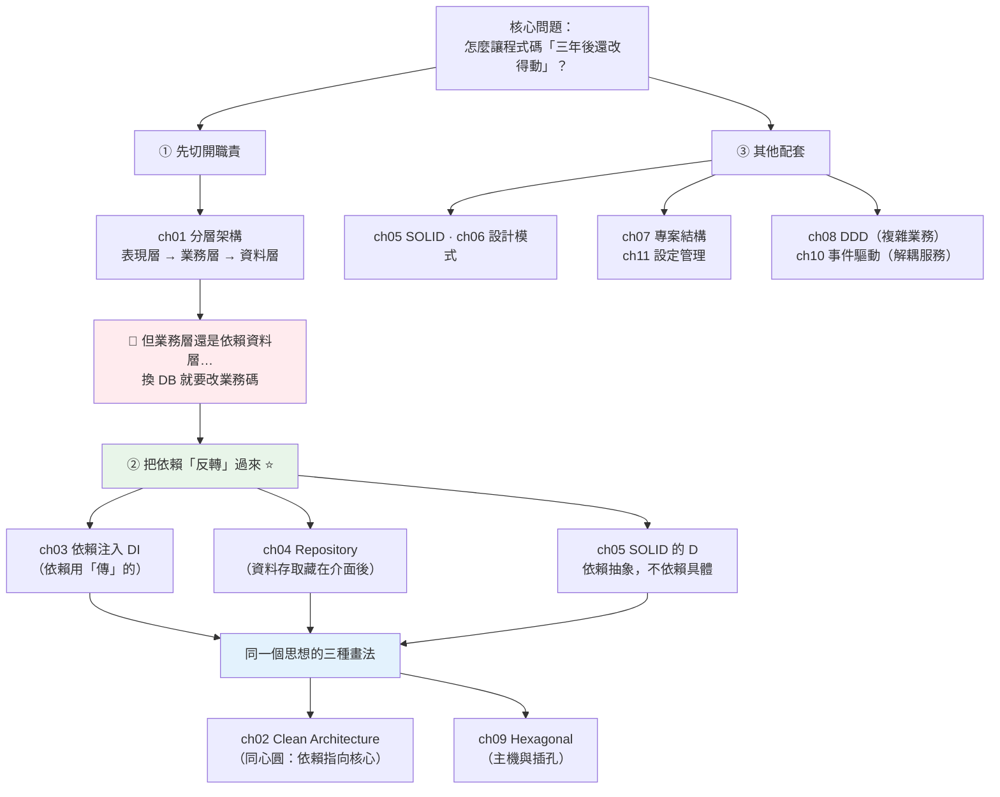

# Part 16 統整：架構與設計全貌

> 把這 11 章串成一張圖——所有架構模式，都在解同一個問題：**怎麼讓「三年後的你」還改得動這份程式碼。**

## 🗺️ 知識地圖（這 11 章怎麼串起來）

Part 16 的模式看起來很多（分層、Clean、DI、Repository、SOLID、Hexagonal…），
但**它們是同一件事的不同說法**——而那件事只有一句：

> **讓「會變的東西」（框架、資料庫、UI）依賴「不會變的東西」（業務規則），而不是反過來。**



**一句話串起來**：

**[分層](01-layered-architecture.md)**（ch01）是第一步：把「處理 HTTP」「業務規則」「存取資料庫」
切成三層，各司其職。**但它留下一個問題**——業務層**依賴**資料層，
所以「換一個資料庫」就得動業務碼。

**解法是把依賴「反轉」過來**（ch03、ch04、ch05 的 D）：

> **業務層「定義介面」（我需要一個能存 Task 的東西），
> 資料層「來實作它」。**

於是**業務層完全不知道 SQLite 的存在**，而 SQLite 得配合業務層的介面。
換資料庫？**業務碼一行都不用改**（下面的小實作會證明）。

而 **[Clean Architecture](02-clean-architecture.md)**（ch02，同心圓）
和 **[Hexagonal](09-hexagonal.md)**（ch09，主機與插孔）——
**是同一個思想的兩種畫法**：**依賴一律指向核心**。

## ⚡ 速查表（什麼情境用什麼）

| 情境 | 怎麼做 | 章節 |
|------|--------|------|
| 程式碼全塞在一個檔案，改不動 | **分層**：表現層（API）→ 業務層（Service）→ 資料層（Repository） | [ch01](01-layered-architecture.md) |
| **業務邏輯綁死了資料庫** | **依賴反轉**：業務層定義介面，資料層實作 | [ch02](02-clean-architecture.md)、[ch05](05-solid.md) |
| 一個類別需要另一個物件 | **依賴注入**——用**參數傳進來**，別在內部 `new` | [ch03](03-dependency-injection.md) |
| 業務碼裡到處是 SQL | **Repository**——把資料存取藏在「像操作集合」的介面後 | [ch04](04-repository-pattern.md) |
| 想讓程式**好測** | DI + Repository → 測試時**注入假的**（呼應 [Part 12](../12-testing/06-mock.md)） | [ch03](03-dependency-injection.md) |
| 類別越改越亂 | **SOLID**：一個類別一個改變的理由（S）、加功能別改舊碼（O） | [ch05](05-solid.md) |
| 遇到反覆出現的設計問題 | **設計模式**——但 Python 有一等函式，**很多模式會縮水** | [ch06](06-design-patterns.md) |
| 專案要怎麼擺資料夾 | **小專案按層分、大專案按功能分** | [ch07](07-project-structure.md) |
| 密碼、API 金鑰放哪 | **環境變數**（別寫死、別進 git）；用 pydantic-settings 驗證 | [ch11](11-config-management.md) |
| 業務很複雜，工程師與 PM 講不同語言 | **DDD**：統一語言 + 限界上下文 | [ch08](08-ddd.md) |
| 「下單後要寄信、扣庫存、通知物流」 | **事件驅動**：發一個事件，其他人各自訂閱 | [ch10](10-event-driven-mq.md) |
| 想畫出「可插拔」的架構 | **Hexagonal**（port ＝介面、adapter ＝實作） | [ch09](09-hexagonal.md) |

## 🔑 核心心智模型（帶得走的幾句話）

- **所有架構模式，都在做同一件事：讓依賴指向「不會變的東西」。**
  框架會換、資料庫會換、UI 會換——但**業務規則**（「餘額不足不能轉帳」）不會。
  所以**讓框架依賴業務，而不是業務依賴框架**。
- **依賴注入 ＝ 把依賴當參數傳。** 就這樣，沒有更玄的。
  它的回報是：**可測試**（測試時傳假的）、**可替換**（換實作只改組裝處）、
  **依賴看得見**（從 `__init__` 一眼看出這個類別需要什麼）。
- **Repository ＝ 讓資料存取「看起來像操作一個 list」。**
  業務層說 `repo.get(42)`，至於背後是 SQL、是 Mongo、還是記憶體 dict——**它不在乎**。
- **Clean Architecture 和 Hexagonal 是同一個東西。** 一個畫成同心圓、一個畫成六角形，
  講的都是：**核心定義介面，外圍來實作；依賴一律指向核心**。
- **能用組合，就別用繼承。** 繼承把你綁死在父類別的實作上；組合保持彈性。
  （這也是 [Part 4 mixin](../04-oop/15-mixin.md) 的結論。）
- **架構是有成本的。** 三個檔案的小腳本**不需要** Clean Architecture。
  **先讓它動，痛了再重構**——過早的抽象比重複更糟。

## 🛠️ 小實作：換掉整個資料層，業務邏輯一行不改

這支腳本示範**依賴反轉**的威力：同一個 `TaskService`，
分別注入**記憶體版**和**SQLite 版** repository——**業務碼完全相同**。

```python
# architecture_demo.py —— Part 16 主線：讓依賴指向核心
from __future__ import annotations

from dataclasses import dataclass
from typing import Protocol


# ── 領域層（最內圈）：不依賴任何框架、任何資料庫 ──
@dataclass(frozen=True)
class Task:
    id: int
    title: str
    done: bool = False


# ── ch04 Repository + ch03 DI：核心「定義介面」，外圍「實作它」──
class TaskRepository(Protocol):
    """業務層說：我需要一個能存取 Task 的東西。至於它背後是什麼，我不在乎。"""

    def add(self, title: str) -> Task: ...
    def list_open(self) -> list[Task]: ...


class InMemoryTaskRepo:
    """外圍實作 A：記憶體版——測試用，毫秒級，不必起資料庫。"""

    def __init__(self) -> None:
        self._items: dict[int, Task] = {}
        self._next = 1

    def add(self, title: str) -> Task:
        task = Task(id=self._next, title=title)
        self._items[task.id] = task
        self._next += 1
        return task

    def list_open(self) -> list[Task]:
        return [t for t in self._items.values() if not t.done]


class SqliteTaskRepo:
    """外圍實作 B：真的 SQLite——正式用。業務層完全不必改。"""

    def __init__(self) -> None:
        import sqlite3

        self.conn = sqlite3.connect(":memory:")
        self.conn.execute(
            "CREATE TABLE tasks (id INTEGER PRIMARY KEY, title TEXT, done INTEGER DEFAULT 0)"
        )

    def add(self, title: str) -> Task:
        cursor = self.conn.execute("INSERT INTO tasks (title) VALUES (?)", (title,))
        self.conn.commit()
        return Task(id=cursor.lastrowid or 0, title=title)

    def list_open(self) -> list[Task]:
        rows = self.conn.execute(
            "SELECT id, title, done FROM tasks WHERE done = 0"
        ).fetchall()
        return [Task(id=r[0], title=r[1], done=bool(r[2])) for r in rows]


# ── 業務層：只依賴「介面」，不依賴任何具體實作 ──
class TaskService:
    def __init__(self, repo: TaskRepository) -> None:      # ch03 依賴注入
        self.repo = repo

    def create(self, title: str) -> Task:
        if not title.strip():
            raise ValueError("標題不能空白")               # 業務規則住在這裡
        return self.repo.add(title.strip())

    def open_count(self) -> int:
        return len(self.repo.list_open())


def run_scenario(repo: TaskRepository, label: str) -> None:
    service = TaskService(repo)        # 注入不同實作——業務碼「一行都沒改」
    service.create("寫統整章")
    service.create("跑測試")
    try:
        service.create("   ")          # 業務規則：空白標題要擋下
    except ValueError as exc:
        rejected = str(exc)
    print(f"  {label:22s} 未完成 {service.open_count()} 筆 | 擋下空白標題: {rejected}")


def demo() -> None:
    print("【ch01 分層 + ch03 DI + ch04 Repository】")
    print("  同一個 TaskService，換掉整個資料層——業務邏輯一行都不用改:\n")
    run_scenario(InMemoryTaskRepo(), "記憶體版（測試用）")
    run_scenario(SqliteTaskRepo(), "SQLite 版（正式用）")
    print("\n  ↑ 這就是「依賴反轉」：業務層定義介面，資料層來實作它。")
    print("    業務層 → 不知道 SQLite 的存在；SQLite → 得配合業務層的介面。")


if __name__ == "__main__":
    demo()
```

**預期輸出**：

```pycon
$ python architecture_demo.py
【ch01 分層 + ch03 DI + ch04 Repository】
  同一個 TaskService，換掉整個資料層——業務邏輯一行都不用改:

  記憶體版（測試用）          未完成 2 筆 | 擋下空白標題: 標題不能空白
  SQLite 版（正式用）        未完成 2 筆 | 擋下空白標題: 標題不能空白

  ↑ 這就是「依賴反轉」：業務層定義介面，資料層來實作它。
    業務層 → 不知道 SQLite 的存在；SQLite → 得配合業務層的介面。
```

**兩行輸出一模一樣——這正是重點**：

`TaskService`（業務層）**從頭到尾沒有 import 過 `sqlite3`**。
它只認得一個 **`TaskRepository` 介面**（用 [Part 5 的 Protocol](../05-typing/06-protocol.md) 定義）。

於是：

- **換資料庫** → 寫一個新的 `PostgresTaskRepo`，業務層**一行不改**。
- **寫測試** → 注入 `InMemoryTaskRepo`，**不用起資料庫、毫秒跑完**
  （這正是 [Part 12](../12-testing/06-mock.md) 說的「能 mock 的前提是好設計」）。
- **業務規則**（「標題不能空白」）**住在業務層**，不會因為換資料庫而遺失。

**「依賴反轉」的意思就是**：
本來是「業務 → 依賴 → 資料庫」，現在變成「**業務 ← 被依賴 ← 資料庫**」。
箭頭反過來了——這就是 Clean Architecture 那張同心圓
（[ch02](02-clean-architecture.md)）與 Hexagonal 那個主機插孔
（[ch09](09-hexagonal.md)）在講的**同一件事**。

## ✅ 自測清單（答不出來就回去讀）

- [ ] 分層架構的「單向依賴」是什麼意思？違反了會怎樣？（[ch01](01-layered-architecture.md)）
- [ ] Clean Architecture 的「依賴規則」一句話怎麼說？（[ch02](02-clean-architecture.md)）
- [ ] 依賴注入具體是在做什麼？它帶來哪三個好處？（[ch03](03-dependency-injection.md)）
- [ ] Repository 模式解決什麼問題？它讓資料存取「看起來像」什麼？（[ch04](04-repository-pattern.md)）
- [ ] SOLID 的 D（依賴反轉）和 DI 是什麼關係？（[ch05](05-solid.md)）
- [ ] 為什麼說「Python 讓很多設計模式縮水」？舉一個例子。（[ch06](06-design-patterns.md)）
- [ ] 專案該按「技術層」還是「功能」分資料夾？（[ch07](07-project-structure.md)）
- [ ] DDD 的「限界上下文」在解決什麼問題？（[ch08](08-ddd.md)）
- [ ] Hexagonal 的 port 和 adapter 分別是什麼？（[ch09](09-hexagonal.md)）
- [ ] 事件驅動比「直接呼叫」好在哪？代價是什麼？（[ch10](10-event-driven-mq.md)）
- [ ] 密碼絕對不能放哪裡？該放哪？（[ch11](11-config-management.md)）
- [ ] 什麼時候「不該」上這些架構？（陷阱題）

## 🎯 面試速查

| 考點 | 面試官想聽到什麼 | 章節 |
|------|------------------|------|
| **什麼是依賴注入？為什麼要用？** | 「**把依賴當參數傳進來**，而不是在類別內部自己建立。好處：① **可測試**（測試時注入假的，不必連真資料庫）；② **可替換**（換實作只改組裝處）；③ **依賴明確**（從 `__init__` 簽名一眼看出需要什麼）。」 | [ch03](03-dependency-injection.md) |
| **依賴反轉（DIP）？** | 「**高層模組不該依賴低層模組，兩者都該依賴抽象**。實務上：**業務層定義介面**（`TaskRepository`），**資料層來實作它**。於是箭頭反過來了——業務層不知道 SQLite 的存在，換資料庫時**業務碼一行不改**。」 | [ch05](05-solid.md)、[ch02](02-clean-architecture.md) |
| **Repository 模式？** | 「把資料存取**藏在一個「像操作集合」的介面後面**（`repo.get(id)`、`repo.add(x)`）。業務層不必知道背後是 SQL 還是 Mongo。好處：**業務邏輯與持久化解耦**、**測試可用記憶體版**。」 | [ch04](04-repository-pattern.md) |
| **Clean Architecture 的核心？** | 「**依賴規則：依賴一律指向內（核心）**。業務規則在圓心（不依賴任何框架），資料庫、Web 框架、UI 都是**可替換的外圍細節**。Hexagonal（六角形）是同一個思想的另一種畫法。」 | [ch02](02-clean-architecture.md)、[ch09](09-hexagonal.md) |
| **SOLID 是什麼？** | 「五條讓程式**好改**的原則：**S** 一個類別一個改變的理由；**O** 對擴充開放、對修改封閉；**L** 子型別要能替換父型別；**I** 別強迫依賴用不到的介面；**D** 依賴抽象，不依賴具體。核心目標是**縮小改動的影響範圍**。」 | [ch05](05-solid.md) |
| **什麼時候「不該」上架構？** | 「**小專案不需要**。三個檔案的腳本套 Clean Architecture 是災難——**過早的抽象比重複更糟**。原則是『**先讓它動，痛了再重構**』：當你發現『改一個地方要動五個檔案』或『測試必須連真資料庫』時，才是引入的時機。」 | [ch01](01-layered-architecture.md) |

---

🎉 **恭喜完成 Part 16！** 你的程式碼從「能動」升級成「**改得動**」。

接下來 [Part 17 資料處理](../17-data-science/README.md) 換一個世界：
**numpy 與 pandas**。你會看到一個和 Part 3 完全相反的哲學——
Python 的 `list` 把每個數字包成一個物件（[Part 10](../10-cpython-internals/01-everything-is-object.md)），
而 numpy 把盒子**全拆了**，只留裸數字排成一條連續的蛋盒。
**這一拆，換來了百倍的速度。**

➡️ 下一 Part：[資料處理與科學計算 Data Science](../17-data-science/README.md)

[⬆️ 回 Part 16 索引](README.md)
