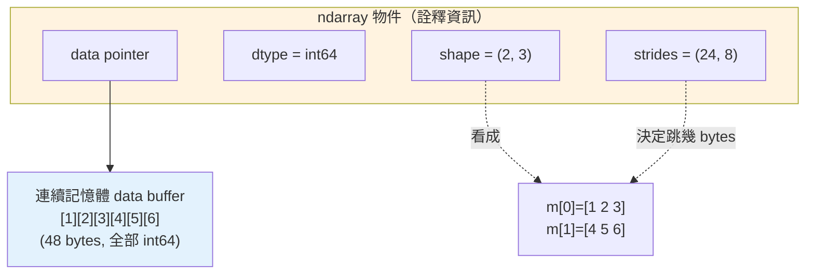

# numpy 基礎與 ndarray

> numpy 是整個 Python 科學計算生態的地基——pandas、scikit-learn、PyTorch 底層都是它。而 numpy 的核心只有一個東西：`ndarray`。這章講清楚 ndarray 是什麼、為什麼比 Python `list` 快幾十倍、記憶體怎麼佈局。

## Why（為什麼）

Python 的 `list` 很方便，但拿來做數值運算又慢又耗記憶體。要把一百萬個數字各乘以 2，用 `list`：

```python
result = [x * 2 for x in data]   # 純 Python 迴圈，每個元素都走一次直譯器
```

這慢在哪？Python 的 `list` 存的是**指向 Python 物件的指標**——每個 `int` 都是一個完整的 `PyObject`（含型別、引用計數、值，見 [CPython 內部](../10-cpython-internals/README.md)），散落在記憶體各處。迴圈每一步都要：解直譯器 bytecode、解指標、取出物件、拆箱（unbox）成 C 的數字、算完再裝箱（box）回 Python 物件。一百萬次全走這套，慢到不行，還吃掉大量記憶體（每個小整數物件都要 28 bytes 上下）。

`numpy` 的 `ndarray` 換一種做法：**一整塊連續記憶體，裡面是裸的 C 數字（不是 Python 物件）**，運算下沉到 C/SIMD 一次處理整個陣列。同樣的操作：

```python
result = data * 2   # 向量化：整個陣列一次算，迴圈在 C 層
```

不但寫起來更短，還快上數十倍、省下大量記憶體。因為所有上層資料工具（pandas、機器學習、影像處理）都建立在 ndarray 之上，**理解 ndarray 就是理解整個資料生態的地基**。這章打好這個地基，下一章談讓它真正發威的[向量化與廣播](02-numpy-vectorization.md)。

## Theory（理論：ndarray 是什麼）

`ndarray`（N-dimensional array，N 維陣列）與 Python `list` 的根本差異：

| 特性 | Python `list` | numpy `ndarray` |
|------|--------------|-----------------|
| 元素型別 | 任意、可混合 | **同質（homogeneous）**，全部同一 `dtype` |
| 記憶體 | 指標陣列，物件散落各處 | **單一連續區塊**，裸 C 數值 |
| 大小 | 動態可增減 | **固定**（改大小要建新陣列） |
| 運算 | 需 Python 迴圈 | **向量化**（迴圈在 C 層） |
| 維度 | 只有一維（要巢狀模擬多維） | 原生 N 維 |

ndarray 的三大要素：

- **`dtype`（data type）**：陣列元素的統一型別，如 `int64`、`float64`、`bool`。因為同質，numpy 才能把資料緊密排成連續記憶體、下放 C 運算。
- **`shape`**：各維度的長度，如 `(2, 3)` 表示 2 列 3 欄。
- **`data buffer`**：真正存數值的那塊連續記憶體。

「同質 + 連續 + 固定型別」這三點，就是 ndarray 又快又省的全部祕密。

## Specification（規範：建立與屬性）

**建立陣列**：

```python
np.array([1, 2, 3])          # 從 list/tuple 建立
np.zeros((2, 3))             # 指定 shape 的全 0 陣列
np.ones((2, 3))             # 全 1
np.full((2, 3), 7)          # 全 7
np.arange(0, 10, 2)         # 類似 range：0,2,4,6,8
np.linspace(0, 1, 5)        # 0~1 之間均分 5 個點（含端點）
np.eye(3)                   # 3x3 單位矩陣
np.random.default_rng(42).random((2, 2))  # 隨機
```

**關鍵屬性**：

- `arr.dtype`：元素型別。
- `arr.shape`：各維長度的 tuple。
- `arr.ndim`：維度數（`len(shape)`）。
- `arr.size`：總元素數（各維相乘）。
- `arr.itemsize`：單一元素佔幾 bytes（`int64` 為 8）。
- `arr.nbytes`：整塊資料佔幾 bytes（`size * itemsize`）。

**索引與切片**：語法與 list 類似但支援多維（`m[1, 2]`、`m[:, 1:]`）。**重點：numpy 切片回傳 view（共享同一塊記憶體），不是 copy**——改 view 會改到原陣列，要獨立副本得用 `.copy()`。

## Implementation（底層：連續記憶體 + strides + dtype）

一個 ndarray 在 C 層是一個結構，關鍵欄位：

- **data pointer**：指向那塊連續記憶體的起點。
- **dtype**：每個元素怎麼解讀（幾 bytes、有號無號、整數浮點）。
- **shape**：各維長度。
- **strides（步幅）**：每個維度「跳到下一個元素要走幾 bytes」。

**strides 是 ndarray 高效的關鍵**。一塊一維連續記憶體，透過 shape + strides 就能被「看成」任意維度，而**不必搬動資料**。例如 `int64`（8 bytes）的 `2x3` 陣列，記憶體實際是 `[a,b,c,d,e,f]` 連續 48 bytes，strides 為 `(24, 8)`：往下一列跳 24 bytes（3 個元素）、往下一欄跳 8 bytes（1 個元素）。要取 `m[1, 2]` 就是 `data + 1*24 + 2*8`——一次位址計算就到。

這也解釋了幾件事：

- **`reshape` 為何幾乎免費**：只是換一組 shape/strides 去重新詮釋同一塊記憶體，不複製資料。
- **切片為何是 view**：view 共用同一 data pointer，只是換了起點/shape/strides。
- **為何運算快**：資料連續 → CPU 快取命中率高（locality），且不需拆箱裝箱、可用 SIMD 一次算多個。

用 `arr.__array_interface__` 或比較 `id`/記憶體位址可以佐證 view 共享記憶體（下面範例用「改一個影響另一個」來證明）。

## Code Example（可執行的 Python 範例）

```python
# numpy_basics.py — ndarray 建立、屬性、切片 view vs copy（需要 numpy）
import numpy as np

# 1) 建立 ndarray 的幾種方式
a = np.array([1, 2, 3, 4])                 # 從 list
print("a =", a, "| dtype =", a.dtype)

zeros = np.zeros((2, 3))                    # 2x3 全 0
rng = np.arange(0, 10, 2)                   # 0,2,4,6,8
lin = np.linspace(0, 1, 5)                  # 0~1 均分 5 點
print("zeros shape =", zeros.shape, "| rng =", rng, "| lin =", lin)

# 2) 屬性
m = np.array([[1, 2, 3], [4, 5, 6]])
print(f"ndim={m.ndim} shape={m.shape} size={m.size} dtype={m.dtype} itemsize={m.itemsize}")

# 3) 向量化運算：整個陣列一次算，無 Python 迴圈
print("a * 2 =", a * 2)
print("a + a =", a + a)
print("a.sum() =", a.sum(), "| a.mean() =", a.mean())

# 4) 索引與多維切片
row = m[1]                # 第 2 列
sub = m[:, 1:]            # 所有列、第 2 欄起
print("row =", row)
print("sub =\n", sub)

# 5) 切片是 view（共享記憶體），改 view 會影響原陣列
view = a[1:3]
view[0] = 99
print("改 view 後 a =", a)

# 6) 要獨立副本用 .copy()
a2 = np.array([1, 2, 3, 4])
copy = a2[1:3].copy()
copy[0] = -1
print("改 copy 後 a2 =", a2)

# 7) reshape 不複製資料，只換視角
r = np.arange(6).reshape(2, 3)
print("reshape:\n", r)
```

**預期輸出**：

```pycon
$ python numpy_basics.py
a = [1 2 3 4] | dtype = int64
zeros shape = (2, 3) | rng = [0 2 4 6 8] | lin = [0.   0.25 0.5  0.75 1.  ]
ndim=2 shape=(2, 3) size=6 dtype=int64 itemsize=8
a * 2 = [2 4 6 8]
a + a = [2 4 6 8]
a.sum() = 10 | a.mean() = 2.5
row = [4 5 6]
sub =
 [[2 3]
 [5 6]]
改 view 後 a = [ 1 99  3  4]
改 copy 後 a2 = [1 2 3 4]
reshape:
 [[0 1 2]
 [3 4 5]]
```

逐段解說：

- **(1) 建立**：`array` 從既有序列建；`zeros`/`arange`/`linspace` 依規則生。注意 `dtype` 由內容推得——整數 list → `int64`（Windows/Linux 64 位元）。
- **(2) 屬性**：`shape=(2,3)` 是 2 列 3 欄、`size=6`、`itemsize=8`（`int64` 佔 8 bytes）。
- **(3) 向量化**：`a * 2`、`a + a` 都是「整個陣列一次算」，沒有 Python 迴圈——這是 numpy 的核心價值。
- **(4) 多維切片**：`m[:, 1:]` 表示「所有列、第 2 欄開始」，一次取一塊子矩陣。
- **(5) view**：`a[1:3]` 是 view，改它就改到 `a`（`a` 變成 `[1, 99, 3, 4]`）——這是 numpy 常見驚喜，務必記得。
- **(6) copy**：`.copy()` 產生獨立記憶體，改它不影響原陣列。
- **(7) reshape**：把一維 `0..5` 重新看成 `2x3`，資料沒被複製，只是換 shape/strides。

## Diagram（圖解：ndarray 記憶體佈局）



一塊連續記憶體 +（dtype, shape, strides）詮釋資訊 = 任意維度的 ndarray；reshape / 切片只換詮釋資訊，資料不動。

## Best Practice（最佳實踐）

- **數值運算用 ndarray、不要用 list + 迴圈**：向量化又快又省（見 [向量化](02-numpy-vectorization.md)）。
- **注意切片是 view**：需要獨立資料時明確 `.copy()`，避免不小心改到原陣列。
- **善用建構函式**：`zeros`/`ones`/`arange`/`linspace` 比先建 list 再轉快且清楚。
- **注意 dtype**：需要省記憶體用 `float32`/`int32`；跨平台注意預設整數型別（Windows 舊版曾是 `int32`，現代多為 `int64`）。
- **隨機用 `np.random.default_rng(seed)`**（新版 Generator API），可重現、比舊 `np.random.*` 好。
- **用 `arr.shape`/`dtype` 隨手檢查**：多數 numpy bug 來自 shape/型別不如預期。

## Common Mistakes（常見誤解）

- **以為切片是 copy**：`b = a[1:3]; b[0] = 0` 竟改到 `a`——numpy 切片預設是 view，要 copy 得明講。
- **用 Python 迴圈逐元素處理 ndarray**：慢得像沒用 numpy；改用向量化。
- **忽略 dtype 溢位**：`int8` 陣列存 200 會溢位（wrap around），結果錯誤且不報錯。
- **shape 搞錯導致廣播出乎意料**：`(3,)` 與 `(3,1)` 行為不同（見 [廣播](02-numpy-vectorization.md)）。
- **拿 `==` 比整個陣列當 bool 用**：`if a == b:` 會 `ValueError`（陣列有多個真值）；用 `np.array_equal`/`.all()`/`.any()`。
- **用 `np.array([...], dtype=object)` 存混合型別**：退化成 Python 物件陣列，失去 numpy 的速度優勢。

## Interview Notes（面試重點）

- **能說出 ndarray 為何比 list 快**：同質固定型別 + 連續記憶體（無拆箱裝箱、快取友善、可 SIMD），運算下沉到 C 的向量化，而 list 是散落的 Python 物件指標。
- **能解釋 shape / strides / dtype 三者的角色**，並說明「reshape 與切片為何不複製資料」（只換詮釋資訊）。
- **知道切片回傳 view 而非 copy**，能講清楚何時該 `.copy()`。
- **知道 ndarray 是整個資料生態（pandas、ML 框架）的底層**。
- **能舉向量化 vs 迴圈的效能差**，並知道 dtype 選擇對記憶體與溢位的影響。

---

➡️ 下一章：[向量化與廣播](02-numpy-vectorization.md)

[⬆️ 回 Part 17 索引](README.md)
