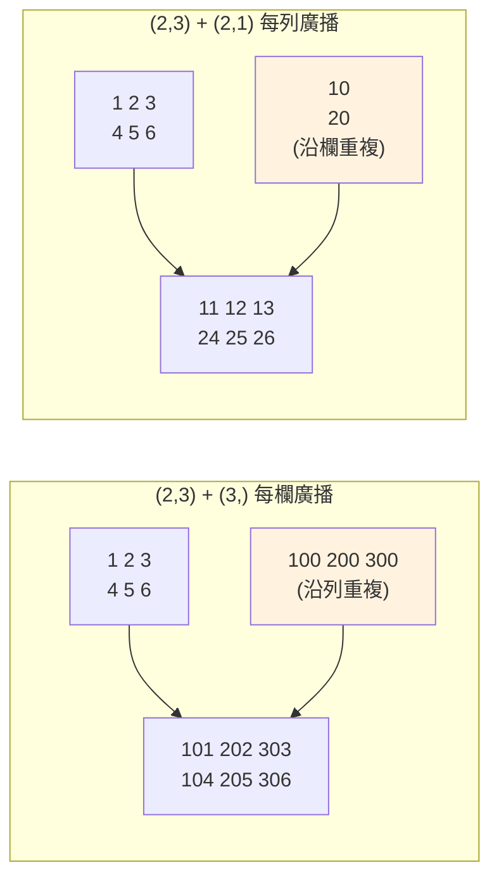

# 向量化與廣播

> 用了 numpy 卻還在寫 `for` 迴圈，等於買了跑車推著走。這章講讓 numpy 真正發威的兩把鑰匙：**向量化（vectorization）**——把迴圈交給 C；**廣播（broadcasting）**——讓不同形狀的陣列也能一起運算。

## 💡 白話導讀（建議先讀）

上一章說 numpy 把數字排進連續蛋盒。但如果你還寫 `for x in arr:` 逐格處理——
**等於買了跑車推著走**：每次取出一格，numpy 都得把裸數字**重新裝回 Python 盒子**給你，
比純 list 還慢。

正確姿勢是**向量化（vectorization）**：不要一顆顆搬雞蛋，**整盤端走**。

```python
result = arr * 2 + 1   # 一行，整個陣列，迴圈在 C 層跑
```

`*`、`+` 背後是 **ufunc**（universal function）：真正的迴圈發生在編譯過的 C 程式碼裡，
沒有直譯器逐步開銷、沒有裝箱拆箱、連續記憶體又對 CPU 快取友善——三個加速疊在一起，
常見 10~100 倍差距。

第二把鑰匙是**廣播（broadcasting）**：形狀不同的陣列運算時，numpy 自動「拉伸」小的去配大的——
像影印機把一行字複製成整頁。`(3, 4) 的矩陣 + (4,) 的一列`，那一列會自動套到每一行，
**而且不真的複製記憶體**（虛擬拉伸）。規則只有一條：從尾端對齊比形狀，每一維要嘛相等、要嘛其中一個是 1。

這章的目標：讓你看到 `for` 迴圈碰 numpy 陣列就條件反射地問——「這能不能向量化？」
（答案幾乎總是能：條件邏輯用 `np.where`、累計用 `np.cumsum`、配對用廣播。）

## Why（為什麼）

[上一章](01-numpy-basics.md)說 ndarray 快在「連續記憶體 + 同質型別」。但如果你這樣用它：

```python
result = np.zeros(n)
for i in range(n):
    result[i] = data[i] * 2 + 1   # 🔴 逐元素 Python 迴圈
```

你就把 numpy 的優勢丟光了——迴圈仍在 Python 直譯器裡一步步走，每次索引 `data[i]` 還要把 C 數值裝箱成 Python 物件。這比用 list 還可能更慢。

**向量化**是解法：把整個運算寫成「對整個陣列的操作」，讓實際的迴圈落在 numpy 的 C 實作裡（還能用 SIMD 一次算多個）：

```python
result = data * 2 + 1   # ✅ 向量化：迴圈在 C 層，快數十倍
```

而真實資料常常形狀不一致——一個 `(1000, 3)` 的矩陣要每欄乘上不同的權重 `(3,)`、每列加不同的偏移 `(1000, 1)`。**廣播**讓 numpy 在不實際複製資料的情況下，自動把小陣列「延展」成相容形狀一起算。掌握向量化與廣播，你才算真的會用 numpy——這也是 pandas 高效操作（見 [pandas 基礎](03-pandas-basics.md)）背後的同一套機制。

## Theory（理論：向量化與 ufunc）

**向量化**的本質：用「對整個陣列的表示式」取代「逐元素的 Python 迴圈」，把迴圈下沉到編譯過的 C 程式碼。

背後的機制是 **ufunc（universal function，通用函式）**：numpy 提供的一大類「逐元素運算函式」，如 `np.add`、`np.sqrt`、`np.exp`、`np.maximum`。`a + b`、`a * 2` 這些運算子其實就是在呼叫對應的 ufunc（`np.add(a, b)` 等）。ufunc 的特性：

- **逐元素（element-wise）**：對每個元素套用同一運算，一次處理整個陣列。
- **在 C 層迴圈**：真正的迴圈在編譯碼裡，無 Python 直譯器開銷。
- **支援廣播**：能自動處理形狀相容的不同陣列。

為什麼快？三個原因疊加：**沒有 Python 直譯器逐步開銷、沒有拆箱裝箱、連續記憶體對 CPU 快取友善且可 SIMD**。實測下來，百萬級資料常有數十倍差距。

## Specification（規範：廣播規則）

**廣播（broadcasting）**：讓不同 shape 的陣列一起運算。numpy 從**最後一個維度往前**逐維比對，兩維相容的條件是：

1. 兩者**相等**，或
2. 其中一個是 **1**（會被「延展」成另一個的長度），或
3. 其中一個**缺這個維度**（視為 1）。

只要每一維都相容，就能廣播；否則丟 `ValueError`。

範例（右對齊比對）：

```text
A (2, 3)   +   B (3,)      → B 視為 (1,3) → 延展成 (2,3) ✅  每列都加 B
A (2, 3)   +   B (2, 1)    → B 延展成 (2,3) ✅  每欄都加 B（每列不同值）
A (2, 3)   +   B (2,)      → 末維 3 vs 2 不相容 ❌ ValueError
A (3,)     +   純量 5      → 純量廣播到每個元素 ✅
```

**關鍵**：廣播不會真的複製資料——numpy 用 stride=0 的技巧「假裝」延展，所以省記憶體也快。要控制廣播方向，常用 `reshape(-1, 1)` 或 `arr[:, None]` 把一維變成欄向量。

**其他向量化利器**：

- **布林遮罩（boolean masking）**：`arr[arr > 0]` 選出符合條件的元素。
- **`np.where(cond, a, b)`**：向量化的「if-else」。
- **聚合的 `axis`**：`arr.sum(axis=0)` 沿列方向壓縮（得每欄總和）、`axis=1` 沿欄方向（得每列總和）。

## Implementation（底層：ufunc 迴圈與 stride=0 廣播）

**ufunc 怎麼快**：一個 ufunc（如 `np.add`）內部是編譯好的 C 迴圈，直接走過兩個陣列的連續記憶體、對每對元素做加法、寫入輸出。整趟沒有 Python bytecode、沒有物件建立。若 CPU 支援，numpy 還會用 SIMD 指令一次加好幾個 `float64`。這就是為何 `a + b` 遠快於 Python `for`。

**廣播怎麼不複製資料**：這是 strides 的巧妙運用（見 [ndarray strides](01-numpy-basics.md)）。當 `(3,)` 的 `B` 要對 `(2,3)` 的 `A` 每列相加，numpy **不會**真的把 `B` 複製成 `(2,3)`；它把 `B` 的第 0 維 stride 設成 **0**——意思是「這個維度往前走時，記憶體位址不動」，於是同一份 `B` 資料被「重複讀取」當成每一列。零複製、零額外記憶體。

**布林遮罩怎麼運作**：`arr > 0` 先產生一個同 shape 的 `bool` 陣列（每格 True/False），`arr[mask]` 再依此挑出 True 的元素、複製成一個**新的一維陣列**（遮罩選取會複製，不是 view）。

驗證向量化的速度差、廣播的形狀行為，最好的方式就是實際跑（見下方範例）。

## Code Example（可執行的 Python 範例）

```python
# vectorization.py — 向量化、廣播、遮罩、axis 聚合（需要 numpy）
import time

import numpy as np

# 1) 向量化 vs 迴圈：效能對比
n = 1_000_000
data = np.arange(n, dtype=np.float64)

t0 = time.perf_counter()
loop = [x * 2 + 1 for x in data]     # 純 Python 迴圈
t_loop = time.perf_counter() - t0

t0 = time.perf_counter()
vec = data * 2 + 1                    # 向量化
t_vec = time.perf_counter() - t0
print(f"迴圈比向量化慢約 {t_loop / t_vec:.0f} 倍（依機器而異）")

# 2) ufunc：逐元素函式
x = np.array([1.0, 4.0, 9.0, 16.0])
print("sqrt =", np.sqrt(x))
print("exp(0,1,2) =", np.exp(np.array([0.0, 1.0, 2.0])).round(3))

# 3) 廣播：純量對整個陣列
prices = np.array([100.0, 200.0, 300.0])
print("每個都打 9 折:", prices * 0.9)

# 4) 廣播：(2,3) + (2,1) → 每列加不同值
matrix = np.array([[1, 2, 3], [4, 5, 6]])
col_bonus = np.array([10, 20])
print("每列加不同值:\n", matrix + col_bonus.reshape(2, 1))

# 5) 廣播：(2,3) + (3,) → 每欄加不同值
row_bonus = np.array([100, 200, 300])
print("每欄加不同值:\n", matrix + row_bonus)

# 6) 布林遮罩
scores = np.array([55, 90, 72, 40, 88])
mask = scores >= 60
print("mask =", mask)
print("及格分數 =", scores[mask])
print("及格人數 =", mask.sum(), "| 平均 =", scores.mean())

# 7) axis 聚合
m = np.array([[1, 2, 3], [4, 5, 6]])
print("整體 sum =", m.sum())
print("沿 axis=0(欄) =", m.sum(axis=0))
print("沿 axis=1(列) =", m.sum(axis=1))

# 8) np.where：向量化 if-else
print("np.where:", np.where(scores >= 60, "pass", "fail"))
```

**預期輸出**（第一行倍數依機器而異）：

```pycon
$ python vectorization.py
迴圈比向量化慢約 25 倍（依機器而異）
sqrt = [1. 2. 3. 4.]
exp(0,1,2) = [1.    2.718 7.389]
每個都打 9 折: [ 90. 180. 270.]
每列加不同值:
 [[11 12 13]
 [24 25 26]]
每欄加不同值:
 [[101 202 303]
 [104 205 306]]
mask = [False  True  True False  True]
及格分數 = [90 72 88]
及格人數 = 3 | 平均 = 69.0
整體 sum = 21
沿 axis=0(欄) = [5 7 9]
沿 axis=1(列) = [ 6 15]
np.where: ['fail' 'pass' 'pass' 'fail' 'pass']
```

逐段解說：

- **(1) 效能**：同一計算，向量化比 Python 迴圈快數十倍（實際倍數視 CPU/資料量而定）。這就是「用 numpy 卻寫迴圈」的代價。
- **(2) ufunc**：`np.sqrt`、`np.exp` 逐元素套用、一次處理整個陣列。
- **(3) 純量廣播**：`prices * 0.9`，`0.9` 廣播到每個元素。
- **(4) `(2,1)` 廣播**：`col_bonus.reshape(2, 1)` 變成欄向量 → 每**列**加不同值（第 0 維延展）。
- **(5) `(3,)` 廣播**：一維直接對每**欄**廣播（末維相等 3==3）→ 每欄加不同值。對比 (4)、(5) 就能看懂廣播方向由 shape 決定。
- **(6) 遮罩**：`scores >= 60` 產生 bool 陣列，`scores[mask]` 選出及格分數；`mask.sum()` 因 True=1 而算出人數。
- **(7) axis**：`axis=0` 把「列」壓掉、得每欄總和 `[5,7,9]`；`axis=1` 把「欄」壓掉、得每列總和 `[6,15]`。記法：**axis 是「被消掉的維度」**。
- **(8) `np.where`**：向量化的三元運算，一次對整個陣列做 if-else。

## Diagram（圖解：廣播如何延展）



廣播用 stride=0「重複讀取」小陣列，不實際複製資料。

## Best Practice（最佳實踐）

- **能向量化就別寫迴圈**：用 ufunc、廣播、遮罩、`np.where` 表達整體運算。
- **用廣播取代手動 tile/複製**：`a[:, None] * b` 比 `np.repeat` 省記憶體又快。
- **控制廣播方向用 `reshape(-1, 1)` 或 `arr[:, None]`**：把一維明確變成欄向量，避免搞錯維度。
- **聚合記清 `axis` 語意**：`axis` 是被壓掉的維度；`axis=0` 得「每欄」、`axis=1` 得「每列」。
- **遮罩選取會複製**：需要就地修改用 `arr[mask] = value`（這會寫回原陣列）。
- **量測再優化**：用 `%timeit`（Jupyter，見 [Jupyter](07-jupyter.md)）或 `time.perf_counter` 確認向量化真的更快（見 [效能](../18-performance/README.md)）。

## Common Mistakes（常見誤解）

- **在 ndarray 上寫 Python `for` 逐元素處理**：完全放棄向量化，慢得像沒用 numpy。
- **廣播形狀不相容還硬算**：`(2,3)+(2,)` 會 `ValueError`——記得從末維右對齊比對。
- **搞混 `(3,)` 與 `(3,1)`**：前者對「欄」廣播、後者對「列」廣播，結果完全不同。
- **`axis` 方向記反**：`axis=0` 常被誤以為「沿列」；它是「消掉第 0 維（列）」→ 得每欄結果。
- **以為廣播很耗記憶體**：其實零複製（stride=0）；真正耗記憶體的是自己 `np.repeat`/`tile`。
- **對浮點結果用 `==` 精確比較**：浮點誤差；用 `np.isclose`/`np.allclose`。
- **忘了遮罩選取是 copy**：`arr[arr>0]` 是新陣列，改它不影響原陣列。

## Interview Notes（面試重點）

- **能定義向量化並說出為何快**：以整體陣列運算取代 Python 迴圈，迴圈下沉到 C 的 ufunc（無直譯開銷、無拆箱裝箱、快取友善、SIMD）。
- **能完整講廣播規則**：末維右對齊、逐維要求「相等或其一為 1」，並知道它靠 stride=0 零複製延展。
- **能舉例區分 `(n,)` 與 `(n,1)` 的廣播差異**，並示範用 `reshape`/`None` 控制方向。
- **能解釋 `axis` 的意義**（被消掉的維度）與 `axis=0`/`1` 各得什麼。
- **知道布林遮罩、`np.where` 是向量化條件的標準做法**，且遮罩選取會複製。
- **能連結到 pandas**：pandas 的欄運算、`apply` vs 向量化，底層都是 numpy 的這套機制。

---

➡️ 下一章：[pandas 基礎](03-pandas-basics.md)

[⬆️ 回 Part 17 索引](README.md)
