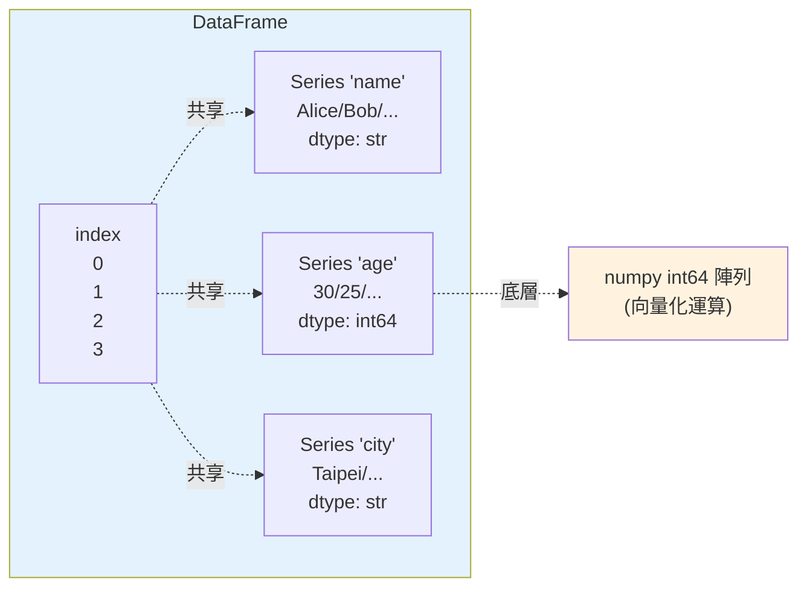

# pandas 基礎

> 如果 numpy 是「陣列」，pandas 就是「表格」。它把資料變成有欄名、有列索引、能混不同型別的 `DataFrame`——Excel 能做的它都能做，而且能處理百萬列、可程式化、可重現。這章講 pandas 的兩個核心結構：`Series` 與 `DataFrame`。

## Why（為什麼）

真實資料很少是「一排純數字」。它長這樣：一張表，有欄名（name、age、city）、每列是一筆記錄、不同欄是不同型別（字串、整數、日期）、還可能有缺失值。用 numpy 的 ndarray 硬存這種資料很痛苦——ndarray 要求同質型別、沒有欄名、沒有列標籤。

pandas 就是為這種**帶標籤、異質、表格化**的資料而生。它建立在 numpy 之上（每一欄底層仍是 numpy 陣列，享有向量化的速度，見 [向量化](02-numpy-vectorization.md)），但加上了：

- **欄名與列索引（index）**：用有意義的名字存取，`df["age"]` 而非 `arr[:, 1]`。
- **異質欄**：一張表可同時有字串欄、整數欄、日期欄。
- **缺失值處理**：內建 `NaN`/`NA` 與一整套清理工具（見 [資料清理](05-data-cleaning.md)）。
- **強大的讀寫**：一行 `read_csv`/`read_sql` 就把 CSV、Excel、資料庫、JSON 變成 DataFrame。

從資料分析、報表、ETL 到機器學習的特徵工程，pandas 幾乎是 Python 資料工作的預設工具。這章打好 Series/DataFrame 的基礎，下一章談更進階的 [DataFrame 操作](04-dataframe-operations.md)。

## Theory（理論：Series 與 DataFrame）

pandas 有兩個核心資料結構：

- **`Series`**：**帶標籤的一維陣列**。可以想成「一個 numpy 陣列 + 一組索引（index）標籤 + 一個名字」。像一欄資料。
- **`DataFrame`**：**二維表格**。可以想成「多個共享同一個列索引（index）的 Series 並排」——每一欄是一個 Series，所有欄共用同一組列標籤。

兩個關鍵概念：

- **index（索引）**：每一列的標籤。預設是 `0, 1, 2, ...` 的整數，但可以是日期、字串、任意 hashable 值。index 讓「對齊（alignment）」成為可能——兩個 Series 相加時，pandas 依 index 對齊而非位置。
- **dtype（每欄型別）**：DataFrame 每一欄有自己的 dtype（`int64`、`float64`、`bool`、`datetime64`，以及 pandas 3.0 起字串欄預設的 `str`）。

理解「DataFrame = 一堆共享 index 的 Series」是掌握 pandas 的關鍵——很多操作（選欄、加欄、聚合）都從這個模型自然推出。

## Specification（規範：建立與存取）

**建立**：

```python
pd.Series([10, 20, 30], index=["a", "b", "c"], name="score")
pd.DataFrame({"name": [...], "age": [...]})   # 從 dict（欄名 → 值）
pd.DataFrame(list_of_dicts)                    # 從 list of dict（每筆一列）
pd.read_csv("data.csv")                        # 從 CSV（最常用）
pd.read_sql(query, conn)                       # 從資料庫（見 Part 15）
```

**檢視**：`df.head()` / `df.tail()`（前/後幾列）、`df.shape`（列數, 欄數）、`df.columns`、`df.dtypes`、`df.info()`（摘要）、`df.describe()`（數值統計）。

**選欄**：

- `df["age"]` → 回傳一個 Series（單欄）。
- `df[["name", "age"]]` → 回傳 DataFrame（多欄，注意雙層中括號）。

**選列**：pandas 有兩套索引器，務必分清：

- **`df.loc[...]`**：**依標籤（label）**——`df.loc[1, "name"]`、`df.loc[df["age"] > 30]`。
- **`df.iloc[...]`**：**依整數位置（position）**——`df.iloc[0]`（第一列）、`df.iloc[0:2, 1]`。

**布林過濾**：`df[df["age"] > 28]` 用布林 Series 篩列（同 numpy 遮罩）。

## Implementation（底層：欄是 numpy 陣列、index 提供對齊）

**DataFrame 底層是什麼**：每一欄（Series）的值本質上是一個 numpy 陣列（或 pandas 的擴充陣列，如可為空的 `Int64`、字串 `str` dtype）。所以欄的向量化運算（`df["age"] * 2`）享有 numpy 的速度——迴圈在 C 層。因為每欄各有 dtype，DataFrame 才能異質，而每一欄內部仍同質。

**index 帶來自動對齊（alignment）**：pandas 運算不是按位置、而是**按 index 對齊**。兩個 Series 相加時，pandas 先對齊兩者的 index，同標籤才相加，對不上的產生 `NaN`。這既是 pandas 的威力（自動對齊不同來源資料）也是常見驚喜（沒對齊就冒出一堆 NaN）。

**`apply` vs 向量化**：`df["age"].apply(func)` 會對每個元素呼叫 Python 函式——這是**逐元素的 Python 迴圈**，慢。能用向量化（`df["age"] * 2`、`df["age"] >= 30`）就別用 `apply`。`apply` 只在「真的無法向量化的複雜邏輯」才用（見 [向量化](02-numpy-vectorization.md) 的取捨）。

**copy vs view / SettingWithCopyWarning**：pandas 的鏈式索引（`df[df.age>30]["name"] = ...`）可能作用在暫時副本上、改不到原表，並觸發警告。正解是用 `df.loc[cond, "name"] = ...` 一次定位（見下章 [DataFrame 操作](04-dataframe-operations.md)）。

## Code Example（可執行的 Python 範例）

```python
# pandas_basics.py — Series 與 DataFrame 的建立、選取、過濾（需要 pandas）
import pandas as pd

# 1) Series：帶標籤的一維陣列
s = pd.Series([10, 20, 30], index=["a", "b", "c"], name="score")
print("Series:")
print(s)
print("s['b'] =", s["b"], "| s.mean() =", s.mean())
print()

# 2) DataFrame：二維表格（多個共享 index 的 Series）
df = pd.DataFrame({
    "name": ["Alice", "Bob", "Carol", "Dave"],
    "age": [30, 25, 35, 28],
    "city": ["Taipei", "Tokyo", "Taipei", "Osaka"],
})
print("DataFrame:")
print(df)
print()

# 3) 檢視結構
print("shape =", df.shape)
print("columns =", list(df.columns))
print("dtypes:")
print(df.dtypes)
print()

# 4) 選欄（單欄回 Series）
print("df['name']:", df["name"].tolist())
print()

# 5) 選列：iloc(位置) / loc(標籤)
print("iloc[0]:", df.iloc[0].to_dict())
print("loc[1, 'name'] =", df.loc[1, "name"])
print()

# 6) 布林過濾
print("age > 28:")
print(df[df["age"] > 28][["name", "age"]])
print()

# 7) 新增衍生欄
df["age_group"] = df["age"].apply(lambda a: "30+" if a >= 30 else "under30")
print(df[["name", "age", "age_group"]])
print()

# 8) 數值統計
print("describe:")
print(df["age"].describe())
```

**預期輸出**：

```pycon
$ python pandas_basics.py
Series:
a    10
b    20
c    30
Name: score, dtype: int64
s['b'] = 20 | s.mean() = 20.0

DataFrame:
    name  age    city
0  Alice   30  Taipei
1    Bob   25   Tokyo
2  Carol   35  Taipei
3   Dave   28   Osaka

shape = (4, 3)
columns = ['name', 'age', 'city']
dtypes:
name      str
age     int64
city      str
dtype: object

df['name']: ['Alice', 'Bob', 'Carol', 'Dave']

iloc[0]: {'name': 'Alice', 'age': 30, 'city': 'Taipei'}
loc[1, 'name'] = Bob

age > 28:
    name  age
0  Alice   30
2  Carol   35

    name  age age_group
0  Alice   30       30+
1    Bob   25   under30
2  Carol   35       30+
3   Dave   28   under30

describe:
count     4.000000
mean     29.500000
std       4.203173
min      25.000000
25%      27.250000
50%      29.000000
75%      31.250000
max      35.000000
Name: age, dtype: float64
```

逐段解說：

- **(1) Series**：印出來左邊是 index（a/b/c）、右邊是值，底下標明 `Name` 與 `dtype`。`s["b"]` 用標籤存取、`s.mean()` 是向量化聚合。
- **(2) DataFrame**：由 dict 建立，key 成欄名，最左邊那欄 `0..3` 是自動產生的整數 index。
- **(3) 結構**：`shape=(4,3)`（4 列 3 欄）。`dtypes` 顯示每欄型別——注意 `name`/`city` 是 `str`（**pandas 3.0 起字串欄預設 `str` dtype**；舊版顯示 `object`），`age` 是 `int64`。
- **(4) 選欄**：`df["name"]` 回傳 Series。
- **(5) loc vs iloc**：`iloc[0]` 依位置取第一列；`loc[1, "name"]` 依標籤取 index=1 那列的 name 欄。分清這兩個是 pandas 基本功。
- **(6) 過濾**：`df["age"] > 28` 產生布林 Series，篩出 Alice、Carol。注意結果保留原 index（0、2）。
- **(7) 衍生欄**：`apply` 逐列套函式產生新欄（此例邏輯簡單，其實可向量化為 `np.where(df.age>=30, ...)`）。
- **(8) describe**：一次算出計數、平均、標準差、四分位數等——快速摸清數值分布。

## Diagram（圖解：DataFrame = 共享 index 的 Series）



## Best Practice（最佳實踐）

- **分清 `loc`（標籤）與 `iloc`（位置）**：混用是 pandas 最常見的錯誤來源。
- **選/改資料用 `df.loc[列條件, 欄]` 一次定位**：避免鏈式索引與 `SettingWithCopyWarning`（見 [DataFrame 操作](04-dataframe-operations.md)）。
- **能向量化就別 `apply`**：`df["age"] * 2`、`np.where(...)` 遠快於逐列 Python 函式。
- **先 `df.info()` / `df.describe()` / `df.head()` 摸清資料**再動手：型別、缺失、分布一目了然。
- **善用具意義的 index**（如日期、ID）：讓對齊、選取、時間序列操作更自然。
- **讀檔就指定 dtype / parse_dates**：`read_csv(..., dtype=..., parse_dates=[...])` 一開始就把型別弄對，省後續清理。

## Common Mistakes（常見誤解）

- **混淆 `loc` 與 `iloc`**：`df.loc[0]` 是標籤 0 的列、`df.iloc[0]` 是第一列——當 index 不是 0..n 時兩者不同。
- **鏈式索引賦值**：`df[df.age>30]["name"] = "x"` 可能改到副本、無效，並觸發 `SettingWithCopyWarning`；用 `df.loc[df.age>30, "name"] = "x"`。
- **忘了 index 對齊**：兩個 Series 相加時 pandas 按 index 對齊，對不上就 `NaN`——不是按位置。
- **濫用 `apply`/`iterrows`**：逐列 Python 迴圈極慢；優先向量化。
- **單欄用雙括號、多欄用單括號**：`df["a"]` 回 Series、`df[["a"]]` 回 DataFrame；`df["a", "b"]` 會錯，多欄要 `df[["a", "b"]]`。
- **以為 `df["new"] = ...` 之外能就地改**：許多方法回傳新物件（`df.drop(...)`）而非就地改，要接回或加 `inplace`（新版趨向不鼓勵 `inplace`）。

## Interview Notes（面試重點）

- **能說出 Series / DataFrame 的關係**：DataFrame 是「多個共享同一 index 的 Series」，每欄一個 dtype、底層是 numpy 陣列。
- **能清楚區分 `loc` 與 `iloc`**（標籤 vs 位置）並舉出何時會不同。
- **能解釋 index 對齊**：pandas 按標籤對齊運算，對不上產生 NaN，是威力也是坑。
- **知道 `apply` 是逐元素 Python 迴圈、慢**，能講「優先向量化」的理由（底層是 numpy）。
- **知道 `SettingWithCopyWarning` 的成因（鏈式索引）與正解（`df.loc[...]` 一次定位）**。
- **能說明 pandas 建立在 numpy 之上**、以及它相對 numpy 多了什麼（欄名、index、異質欄、缺失值、讀寫）。

---

➡️ 下一章：[DataFrame 操作](04-dataframe-operations.md)

[⬆️ 回 Part 17 索引](README.md)
