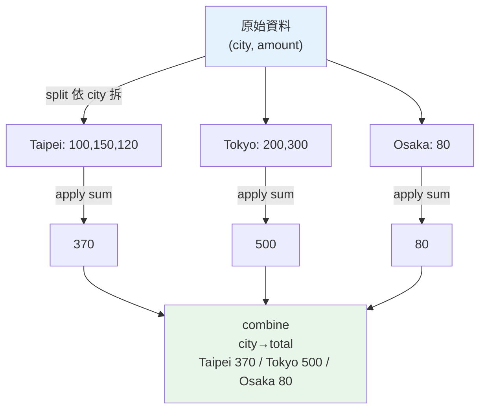

# DataFrame 操作

> 資料分析的日常不是「看一張表」，而是「把幾張表接起來、分組算總和、排序找出前幾名、重塑成報表」。這章講 pandas 最核心的四類操作：**groupby 分組聚合、merge 表連接、sort 排序、pivot 樞紐重塑**。

## Why（為什麼）

有了 [DataFrame](03-pandas-basics.md)，接下來要回答的是真實的分析問題：

- 「每個城市的營業額是多少？」→ 要**分組**再**聚合**（groupby）。
- 「訂單表只有 city 代碼，要補上國家、地區資訊」→ 要把訂單表和城市表**連接**（merge / join，就像 SQL 的 JOIN，見 [Part 15 資料庫](../15-database/README.md)）。
- 「金額最高的前 10 筆是哪些？」→ 要**排序**（sort_values）取前 N。
- 「做一張『城市 × 類別』的交叉報表」→ 要**重塑**（pivot_table）。

這四類操作（分組、連接、排序、重塑）幾乎涵蓋所有資料分析與 ETL 工作。它們的威力在於：**用宣告式的、向量化的表達式**取代手寫巢狀迴圈——你說「要什麼結果」，pandas 用底層 C/numpy 高效算出來。這章把這四把工具講透，讓你能把原始表格轉成任何想要的形狀與摘要。

## Theory（理論：split-apply-combine）

pandas 分組聚合的核心心智模型是 **split-apply-combine（拆分—套用—合併）**：

1. **split**：依某個 key（如 city）把資料拆成多個群組。
2. **apply**：對每個群組套用一個函式（如 `sum`、`mean`、`count`）。
3. **combine**：把各群組的結果合併成一個新的 Series/DataFrame。

`df.groupby("city")["amount"].sum()` 就是這三步：依 city 拆分 → 對每組的 amount 求和 → 合併成「每城市總額」。理解這個模型，各種 groupby 變體（多欄分組、多重聚合、自訂聚合）都能推出來。

**連接（join）的模型**沿用關聯式資料庫：兩張表依「共同的鍵（key）」對起來。連接方式（how）：

- `inner`：只保留兩表都有的鍵。
- `left`：保留左表所有列，右表對不上的補 `NaN`。
- `right` / `outer`：對稱地保留右表 / 兩表全部。

**重塑（reshape）**：`pivot_table` 把「長格式」資料（每列一筆記錄）轉成「寬格式」交叉表（一個維度當列、一個當欄、格子放聚合值）——這正是 Excel 樞紐分析表的程式化版本。

## Specification（規範：核心 API）

**分組聚合**：

```python
df.groupby("city")["amount"].sum()                    # 單一聚合
df.groupby("city")["amount"].agg(["sum", "mean", "count"])  # 多重聚合
df.groupby(["city", "category"])["amount"].sum()      # 多欄分組（階層 index）
df.groupby("city").agg(total=("amount", "sum"))       # 具名聚合（自訂欄名）
```

**排序**：

```python
df.sort_values("amount", ascending=False)             # 依欄排序
df.sort_values(["city", "amount"])                    # 多欄排序
df.nlargest(3, "amount")                               # 取最大 3 筆（比 sort+head 快）
```

**連接**：

```python
left.merge(right, on="city", how="left")              # 依共同欄連接
left.merge(right, left_on="a", right_on="b")          # 鍵欄名不同
pd.concat([df1, df2])                                  # 垂直堆疊（同結構的表接起來）
pd.concat([df1, df2], axis=1)                          # 水平併欄
```

**重塑**：

```python
df.pivot_table(index="city", columns="category",
               values="amount", aggfunc="sum", fill_value=0)
df.melt(...)     # pivot 的反向：寬轉長
```

## Implementation（底層：hash 分組、對齊連接）

**groupby 怎麼運作**：pandas 對分組鍵建立一組「每列屬於哪一組」的標籤（透過 hash），把資料在內部依組別分割，再對每組的欄套用聚合。內建聚合（`sum`、`mean`、`count`…）是用 **Cython/C 實作的快路徑**，不會退回 Python 迴圈，所以極快。但若你傳自訂 Python 函式給 `.apply()`，就會對每組呼叫一次 Python 函式，較慢——能用內建聚合就用內建。

**merge 怎麼運作**：pandas 對連接鍵建立 hash 表（或在已排序時用 merge join），依鍵配對兩表的列。這與 SQL JOIN 同理，複雜度接近線性（hash join）。注意 **merge 可能讓列數暴增**——若右表對同一鍵有多列，會產生笛卡兒式的展開（見 Common Mistakes）。

**多欄 groupby 產生 MultiIndex**：`groupby(["city","category"])` 的結果 index 是階層式的（MultiIndex），可用 `.reset_index()` 攤平回一般欄，或 `.unstack()` 把某一層轉成欄（這其實就跟 pivot 相通）。

**pivot_table = groupby + unstack**：`pivot_table(index=A, columns=B, values=V, aggfunc=sum)` 本質等於「`groupby([A, B])[V].sum()` 再把 B 那層 unstack 成欄」。理解這點就懂 pivot 不是魔法，而是分組聚合的重塑。

## Code Example（可執行的 Python 範例）

```python
# dataframe_ops.py — groupby / sort / merge / pivot（需要 pandas）
import pandas as pd

sales = pd.DataFrame({
    "order_id": [1, 2, 3, 4, 5, 6],
    "city": ["Taipei", "Tokyo", "Taipei", "Osaka", "Tokyo", "Taipei"],
    "category": ["A", "B", "A", "A", "B", "B"],
    "amount": [100, 200, 150, 80, 300, 120],
})

# 1) groupby 單一聚合
print("每城市總額:")
print(sales.groupby("city")["amount"].sum())
print()

# 2) groupby 多重聚合
print("每城市多重統計:")
print(sales.groupby("city")["amount"].agg(["sum", "mean", "count"]))
print()

# 3) 多欄 groupby（產生 MultiIndex）
print("城市x類別 總額:")
print(sales.groupby(["city", "category"])["amount"].sum())
print()

# 4) 排序取前 N
print("依金額排序(前3):")
print(sales.sort_values("amount", ascending=False).head(3)[["order_id", "amount"]])
print()

# 5) merge：連接城市→國家對照表
cities = pd.DataFrame({
    "city": ["Taipei", "Tokyo", "Osaka"],
    "country": ["Taiwan", "Japan", "Japan"],
})
merged = sales.merge(cities, on="city", how="left")
print("merge 後(前3):")
print(merged[["order_id", "city", "country", "amount"]].head(3))
print()

# 6) merge 後再聚合
print("每國總額:")
print(merged.groupby("country")["amount"].sum())
print()

# 7) pivot_table 交叉報表
print("pivot(city x category 總額):")
print(sales.pivot_table(index="city", columns="category",
                        values="amount", aggfunc="sum", fill_value=0))
```

**預期輸出**：

```pycon
$ python dataframe_ops.py
每城市總額:
city
Osaka      80
Taipei    370
Tokyo     500
Name: amount, dtype: int64

每城市多重統計:
        sum        mean  count
city                          
Osaka    80   80.000000      1
Taipei  370  123.333333      3
Tokyo   500  250.000000      2

城市x類別 總額:
city    category
Osaka   A            80
Taipei  A           250
        B           120
Tokyo   B           500
Name: amount, dtype: int64

依金額排序(前3):
   order_id  amount
4         5     300
1         2     200
2         3     150

merge 後(前3):
   order_id    city country  amount
0         1  Taipei  Taiwan     100
1         2   Tokyo   Japan     200
2         3  Taipei  Taiwan     150

每國總額:
country
Japan     580
Taiwan    370
Name: amount, dtype: int64

pivot(city x category 總額):
category    A    B
city              
Osaka      80    0
Taipei    250  120
Tokyo       0  500
```

逐段解說：

- **(1) 單一聚合**：`groupby("city")["amount"].sum()`——split-apply-combine：依城市拆、對 amount 求和、合併。結果 index 是城市（且已排序）。
- **(2) 多重聚合**：`.agg(["sum","mean","count"])` 一次算多個統計，結果是每城市一列、每統計一欄。
- **(3) 多欄分組**：`groupby(["city","category"])` 的結果 index 是階層式（MultiIndex）——Taipei 底下有 A、B 兩列。
- **(4) 排序**：`sort_values(..., ascending=False)` 由大到小，取前 3。（等效且更快：`sales.nlargest(3, "amount")`。）
- **(5) merge**：把 `sales` 依 `city` 左連接 `cities`，補上 `country` 欄——`how="left"` 保留所有訂單。
- **(6) 連接後聚合**：先 merge 補國家、再 groupby 國家求和——ETL 的典型兩步。
- **(7) pivot_table**：把長格式的 sales 轉成「城市 × 類別」交叉表，格子是總額，缺的組合用 `fill_value=0` 補 0。等價於 (3) 的結果 unstack 成欄。

## Diagram（圖解：split-apply-combine）



## Best Practice（最佳實踐）

- **用內建聚合（`sum`/`mean`/`count`/`agg`）而非 `groupby().apply(python_func)`**：內建走 Cython 快路徑。
- **具名聚合讓結果欄名清楚**：`.agg(total=("amount","sum"), avg=("amount","mean"))`。
- **取前 N 用 `nlargest`/`nsmallest`**：比 `sort_values().head(N)` 快（不用全排序）。
- **merge 前檢查鍵的唯一性**：右表鍵重複會讓結果列數暴增；必要時先去重或用 `validate="m:1"`。
- **merge 指定 `how` 與 `on`**：明確表達連接語意，避免意外的 inner join 丟資料。
- **多欄 groupby 後常接 `.reset_index()`**：把 MultiIndex 攤平成一般欄，方便後續處理。
- **pivot 記得 `fill_value`**：補上缺失組合，避免報表出現 NaN。

## Common Mistakes（常見誤解）

- **merge 造成列數暴增**：右表對同鍵有多列 → 笛卡兒展開；先確認鍵唯一或用 `validate`。
- **`how` 用錯丟資料**：想保留左表全部卻用了預設 `inner`，對不上的列被默默丟掉。
- **groupby 後忘了選欄就聚合整表**：`groupby("city").sum()` 會對所有數值欄求和（含 `order_id`），通常不是你要的；先選 `["amount"]`。
- **對 groupby 結果的 MultiIndex 不會操作**：忘了 `.reset_index()` / `.unstack()` 導致後續選取困難。
- **用 `apply` 做能向量化的事**：`groupby().apply(lambda g: g.amount.sum())` 慢，直接 `["amount"].sum()`。
- **`sort_values` 忘了它回傳新表**：沒接回變數或沒設 `ignore_index`，以為原表被排序了。
- **concat 沒對齊欄名**：欄名不一致會產生一堆 NaN 欄；先確保結構一致。

## Interview Notes（面試重點）

- **能講 split-apply-combine 模型**，並說明 `groupby` 內建聚合走 Cython 快路徑、`apply(python_func)` 較慢。
- **能對應 pandas merge 與 SQL JOIN**：`how` 的 inner/left/right/outer 語意，以及鍵重複造成列數暴增的風險。
- **知道多欄 groupby 產生 MultiIndex**，會用 `reset_index`/`unstack` 重塑。
- **能解釋 `pivot_table` 等價於 groupby + unstack**，並知道 `aggfunc`/`fill_value` 的作用。
- **知道取前 N 用 `nlargest` 比全排序快**、具名聚合讓欄名清楚。
- **能把「補維度→分組聚合→重塑報表」串成一條 ETL 流程**，並知道每步的效能與正確性陷阱。

---

➡️ 下一章：[資料清理](05-data-cleaning.md)

[⬆️ 回 Part 17 索引](README.md)
