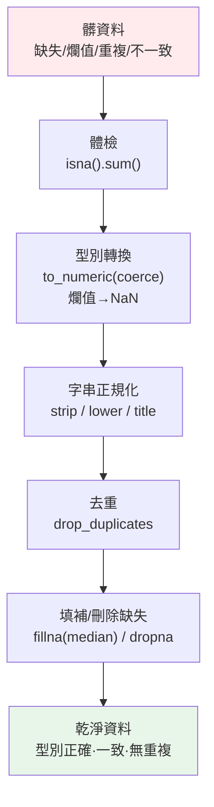

# 資料清理

> 真實資料是髒的：有缺失、有重複、型別不對、字串有多餘空白、大小寫不一。資料分析有句名言——**「80% 的時間花在清理資料」**。這章講 pandas 清理資料的完整流程：處理缺失值、型別轉換、去重、字串正規化。

## Why（為什麼）

教科書的資料乾乾淨淨，真實世界的資料一團亂：

- **缺失值**：某些欄是空的（`None`、`NaN`、空字串、`"N/A"`）。
- **型別不對**：整欄年齡讀進來是字串 `"30"`，甚至混著 `"abc"` 這種爛值。
- **重複**：同一筆記錄出現兩次（重複匯入、爬蟲重抓）。
- **不一致**：城市名一下 `"Taipei"` 一下 `"taipei"`、字串前後有空白、日期格式五花八門。

如果不清理就直接分析，結果全錯：平均值被爛值汙染、分組因大小寫不同而分裂、缺失值讓計算變 `NaN` 擴散。**清理資料是分析的前提，不是可選步驟**。這章講 pandas 提供的一整套清理工具，把髒資料變成可信、型別正確、一致的乾淨表——這是每個資料工作者的核心日常，也是面試常考的實務題。

## Theory（理論：缺失值的表示）

pandas 用特殊標記表示「缺失（missing）」：

- **`NaN`（Not a Number）**：源自 numpy 浮點數的缺失標記。傳統上，只要一個整數欄出現缺失，pandas 會把整欄升級成 `float64`（因為 `int` 沒有 NaN），這是常見驚喜。
- **`None`**：Python 的空值，在 object/字串欄裡代表缺失。
- **`pd.NA`**：pandas 較新的、型別中立的缺失標記，配合可為空的 `Int64`、`boolean`、`str` 等擴充型別使用，讓整數欄也能有缺失而不必變 float。

**缺失值的特性**：`NaN` 有「傳染性」——任何與 `NaN` 的算術結果都是 `NaN`（`NaN + 1 == NaN`），比較也永遠為 `False`（`NaN == NaN` 是 `False`！）。所以偵測缺失不能用 `== NaN`，要用 `isna()` / `notna()`。

**清理的兩種策略**：

- **刪除（drop）**：`dropna()` 丟掉有缺失的列/欄。簡單但會丟資料，缺失多時不適合。
- **填補（impute / fill）**：`fillna()` 用某個值補上——常數、前後值（`ffill`/`bfill`）、或統計量（平均/中位數）。保留資料量，但要選對填補策略避免扭曲分布。

## Specification（規範：清理 API）

**偵測缺失**：

```python
df.isna()            # 每格是否缺失（bool DataFrame）
df.isna().sum()      # 每欄缺失數（最常用的體檢）
df.notna()           # isna 的反向
```

**處理缺失**：

```python
df.dropna()                       # 丟掉任何含缺失的列
df.dropna(subset=["age"])         # 只看特定欄
df.dropna(axis=1)                 # 丟掉含缺失的欄
df["x"].fillna(0)                 # 補常數
df["x"].fillna(df["x"].median())  # 補中位數
df["x"].ffill()                   # 用前一個非缺失值補（時間序列常用）
```

**型別轉換**：

```python
pd.to_numeric(df["age"], errors="coerce")   # 轉數字，失敗的變 NaN
pd.to_datetime(df["date"], errors="coerce") # 轉日期
df["x"].astype("Int64")                      # 轉可為空的整數
df["cat"].astype("category")                 # 轉類別型（省記憶體）
```

**去重**：

```python
df.duplicated()                              # 每列是否為重複（bool）
df.drop_duplicates(subset="id", keep="first")# 依欄去重，保留第一筆
```

**字串處理**（`.str` 存取器，向量化）：

```python
df["s"].str.strip()      # 去前後空白
df["s"].str.lower()      # 轉小寫
df["s"].str.title()      # 首字母大寫
df["s"].str.replace(...) # 取代
df["s"].str.contains(...)# 是否包含（可搭 regex，見 Part 11 的 re）
```

## Implementation（底層：coerce、str 存取器、category）

**`errors="coerce"` 的機制**：`pd.to_numeric(..., errors="coerce")` 逐值嘗試轉型，**轉不動的（如 `"abc"`）不丟例外，而是設成 `NaN`**。這是清理髒資料的關鍵手法——先把爛值統一變成缺失，再用缺失處理流程統一補/丟。相對的 `errors="raise"`（預設）遇爛值會直接爆，`errors="ignore"` 則原樣保留（不推薦，型別沒清乾淨）。

**`.str` 存取器為何向量化**：`df["name"].str.strip()` 不是逐列跑 Python `str.strip`，而是 pandas 對整欄字串做的向量化操作（底層走 C/優化路徑，尤其 pandas 3.0 的 `str` dtype）。它會自動略過缺失值（對 `NaN` 回 `NaN`），所以清理字串時不必先處理缺失。

**`category` 型別省記憶體**：當一欄的值只有少數幾種（如城市、性別、狀態），轉成 `category` 後，pandas 內部用整數編碼 + 一張對照表存，大量重複值只存一次。百萬列、少數類別的欄，記憶體可省數十倍，groupby 也更快（見 [效能](../18-performance/README.md)）。

**去重的判定**：`drop_duplicates` 依指定欄（或全欄）判斷「值完全相同」的列，`keep` 決定保留第一筆、最後一筆、或全丟。注意去重前常需先做字串正規化（`strip`+`lower`），否則 `" Bob "` 與 `"Bob"` 會被當成不同值而漏抓。

## Code Example（可執行的 Python 範例）

```python
# data_cleaning.py — 缺失、型別、字串、去重的完整清理流程（需要 pandas/numpy）
import numpy as np
import pandas as pd

df = pd.DataFrame({
    "name": ["Alice", "Bob", " Carol ", "Bob", "Eve"],
    "age": ["30", "25", None, "25", "abc"],          # 字串、含缺失、含爛值
    "salary": [50000, np.nan, 55000, np.nan, 48000], # 含缺失
    "city": ["Taipei", "tokyo", "Taipei", "tokyo", None],  # 大小寫不一、含缺失
})
print("原始:")
print(df)
print()

# 0) 體檢：每欄缺失數
print("缺失值統計:")
print(df.isna().sum())
print()

# 1) 型別轉換：age 轉數字，"abc" 轉不動 → 變 NaN
df["age"] = pd.to_numeric(df["age"], errors="coerce")
print("age 轉數字後:", df["age"].tolist())
print()

# 2) 填補缺失：用中位數（對數值較穩健，不受極端值影響）
df["salary"] = df["salary"].fillna(df["salary"].median())
df["age"] = df["age"].fillna(df["age"].median())
print("填補後 salary:", df["salary"].tolist())
print("填補後 age:", df["age"].tolist())
print()

# 3) 字串清理：去空白、統一大小寫（去重前必做）
df["name"] = df["name"].str.strip()
df["city"] = df["city"].str.title()
print("清理字串後 name:", df["name"].tolist())
print("清理字串後 city:", df["city"].tolist())
print()

# 4) 去重（依 name，保留第一筆）
before = len(df)
df = df.drop_duplicates(subset="name", keep="first")
print(f"去重: {before} -> {len(df)} 列")
print()

# 5) 填補剩餘的缺失 city
df["city"] = df["city"].fillna("Unknown")
print("最終:")
print(df)
print()
print("最終 dtypes:")
print(df.dtypes)
```

**預期輸出**：

```pycon
$ python data_cleaning.py
原始:
      name  age   salary    city
0    Alice   30  50000.0  Taipei
1      Bob   25      NaN   tokyo
2   Carol   NaN  55000.0  Taipei
3      Bob   25      NaN   tokyo
4      Eve  abc  48000.0     NaN

缺失值統計:
name      0
age       1
salary    2
city      1
dtype: int64

age 轉數字後: [30.0, 25.0, nan, 25.0, nan]

填補後 salary: [50000.0, 50000.0, 55000.0, 50000.0, 48000.0]
填補後 age: [30.0, 25.0, 25.0, 25.0, 25.0]

清理字串後 name: ['Alice', 'Bob', 'Carol', 'Bob', 'Eve']
清理字串後 city: ['Taipei', 'Tokyo', 'Taipei', 'Tokyo', nan]

去重: 5 -> 4 列

最終:
    name   age   salary     city
0  Alice  30.0  50000.0   Taipei
1    Bob  25.0  50000.0    Tokyo
2  Carol  25.0  55000.0   Taipei
4    Eve  25.0  48000.0  Unknown

最終 dtypes:
name          str
age       float64
salary    float64
city          str
dtype: object
```

逐段解說：

- **(0) 體檢**：`df.isna().sum()` 是清理的第一步——一眼看出 age 缺 1、salary 缺 2、city 缺 1。
- **(1) 型別轉換 + coerce**：`age` 原本是字串欄且混著 `"abc"`。`to_numeric(errors="coerce")` 把 `"30"` 轉成 30.0、把轉不動的 `"abc"` 變成 `NaN`——爛值統一成缺失。注意整欄變 `float64`（因為有 NaN）。
- **(2) 中位數填補**：用**中位數**而非平均數補缺——中位數不受極端值影響，較穩健。salary 缺的兩格補成中位數 50000。
- **(3) 字串清理**：`.str.strip()` 去掉 `" Carol "` 的空白、`.str.title()` 把 `"tokyo"` 統一成 `"Tokyo"`。這步在去重**之前**做很關鍵——否則 `" Carol "` 會被當成獨立值。注意 `city` 的 `None` 經 `.str.title()` 仍是 `NaN`（str 操作自動略過缺失）。
- **(4) 去重**：字串正規化後，兩筆 `Bob` 才被正確辨識為重複，去掉一筆（5→4 列）。
- **(5) 補剩餘缺失**：Eve 的 city 仍是 NaN，補成 `"Unknown"`。
- **最終**：型別正確（age/salary 為數值）、無缺失、字串一致、無重複——可以安心分析了。注意最終 index 是 `0,1,2,4`（去重保留原 index），需要連續可 `.reset_index(drop=True)`。

## Diagram（圖解：清理流程）



順序有講究：**先轉型（爛值變缺失）→ 字串正規化 → 去重 → 處理缺失**。

## Best Practice（最佳實踐）

- **先體檢再動手**：`df.info()`、`df.isna().sum()`、`df.describe()`、`df["c"].value_counts()` 摸清髒在哪。
- **爛值用 `errors="coerce"` 統一成 NaN**：再走缺失處理流程，別讓爛值散落。
- **填補選對統計量**：數值偏態用中位數、常態用平均、時間序列用 `ffill`/`bfill`、類別用眾數或 `"Unknown"`。
- **字串正規化在去重之前**：`strip`+`lower`/`title` 後再 `drop_duplicates`，避免漏抓。
- **偵測缺失用 `isna()` 不用 `== NaN`**：`NaN == NaN` 是 False。
- **低基數欄轉 `category`**：省記憶體、加速 groupby。
- **清理步驟可重現**：寫成函式/pipeline（`df.pipe(...)`），別在 notebook 手動改一改就忘了怎麼來的。
- **去重後視需要 `reset_index(drop=True)`**：讓 index 連續。

## Common Mistakes（常見誤解）

- **用 `== NaN` 或 `!= NaN` 偵測缺失**：永遠 False/True，抓不到；用 `isna()`/`notna()`。
- **直接 `astype(int)` 轉含爛值的欄**：直接爆例外；先 `to_numeric(errors="coerce")`。
- **去重前沒正規化字串**：`" Bob "` vs `"Bob"` vs `"bob"` 被當不同值，重複沒去乾淨。
- **無腦 `dropna()` 丟掉大量資料**：缺失多時可能丟掉半張表；先評估該補還是該丟。
- **用平均數填補偏態資料**：被極端值拉偏；偏態用中位數。
- **忘了整數欄有 NaN 會變 float**：需要保留整數用可為空的 `Int64` dtype。
- **在鏈式索引上清理**：`df[df.x>0]["y"] = ...` 觸發 `SettingWithCopyWarning` 且可能無效；用 `df.loc[...]`（見 [DataFrame 操作](04-dataframe-operations.md)）。
- **清理不可重現**：在 notebook 手動改資料、沒記錄步驟，換份資料就重來——寫成可重跑的函式。

## Interview Notes（面試重點）

- **能說出缺失值的表示（NaN/None/pd.NA）與傳染性**（NaN 參與運算/比較的行為），並知道偵測要用 `isna()`。
- **能講清理流程的正確順序**：體檢 → 轉型（coerce 把爛值變 NaN）→ 字串正規化 → 去重 → 填補/刪除。
- **能說明 `errors="coerce"` 的用途**：把轉不動的值統一成 NaN 再處理。
- **能討論填補策略的取捨**：drop vs fill、平均 vs 中位數 vs ffill、何時用哪個。
- **知道去重前要先正規化字串**，以及 `keep` 參數的意義。
- **知道 `category` 型別省記憶體/加速**、整數欄遇缺失會升 float（或用 `Int64`）。
- **強調清理要可重現**（寫成 pipeline/函式），這是實務與面試都看重的工程素養。

---

➡️ 下一章：[資料視覺化](06-visualization.md)

[⬆️ 回 Part 17 索引](README.md)
