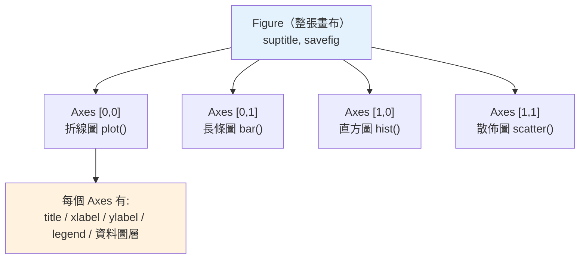

# 資料視覺化

> 一張圖勝過千行數字。`df.describe()` 告訴你平均和標準差，但一張直方圖讓你「看見」分布的形狀、離群值、雙峰。這章講 Python 視覺化的地基 matplotlib，以及 pandas 內建繪圖，用最少的程式把資料變成圖。

## Why（為什麼）

分析資料時，純看數字很容易被騙。經典的 **Anscombe's Quartet（安斯庫姆四重奏）**：四組資料的平均、變異數、相關係數幾乎一模一樣，畫出來卻長得天差地遠（一條線、一條曲線、一個離群值主導、一根垂直線）。**只看統計摘要會錯過真相，畫出來才看得見。**

視覺化的用途貫穿整個資料工作：

- **探索（EDA, exploratory data analysis）**：先畫圖看分布、趨勢、關係、離群值，決定怎麼清理與分析。
- **驗證**：清理前後對照、模型預測 vs 真實值。
- **溝通**：把結論用圖表呈現給非技術的人。

Python 視覺化的地基是 **matplotlib**——幾乎所有其他繪圖庫（seaborn、pandas `.plot()`、plotly 的部分）都建立在它之上或受它啟發。理解 matplotlib 的核心模型（Figure / Axes），你就能畫出任何圖、也看得懂別人的繪圖程式。這章聚焦 matplotlib 與 pandas 繪圖的基本功。

## Theory（理論：Figure 與 Axes）

matplotlib 的核心是兩層物件，務必分清：

- **`Figure`（畫布）**：整張圖的容器，可以包含一個或多個子圖。
- **`Axes`（座標軸/子圖）**：實際畫圖的區域——有 x 軸、y 軸、標題、資料。**注意 `Axes` 不是「軸線」，而是「一個子圖」**。一個 Figure 可有多個 Axes（如 2×2 儀表板）。

在一個 Axes 上呼叫 `ax.plot(...)`、`ax.bar(...)`、`ax.scatter(...)` 等方法畫上不同圖層，再用 `ax.set_title`、`ax.set_xlabel` 設定裝飾。

matplotlib 有兩種使用風格：

- **物件導向風格（OO，推薦）**：`fig, ax = plt.subplots()` 拿到明確的 Figure/Axes 物件，對它們呼叫方法。清楚、可控、適合多子圖與正式程式。
- **pyplot 狀態機風格**：`plt.plot(...)`、`plt.title(...)` 對「當前」隱含的 Axes 操作。適合 REPL 快速畫單圖，但多圖時容易搞混「當前是誰」。

**本書推薦 OO 風格**——尤其是多子圖或寫進程式時，明確持有物件遠比依賴隱含狀態可靠。

## Specification（規範：常用圖與 API）

**建立畫布與子圖**：

```python
fig, ax = plt.subplots()                       # 單一子圖
fig, axes = plt.subplots(2, 2, figsize=(10, 8))# 2x2 子圖，axes 是 2D 陣列
```

**常見圖種**（在某個 `ax` 上）：

- `ax.plot(x, y)`：**折線圖**——趨勢、時間序列。
- `ax.bar(x, h)` / `ax.barh`：**長條圖**——類別比較。
- `ax.hist(data, bins=20)`：**直方圖**——單一變數的分布。
- `ax.scatter(x, y)`：**散佈圖**——兩變數的關係/相關。
- `ax.boxplot(data)`：**箱型圖**——分布摘要與離群值。

**裝飾**：`ax.set_title(...)`、`ax.set_xlabel/ylabel(...)`、`ax.legend()`、`ax.grid(True)`、`fig.suptitle(...)`（整張圖標題）、`fig.tight_layout()`（自動排版避免重疊）。

**輸出**：

```python
fig.savefig("out.png", dpi=100)   # 存檔（伺服器/報告）
plt.show()                         # 開視窗顯示（互動環境）
```

**pandas 內建繪圖**（底層就是 matplotlib，最省事）：

```python
df.plot(x="month", y="revenue", kind="line")
df["col"].plot(kind="hist", bins=20)
df.plot.scatter(x="a", y="b")
```

**選圖種的原則**：比較類別用長條、看趨勢用折線、看分布用直方/箱型、看關係用散佈。

## Implementation（底層：後端、Agg、pandas 委派）

**後端（backend）**：matplotlib 把「怎麼畫」與「畫去哪」分開。**後端**決定輸出目標——互動視窗（`TkAgg`、`Qt5Agg`）、或非互動的檔案渲染器（**`Agg`**，畫成點陣圖如 PNG）。在**沒有顯示器的環境**（伺服器、Docker、CI，見 [雲原生](../19-cloud-native/README.md)）必須用非互動後端，否則 `plt.show()` 會失敗或卡住。設定方式：

```python
import matplotlib
matplotlib.use("Agg")   # 必須在 import pyplot 之前
import matplotlib.pyplot as plt
```

Jupyter（見 [Jupyter](07-jupyter.md)）則用 `inline` 後端把圖直接嵌進 notebook。

**pandas `.plot()` 怎麼運作**：它只是**委派（delegate）給 matplotlib**——建立 Figure/Axes、把 DataFrame 的欄餵給對應的 matplotlib 方法、回傳那個 `Axes` 物件。所以你可以接著對回傳的 `ax` 做任何 matplotlib 裝飾（`ax.set_title(...)`）。這是「快速用 pandas 畫、再用 matplotlib 微調」的常見組合。

**為何要 `plt.close(fig)`**：每個 Figure 都佔記憶體。在迴圈裡大量產圖卻不關閉，會累積導致記憶體暴漲、警告（"more than 20 figures"）。存完檔就 `plt.close(fig)` 釋放。

## Code Example（可執行的 Python 範例）

以下用 `Agg` 後端畫一個 2×2 儀表板並存成 PNG，不需顯示器即可執行（適合伺服器/CI）：

```python
# visualization.py — matplotlib 四種圖 + pandas 繪圖（需要 matplotlib/pandas/numpy）
from pathlib import Path

import matplotlib

matplotlib.use("Agg")   # 非互動後端：不開視窗、可存檔（須在 import pyplot 前）
import matplotlib.pyplot as plt  # noqa: E402
import numpy as np               # noqa: E402
import pandas as pd              # noqa: E402

rng = np.random.default_rng(42)   # 固定 seed，結果可重現

# 準備資料
sales = pd.DataFrame({
    "month": ["Jan", "Feb", "Mar", "Apr", "May", "Jun"],
    "revenue": [120, 135, 128, 160, 175, 190],
})
scores = rng.normal(70, 10, size=200)   # 200 個常態分布分數

# 建立 2x2 子圖（OO 風格）
fig, axes = plt.subplots(2, 2, figsize=(10, 8))
fig.suptitle("Sales Dashboard", fontsize=14)

# (1) 折線圖：趨勢
axes[0, 0].plot(sales["month"], sales["revenue"], marker="o", color="tab:blue")
axes[0, 0].set_title("Revenue Trend")
axes[0, 0].set_ylabel("Revenue (k)")

# (2) 長條圖：類別比較
axes[0, 1].bar(sales["month"], sales["revenue"], color="tab:green")
axes[0, 1].set_title("Revenue by Month")

# (3) 直方圖：分布
axes[1, 0].hist(scores, bins=20, color="tab:orange", edgecolor="white")
axes[1, 0].set_title("Score Distribution")

# (4) 散佈圖：關係
x = rng.random(50)
y = 2 * x + rng.normal(0, 0.1, 50)
axes[1, 1].scatter(x, y, alpha=0.6, color="tab:red")
axes[1, 1].set_title("Scatter")

fig.tight_layout()                # 自動排版避免重疊
out = Path("dashboard.png")
fig.savefig(out, dpi=100)
plt.close(fig)                    # 釋放記憶體
print(f"圖已存至 {out}（存在={out.exists()}）")

# pandas 內建繪圖（底層就是 matplotlib，回傳 Axes 可再微調）
ax = sales.plot(x="month", y="revenue", kind="line", marker="o", legend=False)
ax.set_title("via pandas .plot()")
ax.figure.savefig("revenue_pandas.png", dpi=100)
plt.close(ax.figure)
print("pandas .plot() 也輸出成功:", Path("revenue_pandas.png").exists())
```

**預期輸出**：

```pycon
$ python visualization.py
圖已存至 dashboard.png（存在=True）
pandas .plot() 也輸出成功: True
```

（執行後目錄會多出 `dashboard.png` 與 `revenue_pandas.png`。）

逐段解說：

- **後端設定**：`matplotlib.use("Agg")` 必須在 `import matplotlib.pyplot` **之前**，否則後端已定型。這讓程式在無顯示器環境也能跑。
- **`plt.subplots(2, 2)`**：一次建立 Figure 與 2×2 的 Axes 陣列，`axes[列, 欄]` 取用各子圖——這是 OO 風格的核心。
- **(1)–(4)**：分別在四個 Axes 上畫折線（趨勢）、長條（類別比較）、直方（分布）、散佈（關係）——涵蓋最常用的四種圖，並示範各自適合的資料情境。
- **`rng = default_rng(42)`**：固定隨機種子，讓直方圖/散佈圖每次結果一致、可重現。
- **`fig.tight_layout()`**：自動調整間距，避免標題/標籤互相重疊。
- **`fig.savefig` + `plt.close`**：存檔後關閉釋放記憶體——迴圈產圖時尤其重要。
- **pandas `.plot()`**：一行畫折線，回傳 `Axes`，接著用 `ax.set_title` 微調——展示「pandas 快畫 + matplotlib 微調」的組合。

## Diagram（圖解：Figure / Axes 結構）



## Best Practice（最佳實踐）

- **用 OO 風格**（`fig, ax = plt.subplots()`）而非 pyplot 狀態機：多子圖時明確可控。
- **選對圖種**：類別比較→長條、趨勢→折線、分布→直方/箱型、關係→散佈。別用圓餅圖比較多類別（人眼難比角度）。
- **無顯示器環境設 `Agg` 後端**（在 import pyplot 前）：伺服器、Docker、CI 存檔用。
- **一定加標題與軸標籤（含單位）**：沒有標籤的圖等於沒說話。
- **固定隨機種子**（`default_rng(seed)`）讓含隨機的圖可重現。
- **迴圈產圖記得 `plt.close(fig)`**：避免記憶體累積。
- **快速探索用 pandas `.plot()`，需要精修時取回 `Axes` 用 matplotlib 微調**。
- **注意可及性**：用色盲友善配色（`tab:` 系列不錯）、別只靠顏色區分（用形狀/標籤輔助）。

## Common Mistakes（常見誤解）

- **把 `Axes` 當成「軸線」**：它是「一個子圖」；一個 Figure 可有多個 Axes。
- **在無顯示器環境用預設後端**：`plt.show()` 卡住或報錯；改 `Agg` 並 `savefig`。
- **`matplotlib.use()` 放在 import pyplot 之後**：無效，後端已定型；要在之前設。
- **迴圈畫圖不 `close`**：Figure 累積，記憶體暴漲、跳「>20 figures」警告。
- **pyplot 狀態機下搞不清「當前 Axes」**：多圖時畫錯地方；用 OO 明確持有物件。
- **圖沒標題/軸標籤**：讀者看不懂在畫什麼。
- **只看統計摘要不畫圖**：錯過分布形狀、離群值、雙峰（Anscombe's Quartet 的教訓）。
- **用錯圖種**：拿折線畫無序類別、拿圓餅比一堆類別——誤導或難讀。

## Interview Notes（面試重點）

- **能解釋 Figure vs Axes 的關係**（畫布 vs 子圖），並知道 OO 風格優於 pyplot 狀態機。
- **能對應圖種與資料情境**：長條/折線/直方/散佈/箱型各適合什麼。
- **知道 matplotlib 後端的概念**，以及無顯示器環境要用 `Agg` + `savefig`。
- **知道 pandas `.plot()` 底層委派給 matplotlib**、回傳 Axes 可再微調。
- **能講「只看摘要會被騙、要畫圖」**（Anscombe's Quartet），視覺化在 EDA 的角色。
- **知道迴圈產圖要 `plt.close` 釋放記憶體**、含隨機的圖要固定 seed 以可重現。

---

➡️ 下一章：[Jupyter 與資料工作流](07-jupyter.md)

[⬆️ 回 Part 17 索引](README.md)
