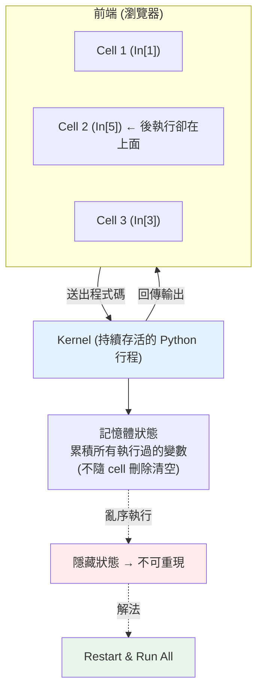

# Jupyter 與資料工作流

> Jupyter Notebook 是資料工作者的預設工作台——寫一段程式、馬上看結果、旁邊配文字與圖。但它的「互動、可保留狀態」既是威力也是陷阱。這章講 Jupyter 的運作模型、好用的功能，以及最重要的一課：如何避免「隱藏狀態」讓你的分析變得不可重現。

## 💡 白話導讀（建議先讀）

Jupyter 的體驗像「一台不關機的計算機」：打一段、馬上看結果，變數一直留在記憶體，
資料載入一次就能反覆把玩——這正是資料探索要的節奏。但**威力和陷阱是同一件事**。

架構先看懂：網頁介面（前端）只負責顯示；真正執行的是背後**一個持續存活的 Python 行程,
叫 kernel**。你每執行一個 cell，程式碼就送進 kernel 跑，狀態**累積**在 kernel 記憶體裡。

「不關機」的三個經典坑，全源於此：

- **殘留狀態**：你刪了 cell,但它定義過的變數**還活在 kernel 裡**——螢幕上看不到的東西
  不代表不存在,像計算機螢幕清了、記憶體 M+ 還存著上次的數字。
- **亂序執行**：cell 可以跳著執行,於是「筆記本由上到下的順序」和「實際執行順序」
  可能完全不同。別人（或一週後的你）照順序跑,直接爆炸。
- **`In [n]` 編號**就是破案線索：它記錄實際執行順序,編號亂跳＝狀態可疑。

解藥只有一帖,養成習慣：**交付前 Restart & Run All**——重啟 kernel、從頭跑到尾,
確保筆記本「照順序執行是成立的」。這是 notebook 界的「對帳」。

這章還講:notebook 與 `.py` 的分工（探索用 notebook,沉澱成模組進版控）、
`%timeit`／`%%time` 等魔法指令、以及 notebook 進 git 的做法（輸出要不要清）。

## Why（為什麼）

一般 Python 程式是「寫完整支 → 執行 → 看結果」。但資料探索是**互動、迭代**的：載入資料看一眼、試個轉換、畫張圖、發現不對再改、又畫一張……。用傳統「改檔→整支重跑」的節奏太慢——每次都要從頭載入大資料。

**Jupyter Notebook** 為此而生：把程式切成一格格 **cell**，每格可獨立執行、立刻看到輸出（表格、圖、數字），而且**變數會留在記憶體裡**跨 cell 共用——載入一次大資料，後面所有 cell 都能直接用。再加上能穿插 Markdown 文字、數學公式、圖表，一份 notebook 就是「可執行的分析報告」。這使它成為資料科學、機器學習、教學、研究的標準工具。

但「保留狀態 + 可任意順序執行」帶來一個嚴重陷阱：**隱藏狀態（hidden state）**——你看到的輸出可能是「以某個你已經忘記的順序」跑出來的，別人（或你自己）重跑卻得不到同樣結果。理解這個陷阱並養成正確習慣，是用好 Jupyter 的關鍵，也是這章的重點。

## Theory（理論：kernel、cell、執行計數）

Jupyter 的架構分兩部分：

- **前端（notebook / JupyterLab）**：你看到的網頁介面，負責顯示 cell、輸出、圖。
- **kernel（核心）**：背後一個**持續存活的 Python 行程**，真正執行程式碼。你按下執行，前端把該 cell 的程式送給 kernel，kernel 執行後把結果傳回顯示。

關鍵在於 **kernel 是有狀態、持續存活的**：它像一個一直開著的 Python REPL（見 [REPL](../01-getting-started/README.md)）。你在 cell 1 定義的變數，會**一直留在 kernel 記憶體裡**，直到你重啟 kernel 或覆寫它。這就是為何能「載入一次、到處用」。

**cell 與執行計數**：每個 code cell 執行後，左側會顯示 `In [n]:` 的編號 `n`——這是**執行順序計數**，不是 cell 的位置順序。`In [5]` 在 `In [3]` 之上，代表它「後執行、但排在上面」。**這個編號是偵測亂序執行的線索**：如果編號不是由上到下遞增，代表你的 notebook 曾亂序執行過，顯示的狀態未必能線性重現。

## Specification（規範：cell、magic、常用操作）

**cell 型別**：

- **Code cell**：執行 Python，輸出顯示在下方。
- **Markdown cell**：寫文字、標題、公式（LaTeX）、清單——做說明與報告。

**執行**：`Shift+Enter`（執行並跳下一格）、`Ctrl+Enter`（執行留原地）。

**魔術指令（magic commands）**：IPython 提供的特殊指令，`%` 開頭作用於單行、`%%` 作用於整個 cell：

- `%timeit expr`：多次執行、量測平均耗時（見 [效能](../18-performance/README.md)）。
- `%%time`：量測整個 cell 執行時間。
- `%matplotlib inline`：把圖嵌進 notebook（見 [視覺化](06-visualization.md)）。
- `%load_ext`、`%run script.py`、`!command`（`!` 執行 shell 指令，如 `!pip install`）。

**顯示**：cell 最後一個運算式的值會自動顯示（DataFrame 會渲染成漂亮的 HTML 表格）；`display(obj)` 可顯示多個。

**關鍵選單**：**Kernel → Restart & Run All**（重啟 kernel、從頭依序跑全部）——驗證可重現性的黃金操作。

## Implementation（底層：隱藏狀態與可重現性）

**隱藏狀態問題**：因為 kernel 狀態持續存在、cell 又能任意順序執行，你的 notebook 顯示的結果，其實是「所有你曾經執行過的 cell、以某個實際順序」累積出來的狀態——這個順序未必等於 cell 由上到下的排列。常見的坑：

- 你定義了變數 `x`，用完後**刪掉了那個 cell**，但 `x` 仍留在 kernel 記憶體裡，後面的 cell 還能用——直到別人重跑，那格不存在了，就 `NameError`。
- 你把某個 cell 改了又跑、跑了又改，中間的變數被覆寫多次，最終狀態沒人說得清怎麼來的。
- cell 亂序執行：先跑下面、再跑上面，結果依賴了「當下的記憶體狀態」而非「程式碼的線性邏輯」。

**唯一可靠的驗證**：**Restart & Run All**。重啟 kernel（清空所有記憶體狀態）、從第一格依序執行到最後一格。如果這樣能得到你看到的結果、且沒有錯誤，這份 notebook 才是可重現的。**交付/分享 notebook 前，一定要 Restart & Run All 通過一次。**

下面的 Code Example 用純 Python 模擬「亂序執行導致結果不同」，讓你在沒有 Jupyter 的情況下也能親眼看到這個陷阱的本質。

## Code Example（可執行的 Python 範例）

```python
# jupyter_hidden_state.py — 模擬 Jupyter 亂序執行的隱藏狀態陷阱（純 stdlib）
# 把三個「cell」寫成函式，各自讀寫共享的 state（模擬 kernel 記憶體）

def cell_a(state):
    state["total"] = 100
    return state

def cell_b(state):
    state["total"] = state.get("total", 0) * 2   # 依賴 cell_a 已先跑
    return state

def cell_c(state):
    state["total"] = state.get("total", 0) + 5
    return state


# 情境 1：作者「以為」的線性順序 A → B → C
s1 = {}
cell_a(s1); cell_b(s1); cell_c(s1)
print("線性順序 A→B→C:", s1["total"])   # 100*2+5 = 205

# 情境 2：實際在 notebook 亂序執行 A → C → B
s2 = {}
cell_a(s2); cell_c(s2); cell_b(s2)
print("亂序 A→C→B:", s2["total"])       # (100+5)*2 = 210 ← 不一樣！

# 情境 3：讀者「Restart & Run All」重新線性跑
s3 = {}
for cell in (cell_a, cell_b, cell_c):
    cell(s3)
print("Restart & Run All:", s3["total"])   # 回到 205

print("\n結論：亂序執行讓 notebook 顯示的結果無法被重現 → 一定要 Restart & Run All 驗證")
```

**預期輸出**：

```pycon
$ python jupyter_hidden_state.py
線性順序 A→B→C: 205
亂序 A→C→B: 210
Restart & Run All: 205

結論：亂序執行讓 notebook 顯示的結果無法被重現 → 一定要 Restart & Run All 驗證
```

逐段解說：

- **cell_a/b/c**：模擬三個 notebook cell，各自讀寫共享的 `state` dict——這個 `state` 就是「kernel 的記憶體」。
- **情境 1（A→B→C）**：這是 cell 由上到下的「應有順序」，`100 * 2 + 5 = 205`。
- **情境 2（A→C→B）**：模擬你在 notebook 裡先跑了下面的 cell、又回頭跑上面——同樣三個 cell、同樣的程式碼，只因**執行順序不同**，結果變成 `(100 + 5) * 2 = 210`。這就是隱藏狀態的危險：畫面顯示 210，但程式碼看起來「應該」是 205。
- **情境 3（Restart & Run All）**：清空狀態、嚴格由上到下重跑，回到 205——**這才是程式碼真正代表的結果**。
- **啟示**：notebook 當下顯示的數字未必對應「乾淨重跑」的結果。交付前務必 Restart & Run All，確保別人（和未來的你）能重現。

## Diagram（圖解：Jupyter 架構與隱藏狀態）



## Best Practice（最佳實踐）

- **交付前一定 Restart & Run All**：確認能從乾淨狀態線性重現、無錯誤。
- **cell 由上到下就是執行順序**：寫成「照著跑一遍就對」的線性邏輯，別依賴亂序狀態。
- **一個 cell 做一件事**：小而聚焦，好讀、好重跑、好除錯。
- **固定隨機種子**（`np.random.default_rng(42)`）：讓含隨機的分析可重現（見 [numpy](02-numpy-vectorization.md)）。
- **用 Markdown cell 說明脈絡**：notebook 是報告，不只是程式。
- **重活抽成 `.py` 模組、notebook 只做編排與呈現**：可測試（見 [測試](../12-testing/README.md)）、可重用、可版控。
- **版控 notebook 前先清輸出**（`jupyter nbconvert --clear-output` 或用 `nbstripout`）：避免龐大輸出/圖塞爆 git diff。
- **量測用 `%timeit`/`%%time`**：探索效能瓶頸（見 [效能](../18-performance/README.md)）。

## Common Mistakes（常見誤解）

- **亂序執行後以為結果可重現**：畫面數字是亂序狀態的產物；別人重跑得到不同結果或報錯。
- **依賴已刪除 cell 遺留的變數**：kernel 還記得，但重跑就 `NameError`。
- **從不 Restart & Run All**：直到交付才發現整份 notebook 跑不起來。
- **把所有邏輯塞進超長 cell**：難重跑、難除錯、難重用。
- **在 notebook 裡寫正式產品邏輯**：難測試、難版控；重活該進 `.py` 模組。
- **commit 帶著大量輸出/圖的 notebook**：git diff 爆炸、review 困難；先清輸出。
- **含隨機卻不固定 seed**：每次結果不同，無法重現與比較。
- **把執行計數 `In [n]` 當成 cell 位置**：它是執行順序，編號跳動正是亂序的警訊。

## Interview Notes（面試重點）

- **能解釋 Jupyter 的 kernel 模型**：持續存活、有狀態的 Python 行程，變數跨 cell 保留。
- **能說清「隱藏狀態 / 亂序執行」的問題與後果**（不可重現），並知道 **Restart & Run All** 是驗證解法。
- **知道執行計數 `In [n]` 是執行順序**，可用來察覺亂序。
- **能講可重現性實務**：固定 seed、線性邏輯、清輸出再版控、重活抽成模組。
- **知道常用 magic**（`%timeit`、`%%time`、`%matplotlib inline`）與 `!` 執行 shell。
- **能談 notebook 的定位與侷限**：適合探索/報告/教學；不適合放正式產品邏輯（該進可測試的 `.py`）。

---

➡️ 下一章：[機器學習入門 scikit-learn](08-machine-learning-intro.md)

[⬆️ 回 Part 17 索引](README.md)
