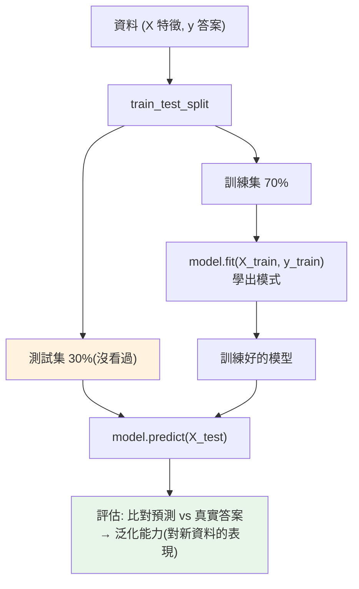

# 機器學習入門 scikit-learn

> 資料清理、分析之後，下一步常是「從資料中學出模型來預測」。**scikit-learn** 是 Python 機器學習的入門標準庫——用一致又簡潔的 API 涵蓋分類、迴歸、分群等經典演算法。這章不深入數學，而是帶你理解機器學習的**工作流程**與 scikit-learn 的**核心 API**，跑出你的第一個模型。

## Why（為什麼）

前面幾章（[numpy](01-numpy-basics.md)、[pandas](03-pandas-basics.md)、[清理](05-data-cleaning.md)）教你**處理**資料。但很多時候目標更進一步——**從資料中學出規律來做預測**：這封 email 是不是垃圾郵件？這筆交易是不是詐欺？這個房子值多少錢？這些是**機器學習（machine learning）** 的問題——不是人寫死規則，而是讓演算法**從歷史資料中學出模式**，再用來預測新資料。

**scikit-learn** 是 Python 機器學習的**入門與原型首選**：

- **一致的 API**：所有模型都是 `fit()`（訓練）+ `predict()`（預測）——換演算法只改一行，學一個等於學會全部。
- **涵蓋經典演算法**：分類、迴歸、分群、降維、模型選擇、前處理——一應俱全。
- **建立在 [numpy](01-numpy-basics.md) 之上**：資料以 numpy 陣列流動，與整個資料生態無縫接。
- **文件與範例極佳**：適合學習與快速驗證想法。

這章的目標**不是教機器學習的數學**（那是一整個領域），而是讓你**理解 ML 的工作流程**（資料 → 訓練 → 評估 → 預測）與 scikit-learn 的**一致 API**，跑出第一個能運作的模型，並認識幾個關鍵陷阱（過擬合、資料洩漏）。深度學習（PyTorch/TensorFlow）是另一個層次，這裡先打好經典 ML 的基礎。

## Theory（理論：監督式學習的流程）

**機器學習的三大類**：

- **監督式學習（supervised）**：資料有「答案（label）」，學「輸入 → 輸出」的映射。**分類（classification）**（輸出是類別，如垃圾/正常）、**迴歸（regression）**（輸出是數值，如房價）。**最常見**。
- **非監督式學習（unsupervised）**：資料沒有答案，找結構。**分群（clustering）**（把相似的分一組）、**降維**。
- **強化學習（reinforcement）**：透過與環境互動、獎懲學習（如下棋、機器人）。

**監督式學習的標準流程**（本章聚焦）：

1. **準備資料**：整理成**特徵矩陣 `X`**（每列一個樣本、每欄一個特徵）與**目標 `y`**（每個樣本的答案）。
2. **切分訓練/測試集（train/test split）**：把資料分成**訓練集**（給模型學）與**測試集**（模型沒看過，用來公正評估）。**關鍵**——用模型沒看過的資料評估，才知道它對**新資料**的真實表現。
3. **訓練（fit）**：模型從訓練集學出模式。
4. **預測（predict）**：對測試集/新資料做預測。
5. **評估（evaluate）**：比對預測與真實答案，算指標（準確率、精確率、召回率、RMSE…）。

**核心觀念——泛化（generalization）**：機器學習的目標不是「背下訓練資料」，而是**對沒見過的新資料也預測得好**。這就是為何要用獨立的測試集評估——在訓練資料上表現好不算數，對新資料好才是真本事。

## Specification（規範：scikit-learn API）

**一致的 estimator API**——所有模型都遵循：

```python
from sklearn.tree import DecisionTreeClassifier

model = DecisionTreeClassifier()   # 1. 建立模型（可設超參數）
model.fit(X_train, y_train)        # 2. 訓練（學）
predictions = model.predict(X_test)  # 3. 預測
model.score(X_test, y_test)        # 4. 評估（回準確率等）
```

**切分資料**：

```python
from sklearn.model_selection import train_test_split
X_train, X_test, y_train, y_test = train_test_split(
    X, y, test_size=0.3, random_state=42   # 30% 當測試集；固定 seed 可重現
)
```

**常見模型**（都是同樣的 fit/predict）：

- 分類：`LogisticRegression`、`DecisionTreeClassifier`、`RandomForestClassifier`、`SVC`、`KNeighborsClassifier`。
- 迴歸：`LinearRegression`、`Ridge`、`RandomForestRegressor`。
- 分群：`KMeans`（非監督，`fit` + `predict`）。

**評估指標**：

```python
from sklearn.metrics import accuracy_score, classification_report, mean_squared_error
accuracy_score(y_test, predictions)          # 分類：準確率
mean_squared_error(y_test, predictions)      # 迴歸：均方誤差
```

**前處理與 Pipeline**：`StandardScaler`（標準化）、`Pipeline`（把前處理 + 模型串成一個）——避免資料洩漏（見 Implementation）。

## Implementation（底層：train/test split、過擬合、資料洩漏）

**為何一定要 train/test split**：如果你用**同一份資料**訓練又評估，模型可能只是「**背下**」了那些資料（記住每個樣本的答案），評估分數很高，但對**新資料**一塌糊塗——這叫**過擬合（overfitting）**。用**獨立的測試集**（模型訓練時沒看過）評估，才能公正衡量「對新資料的泛化能力」。這是機器學習方法論的基石：**永遠用沒看過的資料評估**。`random_state` 固定切分的隨機性，讓結果可重現（見 [Jupyter 可重現性](07-jupyter.md)）。

**過擬合 vs 欠擬合**：

- **過擬合（overfitting）**：模型太複雜，把訓練資料的雜訊也學進去——訓練分數高、測試分數低。像死背考古題卻不懂原理。解法：簡化模型（如限制決策樹深度 `max_depth`）、增加資料、正則化、交叉驗證。
- **欠擬合（underfitting）**：模型太簡單，連訓練資料的規律都學不好——訓練、測試都差。解法：用更強的模型、加特徵。
- 目標是**兩者之間的甜蜜點**——複雜到能學出規律、又不至於背雜訊。

**資料洩漏（data leakage）——隱蔽但致命的錯誤**：如果測試集的資訊「洩漏」進了訓練過程，評估就會虛高（實際部署卻不行）。經典例子：在切分**之前**就對整個資料集做標準化（`StandardScaler.fit`）——這樣訓練時就「偷看」了測試集的統計量（平均、標準差），造成洩漏。**正解**：只在**訓練集**上 `fit` 前處理器，再套用到測試集；用 **`Pipeline`** 把前處理和模型綁在一起，讓交叉驗證自動地在每折內正確處理，避免洩漏。這是 ML 實務最容易犯、也最容易被忽略的錯。

**scikit-learn 的一致 API 為何重要**：因為所有模型都是 `fit`/`predict`，你可以**輕易替換演算法**（把 `DecisionTreeClassifier` 換成 `RandomForestClassifier`，其餘不動）來比較、也能用統一的工具（`GridSearchCV` 調參、`cross_val_score` 交叉驗證、`Pipeline` 串接）套用到任何模型。這個設計讓「嘗試不同模型」變得極簡單。下面範例用經典的鳶尾花資料集訓練一個決策樹分類器。

## Code Example（可執行的 Python 範例）

```python
# ml_intro.py — scikit-learn 監督式學習流程（需要 scikit-learn/numpy）
from __future__ import annotations

from sklearn.datasets import load_iris
from sklearn.metrics import accuracy_score
from sklearn.model_selection import train_test_split
from sklearn.tree import DecisionTreeClassifier


def main() -> None:
    # 1. 準備資料：X 特徵矩陣（150 筆花、4 個特徵）、y 答案（3 種花）
    X, y = load_iris(return_X_y=True)
    print(f"資料：{X.shape[0]} 筆樣本、{X.shape[1]} 個特徵、{len(set(y))} 個類別")

    # 2. 切分訓練/測試集（固定 random_state 可重現）
    X_train, X_test, y_train, y_test = train_test_split(
        X, y, test_size=0.3, random_state=42
    )
    print(f"訓練集 {X_train.shape[0]} 筆、測試集 {X_test.shape[0]} 筆")

    # 3. 訓練：決策樹（限制深度避免過擬合）
    model = DecisionTreeClassifier(max_depth=3, random_state=42)
    model.fit(X_train, y_train)  # 一致的 API：fit 訓練

    # 4. 預測（對模型沒看過的測試集）
    predictions = model.predict(X_test)  # 一致的 API：predict

    # 5. 評估（用沒看過的資料，才是真實表現）
    accuracy = accuracy_score(y_test, predictions)
    print(f"\n測試集準確率 = {accuracy:.3f}")
    print(f"預測前 5 筆 = {predictions[:5].tolist()}")
    print(f"實際前 5 筆 = {y_test[:5].tolist()}")

    # 對新資料預測（一朵花的 4 個特徵）
    new_flower = [[5.1, 3.5, 1.4, 0.2]]
    pred = model.predict(new_flower)
    print(f"\n新樣本預測類別 = {int(pred[0])}")


if __name__ == "__main__":
    main()
```

**預期輸出**：

```pycon
$ python ml_intro.py
資料：150 筆樣本、4 個特徵、3 個類別
訓練集 105 筆、測試集 45 筆

測試集準確率 = 1.000
預測前 5 筆 = [1, 0, 2, 1, 1]
實際前 5 筆 = [1, 0, 2, 1, 1]

新樣本預測類別 = 0
```

逐段解說：

- **1. 準備資料**：鳶尾花資料集——`X` 是 150×4 的特徵矩陣（花萼/花瓣的長寬）、`y` 是每朵花的品種（0/1/2）。這是監督式學習的標準輸入格式。
- **2. 切分**：70% 訓練（105 筆）、30% 測試（45 筆）。`random_state=42` 固定切分，讓結果可重現。
- **3. 訓練（fit）**：`DecisionTreeClassifier(max_depth=3)` 從訓練集學出「怎麼依特徵判斷品種」。`max_depth=3` 限制樹的複雜度，避免過擬合。
- **4. 預測（predict）**：對**模型沒看過的**測試集預測——這才能衡量真實表現。
- **5. 評估**：準確率 1.000（45 筆全對）——注意這是在**測試集**（沒看過的資料）上，所以是可信的。前 5 筆預測與實際完全吻合。
- **對新資料預測**：給一朵新花的 4 個特徵，模型預測品種 0。這就是機器學習的產出——用學到的模式預測新資料。
- **要點**：scikit-learn 的一致 API（`fit`/`predict`）+ 監督式流程（切分 → 訓練 → 用沒看過的資料評估）。準確率要看測試集、留意過擬合與資料洩漏。

## Diagram（圖解：監督式學習流程）



## Best Practice（最佳實踐）

- **永遠用獨立的測試集評估**：訓練集分數會騙人，測試集才是真實表現。
- **固定 `random_state` 可重現**：切分、模型的隨機性都固定，結果可複現。
- **警惕過擬合**：限制模型複雜度（如 `max_depth`）、用交叉驗證、比較訓練 vs 測試分數。
- **避免資料洩漏**：前處理只在訓練集 `fit`、用 `Pipeline` 綁前處理與模型。
- **善用一致 API 快速比較模型**：換一行就試不同演算法。
- **選對評估指標**：不平衡資料別只看準確率（看精確率/召回率/F1）。
- **用交叉驗證（`cross_val_score`）** 得到更穩健的評估，`GridSearchCV` 調超參數。
- **先簡單模型（baseline）再加複雜度**：別一開始就上最複雜的。

## Common Mistakes（常見誤解）

- **用訓練資料評估**：分數虛高，掩蓋過擬合；一定用測試集。
- **資料洩漏**：切分前對全資料做前處理、或用未來資訊——評估虛高、部署翻車。
- **過擬合不自知**：訓練分數 99% 就滿意，測試分數其實很差。
- **不平衡資料只看準確率**：99% 正常 1% 詐欺時，全猜正常也有 99% 準確率卻毫無用處。
- **不固定 random_state**：結果無法重現，難以比較。
- **把 ML 當萬能**：資料少/沒模式時，簡單規則可能更好；ML 不是每個問題的答案。
- **忽略特徵工程**：好特徵常比複雜模型更有效。
- **直接上深度學習**：多數表格資料問題，scikit-learn 的經典模型就夠且更省。

## Interview Notes（面試重點）

- **能講監督式學習流程**：準備 X/y → train/test split → fit → predict → 用測試集評估，並強調泛化。
- **能解釋為何要 train/test split**（避免過擬合、衡量對新資料的真實表現）。
- **能講過擬合 vs 欠擬合**及應對（限制複雜度/加資料 vs 加強模型/特徵）。
- **知道資料洩漏是隱蔽陷阱**（前處理在切分前、用未來資訊），以及 Pipeline 的防護。
- **知道 scikit-learn 的一致 API（fit/predict）** 讓換模型/調參/交叉驗證統一。
- **知道不平衡資料別只看準確率**、要選對指標、交叉驗證更穩健。

---

➡️ 下一章：[polars 高效 DataFrame](09-polars.md)

[⬆️ 回 Part 17 索引](README.md)
