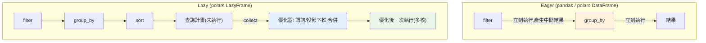

# polars 高效 DataFrame

> [pandas](03-pandas-basics.md) 是資料處理的老大哥，但在大資料與多核時代顯出疲態——單執行緒、記憶體吃重。**polars** 是用 Rust 寫的新一代 DataFrame 函式庫：多核平行、記憶體高效、還有**惰性求值（lazy evaluation）** 能自動優化整條查詢。這章講 polars 的核心優勢、與 pandas 的差異，以及 lazy API。

## 💡 白話導讀（建議先讀）

pandas 像一位手藝精湛的**老師傅**：什麼都會,但**一個人做**（單執行緒）,
而且每道菜上桌前都得把整批食材搬進廚房（記憶體吃重）。資料一大,老師傅就喘。

polars 是新開的**團隊廚房**：Rust 寫的、天生用滿所有 CPU 核心,而且多了一個殺手鐧——
**先看完整份訂單再開火（lazy 惰性求值）**。

- **pandas（eager,急切）**：每來一道指令就立刻做——讀全檔、過濾、選欄,每步都真的執行、
  每步都留中間結果。
- **polars（lazy）**：`pl.scan_csv(...)` 之後的每個操作都只是**記在計畫上**,
  直到 `.collect()` 才動手。這時優化器把整條計畫看一遍:
  「最後只要 3 欄?那讀檔時就只讀 3 欄（投影下推）。
  有 filter?推到最前面,先濾再算（謂詞下推）。」——像聰明的主廚重排工序,
  常常快一個數量級、記憶體省一大截。

（似曾相識?這正是[資料庫查詢優化器](../15-database/06-query-processing.md)與
[生成器惰性求值](../07-iterators-generators/README.md)的同一個思想:**晚點執行,才有優化空間**。）

語法上 polars 用**表達式（expression）**風格:`pl.col("age") > 30` 是「描述」不是「執行」,
組合起來交給引擎。這章講 eager/lazy 兩種模式、與 pandas 的對照表、以及何時值得切換
（大檔、多核機器、管線長）——pandas 不會消失,但 polars 值得進你的工具箱。

## Why（為什麼）

[pandas](03-pandas-basics.md) 是 Python 資料處理的事實標準、生態成熟。但它誕生於單核時代，有些先天限制在今日的大資料場景浮現：

- **單執行緒**：pandas 多數操作只用一個 CPU 核——8 核機器閒置 7 核。
- **記憶體吃重**：中間結果常複製整份資料，處理大於記憶體的資料吃力。
- **急切求值（eager）**：每一步立刻執行，無法看到「整條查詢」來做全域優化——你寫 `df.filter(...).groupby(...)`，pandas 先算完 filter（產生完整中間 DataFrame）再算 groupby，即使有更省的執行順序。

**polars** 是為現代硬體重新設計的 DataFrame 函式庫，用 **Rust** 撰寫、基於 **Apache Arrow** 記憶體格式：

- **多核平行**：預設用所有 CPU 核平行處理——大資料快數倍到數十倍。
- **記憶體高效**：Arrow 的列式（columnar）格式 + 零複製，省記憶體。
- **惰性求值（lazy）**：可以先**建立整條查詢的計畫**、最後才執行，讓 polars 的**查詢優化器**重排/合併操作（如把 filter 下推、只讀需要的欄）——像資料庫的查詢優化。
- **表達式 API**：`pl.col("x") * 2` 這種表達式可平行、可組合、可優化。

polars 不是要取代 pandas（pandas 生態仍龐大），而是在**大資料、效能敏感**的場景提供更快的選擇，且 API 相近好上手。這章講它的核心優勢與用法，讓你在需要時能選對工具。

## Theory（理論：eager vs lazy、列式與 Arrow）

**急切（eager）vs 惰性（lazy）求值**——polars 最大的特色：

- **Eager（急切，同 pandas）**：每個操作**立刻執行**，回傳結果。直覺、好除錯，但無法全域優化。polars 的 `DataFrame` 是 eager 的。
- **Lazy（惰性）**：操作只**建立查詢計畫（query plan）**，不立刻執行；直到你呼叫 `.collect()`，polars 的**優化器**才分析整條計畫、重排優化、然後一次執行。polars 的 `LazyFrame`（`df.lazy()` 或 `pl.scan_csv()`）是 lazy 的。**大資料時 lazy 通常快得多**。

**惰性求值的優化**（像 SQL 查詢優化器）：

- **謂詞下推（predicate pushdown）**：把 filter 盡量往前推——如從 CSV 讀取時就只讀符合條件的列，而非全讀再過濾。
- **投影下推（projection pushdown）**：只讀/處理實際用到的欄，跳過無關欄。
- **操作合併**：把多個步驟合併成更少的遍歷。

**列式儲存（columnar）+ Apache Arrow**：polars 用 Arrow 的**列式**記憶體格式——同一欄的資料連續存放（相對 pandas 早期的列式/區塊混合）。好處：對「整欄運算」（多數資料操作）快取友善、易向量化與平行、且 Arrow 是跨語言標準（與其他 Arrow 生態零複製互通）。這呼應 [numpy 的連續記憶體](01-numpy-basics.md) 為何快的原理，但擴展到多欄異質的 DataFrame。

## Specification（規範：polars API）

**建立與 eager 操作**（API 與 pandas 相近）：

```python
import polars as pl

df = pl.DataFrame({"city": [...], "amount": [...]})
df.filter(pl.col("amount") > 100)                 # 過濾
df.group_by("city").agg(pl.col("amount").sum())   # 分組聚合
df.sort("amount", descending=True)                # 排序
df.select(pl.col("amount") * 2)                    # 選欄/運算
df.with_columns((pl.col("amount") * 1.1).alias("with_tax"))  # 加欄
```

**表達式（expression）**——polars 的核心：`pl.col("x")` 開頭的可組合運算，能平行執行：

```python
pl.col("amount").sum()                  # 聚合
pl.col("amount") * 2                     # 逐元素
pl.col("amount").filter(pl.col("amount") > 100).mean()  # 條件聚合
(pl.col("a") + pl.col("b")).alias("c")   # 組合
```

**惰性 API**（大資料/效能場景）：

```python
result = (
    pl.scan_csv("big.csv")              # 惰性讀取（不立刻載入）
    .filter(pl.col("amount") > 100)     # 建立計畫（謂詞下推）
    .group_by("city").agg(pl.col("amount").sum())
    .sort("city")
    .collect()                          # 到這裡才執行（優化後一次跑）
)
```

**與 pandas 互通**：`df.to_pandas()` / `pl.from_pandas(pdf)`——可漸進採用。

## Implementation（底層：lazy 優化與多核）

**lazy 為何能大幅加速**：考慮「讀一個 10GB CSV、過濾 `amount > 100`、依 city 分組加總」。**Eager（pandas 風格）**：先把 10GB 全讀進記憶體 → 過濾（產生中間 DataFrame）→ 分組。整份資料進記憶體、多次遍歷。**Lazy（polars）**：`scan_csv` + filter + group_by 只建立**計畫**，`collect` 時優化器看到「你最後只要 city 的總和、且只要 amount>100 的列」，於是：**謂詞下推**——讀 CSV 時就跳過 amount≤100 的列（不進記憶體）；**投影下推**——只讀 city 與 amount 兩欄（若 CSV 有 50 欄，其餘 48 欄根本不讀）。結果是**讀更少資料、遍歷更少次、用更少記憶體**——大資料時差距可達數十倍。這正是「看到整條查詢才能全域優化」的價值，和資料庫查詢優化器同理。

**多核平行為何有效**：DataFrame 的多數操作（欄運算、group_by、join、排序）**天生可平行**——不同欄可同時處理、group_by 可把資料分片給多核各自聚合再合併。polars 用 Rust 的無 GIL 平行（不受 Python [GIL](../09-concurrency/README.md) 限制，因為運算在 Rust 層）把工作分給所有 CPU 核。這是相對 pandas（單執行緒、且 Python 層受 GIL）的根本優勢——同樣的 group_by，polars 用 8 核、pandas 用 1 核。

**何時用 polars vs pandas**：pandas 生態龐大（與 [scikit-learn](08-machine-learning-intro.md)、matplotlib、無數套件整合）、資料量小時差異不大、且大量既有程式碼。polars 在**大資料、效能敏感、複雜查詢**時優勢明顯。實務可**互通漸進採用**——用 polars 做重活的 ETL、再 `to_pandas()` 接既有生態。下面範例展示 polars 的 eager 與 lazy 操作。

## Code Example（可執行的 Python 範例）

```python
# polars_demo.py — polars eager 與 lazy 查詢（需要 polars；ASCII 安全輸出）
from __future__ import annotations

import polars as pl


def main() -> None:
    df = pl.DataFrame(
        {
            "city": ["Taipei", "Tokyo", "Taipei", "Osaka", "Tokyo"],
            "amount": [100, 200, 150, 80, 300],
        }
    )
    print(f"shape = {df.shape}, columns = {df.columns}")

    # Eager：立刻執行的分組聚合（表達式 API）
    by_city = (
        df.group_by("city")
        .agg(pl.col("amount").sum().alias("total"))
        .sort("city")
    )
    print(f"每城市總額(eager): {by_city.to_dicts()}")

    # Lazy：建立查詢計畫，collect 時才優化並執行
    lazy_result = (
        df.lazy()
        .filter(pl.col("amount") > 100)  # 謂詞（優化器可下推）
        .group_by("city")
        .agg(pl.col("amount").sum().alias("total"))
        .sort("city")
        .collect()  # 到這裡才執行
    )
    print(f"lazy(amount>100 分組): {lazy_result.to_dicts()}")

    # 表達式：加一個含稅欄
    with_tax = df.with_columns(
        (pl.col("amount") * 1.05).round(1).alias("with_tax")
    )
    print(f"加含稅欄前 3 筆: {with_tax.head(3).to_dicts()}")

    print(f"總額 = {df['amount'].sum()}")


if __name__ == "__main__":
    main()
```

**預期輸出**：

```pycon
$ python polars_demo.py
shape = (5, 2), columns = ['city', 'amount']
每城市總額(eager): [{'city': 'Osaka', 'total': 80}, {'city': 'Taipei', 'total': 250}, {'city': 'Tokyo', 'total': 500}]
lazy(amount>100 分組): [{'city': 'Taipei', 'total': 150}, {'city': 'Tokyo', 'total': 500}]
加含稅欄前 3 筆: [{'city': 'Taipei', 'amount': 100, 'with_tax': 105.0}, {'city': 'Tokyo', 'amount': 200, 'with_tax': 210.0}, {'city': 'Taipei', 'amount': 150, 'with_tax': 157.5}]
總額 = 830
```

逐段解說：

- **Eager 分組**：`group_by("city").agg(pl.col("amount").sum())` 立刻執行，得每城市總額。用**表達式** `pl.col("amount").sum()` 描述聚合——可平行、可組合。
- **Lazy 查詢**：`df.lazy()...collect()`——中間的 `filter`/`group_by`/`sort` 只**建立計畫**，`collect()` 時 polars 優化器分析整條、下推謂詞（`amount>100`）、然後一次執行。注意結果：Taipei 只算 150（100 被 filter 掉）、Tokyo 500，Osaka（80）整個被排除。大資料時這種下推能省下大量 I/O 與記憶體。
- **表達式加欄**：`with_columns((pl.col("amount") * 1.05).round(1))` 用表達式算含稅欄——簡潔、可平行。
- **輸出用 `to_dicts()`**：polars 的漂亮表格用 Unicode 框線字元，在某些終端（如 Windows cp950）印不出（見 [編碼](../02-fundamentals/16-encoding-bytes.md)），故用 `to_dicts()` 輸出 ASCII 安全的資料。
- **要點**：polars 的 eager API 與 pandas 相近好上手；lazy API 讓優化器全域優化（下推）；表達式讓運算平行組合。大資料/效能場景是 pandas 的有力替代。

## Diagram（圖解：eager vs lazy）



## Best Practice（最佳實踐）

- **大資料/效能敏感用 polars、小資料或需既有生態用 pandas**：適材適所。
- **大資料用 lazy API（`scan_*` + `collect`）**：讓優化器下推謂詞/投影，省 I/O 與記憶體。
- **用表達式（`pl.col(...)`）而非逐列處理**：可平行、可組合、可優化。
- **從檔案讀取用 `scan_csv`/`scan_parquet`（惰性）** 而非 `read_*`（急切）於大檔。
- **與 pandas 互通漸進採用**：polars 做重活 ETL、`to_pandas()` 接既有生態（scikit-learn 等）。
- **善用 Parquet 等列式格式**：與 polars/Arrow 的列式模型契合、又快又小。
- **善用多核**：polars 預設平行，讓大工作跑滿 CPU。
- **需要時檢視查詢計畫**（`.explain()`）：理解優化器做了什麼。

## Common Mistakes（常見誤解）

- **無腦全用 pandas**：大資料下單執行緒、記憶體吃重，polars 快數倍。
- **大資料用 eager 而非 lazy**：錯過謂詞/投影下推，全讀全處理。
- **在 polars 裡套 pandas 的逐列 apply 習慣**：失去平行與優化；用表達式。
- **大檔用 `read_csv` 全載入**：該用 `scan_csv` 惰性 + 下推。
- **忽略 polars 表格在某些終端印不出**（Unicode 框線）：用 `to_dicts()`/寫檔或 UTF-8 終端。
- **以為 polars 要完全取代 pandas**：pandas 生態龐大，兩者互補、可互通。
- **不用 Parquet 卻抱怨 CSV 慢**：CSV 是文字格式、慢；列式的 Parquet 快得多。
- **lazy 忘了 `collect()`**：只建計畫沒執行，拿到的是 LazyFrame 不是結果。

## Interview Notes（面試重點）

- **能說出 polars 相對 pandas 的優勢**：多核平行、Arrow 列式記憶體高效、惰性求值可全域優化。
- **能解釋 eager vs lazy**：立刻執行 vs 建計畫後優化再執行，以及 lazy 的下推優化（謂詞/投影）。
- **能講「看到整條查詢才能全域優化」**（同資料庫查詢優化器）與其省 I/O/記憶體的價值。
- **知道 polars 用 Rust（無 GIL 平行）、基於 Apache Arrow 列式格式**。
- **能給選型**：大資料/效能用 polars、小資料/既有生態用 pandas，且可互通漸進採用。
- **知道表達式 API、`scan_*` 惰性讀取、Parquet 列式格式** 的角色。

---

⬅️ 這是 Part 17 的最後一章。


➡️ 下一章：[Part 17 統整：資料處理與科學計算全貌](10-summary.md)

[⬆️ 回 Part 17 索引](README.md)
