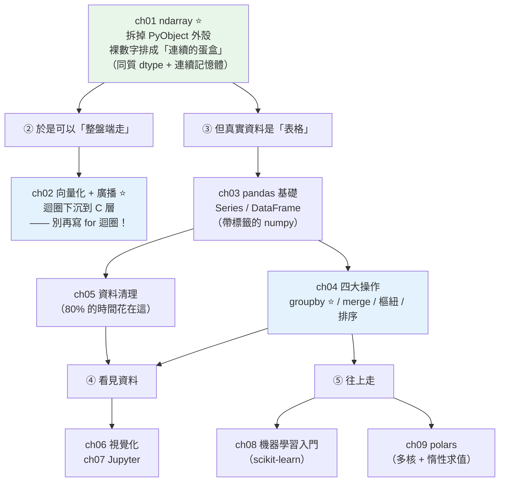

# Part 17 統整：資料處理與科學計算全貌

> 把這 9 章串成一張圖——numpy 做了一件「反 Python」的事：**它把物件的盒子全拆了**。而這一拆，換來了速度與記憶體。

## 🗺️ 知識地圖（這 9 章怎麼串起來）

Part 17 的一切，都從**一個違反 Python 直覺的決定**長出來：

[Part 10 說「一切皆物件」](../10-cpython-internals/01-everything-is-object.md)——
每個 `int` 都是一個完整的 `PyObject`（28 bytes，帶型別、帶引用計數），
而 `list` 存的只是**指向它們的指標**，物件散落在記憶體各處。

**numpy 把這一切推翻了**：



**一句話串起來**：

**[ndarray](01-numpy-basics.md)**（ch01）把「一百萬個裝著數字的盒子」
變成「**一條連續的蛋盒，只放裸數字**」。
這帶來兩個結果：**省記憶體**（沒有 PyObject 外殼）、**快**（CPU 快取友善、可在 C 層跑迴圈）。

於是就有了 **[向量化](02-numpy-vectorization.md)**（ch02）——
**`arr * 2 + 1` 一行取代整個 for 迴圈**。
（**在 numpy 陣列上寫 `for` 迴圈，等於買了跑車推著走。**）

但真實世界的資料不是純數字陣列，而是**有欄名、有缺失、混型別的表格**——
這就是 **[pandas](03-pandas-basics.md)**（ch03）：**帶標籤的 numpy**。
它的日常是四大操作（ch04，**核心是 groupby 的 split-apply-combine**）
與資料清理（ch05，**分析師 80% 的時間花在這裡**）。

## ⚡ 速查表（什麼情境用什麼）

| 情境 | 怎麼做 | 章節 |
|------|--------|------|
| **對一堆數字做運算** | **向量化**：`arr * 2 + 1`——**別寫 `for` 迴圈** | [ch02](02-numpy-vectorization.md) |
| 條件式運算（if/else 套在陣列上） | `np.where(cond, a, b)` | [ch02](02-numpy-vectorization.md) |
| 形狀不同的陣列要運算 | **廣播**（自動「拉伸」小的去配大的） | [ch02](02-numpy-vectorization.md) |
| 讀 CSV / Excel | `pd.read_csv(...)` | [ch03](03-pandas-basics.md) |
| 看資料長什麼樣 | `df.head()` / `df.info()` / `df.describe()` 三板斧 | [ch03](03-pandas-basics.md) |
| **選資料** | **`loc`（按標籤）vs `iloc`（按位置）**——口訣：**l**oc 看 **l**abel | [ch03](03-pandas-basics.md) |
| **「每個城市各賣多少」** | **`df.groupby("city")["amount"].sum()`**（split-apply-combine） | [ch04](04-dataframe-operations.md) |
| 一次算多個統計 | `.agg(["sum", "mean", "count"])` | [ch04](04-dataframe-operations.md) |
| **每列旁邊附上「所屬組的統計」**（算佔比） | **`transform`**（列數不變！**不是 `agg`**） | [ch04](04-dataframe-operations.md) |
| 把兩張表接起來 | `pd.merge(a, b, on="key", how="left")` | [ch04](04-dataframe-operations.md) |
| 長表變寬表（做報表） | `pivot_table`；反過來用 `melt` | [ch04](04-dataframe-operations.md) |
| **偵測缺失值** | **`df.isna()`**——**不能用 `== NaN`**（`NaN != NaN`！） | [ch05](05-data-cleaning.md) |
| 補缺失值 | `fillna(df["x"].median())`——**偏態資料用中位數，別用平均** | [ch05](05-data-cleaning.md) |
| 「數字被讀成字串了」 | `astype(int)` / `pd.to_numeric` / `pd.to_datetime` | [ch05](05-data-cleaning.md) |
| 畫圖 | matplotlib：**`fig, ax = plt.subplots()`** 物件導向風格 | [ch06](06-visualization.md) |
| 探索資料 | Jupyter——但**交付前一定 Restart & Run All** | [ch07](07-jupyter.md) |
| 從資料學出模型 | scikit-learn：`fit` → `predict`（**別用訓練資料評估**） | [ch08](08-machine-learning-intro.md) |
| 資料大到 pandas 跑不動 | **polars**（多核 + **惰性求值**：先看完整份計畫再開火） | [ch09](09-polars.md) |

## 🔑 核心心智模型（帶得走的幾句話）

- **ndarray ＝ 拆掉盒子的連續蛋盒。** 同質（同一個 `dtype`）、連續記憶體——
  這兩個特性就是它快的**全部原因**，也解釋了它的所有限制
  （不能混型別、改大小要重建）。
- **在 numpy 陣列上寫 `for` 迴圈 ＝ 買了跑車推著走。**
  逐一取值時，numpy 得把裸數字**重新裝回 Python 盒子**給你——**比純 list 還慢**。
  永遠問自己：**「這能不能向量化？」**（答案幾乎總是能。）
- **pandas ＝ 帶標籤的 numpy。** 它按「名字」（index）辦事，不是按位置——
  兩個 Series 相加時會**自動對齊 index**（像按學號發考卷，不是按座位）。
- **`groupby` 只有一個心智模型：split-apply-combine。**
  分堆 → 每堆算 → 合併。所有變體都是它換參數。
- **`agg` 壓縮、`transform` 不壓縮。** 要「每組一個數」用 `agg`；
  要「每列旁邊附上組的統計」（算佔比）用 **`transform`**——**選錯是新手頭號 bug**。
- **`NaN != NaN`。** 所以偵測缺失**永遠用 `isna()`**，不能用 `== NaN`。
  而且 `NaN` 有**傳染性**：`NaN + 1` 還是 `NaN`。

## 🛠️ 小實作：向量化的威力 + 一條 pandas 分析管線

```python
# data_science_demo.py —— Part 17 主線：拆掉盒子 → 整盤端走 → 表格分析
from __future__ import annotations

import sys
import time

import numpy as np
import pandas as pd


def vectorization_speed(n: int = 2_000_000) -> None:
    """ch01/ch02：連續蛋盒 + 整盤端走。"""
    py_list = list(range(n))
    np_arr = np.arange(n)

    start = time.perf_counter()
    _ = [x * 2 + 1 for x in py_list]        # Python 迴圈：每個數字都是一個「盒子」
    loop_time = time.perf_counter() - start

    start = time.perf_counter()
    _ = np_arr * 2 + 1                      # 向量化：迴圈下沉到 C 層
    vec_time = time.perf_counter() - start

    print(f"    Python 迴圈 : {loop_time * 1000:7.1f} ms")
    print(f"    numpy 向量化: {vec_time * 1000:7.1f} ms")
    print(f"    → 快了 {loop_time / vec_time:.0f} 倍")

    # 記憶體：list 的真實佔用 = 指標陣列 + 每個 int 物件本身（各 28 bytes）
    pointers = sys.getsizeof(py_list)
    objects = sum(sys.getsizeof(x) for x in py_list)
    print(f"\n    list  指標陣列 : {pointers:>12,} bytes")
    print(f"          + int 物件: {objects:>12,} bytes  ← 每個數字都是一個 PyObject")
    print(f"          = 真實總計: {pointers + objects:>12,} bytes")
    print(f"    ndarray        : {np_arr.nbytes:>12,} bytes  ← 只有裸數字，沒有外殼")
    print(f"    → 省了 {(pointers + objects) / np_arr.nbytes:.1f} 倍記憶體")


def pandas_pipeline() -> None:
    """ch03/ch04/ch05：讀 → 清 → 分組聚合。"""
    df = pd.DataFrame(
        {
            "city": ["台北", "台北", "台中", "高雄", "台中", "台北"],
            "product": ["A", "B", "A", "B", "B", "A"],
            "amount": [100, 250, np.nan, 300, 150, 200],
        }
    )
    print(f"    原始資料 {len(df)} 筆, 缺失值 {int(df['amount'].isna().sum())} 個")

    # ch05 清理：用「中位數」補（不是平均——平均會被極端值拉走）
    df["amount"] = df["amount"].fillna(df["amount"].median())

    # ch04 groupby：split-apply-combine（agg 會「壓縮」成每組一列）
    result = (
        df.groupby("city")["amount"]
        .agg(["sum", "mean", "count"])
        .sort_values("sum", ascending=False)
    )
    print("\n    依城市分組聚合（agg：壓縮成每組一列）:")
    for line in result.to_string().splitlines():
        print(f"      {line}")

    # transform：不壓縮！每列旁邊附上「該城市總額」→ 才能算佔比
    df["city_total"] = df.groupby("city")["amount"].transform("sum")
    df["pct"] = (df["amount"] / df["city_total"] * 100).round(1)
    print("\n    每筆佔該城市的比例（transform：列數不變）:")
    for line in df[["city", "amount", "pct"]].to_string(index=False).splitlines():
        print(f"      {line}")


def demo() -> None:
    print("【ch01/ch02 numpy 向量化】200 萬個數字做 x*2+1")
    vectorization_speed()
    print("\n【ch03-ch05 pandas 分析管線】")
    pandas_pipeline()


if __name__ == "__main__":
    demo()
```

**預期輸出**（時間依機器而異）：

```pycon
$ python data_science_demo.py
【ch01/ch02 numpy 向量化】200 萬個數字做 x*2+1
    Python 迴圈 :   127.0 ms
    numpy 向量化:    24.0 ms
    → 快了 5 倍

    list  指標陣列 :   16,000,056 bytes
          + int 物件:   56,000,000 bytes  ← 每個數字都是一個 PyObject
          = 真實總計:   72,000,056 bytes
    ndarray        :   16,000,000 bytes  ← 只有裸數字，沒有外殼
    → 省了 4.5 倍記憶體

【ch03-ch05 pandas 分析管線】
    原始資料 6 筆, 缺失值 1 個

    依城市分組聚合（agg：壓縮成每組一列）:
                sum        mean  count
      city
      台北    550.0  183.333333      3
      台中    350.0  175.000000      2
      高雄    300.0  300.000000      1

    每筆佔該城市的比例（transform：列數不變）:
      city  amount   pct
        台北   100.0  18.2
        台北   250.0  45.5
        台中   200.0  57.1
        高雄   300.0 100.0
        台中   150.0  42.9
        台北   200.0  36.4
```

**三個值得停下來看的地方**：

**① 記憶體的差距，暴露了 numpy 的本質。**

```text
list    = 16 MB（指標）+ 56 MB（200 萬個 PyObject × 28 bytes）= 72 MB
ndarray = 16 MB（就只有裸數字）
```

Python 的 `list` 存的是**指標**，指向散落各處的 `int` 物件——
**每個數字都背著 28 bytes 的 PyObject 外殼**（型別指標、引用計數…見 [Part 10](../10-cpython-internals/02-object-model.md)）。
numpy **把外殼全拆了**，只留裸數字，肩並肩排好。
**這一拆，同時換來了記憶體與速度**（連續記憶體對 CPU 快取極友善）。

**② `agg` 和 `transform` 的差別，一眼看出來。**

- **`agg`** → 三個城市，**壓縮成 3 列**。
- **`transform`** → **原本 6 列，還是 6 列**——每列旁邊多了「該城市總額」，
  所以才能算出「這筆佔該城市的百分比」。

**要算佔比就必須用 `transform`**——用 `agg` 會得到 3 列，貼不回原本的 6 列。
**這是 pandas 新手最常見的錯誤。**

**③ 缺失值用「中位數」補，不是平均。**
台中那筆 `NaN` 補的是中位數 200。**偏態資料用平均會被極端值拉走**
（一個郭台銘走進來，全店「平均」變億萬富翁——見 [Part 24](../24-business-analytics/01-descriptive-stats.md)）。

## ✅ 自測清單（答不出來就回去讀）

- [ ] ndarray 和 list 的根本差別是什麼？（提示：盒子）（[ch01](01-numpy-basics.md)）
- [ ] 為什麼 numpy 陣列不能混型別？為什麼改大小要重建？（[ch01](01-numpy-basics.md)）
- [ ] 為什麼在 numpy 陣列上寫 `for` 迴圈比純 list 還慢？（[ch02](02-numpy-vectorization.md)）
- [ ] 廣播（broadcasting）的規則是什麼？（[ch02](02-numpy-vectorization.md)）
- [ ] pandas 的 index 有什麼特別？「自動對齊」是什麼意思？（[ch03](03-pandas-basics.md)）
- [ ] `loc` 和 `iloc` 差在哪？（[ch03](03-pandas-basics.md)）
- [ ] split-apply-combine 是什麼？（[ch04](04-dataframe-operations.md)）
- [ ] **`agg` 和 `transform` 差在哪？要算「佔比」該用哪個？**（[ch04](04-dataframe-operations.md)）
- [ ] 為什麼偵測缺失值不能用 `== NaN`？（[ch05](05-data-cleaning.md)）
- [ ] 補缺失值該用平均還是中位數？看什麼決定？（[ch05](05-data-cleaning.md)）
- [ ] matplotlib 的 `Figure` 和 `Axes` 分別是什麼？（陷阱：Axes 不是「軸線」）（[ch06](06-visualization.md)）
- [ ] Jupyter 的「殘留狀態」與「亂序執行」為什麼危險？解藥是什麼？（[ch07](07-jupyter.md)）
- [ ] 為什麼不能用訓練資料評估模型？（[ch08](08-machine-learning-intro.md)）
- [ ] polars 的「惰性求值」帶來什麼好處？（[ch09](09-polars.md)）

## 🎯 面試速查

| 考點 | 面試官想聽到什麼 | 章節 |
|------|------------------|------|
| **numpy 為什麼比 list 快？** | 「三個原因疊加：① **連續記憶體 + 同質 dtype**——沒有 PyObject 外殼（一個 int 物件要 28 bytes），對 **CPU 快取友善**；② **向量化**——迴圈跑在**編譯過的 C 層**，沒有直譯器開銷；③ **不必拆裝箱**。我實測過：200 萬個數字，記憶體 **72 MB → 16 MB**。」 | [ch01](01-numpy-basics.md)、[ch02](02-numpy-vectorization.md) |
| **什麼是向量化？** | 「用『**對整個陣列的表示式**』取代『逐元素的 Python 迴圈』，把迴圈**下沉到 C 層**。`arr * 2 + 1` 背後是 **ufunc**。反過來說：**在 numpy 陣列上寫 `for` 迴圈是反模式**——逐一取值時得把裸數字重新裝回 Python 物件，比純 list 還慢。」 | [ch02](02-numpy-vectorization.md) |
| **`agg` vs `transform`？**（pandas 高頻） | 「**`agg` 會壓縮**（N 列 → 每組一列），**`transform` 不壓縮**（列數不變，每列旁邊附上所屬組的統計）。**要算『每筆佔該組的比例』就必須用 `transform`**——用 `agg` 會得到組數那麼多列，貼不回原資料。」 | [ch04](04-dataframe-operations.md) |
| **pandas 的 index 有什麼用？** | 「它讓**對齊（alignment）** 成為可能——兩個 Series 相加時，pandas **按 index 對齊**，不是按位置（像按學號發考卷）。這很貼心，但也會嚇到新手：對不上的 index 會產生 `NaN`。」 | [ch03](03-pandas-basics.md) |
| **`NaN` 有什麼特性？** | 「① **不等於自己**（`NaN == NaN` 是 `False`）——所以偵測缺失**必須用 `isna()`**；② **有傳染性**（`NaN + 1` 還是 `NaN`）；③ 傳統上**整數欄一出現缺失就會被升級成 float**（新的 `Int64` 可空型別可解）。」 | [ch05](05-data-cleaning.md) |
| **pandas 慢怎麼辦？** | 「先確認有沒有**在用迴圈／`apply`**（能向量化就向量化）。真的資料太大，換 **polars**——Rust 寫的、**天生多核**，而且支援**惰性求值**（先建查詢計畫、做謂詞／投影下推，再一次執行），常快一個數量級。」 | [ch09](09-polars.md) |

---

🎉 **恭喜完成 Part 17！** 你會用 Python 處理資料了——
而且知道 numpy 快在哪（**它把盒子拆了**）。

接下來 [Part 18 效能優化](../18-performance/README.md) 要問一個更根本的問題：
**你怎麼知道「哪裡」慢？**
——工程師對「哪裡慢」的直覺出錯率高得驚人。
**優化的第一守則：先量測，別猜。**

➡️ 下一 Part：[效能優化 Performance](../18-performance/README.md)

[⬆️ 回 Part 17 索引](README.md)
