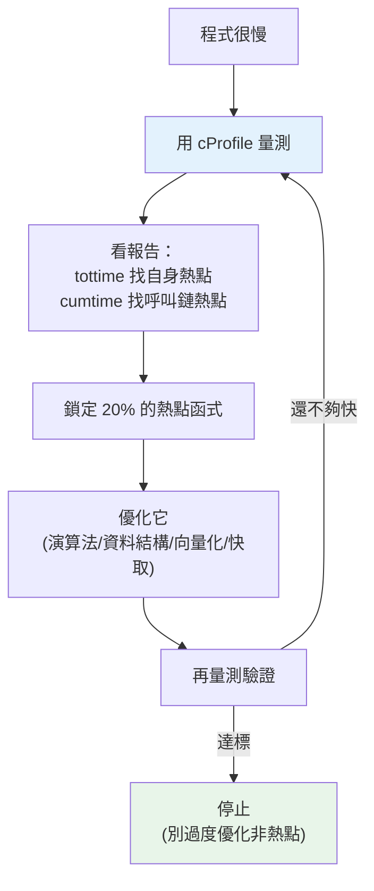

# cProfile 與 profiling

> 優化的第一守則：**先量測，別猜**。工程師對「哪裡慢」的直覺常常是錯的——真正的瓶頸往往在你沒想到的地方。這章講 Python 內建的 profiler `cProfile`：怎麼找出程式真正的熱點（hotspot），把優化力氣花在刀口上。

## Why（為什麼）

假設你的程式跑很慢，你「覺得」是那個複雜的數學運算拖累的，於是花三天優化它——結果快不到 1%。因為真正的瓶頸其實是某個被呼叫幾百萬次的小函式，或一個藏在迴圈裡的資料庫查詢。這就是**憑直覺優化**的下場：**把力氣花在不痛的地方**。

軟體工程有兩句名言貫穿效能優化：

- **「過早優化是萬惡之源」**（Donald Knuth）——在還沒確認瓶頸前就到處優化，只會讓程式更複雜、更難維護，卻沒變快。
- **「先量測」**——優化前必須用資料找出真正的熱點。

**profiling（效能剖析）** 就是「量測程式各部分耗時、找出瓶頸」的技術。Python 內建 `cProfile`，能告訴你每個函式被呼叫幾次、各花多少時間、誰呼叫誰。有了這份資料，你才知道該優化哪裡——通常符合 **80/20 法則**：80% 的時間花在 20%（甚至更少）的程式碼上。找出那 20%，優化它，其餘不用碰。這章教你怎麼用 `cProfile` 找出那關鍵的一小段。

## Theory（理論：兩種 profiler）

profiler 大致分兩類：

- **確定性 profiler（deterministic）**：追蹤每一次函式呼叫與返回，精確記錄呼叫次數與耗時。`cProfile` 屬於此類。**精確但有額外開銷**（程式會比平常慢，因為每次呼叫都被記錄）。
- **取樣 profiler（sampling / statistical）**：定期「抽查」目前在執行哪個函式，用統計推估耗時分布。**開銷低、適合正式環境**，但不精確、看不到呼叫次數。如 `py-spy`、`scalene`（第三方）。

Python 標準庫提供兩個確定性 profiler：

- **`cProfile`**：C 實作，開銷較小，**日常首選**。
- **`profile`**：純 Python 實作，開銷大，但可擴充（很少用）。

**profiling 的兩種粒度**：

- **函式級（function-level）**：`cProfile` 給的——哪個「函式」耗時最多。找宏觀瓶頸用這個。
- **行級（line-level）**：`line_profiler`（第三方）給的——某函式內「哪一行」最慢。鎖定函式後再深入用這個。

先用 `cProfile` 找出熱點函式，需要時再用 `line_profiler` 深入該函式的哪一行。

## Specification（規範：cProfile 用法）

**最快的用法**（直接印報告）：

```python
import cProfile
cProfile.run("workload()")            # 執行並印出各函式統計
cProfile.run("workload()", "out.prof")  # 存成檔案供後續分析
```

**命令列**（不改程式，profile 整支腳本）：

```bash
python -m cProfile -s cumulative myscript.py   # 依累積時間排序
python -m cProfile -o out.prof myscript.py     # 存檔
```

**用 `Profile` 物件 + `pstats` 分析**（最靈活）：

```python
import cProfile, pstats
pr = cProfile.Profile()
pr.enable()
workload()
pr.disable()
stats = pstats.Stats(pr)
stats.sort_stats("cumulative").print_stats(10)  # 前 10 名
```

**報告欄位**（關鍵）：

- **`ncalls`**：呼叫次數。
- **`tottime`**：函式**自身**耗時（不含它呼叫的子函式）——找「這個函式本身」的熱點看這欄。
- **`cumtime`**：**累積**耗時（含子函式）——找「這條呼叫鏈」的熱點看這欄。
- **`percall`**：平均每次呼叫耗時。

**排序準則**：`tottime` 找「哪個函式本身最花時間」；`cumtime` 找「哪個進入點/呼叫鏈總耗時最多」。

## Implementation（底層：cProfile 如何運作）

`cProfile` 掛在 CPython 的**函式呼叫事件**上。CPython 直譯器執行 bytecode 時，每當發生 `call`（進入函式）與 `return`（離開函式）事件，就通知 profiler；`cProfile` 用 C 記錄時間戳與計數。因此：

- **它看得到每次函式呼叫**——精確的 `ncalls` 與各函式耗時。
- **它有 per-call 開銷**——每次呼叫都多做記錄，所以 profile 下的絕對時間比實際慢；**但相對比例仍可靠**（找瓶頸看比例，不看絕對值）。
- **它看不到「函式內某一行」**——粒度是函式，行級要靠 `line_profiler`（它掛在行事件上，開銷更大）。

`tottime` vs `cumtime` 的區別來自這個模型：進入 A 呼叫 B，B 的時間算進 A 的 `cumtime`（累積），但不算進 A 的 `tottime`（自身）。所以：

- 一個 `cumtime` 高、`tottime` 低的函式 → 它本身不慢，是它「呼叫的東西」慢（往下追）。
- 一個 `tottime` 高的函式 → 瓶頸就在它自己身上（優化它）。

`ncalls` 是**確定性的**（同樣輸入呼叫次數固定），而時間欄位會因機器/負載波動——所以下面的可執行範例用 `ncalls` 佐證，時間欄位則以典型報告示意。

## Code Example（可執行的 Python 範例）

```python
# profiling_demo.py — 用 cProfile + pstats 找熱點（需要標準庫）
import cProfile
import pstats


def slow_sum(n: int) -> int:
    """故意用 Python 迴圈累加（熱點候選）。"""
    total = 0
    for i in range(n):
        total += i
    return total


def build_list(n: int) -> list[int]:
    return [i * i for i in range(n)]


def workload() -> int:
    s = 0
    for _ in range(3):
        s += slow_sum(100_000)
        build_list(50_000)
    return s


def main() -> None:
    # 用 Profile 物件收集數據
    pr = cProfile.Profile()
    pr.enable()
    workload()
    pr.disable()

    # 用 pstats 分析：抓每個函式的呼叫次數（ncalls 是確定性的）
    stats = pstats.Stats(pr)
    calls = {func[2]: nc for func, (cc, nc, tt, ct, callers) in stats.stats.items()}
    for name in ["workload", "slow_sum", "build_list"]:
        print(f"{name}: 被呼叫 {calls[name]} 次")

    # 依累積時間排序印報告（時間欄位依機器而異）
    print("\n--- 依 cumtime 排序前 3 名（時間依機器而異）---")
    stats.sort_stats("cumulative").print_stats(3)


if __name__ == "__main__":
    main()
```

**預期輸出**（呼叫次數確定；時間欄位與格式細節依機器而異）：

```pycon
$ python profiling_demo.py
workload: 被呼叫 1 次
slow_sum: 被呼叫 3 次
build_list: 被呼叫 3 次

--- 依 cumtime 排序前 3 名（時間依機器而異）---
         ... function calls ... in X.XXX seconds

   Ordered by: cumulative time

   ncalls  tottime  percall  cumtime  percall filename:lineno(function)
        1    0.00X    0.00X    X.XXX    X.XXX profiling_demo.py:...(workload)
        3    X.XXX    X.XXX    X.XXX    X.XXX profiling_demo.py:...(slow_sum)
        3    0.00X    0.00X    0.0XX    0.0XX profiling_demo.py:...(build_list)
```

逐段解說：

- **`Profile().enable()/disable()`**：框住要量測的區段。比 `cProfile.run("...")` 更靈活（可只 profile 特定段落）。
- **`pstats.Stats`**：把收集到的原始數據變成可查詢/排序的統計。`stats.stats` 是一個 dict，key 是 `(檔名, 行號, 函式名)`，value 含 `ncalls`、`tottime`、`cumtime` 等。
- **呼叫次數佐證**：`workload` 1 次、`slow_sum` 與 `build_list` 各 3 次（迴圈 3 圈各呼叫一次）——這是**確定性**的，可寫進測試。
- **`sort_stats("cumulative").print_stats(3)`**：印出累積耗時前 3 名的報告。實務上你會看 `slow_sum` 的 `tottime` 偏高（純 Python 迴圈），那就是優化目標——例如改成 `sum(range(n))` 或用 numpy 向量化（見 [向量化](../17-data-science/02-numpy-vectorization.md)）。

## Diagram（圖解：profiling 驅動的優化循環）



## Best Practice（最佳實踐）

- **先量測再優化**：用 `cProfile` 找真正的瓶頸，別靠直覺。
- **看 `tottime` 找自身熱點、`cumtime` 找呼叫鏈熱點**：兩者搭配定位問題。
- **profile 具代表性的真實負載**：用貼近正式環境的資料量，別用玩具輸入（瓶頸會不同）。
- **看比例不看絕對時間**：profiler 有開銷，絕對值偏慢，但相對比例可靠。
- **鎖定函式後用 `line_profiler` 深入行級**：函式級找到範圍，行級找到那一行。
- **正式環境用取樣 profiler**（`py-spy`/`scalene`）：低開銷、不需改程式、能 attach 到跑著的行程。
- **優化後再 profile 驗證**：確認真的變快、且沒把瓶頸移到別處。
- **遵守 80/20**：優化那關鍵的少數，其餘別碰（保持簡單）。

## Common Mistakes（常見誤解）

- **憑直覺優化**：花力氣在自以為慢的地方，實際瓶頸在別處——沒量測就是猜。
- **過早優化**：功能還沒穩就到處微優化，徒增複雜度。
- **把 profiler 的絕對時間當真**：它有開銷偏慢；看相對比例。
- **用玩具資料 profile**：小輸入下的瓶頸和正式環境不同（如 I/O、快取行為）。
- **混淆 `tottime` 與 `cumtime`**：優化了 `cumtime` 高但 `tottime` 低的函式（其實該往它呼叫的子函式追）。
- **只優化不驗證**：改完不再量測，可能根本沒變快或引入迴歸。
- **在正式環境用 cProfile**：開銷大會拖慢服務；正式環境該用取樣 profiler。

## Interview Notes（面試重點）

- **能講「先量測、別猜」與過早優化的害處**，並知道 80/20 法則。
- **能說出 `cProfile` 是確定性 profiler**、看得到 `ncalls`，以及它的 per-call 開銷（絕對值偏慢、相對比例可靠）。
- **能清楚區分 `tottime`（自身）與 `cumtime`（累積含子函式）**，並說明各用來找什麼。
- **知道確定性 vs 取樣 profiler 的取捨**，正式環境用取樣（py-spy/scalene）。
- **知道函式級（cProfile）→ 行級（line_profiler）的漸進定位流程**。
- **能描述完整優化循環**：量測 → 定位 → 優化 → 再量測驗證。

---

➡️ 下一章：[timeit 微基準](02-timeit.md)

[⬆️ 回 Part 18 索引](README.md)
