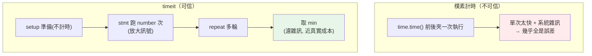

# timeit 微基準

> `cProfile` 告訴你「哪個函式慢」，`timeit` 回答「這兩種寫法哪個快」。當你想比較兩段小程式碼的效能——`''.join()` vs `+=`、`list` vs `set`——`timeit` 是正確的量測工具。這章講怎麼做**可信**的微基準（microbenchmark），避開新手常踩的計時陷阱。

## 💡 白話導讀（建議先讀）

`cProfile` 回答「哪個函式慢」；這章的 `timeit` 回答另一個問題——
「**這兩種寫法哪個快**」（`''.join()` vs `+=`、list comprehension vs `for`）。

聽起來簡單：前後各記一次時間相減不就好了？問題是你要量的東西只有**微秒級**，
而 `time.time()` 的解析度可能是毫秒——**等於用公尺尺量頭髮**。
而且系統隨時有雜訊（OS 排程、其他程式搶 CPU），單次量測毫無意義。

`timeit` 的三帖藥：

1. **高解析度時鐘**（`time.perf_counter`）——換一把夠細的尺。
2. **跑很多次累積**（如一百萬次）——把訊號放大到遠超雜訊。
3. **多輪取最小值**——這是最反直覺的一條：為什麼取 min 不取平均？
   因為**干擾只會讓程式變慢，不會變快**。最快的那一輪＝最接近「沒被打擾時」的真實成本；
   平均值反而被偶發的慢輪污染。

最後一個提醒：微基準測的是「隔離的一小段」，贏了微基準不代表整體會快——
真實程式裡快取、記憶體、I/O 都會改變局勢。**微基準選寫法，profiler 找瓶頸**，兩者分工。

## Why（為什麼）

你想知道「用 `''.join(words)` 還是 `for` 迴圈 `+=` 串接字串比較快」。直覺的做法：

```python
import time
start = time.time()
result = "".join(words)
print(time.time() - start)   # 🔴 這樣量微小程式碼幾乎全是雜訊
```

這幾乎測不準。原因：

- **執行一次太快**：小程式碼跑一次可能只要幾微秒，比計時器本身的解析度還小，量到的幾乎是誤差。
- **系統雜訊**：作業系統排程、其他程序、CPU 頻率變動、快取狀態，都會讓單次量測劇烈波動。
- **一次性成本混入**：第一次執行有 import、快取未熱等一次性開銷，不代表穩態效能。

**`timeit`** 就是為「正確地量測小段程式碼」而生：它把程式碼**跑很多次**（放大到可量測）、**多輪重複取最好成績**（濾掉雜訊）、並隔離環境（關掉 GC 等干擾）。當你要在兩種寫法間做效能決策，`timeit` 給你可信的數字，而不是被雜訊誤導。這章教你正確使用它，以及怎麼解讀結果。

## Theory（理論：微基準為何難）

**微基準（microbenchmark）** 是量測「一小段程式碼」的效能。它出了名地容易做錯，因為要測的時間尺度（微秒、奈秒）和干擾源的尺度重疊：

- **計時器解析度**：`time.time()` 的解析度可能是毫秒級，測微秒級程式碼等於用公尺尺量頭髮。`timeit` 用高解析度的 `time.perf_counter`。
- **雜訊 vs 訊號**：單次量測裡，真正的執行時間（訊號）可能被系統雜訊淹沒。解法是**跑很多次累積**（讓訊號遠大於單次雜訊）、**多輪取最小值**（最小值最接近「沒被干擾時」的真實成本）。
- **為何取 min 而非 mean**：干擾**只會讓程式變慢、不會變快**。所以多輪中的**最小值**最接近純粹的執行成本；平均值會被偶發的慢輪拉高。這是 `timeit` 官方文件的建議。

**微基準的侷限**：它測的是「隔離的一小段」，不代表整體。一段程式碼在微基準快 3 倍，放進真實系統可能因為不是熱點而毫無影響——所以**微基準用來做局部寫法選擇，整體效能仍要靠 [profiling](01-profiling.md)**。

## Specification（規範：timeit 用法）

**函式介面**：

```python
import timeit

# timeit：跑 number 次，回傳「總耗時」（秒）
t = timeit.timeit(stmt="''.join(words)", setup="words=['x']*100", number=100_000)

# repeat：重複 repeat 輪、每輪跑 number 次，回傳各輪總耗時的 list
times = timeit.repeat(stmt="...", setup="...", number=100_000, repeat=5)
best = min(times)   # 取最小輪
```

- **`stmt`**：要量測的程式碼（字串或 callable）。
- **`setup`**：只跑一次的準備碼（建立資料、import），**不計入計時**。
- **`number`**：`stmt` 執行幾次（放大到可量測，預設 1,000,000）。
- **`repeat`**：重複幾輪（預設 5），配合 `min` 濾雜訊。

**命令列**（快速比較，自動選 number）：

```bash
python -m timeit -s "words=['x']*100" "''.join(words)"
```

**Jupyter/IPython 魔術指令**（見 [Jupyter](../17-data-science/07-jupyter.md)）：

```python
%timeit "".join(words)        # 單行，自動決定 number/repeat
%%timeit                       # 整個 cell
```

**重要細節**：`timeit` 預設**關閉 GC**（垃圾回收，見 [CPython GC](../10-cpython-internals/README.md)）以減少干擾——所以它測的是「沒有 GC 打斷」的成本。要含 GC 影響需在 setup 加 `gc.enable()`。

## Implementation（底層：timeit 怎麼濾雜訊）

`timeit` 的核心機制：

1. **用 `perf_counter`**：高解析度、單調遞增的計時器，專為量測時間間隔設計（不受系統時鐘調整影響）。
2. **把 `stmt` 執行 `number` 次於一個迴圈內**，量「整個迴圈」的時間再看總量——單次太快測不準，`number` 次累積起來就遠大於計時誤差。回傳的是**總時間**（要算單次成本自己除以 `number`）。
3. **`setup` 不計時**：準備資料的成本被隔離，只測 `stmt` 本身。
4. **`repeat` 多輪 + 取 `min`**：每輪都是一次獨立量測，最小輪最接近「無干擾」的真實成本。
5. **關閉 GC**：避免垃圾回收在計時中途觸發造成尖峰。

為什麼 `timeit.timeit(number=N)` 回傳「總時間」而非「平均」？因為它把 N 次放在一個迴圈裡量整體，交由你決定怎麼換算（通常 `總時間 / number` 得單次；但比較兩寫法時直接比總時間即可，因為 number 相同）。

**結果依機器而異**：CPU、負載、Python 版本都影響絕對數字。所以微基準的結論要看**相對比例**（A 比 B 快幾倍），且同機同時段比較才公平。下面範例的倍數會因你的機器不同，但「join 比 += 快、set 的 in 比 list 快」的方向是穩定的。

## Code Example（可執行的 Python 範例）

```python
# timeit_demo.py — 用 timeit 做可信的微基準（需要標準庫）
import timeit


def main() -> None:
    # 1) 字串串接：''.join() vs 迴圈 +=
    setup = "words = ['hello'] * 100"
    join_time = timeit.timeit("''.join(words)", setup=setup, number=100_000)
    concat_time = timeit.timeit(
        "s = ''\nfor w in words: s += w", setup=setup, number=100_000
    )
    print(f"join 比 += 串接快約 {concat_time / join_time:.1f} 倍（依機器而異）")

    # 2) 成員測試 in：list vs set
    setup2 = "data_list = list(range(1000)); data_set = set(range(1000))"
    list_in = timeit.timeit("999 in data_list", setup=setup2, number=100_000)
    set_in = timeit.timeit("999 in data_set", setup=setup2, number=100_000)
    print(f"set 的 in 比 list 快約 {list_in / set_in:.0f} 倍（依機器而異）")

    # 3) repeat 多輪取最小值（較穩定）
    times = timeit.repeat("sum(range(100))", number=10_000, repeat=5)
    print(f"sum(range(100)) 最小耗時（5 輪取 min）= {min(times):.4f}s（依機器而異）")

    print("重點：用 number 放大、repeat 取 min；結論看相對倍數，不看絕對值")


if __name__ == "__main__":
    main()
```

**預期輸出**（倍數與絕對時間依機器而異，方向穩定）：

```pycon
$ python timeit_demo.py
join 比 += 串接快約 8.8 倍（依機器而異）
set 的 in 比 list 快約 197 倍（依機器而異）
sum(range(100)) 最小耗時（5 輪取 min）= 0.0040s（依機器而異）
重點：用 number 放大、repeat 取 min；結論看相對倍數，不看絕對值
```

逐段解說：

- **(1) join vs +=**：`''.join()` 一次性配置結果字串；迴圈 `+=` 因字串不可變（見 [字串](../02-fundamentals/README.md)）每次都建新字串，累積成 O(n²) 的浪費。timeit 量出 join 明顯較快——這是「串接字串用 join」這條慣例的量化證據。
- **(2) list vs set 的 `in`**：`list` 的 `in` 是 O(n) 線性掃描；`set` 的 `in` 是 O(1) hash 查找（見 [set](../03-data-structures/README.md)）。1000 個元素時 set 快上百倍——資料結構選對比微優化程式碼有效得多（見 [優化策略](03-optimization-strategies.md)）。
- **(3) repeat + min**：跑 5 輪取最小值，濾掉偶發干擾，得到較穩定的單一數字。
- **共通**：每個都用大 `number` 放大訊號、比較看倍數。絕對值會因機器不同，但相對關係可靠。

## Diagram（圖解：timeit vs 樸素計時）



## Best Practice（最佳實踐）

- **量小段程式碼用 `timeit`，別用 `time.time()` 手動夾**：後者被雜訊淹沒。
- **用大 `number` 放大訊號、`repeat` + `min` 濾雜訊**：結果才穩定可信。
- **把準備資料放 `setup`**：不讓建資料的成本混進被測程式碼。
- **結論看相對倍數、同機同時段比較**：絕對值依機器而異，別跨機比。
- **微基準只做局部寫法選擇，整體瓶頸靠 [profiling](01-profiling.md)**：快 3 倍的非熱點對整體無感。
- **Jupyter 裡直接用 `%timeit`/`%%timeit`**：最方便的互動量測。
- **注意 GC 預設關閉**：要量含 GC 的真實情境需在 setup `gc.enable()`。
- **量測有代表性的輸入規模**：小 n 與大 n 的相對關係可能不同（如 O(n) vs O(n²)）。

## Common Mistakes（常見誤解）

- **用 `time.time()` 量微小程式碼**：解析度不足 + 雜訊，數字沒意義。
- **只跑一次就下結論**：單次量測波動極大；要 `number` 放大 + 多輪。
- **取平均而非最小值**：平均被偶發慢輪拉高；`min` 更接近真實成本。
- **把建資料的成本算進去**：該放 `setup`，否則測到的是「建資料 + 執行」。
- **拿微基準結果推論整體效能**：非熱點快再多也沒用；整體看 profiling。
- **跨機器/不同時段比較絕對數字**：環境不同不可比；看相對倍數、同環境比。
- **忘了 timeit 預設關 GC**：以為測到含 GC 的真實成本，其實沒有。
- **用不具代表性的輸入**：小 n 下 O(n²) 可能還贏 O(n)，放大才看出差異。

## Interview Notes（面試重點）

- **能說明為何不能用 `time.time()` 量小程式碼**（解析度 + 雜訊 + 一次性成本），以及 `timeit` 如何解決（perf_counter、number 放大、repeat + min、隔離 setup）。
- **知道取 `min` 而非 `mean` 的理由**：干擾只會變慢，最小值最接近真實成本。
- **能區分 `timeit`（微基準/寫法比較）與 `cProfile`（找整體熱點）的用途**。
- **知道 timeit 預設關閉 GC**，以及 `%timeit` 魔術指令。
- **能舉經典微基準結論**：`''.join` vs `+=`、`set` vs `list` 的 `in`——並解釋背後複雜度原因。
- **強調微基準的侷限**：局部結論不等於整體，效能決策要結合 profiling。

---

➡️ 下一章：[優化策略與資料結構選擇](03-optimization-strategies.md)

[⬆️ 回 Part 18 索引](README.md)
