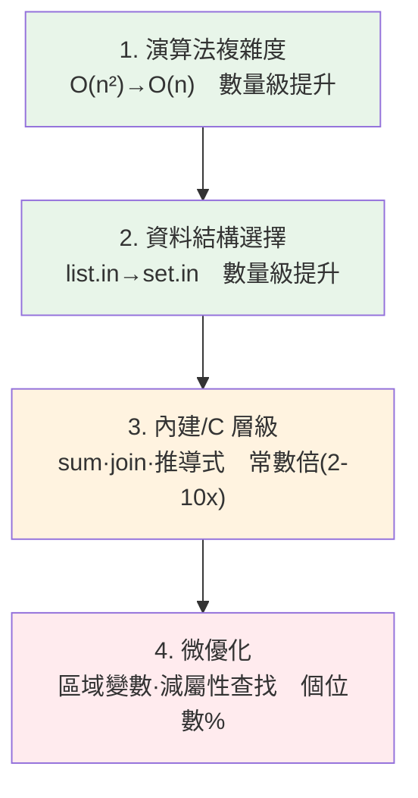

# 優化策略與資料結構選擇

> 最有效的優化不是把迴圈寫得更緊，而是**選對演算法與資料結構**。把 O(n²) 換成 O(n)、把 `list` 的 `in` 換成 `set` 的 `in`——這種改動帶來的是數量級的提升，遠勝於一堆微優化。這章講「該從哪個層級下手優化」，以及 Python 資料結構的效能取捨。

## 💡 白話導讀（建議先讀）

台北到高雄，機車騎再快也贏不了高鐵——**選對交通工具，勝過猛踩油門**。
程式優化同理：把迴圈寫得再緊（打蠟），都比不上**換演算法與資料結構**（換交通工具）。

衡量「交通工具等級」的語言是**大 O 複雜度**：執行時間隨資料量 n 怎麼成長。
n = 100 萬時，O(n) 與 O(n²) 差**一百萬倍**——任何微優化都追不回這個差距。

Python 裡最高頻、一行就換掉交通工具的幾招：

- **`x in list` → `x in set`**：list 是一頁頁翻（O(n)），set 是查目錄（O(1)）——
  和[資料庫索引](../15-database/21-indexing.md)是同一個道理。迴圈裡查成員，先轉 set。
- **迴圈裡 `+=` 串字串 → `''.join()`**：字串不可變，每次 `+=` 都整條重抄（總計 O(n²)）。
- **巢狀迴圈找配對 → dict 建索引**：O(n²) 的雙層迴圈,常能用一個 dict 降成 O(n)。
- **排序後二分／用 heapq 取前 k**：不必每次全掃。

順序也重要,這章給你完整的**優化優先級**：
先問「能不能不做」（快取,下一章）→ 換演算法/資料結構（本章,收益最大）→
善用內建函式與標準庫（C 實作,比手寫迴圈快）→ 最後才是微優化與[原生編譯](05-cython-numba.md)。
記住[上一章](01-profiling.md)的前提：這一切都在**量測找到熱點之後**才動手。

## Why（為什麼）

新手優化程式常從「把程式碼寫得更精巧」開始：換成 list comprehension、減少幾個變數、內聯一個函式……這些通常只帶來個位數百分比的提升。但真正的效能問題往往是**演算法層級**的：一個藏在迴圈裡的 O(n) 操作讓整體變成 O(n²)、用錯資料結構讓每次查找都是線性掃描。

有個優化的**層級金字塔**，效益由大到小：

1. **演算法複雜度**（O(n²) → O(n)）：數量級提升。資料一大，差距是幾百幾千倍。
2. **資料結構選擇**（`list` 的 `in` → `set` 的 `in`）：把 O(n) 操作變 O(1)，同樣是數量級。
3. **用內建/C 層級操作**（`sum()`、`''.join()`、comprehension）：常數倍提升（2–10 倍）。
4. **微優化**（區域變數、減少屬性查找）：個位數百分比。

**先從上層下手**——一個複雜度的改善抵得過一百個微優化。這章教你辨識該從哪一層優化，以及 Python 各資料結構的效能特性，讓你在寫程式時就選對工具，而非事後補救。搭配 [profiling](01-profiling.md) 找出熱點、[timeit](02-timeit.md) 驗證改善。

## Theory（理論：複雜度主導大局）

**大 O 複雜度（Big-O）** 描述「執行時間如何隨輸入規模 n 成長」。這是效能的主導因素，因為當 n 變大，複雜度的差距會壓過一切常數因子：

| 複雜度 | n=1,000 | n=1,000,000 | 典型操作 |
|--------|---------|-------------|---------|
| O(1) | 1 | 1 | dict/set 查找、list 索引 |
| O(log n) | ~10 | ~20 | 二分搜尋、平衡樹 |
| O(n) | 1,000 | 1,000,000 | 線性掃描、list 的 `in` |
| O(n log n) | ~10,000 | ~2×10⁷ | 排序 |
| O(n²) | 10⁶ | 10¹² | 巢狀迴圈、list 去重 |

n=100 萬時，O(n) 與 O(n²) 差**一百萬倍**——再怎麼微優化 O(n²) 的常數也追不上換成 O(n)。所以**優化的第一問是「有沒有降複雜度的空間」**：迴圈裡的 `in list` 能不能換 `in set`？巢狀迴圈能不能用 dict 一次對照？重複計算能不能[快取](04-caching.md)？

**一個常見陷阱**：把 O(n) 操作放進迴圈，整體就成了 O(n²)。例如「去重且保序」用 `if x not in result_list`——`in list` 是 O(n)，放在 n 次迴圈裡就是 O(n²)。改用 `set` 記錄看過的，`in set` 是 O(1)，整體降回 O(n)。

## Specification（規範：資料結構效能特性）

Python 內建資料結構的關鍵操作複雜度：

| 操作 | list | tuple | set | dict | deque |
|------|------|-------|-----|------|-------|
| 索引 `x[i]` | O(1) | O(1) | — | — | O(1) 端點 |
| 成員 `in` | **O(n)** | O(n) | **O(1)** | **O(1)** | O(n) |
| 尾端新增 | O(1)* | — | O(1) | O(1) | O(1) |
| 頭部新增/刪除 | **O(n)** | — | — | — | **O(1)** |
| 依 key 取值 | — | — | — | O(1) | — |

（*list 尾端 append 為攤還 O(1)。）

**選型準則**：

- **要頻繁做「in 成員測試」→ 用 `set`/`dict`**（O(1)），別用 `list`（O(n)）。
- **要「頭尾都能快速增刪」（佇列）→ 用 `collections.deque`**（兩端 O(1)），別用 `list.pop(0)`（O(n)）。
- **要 key→value 映射 → 用 `dict`**（O(1)）。
- **固定不變的序列 → `tuple`**（省記憶體、可 hash、可當 dict key）。
- **需要計數 → `collections.Counter`**；**需要預設值 → `defaultdict`**（見 [collections](../03-data-structures/README.md)）。

**善用 C 層級內建**（比等效 Python 迴圈快數倍）：`sum`、`min`、`max`、`any`、`all`、`sorted`、`''.join()`、list/dict/set comprehension、`map`/`filter`。它們的迴圈在 C 裡跑，省去 Python bytecode 開銷。

## Implementation（底層：為何 set/dict 是 O(1)、C 迴圈更快）

**set/dict 為何 O(1)**：它們是**雜湊表（hash table）**（見 [dict 底層](../03-data-structures/README.md)）。查一個元素時，先算它的 `hash()`，直接跳到對應的桶（bucket）看在不在——不必逐一比對。所以不論表裡有 10 個還是 1000 萬個元素，查找都是（平均）常數時間。代價是元素必須 hashable、且比 list 多花些記憶體存 hash 結構。

**list 的 `in` 為何 O(n)**：list 是連續的物件指標陣列，沒有索引結構。查 `x in lst` 只能從頭逐個 `==` 比對，最壞要比到底——O(n)。

**`list.pop(0)` 為何 O(n)**：list 的元素在記憶體連續排列，移除第 0 個後，後面**所有元素都要往前搬一格**——O(n)。`deque` 是雙向鏈結的分段結構，兩端增刪都是 O(1)。

**內建函式為何比手寫迴圈快**：`sum(xs)` 的迴圈在 CPython 的 C 程式碼裡跑，每次迭代不需執行 Python bytecode、不需管理 Python frame。手寫 `for x in xs: total += x` 每圈都要跑直譯器、做屬性/變數查找、建立整數物件。同樣邏輯，C 迴圈省掉大量直譯開銷（但仍是 O(n)，只是常數小很多）。

這些差異用 [timeit](02-timeit.md) 一量便知。下面範例量化三種層級的優化。

## Code Example（可執行的 Python 範例）

```python
# optimization_demo.py — 演算法/資料結構/內建三層級優化（需要標準庫）
import timeit
from collections import deque


# --- 演算法 + 資料結構：O(n^2) vs O(n) 去重保序 ---
def dedup_slow(items: list[int]) -> list[int]:
    result: list[int] = []
    for x in items:
        if x not in result:  # in list 是 O(n) → 整體 O(n^2)
            result.append(x)
    return result


def dedup_fast(items: list[int]) -> list[int]:
    seen: set[int] = set()
    result: list[int] = []
    for x in items:
        if x not in seen:  # in set 是 O(1) → 整體 O(n)
            seen.add(x)
            result.append(x)
    return result


def manual_sum(xs: list[int]) -> int:
    total = 0
    for x in xs:
        total += x
    return total


def main() -> None:
    data = [i % 500 for i in range(2000)]

    # 正確性：兩種去重結果相同（確定性）
    print("兩種去重結果相同:", dedup_slow(data) == dedup_fast(data))
    print("去重後長度:", len(dedup_fast(data)))

    # 效能：set 版 vs list 版
    slow = timeit.timeit(lambda: dedup_slow(data), number=200)
    fast = timeit.timeit(lambda: dedup_fast(data), number=200)
    print(f"去重：set 版比 list 版快約 {slow / fast:.0f} 倍（依機器而異）")

    # 資料結構：deque.popleft vs list.pop(0)
    lt = timeit.timeit(lambda: _drain_list(2000), number=100)
    dt = timeit.timeit(lambda: _drain_deque(2000), number=100)
    print(f"佇列：deque.popleft 比 list.pop(0) 快約 {lt / dt:.0f} 倍（依機器而異）")

    # 內建：sum vs 手寫迴圈
    xs = list(range(1000))
    m = timeit.timeit(lambda: manual_sum(xs), number=10_000)
    b = timeit.timeit(lambda: sum(xs), number=10_000)
    print(f"內建 sum 比手寫迴圈快約 {m / b:.1f} 倍（依機器而異）")


def _drain_list(n: int) -> None:
    q = list(range(n))
    while q:
        q.pop(0)  # O(n) 搬移


def _drain_deque(n: int) -> None:
    q = deque(range(n))
    while q:
        q.popleft()  # O(1)


if __name__ == "__main__":
    main()
```

**預期輸出**（倍數依機器而異，方向穩定）：

```pycon
$ python optimization_demo.py
兩種去重結果相同: True
去重後長度: 500
去重：set 版比 list 版快約 38 倍（依機器而異）
佇列：deque.popleft 比 list.pop(0) 快約 55 倍（依機器而異）
內建 sum 比手寫迴圈快約 7.2 倍（依機器而異）
```

逐段解說：

- **去重（演算法 + 資料結構）**：兩版結果**完全相同**（都保序去重成 500 個），但 `dedup_slow` 因 `in list` 是 O(n)、整體 O(n²)；`dedup_fast` 用 `set` 記錄看過的，`in set` 是 O(1)、整體 O(n)。差距達數十倍——**這是複雜度層級的優化，效益最大**。
- **佇列（資料結構）**：`list.pop(0)` 每次搬移所有元素（O(n)），排空整個 list 是 O(n²)；`deque.popleft` 兩端 O(1)，排空是 O(n)。用對資料結構直接數十倍。
- **sum（內建 C 層級）**：邏輯一樣是 O(n)，但內建 `sum` 的迴圈在 C 裡跑，省掉直譯開銷，快數倍——這是常數層級的優化，效益小於前兩者但仍實用。
- **層級對比**：前兩個是「數量級」提升（隨 n 放大會更誇張），第三個是「常數倍」——**印證優先從演算法/資料結構層級下手**。

## Diagram（圖解：優化層級金字塔）



由上往下效益遞減——先確認上層沒有優化空間，再往下。

## Best Practice（最佳實踐）

- **先問「能不能降複雜度」**：迴圈裡的 O(n) 操作、巢狀迴圈、重複計算——這裡的改善最大。
- **選對資料結構**：頻繁 `in`→`set`/`dict`；佇列→`deque`；映射→`dict`；計數→`Counter`。
- **善用 C 層級內建**：`sum`/`min`/`max`/`any`/`all`/`sorted`/`join`/推導式，勝過等效 Python 迴圈。
- **避免迴圈內重複工作**：把不變的計算移出迴圈、把 `obj.attr`/全域查找快取成區域變數。
- **用 [profiling](01-profiling.md) 找熱點、[timeit](02-timeit.md) 驗證**：別在非熱點上做複雜優化。
- **可讀性優先，熱點才微優化**：只有被證明是瓶頸的少數程式碼才值得犧牲可讀性。
- **考慮 [快取](04-caching.md)**：重複的昂貴計算用 `lru_cache` 換空間省時間。

## Common Mistakes（常見誤解）

- **在 O(n²) 上做微優化**：把巢狀迴圈的常數壓一點，卻沒發現換個資料結構能降成 O(n)。
- **用 `list` 做頻繁成員測試**：`x in big_list` 是 O(n)，迴圈裡就 O(n²)；該用 `set`。
- **用 `list.pop(0)`/`list.insert(0, x)` 當佇列**：頭部操作 O(n)；用 `deque`。
- **手寫迴圈取代內建**：`sum`/`max`/`join` 有 C 加速，手寫更慢又更長。
- **在迴圈裡重複算不變的東西**：如每圈都 `len(x)`、重新查全域/屬性——移出或快取。
- **過早微優化犧牲可讀性**：非熱點的精巧寫法只增加維護成本。
- **忽略記憶體/複雜度取捨**：set/dict 快但耗記憶體；視情況權衡（見 [記憶體優化](06-memory-optimization.md)）。

## Interview Notes（面試重點）

- **能講優化的層級金字塔**：演算法 > 資料結構 > 內建/C > 微優化，並說明為何先從上層下手（複雜度主導大局）。
- **能背關鍵複雜度**：list 的 `in`/pop(0) 是 O(n)、set/dict 的 `in` 與查找是 O(1)、deque 兩端 O(1)。
- **能解釋 set/dict 為何 O(1)**（雜湊表）、**list 的 `in`/pop(0) 為何 O(n)**（線性掃描/搬移）。
- **能舉「O(n) 操作放進迴圈變 O(n²)」的例子**（如 list 去重）並給出 set 解法。
- **知道內建函式比手寫迴圈快的原因**（C 層級迴圈、省直譯開銷），但複雜度不變。
- **強調先 profiling 找熱點、可讀性優先**，別在非瓶頸上過度優化。

---

➡️ 下一章：[快取 lru_cache](04-caching.md)

[⬆️ 回 Part 18 索引](README.md)
