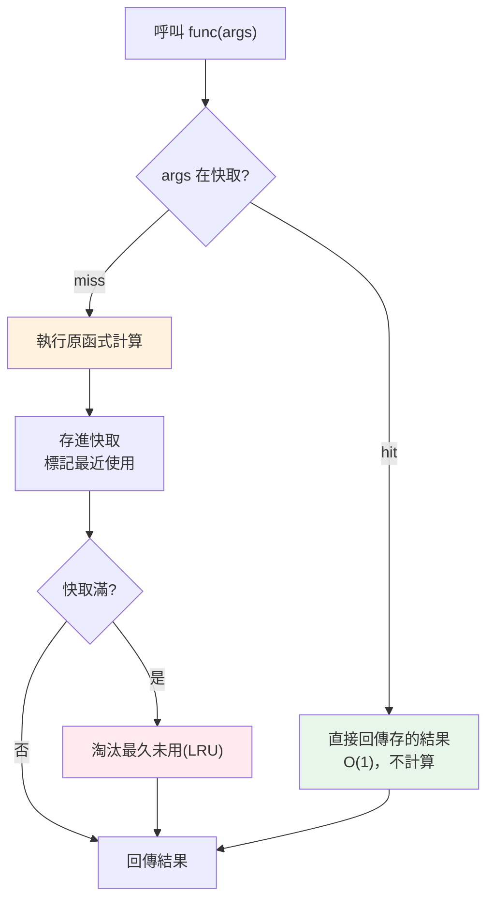

# 快取 lru_cache

> 最快的計算是「不計算」。如果一個函式對相同輸入總是給相同結果，那第二次以後就沒必要重算——把結果記下來直接回傳。這就是**快取（caching）/記憶化（memoization）**。Python 用 `functools.lru_cache` 一行裝飾就能做到。這章講它怎麼用、何時該用、以及背後的機制與陷阱。

## 💡 白話導讀（建議先讀）

**最快的計算,是不計算。**

客人問「招牌套餐多少錢」,店員不會每次都跑回廚房重新核算成本——
櫃檯貼一張**價目表**,問過一次的答案直接抄。這就是**快取（cache）／記憶化（memoization）**：
把「輸入 → 輸出」記在表裡,第二次以後直接查表（cache hit）,免重算。

Python 一行就有：

```python
from functools import lru_cache

@lru_cache(maxsize=128)
def expensive(n): ...
```

但價目表有個前提：**答案不能會變**。函式必須是**純函式**——相同輸入永遠給相同輸出、
不依賴時間/隨機/外部狀態（見[函數式](../08-functional-decorators/README.md)）。
對不純的函式上快取,你會拿到**過時的錯誤答案**——這是快取唯一、也是最大的坑。

表也不能無限貼下去（吃光記憶體）,所以要有**淘汰策略**。LRU（Least Recently Used）
最常用：牆上便條滿了,**撕掉最久沒人看的那張**——賭「最近用過的,近期還會再用」。

眼熟嗎?這正是 [Redis 章](../15-database/18-redis.md)「櫃檯便條」的**行程內迷你版**：
`lru_cache` 快取在單一行程的記憶體裡,Redis 快取在所有服務共享的外部櫃檯。
原理相同,差在**共享範圍與失效策略**——這章講行程內快取,並交代兩者何時該用哪個。

## Why（為什麼）

看這個經典的遞迴費氏數列：

```python
def fib(n):
    if n < 2:
        return n
    return fib(n - 1) + fib(n - 2)
```

`fib(30)` 會呼叫自己 **兩百多萬次**——因為 `fib(28)` 被算了無數遍（`fib(30)` 要 `fib(29)`+`fib(28)`，`fib(29)` 又要 `fib(28)`+`fib(27)`……）。同樣的子問題被重複計算到爆炸，時間複雜度是指數級 O(2ⁿ)。

但這些重算完全是浪費：`fib(28)` 的答案永遠一樣。只要**把算過的結果記下來**，第二次遇到直接回傳，重複計算就消失了——`fib(30)` 從兩百萬次降到 **31 次**，複雜度從 O(2ⁿ) 變 O(n)。

這就是**記憶化（memoization）**：用空間（存結果）換時間（免重算）。它適用於任何「相同輸入 → 相同輸出、且會被重複呼叫」的昂貴計算——遞迴、重複的資料庫/API 查詢、複雜的純函式運算。Python 標準庫的 `functools.lru_cache` 讓你**一行裝飾器**就加上快取，還附命中率統計。這章教你正確使用它，並認清「什麼函式能快取、什麼不能」。

## Theory（理論：記憶化與 LRU）

**記憶化（memoization）**：把函式的「輸入 → 輸出」記在一張表裡。呼叫時先查表：有（cache hit）就直接回傳；沒有（cache miss）才真的計算、並存進表。

**快取能用的前提——函式必須是「純函式（pure function）」**（見 [函數式](../08-functional-decorators/README.md)）：

1. **確定性（deterministic）**：相同輸入永遠給相同輸出（不依賴時間、隨機、外部狀態）。
2. **無副作用（no side effects）**：不修改外部狀態、不做 I/O 影響結果。

若函式不純（如回傳當前時間、依賴會變的全域），快取會回傳過時的錯誤結果。

**LRU（Least Recently Used，最近最少使用）**：快取不能無限成長，否則吃光記憶體。LRU 是一種**淘汰策略**：當快取滿了，丟掉「最久沒被用到」的項目。`lru_cache(maxsize=N)` 最多存 N 筆，滿了就淘汰最久未用的。`maxsize=None` 則無上限（永不淘汰，適合固定輸入集合如遞迴）。

**hashable 要求**：快取用參數當 key 存進 dict，所以**所有參數必須 hashable**（見 [hashable](../03-data-structures/README.md)）——`int`/`str`/`tuple` 可以，`list`/`dict`/`set` 不行（會 `TypeError`）。

## Specification（規範：lru_cache 用法）

```python
from functools import lru_cache, cache

@lru_cache(maxsize=128)       # 最多存 128 筆，LRU 淘汰
def expensive(x): ...

@lru_cache(maxsize=None)      # 無上限（等同 @cache）
def fib(n): ...

@cache                         # Python 3.9+：無上限的簡寫
def fib(n): ...
```

**附帶的方法**（裝飾後函式上）：

- **`func.cache_info()`**：回傳 `CacheInfo(hits, misses, maxsize, currsize)`——命中數、未命中數、上限、目前筆數。用來評估快取效益。
- **`func.cache_clear()`**：清空快取（如底層資料變了，需讓快取失效）。

**參數要求**：所有參數 hashable；不同的 keyword/positional 呼叫視為不同 key（`f(1)` 與 `f(x=1)` 可能是不同 key）。

**變體**：`functools.cached_property`——把類別的 property 結果快取在實例上（算一次，之後讀屬性直接回傳），適合「每個實例算一次的昂貴屬性」。

## Implementation（底層：lru_cache 怎麼運作）

`lru_cache` 內部維護一個 **dict**（key = 參數組成的 hashable、value = 結果）加上一個**追蹤使用順序的結構**（現代 CPython 用雙向鏈結串列 + dict 實作，接近 `OrderedDict` 的行為）：

- **呼叫時**：把參數組成一個 key，去 dict 查。
  - **hit**：直接回傳存的結果，並把該 key 標記為「最近使用」（移到順序結構的尾端）。
  - **miss**：呼叫原函式算出結果，存進 dict，標記為最近使用。
- **滿了（達 maxsize）**：淘汰「最久未使用」的那筆（順序結構的頭端）。

因為查表是 dict 的 O(1) 操作，快取命中幾乎不花時間。`cache_info()` 的 `hits`/`misses` 就是這兩條路徑各走了幾次——**命中率高（hits 遠大於 misses）代表快取很有效**；若幾乎全是 misses（如每次參數都不同），快取反而只增加記憶體開銷、沒好處。

`maxsize=None` 時省去 LRU 的順序維護，純 dict 查存，最快——但要確保輸入集合有限（否則記憶體無限成長）。遞迴 fib 的參數是 `0..n` 的有限集合，適合 `None`。

## Code Example（可執行的 Python 範例）

```python
# caching_demo.py — lru_cache 記憶化與 cache_info（需要標準庫）
from functools import lru_cache


# --- 有快取的 fib：記錄實際執行次數 ---
_exec_count = {"cached": 0, "nocache": 0}


@lru_cache(maxsize=None)
def fib(n: int) -> int:
    _exec_count["cached"] += 1  # 只在真正計算(miss)時 +1
    if n < 2:
        return n
    return fib(n - 1) + fib(n - 2)


def fib_nocache(n: int) -> int:
    _exec_count["nocache"] += 1
    if n < 2:
        return n
    return fib_nocache(n - 1) + fib_nocache(n - 2)


def main() -> None:
    result = fib(30)
    print(f"fib(30) = {result}")
    print(f"有快取：函式本體實際執行 {_exec_count['cached']} 次")
    print(f"cache_info: {fib.cache_info()}")

    fib_nocache(30)
    print(f"無快取：函式本體實際執行 {_exec_count['nocache']} 次")

    # maxsize 淘汰示範
    @lru_cache(maxsize=2)
    def square(x: int) -> int:
        return x * x

    square(1)
    square(2)
    square(3)  # 快取滿(1,2)後存 3 → 淘汰最久未用的 1
    square(2)  # hit（2 還在）
    square(1)  # miss（1 已被淘汰，重算）
    print(f"square(maxsize=2) cache_info: {square.cache_info()}")


if __name__ == "__main__":
    main()
```

**預期輸出**：

```pycon
$ python caching_demo.py
fib(30) = 832040
有快取：函式本體實際執行 31 次
cache_info: CacheInfo(hits=28, misses=31, maxsize=None, currsize=31)
無快取：函式本體實際執行 2692537 次
square(maxsize=2) cache_info: CacheInfo(hits=1, misses=4, maxsize=2, currsize=2)
```

逐段解說：

- **fib 快取效果**：有快取時函式本體只執行 **31 次**（每個 `fib(0..30)` 各算一次），無快取時執行 **2,692,537 次**——差近九萬倍。這就是記憶化把 O(2ⁿ) 變 O(n) 的威力。
- **`cache_info`**：`misses=31`（31 個不同的 n 各算一次）、`hits=28`（其餘都是命中已存結果）、`currsize=31`（存了 31 筆）。命中數可觀，代表快取很有效。
- **maxsize 淘汰**：`square(maxsize=2)` 只能存 2 筆。呼叫序列 `1,2,3,2,1`：算 1（miss）、算 2（miss）、算 3（miss，淘汰最久未用的 1）、2（hit，還在）、1（miss，已被淘汰要重算）。最終 `hits=1, misses=4`——示範 LRU 在容量受限時如何淘汰。
- **可寫進測試**：這些數字（31、2692537、cache_info 各欄）都是**確定性**的，適合驗證。

## Diagram（圖解：快取查詢流程）



## 延伸：本地 vs 分散式快取（該用哪個）

導讀說過 `lru_cache` 是 Redis 那個「櫃檯便條」的**行程內迷你版**。現在把這筆帳結清:兩者何時該用哪個。

| | **本地／行程內快取**（`lru_cache`、dict） | **分散式快取**（Redis、Memcached） |
|---|---|---|
| 存在哪 | **自己這個行程**的記憶體 | **獨立的外部服務**（另一台/另一個容器） |
| 速度 | **奈秒級**（就是查個 dict，免網路） | 微秒~毫秒（要跨網路一趟） |
| 共享範圍 | ❌ **每個行程 / Pod 各自一份** | ✅ **所有實例共享同一份** |
| 失效（清快取） | ⚠️ **只清得掉自己那台** | ✅ 清一次，全體生效 |
| 行程重啟 | 沒了（要重新暖機） | 還在 |
| 容量 | 受單機記憶體限制 | 可獨立擴充 |
| 代價 | 幾乎為零 | 多一個要維運、會掛的元件 |

### 那個會咬人的坑：多實例下，本地快取各說各話

本地快取最危險的地方不是「慢」，而是**它在多實例部署下會不一致**。

你的服務跑 3 個 Pod，每個 Pod 各有一份 `lru_cache`。資料更新了，你呼叫 `cache_clear()`——
**但你只清得掉「收到這個請求的那一台」**，另外兩台還捧著舊值。更難查的是:使用者重新整理，
[負載均衡](../21-microservices/05-api-gateway.md)可能把他分到不同的 Pod——**同一個人連按兩次，一次新值、一次舊值**，
而你在本機怎麼測都測不出來（本機只有一個行程）。

這正是本章範例要讓你**親眼看到**的（[examples/part18/local_vs_distributed_cache.py](../../examples/part18/local_vs_distributed_cache.py)）:

```python
a = make_instance()   # 實例 A（Pod A）
b = make_instance()   # 實例 B（Pod B）
# 兩台都快取了 100，資料更新成 200 後：
a.cache_clear()       # 只清 A
a()  # → 200  ✅ A 拿到新值
b()  # → 100  ❌ B 還在回舊值
```

### 決策：三個問題

1. **這份資料需要跨實例一致嗎？** 需要（庫存、餘額、權限）→ **分散式快取**；不需要（純計算結果、
   極少變的設定、各機不一致也無妨的熱資料）→ 本地快取夠了。
2. **它會變嗎？變了誰負責清？** 純函式、不會變 → 本地快取最香（零成本、奈秒級）。
   會變且要「一清全清」→ 分散式。
3. **你只有一個行程嗎？** 單機腳本、CLI、批次工作 → 本地就好，別為了快取拉一個 Redis 進來。

> **Memcached vs Redis**:兩者都是主流的分散式快取。Memcached **只做快取**（純 key-value、極簡、多執行緒）；
> Redis 功能多得多（資料結構、持久化、pub/sub、Lua），**還能當 session store、佇列、排行榜**——
> 所以實務上多數專案直接用 Redis 一魚多吃（見 [Part 15 Redis](../15-database/18-redis.md)）。

### 兩層快取（L1 + L2）

不是二選一——高流量系統常**兩層都用**:先查**本地**（L1，奈秒、擋掉大部分流量），
沒中再查 **Redis**（L2，跨實例共享），再沒中才打 DB。代價是 L1 的一致性問題還在，
所以 L1 通常只放**很短 TTL**、或只放「容忍短暫不一致」的資料。

## Best Practice（最佳實踐）

- **先問「要不要跨實例一致」再選快取層**：要 → Redis／Memcached；不要且是純計算 → `lru_cache` 就夠（見上方延伸）。
- **只快取純函式**：確定性、無副作用——否則會回傳過時/錯誤結果。
- **參數要 hashable**：`int`/`str`/`tuple` 可以；需要傳 `list` 就先轉 `tuple`。
- **有限輸入集合用 `@cache`/`maxsize=None`；無限或大量輸入用有限 `maxsize`**：避免記憶體無限成長。
- **用 `cache_info()` 評估效益**：命中率低（幾乎全 misses）代表快取沒用、只增開銷，該移除。
- **底層資料會變時要 `cache_clear()`（或設 TTL）**：否則快取回傳陳舊資料——快取失效是快取最難的問題。
- **昂貴的實例屬性用 `cached_property`**：每實例算一次。
- **快取是換記憶體省時間**：權衡記憶體成本，別無腦全加。
- **搭配 [profiling](01-profiling.md) 確認該函式是熱點且重複呼叫**再加快取。

## Common Mistakes（常見誤解）

- **快取不純的函式**：回傳當前時間、依賴會變的全域/DB——快取讓它永遠回舊值，產生難查的 bug。
- **傳 unhashable 參數**：`func([1,2])` → `TypeError: unhashable type: 'list'`；轉 `tuple`。
- **`maxsize=None` 配無限輸入**：快取無限成長 → 記憶體洩漏；用有限 maxsize。
- **底層資料變了卻不清快取**：使用者更新了資料，快取還回舊的——記得 `cache_clear()` 或設失效機制。
- **對命中率低的函式硬加快取**：每次參數都不同，全是 miss，只多花記憶體與 hash 開銷。
- **忽略快取的執行緒安全/一致性**：多執行緒下的快取失效要小心（見 [並發](../09-concurrency/README.md)）。
- **在多實例部署用本地快取、還以為 `cache_clear()` 清得乾淨**：`lru_cache` 是**行程內**的——
  3 個 Pod 就有 3 份，你只清得掉收到請求的那一台，其他還在回舊值。使用者重新整理被分到不同 Pod，
  會看到一下新值一下舊值，而**本機只有一個行程，怎麼測都測不出來**。要跨實例一致，就得用 Redis（見上方延伸）。
- **在方法上用 `lru_cache` 造成實例無法被回收**：快取持有 `self` 參照 → 記憶體洩漏；實例層級快取用 `cached_property`。

## Interview Notes（面試重點）

- **能解釋記憶化把 fib 從 O(2ⁿ) 降到 O(n)**，並說明「空間換時間」的本質。
- **能說出快取的前提是純函式**（確定性、無副作用），並舉快取不純函式的後果。
- **知道 `lru_cache` 的 LRU 淘汰、`maxsize` 語意**（None=無上限）、參數需 hashable。
- **會用 `cache_info()` 讀 hits/misses 評估效益**、`cache_clear()` 失效。
- **知道「快取失效（cache invalidation）是最難的問題之一」**：資料變動時如何讓快取一致。
- **知道 `@cache`（3.9+）、`cached_property`** 的用途，以及在方法上快取持有 `self` 的洩漏風險。
- **「本地快取和 Redis 差在哪？你怎麼選？」**（高頻）
  面試官想聽:「**共享範圍與失效**。`lru_cache` 在**行程內**——奈秒級、零成本，但**每個實例各一份**，
  更新時只清得掉自己那台，多實例會不一致。Redis／Memcached 是**共享的外部服務**——多一趟網路（微秒~毫秒），
  但**所有實例看同一份、清一次全體生效**、重啟還在。**判準:要不要跨實例一致**——要（庫存、餘額）用 Redis；
  純計算、不會變、各機不一致也無妨就用本地。高流量可**兩層都用**（L1 本地擋量 + L2 Redis 共享）。」
  加分:能點出 Memcached 只做純快取、Redis 還能當 session／佇列／排行榜。

---

➡️ 下一章：[Cython 與 numba](05-cython-numba.md)

[⬆️ 回 Part 18 索引](README.md)
