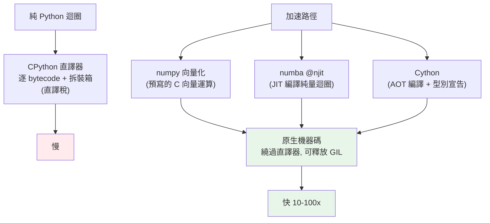

# Cython 與 numba

> 當演算法、資料結構、快取都優化到極限，數值密集的迴圈還是太慢——因為 Python 直譯器本身有開銷。這時的終極武器是**把 Python 編譯成原生機器碼**：Cython 與 numba。這章講 Python 為何慢、這兩個工具如何讓熱點迴圈快上數十倍，以及該在什麼情況下動用它們。

> ⚠️ 本章的 Cython/numba 程式碼需要**額外安裝與編譯**（`pip install cython` / `numba`），屬示意；可執行範例改用 numpy 示範「離開直譯器 → 原生速度」的相同原理。

## Why（為什麼）

假設你 [profile](01-profiling.md) 後發現瓶頸是一個純數值的迴圈——例如逐點計算數百萬次的物理模擬、影像處理、數值積分。你已經：換了好演算法、用了對的資料結構、加了快取——但它就是慢。為什麼？

因為 **CPython 直譯器對每一個小操作都有開銷**。純 Python 的 `total += x * x` 這一行，直譯器要：取出 bytecode、查變數、把 `x` 這個 Python 物件拆箱成 C 數字、相乘、把結果裝箱回 Python 物件、再存回去（見 [CPython 內部](../10-cpython-internals/README.md)）。這些「直譯稅」在幾百萬次迴圈裡累積成巨大浪費——**真正的計算可能只佔 5%，其餘全是直譯開銷**。

解法是**把熱點編譯成原生機器碼**，繞過直譯器：

- **Cython**：把（加了型別標註的）Python 編譯成 C，再編成機器碼。
- **numba**：用 JIT（Just-In-Time，即時編譯）把 Python 函式在執行期編譯成機器碼，一個裝飾器搞定。

編譯後，那個迴圈直接以 C 的速度跑，常能快 **10–100 倍**。這章讓你理解「Python 為何慢、編譯如何救」，以及這是**最後手段**——只在 profiling 證明的數值熱點才動用，且往往 numpy 向量化就夠了。

## Theory（理論：為何編譯能加速）

Python 慢的根源是**動態 + 直譯**：

- **動態型別**：直譯器執行到 `a + b` 時，不知道 `a`、`b` 是 int、float 還是別的，必須執行期查型別、找對應的加法（見 [動態型別](../02-fundamentals/README.md)）。
- **物件拆裝箱**：每個數字都是完整的 `PyObject`（含型別、引用計數），運算要拆箱成 C 數值、算完裝箱回物件。
- **直譯開銷**：每個操作都走 bytecode 直譯迴圈，而非直接的機器指令。

**編譯如何解決**：如果能在編譯期**確定型別**（`n` 是 `int`、`arr` 是 `double[]`），編譯器就能：

- 生成**直接的機器指令**（不查型別、不走直譯迴圈）。
- 用**原生 C 數值**運算（不拆裝箱）。
- 甚至**釋放 GIL**、用 SIMD/多核（見 [GIL](../09-concurrency/README.md)）。

這正是 Cython（靜態編譯）與 numba（JIT 編譯）做的事——它們把「型別明確的數值迴圈」變成接近手寫 C 的速度。**關鍵前提是型別明確且是數值密集運算**；充滿動態行為、字串處理、I/O 的程式碼，編譯幫助有限。

## Specification（規範：三種加速工具）

**numpy 向量化**（見 [向量化](../17-data-science/02-numpy-vectorization.md)）——最常先試的：

```python
result = (arr * arr).sum()   # 迴圈在 numpy 的 C 裡跑，無需編譯任何東西
```

**numba**（JIT，最省事）：

```python
from numba import njit

@njit                      # 首次呼叫時編譯成機器碼，之後直接跑
def compute(arr):
    total = 0.0
    for x in arr:          # 這個「純量迴圈」被編譯，不再走直譯器
        total += x * x
    return total
```

**Cython**（靜態編譯，最可控）：`.pyx` 檔加型別宣告，經 `cythonize` 編成 C 再編成 `.so`/`.pyd`：

```cython
# compute.pyx
def compute(double[:] arr):        # 型別宣告 → 編譯器生成 C
    cdef double total = 0.0
    cdef int i
    for i in range(arr.shape[0]):
        total += arr[i] * arr[i]
    return total
```

**選擇準則**：

- **先試 numpy 向量化**：不必編譯、生態成熟，多數數值工作足夠。
- **純量迴圈難向量化 → numba `@njit`**：一個裝飾器、快、適合科學計算與原型。
- **要細緻控制、整合 C 函式庫、做成套件 → Cython**：更成熟、可控，但需建置步驟。

## Implementation（底層：JIT vs AOT）

**Cython = AOT（Ahead-Of-Time，事前編譯）**：在你「建置」時就把 `.pyx` 轉成 C、再由 C 編譯器編成機器碼模組（`.pyd`/`.so`）。執行時直接載入已編譯的原生模組——無執行期編譯開銷，但需要建置流程與 C 編譯器。Cython 也能**漸進式**：不加型別時它幾乎等於純 Python（小加速），加愈多 `cdef` 型別宣告，愈接近 C 速度。

**numba = JIT（Just-In-Time，即時編譯）**：`@njit` 函式**第一次被呼叫時**，numba 依實際傳入的型別把它編譯成機器碼（用 LLVM），快取起來；之後的呼叫直接跑機器碼。所以**第一次呼叫含編譯成本（較慢），之後才快**——量測要排除首次的暖身。`njit` 的 `n` 代表 "nopython mode"：完全不回退到 Python 物件、全程原生，最快。

**兩者的共同關鍵**：都靠「確定型別 → 生成原生碼 → 繞過直譯器與拆裝箱」。它們也能**釋放 GIL**（`@njit(nogil=True)` / Cython `nogil`），讓數值迴圈真正多核並行——這是純 Python 因 GIL 做不到的（見 [GIL](../09-concurrency/README.md)）。

下面的可執行範例用 **numpy** 當「原生速度」的代理，示範離開直譯器的效益；numba/Cython 在**難以向量化的純量迴圈**上能達到類似甚至更高的加速（因為它們直接編譯迴圈本身，不需配置中間陣列）。

## Code Example（可執行的 Python 範例）

```python
# native_speed_demo.py — 純 Python 迴圈 vs numpy(離開直譯器)（需要 numpy）
import timeit

import numpy as np


def compute_pure(n: int) -> int:
    """純 Python 迴圈：每步都付直譯 + 拆裝箱的稅。"""
    total = 0
    for x in range(n):
        total += (x * x) % 7
    return total


def compute_numpy(n: int) -> int:
    """numpy 向量化：迴圈下沉到 C，無直譯開銷。"""
    arr = np.arange(n, dtype=np.int64)
    return int(((arr * arr) % 7).sum())


def main() -> None:
    n = 1_000_000

    # 正確性：兩者結果相同（確定性）
    print("兩者結果相同:", compute_pure(n) == compute_numpy(n))
    print("結果值:", compute_numpy(n))

    # 效能對比
    pt = timeit.timeit(lambda: compute_pure(n), number=3)
    nt = timeit.timeit(lambda: compute_numpy(n), number=3)
    print(f"numpy 比純 Python 迴圈快約 {pt / nt:.0f} 倍（依機器而異）")
    print("原理：離開 CPython 直譯器、用原生 C 數值運算——Cython/numba 同理")


if __name__ == "__main__":
    main()
```

**預期輸出**（倍數依機器而異，方向穩定）：

```pycon
$ python native_speed_demo.py
兩者結果相同: True
結果值: 1999998
numpy 比純 Python 迴圈快約 6 倍（依機器而異）
```

逐段解說：

- **`compute_pure`**：純 Python 迴圈，每圈都付「直譯 + 物件拆裝箱」的稅，百萬次累積起來很慢。
- **`compute_numpy`**：把運算表達成整個陣列的操作，迴圈落在 numpy 的 C 實作裡——這就是「離開直譯器」帶來的加速。
- **正確性**：兩者結果**完全相同**（`1999998`，確定性），效能卻差數倍——證明慢的不是演算法（複雜度一樣 O(n)），而是**直譯開銷**。
- **與 Cython/numba 的關係**：numpy 靠「預先寫好的 C 向量運算」；numba/Cython 則是「把你自己的純量迴圈編譯成 C」。當運算難以向量化（複雜的逐點邏輯、分支多），numpy 幫不上，numba `@njit` 直接編譯那個迴圈，常能達到更高加速且不需配置中間陣列。
- **注意**：此例 numpy 只快數倍（因 `(arr*arr)%7` 配置了中間陣列）；numba 編譯同一純量迴圈通常能快數十倍——但都遠勝純 Python。

## Diagram（圖解：從直譯到原生）



## Best Practice（最佳實踐）

- **先 profiling 確認是數值熱點**再考慮編譯：只優化被證明的瓶頸。
- **先試 numpy 向量化**：多數數值工作不需編譯就夠快，生態也成熟。
- **難向量化的純量迴圈用 numba `@njit`**：一行裝飾器、暖身後極快，適合科學計算。
- **要做成套件/整合 C/細緻控制用 Cython**：漸進加型別、可控但需建置。
- **numba 量測要排除首次編譯的暖身**：第一次呼叫含編譯成本。
- **數值密集且可釋放 GIL 時考慮 `nogil` + 多核**：突破 GIL 限制（見 [GIL](../09-concurrency/README.md)）。
- **保留純 Python 版本作為對照與正確性基準**：編譯版要與它結果一致。
- **權衡複雜度**：編譯引入建置/依賴/除錯成本，只在值得的熱點用。

## Common Mistakes（常見誤解）

- **還沒 profiling 就上 Cython/numba**：對非熱點編譯，徒增複雜度沒感覺。
- **對充滿字串/I/O/動態行為的程式碼編譯**：編譯只對型別明確的數值迴圈有大效益，這類程式碼幫助有限。
- **numba 量測含首次編譯暖身**：把編譯時間算進去，誤以為沒加速。
- **以為 Cython 不加型別就會快**：不加 `cdef` 型別宣告時幾乎等於純 Python，要加型別才接近 C。
- **忽略 numpy 就直接跳編譯**：很多情況向量化已足夠，且更簡單。
- **編譯版沒對照純 Python 驗證正確性**：型別宣告錯（如整數溢位）可能默默算錯。
- **把編譯當萬靈丹**：它解決「直譯開銷」，解決不了「演算法爛」——複雜度問題先解（見 [優化策略](03-optimization-strategies.md)）。

## Interview Notes（面試重點）

- **能說出 Python 慢的根源**：動態型別 + 物件拆裝箱 + 直譯開銷，數值迴圈尤其吃虧。
- **能解釋 Cython（AOT）與 numba（JIT）如何加速**：確定型別 → 生成原生機器碼 → 繞過直譯器與拆裝箱，並可釋放 GIL。
- **知道 numba 首次呼叫含編譯成本**、`@njit` 的 nopython 模式意義。
- **能給選型建議**：先 numpy 向量化 → 難向量化用 numba → 要套件化/整合 C 用 Cython。
- **強調這是最後手段**：先 profiling、先解演算法/資料結構、先試向量化，數值熱點才編譯。
- **知道編譯能釋放 GIL 讓數值運算多核**，這是純 Python 做不到的。

---

➡️ 下一章：[記憶體優化 __slots__](06-memory-optimization.md)

[⬆️ 回 Part 18 索引](README.md)
