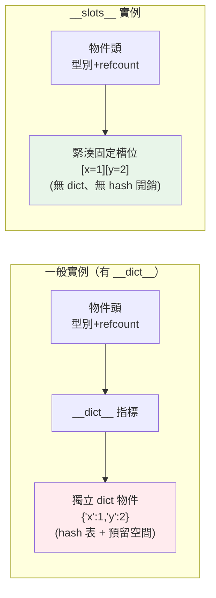

# 記憶體優化 __slots__

> 效能不只是速度，記憶體也是資源。當你要建立**幾百萬個小物件**，Python 每個實例預設攜帶的 `__dict__` 會吃掉大量記憶體。`__slots__` 能拿掉這份開銷，省下 5–8 成記憶體。這章講 Python 物件的記憶體模型、`__slots__` 的原理，以及用生成器串流大資料避免一次載入。

## 💡 白話導讀（建議先讀）

Python 的每個物件實例,預設都背著一個**雜物包**——`__dict__`。
好處是隨時能塞新東西（動態加屬性 `obj.anything = 1`）;
代價是**包本身就重**:一個空 dict 就要上百 bytes。一個物件無所謂,
**一百萬個物件**時,光雜物包就吃掉幾百 MB。

`__slots__` 就是把雜物包換成**固定格數的工具腰帶**:

```python
class Point:
    __slots__ = ("x", "y")   # 只有這兩格,別給我配 __dict__
```

屬性存進類別預先劃好的固定位置——省下整個 dict,單一實例常省一半以上記憶體,
存取還更快。代價是失去彈性:不能再動態加新屬性。
**大量小物件的資料類**（座標點、記錄）最值得上。

這章的其他省記憶體招式,其實都是舊朋友:

- **generator 取代 list**:不要整箱搬,一次拿一個——[說書人](../07-iterators-generators/README.md)的老原則,
  處理大檔案時是「幾 GB vs 幾 KB」的差距。
- **numpy 陣列取代 list of objects**:[拆掉盒子的蛋盒](../17-data-science/01-numpy-basics.md),
  百萬個數字從「百萬個 PyObject」變一條連續裸數值。
- **量測工具**:`sys.getsizeof`、`tracemalloc`（誰配置了記憶體）——
  和速度優化同一守則:**先量,再動手**。

## Why（為什麼）

Python 一切皆物件，而物件不便宜。一個看似簡單的實例：

```python
class Point:
    def __init__(self, x, y):
        self.x = x
        self.y = y
```

每個 `Point` 實例預設帶一個 **`__dict__`**（一個 dict，存 `{'x': ..., 'y': ...}`）——這讓你能隨時 `p.z = 3` 動態加屬性，但代價是**每個實例都多背一個 dict 的記憶體**（幾百 bytes）。一兩個物件沒差，但當你要建**一百萬個 Point**（科學計算、遊戲實體、ORM 載入大量列、解析巨量資料），這份 per-instance dict 開銷乘以一百萬，就是幾百 MB 的浪費，甚至撐爆記憶體。

**`__slots__`** 是解法：宣告「這個類別只會有這幾個固定屬性」，Python 就**不建 `__dict__`**，改用更緊湊的固定欄位存屬性——每個實例省下 5–8 成記憶體。

記憶體優化還有另一面：**別把不需要同時存在的資料一次全載入記憶體**。讀一個 10GB 的檔案做逐行處理，用 `list` 全讀會 OOM，用**生成器（generator）串流**則記憶體恆定（見 [生成器](../07-iterators-generators/README.md)）。這章講這兩大記憶體優化手段：`__slots__` 壓縮物件、生成器串流資料。

## Theory（理論：Python 物件的記憶體模型）

一個普通 Python 實例的記憶體由幾部分組成：

- **物件本身的固定開銷**：型別指標、引用計數等（見 [物件模型](../10-cpython-internals/README.md)），約數十 bytes。
- **`__dict__`**：一個獨立的 dict 物件，存實例的所有屬性。這是「能動態加屬性」的來源，也是主要的額外開銷——一個小 dict 本身就要一兩百 bytes 以上。
- **（可能的）`__weakref__`**：支援弱引用的槽位。

**`__slots__` 做的事**：在類別定義 `__slots__ = ("x", "y")`，等於告訴 Python：「這個類別的實例**只會有 x、y 這兩個屬性**，別給我建 `__dict__`」。於是：

- 實例**不再有 `__dict__`**，屬性改存在類別預先配置的**固定位置**（像 C struct 的欄位，透過 descriptor 存取，見 [descriptor](../04-oop/README.md)）。
- 記憶體大幅下降（沒有 dict 的開銷）。
- **副作用**：不能再動態加未宣告的屬性（`p.z = 3` 會 `AttributeError`）——這既是限制，也常是好處（防打錯字）。

**取捨**：`__slots__` 用「失去動態性 + 少許彈性」換「大量記憶體 + 些許屬性存取加速」。只在**大量實例**時才值得——少量物件不必用。

## Specification（規範：__slots__ 與串流）

**`__slots__` 宣告**：

```python
class Point:
    __slots__ = ("x", "y")     # 只允許這些屬性，不建 __dict__
    def __init__(self, x, y):
        self.x = x
        self.y = y
```

**規則與細節**：

- 宣告後**不能設定 `__slots__` 以外的屬性**（`AttributeError`）。
- **繼承**：子類別若沒宣告自己的 `__slots__`，實例又會有 `__dict__`（前功盡棄）；要保持節省，子類別也要宣告 `__slots__`。
- 有 `__slots__` 的類別預設**不支援弱引用**，需要就加 `"__weakref__"` 進 slots。
- `@dataclass(slots=True)`（Python 3.10+）可自動產生帶 slots 的 dataclass。

**量測記憶體**：

- `sys.getsizeof(obj)`：物件**自身**佔幾 bytes（**不含**它引用的其他物件，如 `__dict__`、list 內容）。
- `tracemalloc`：追蹤一段程式的實際記憶體配置（標準庫，見 [stdlib](../11-stdlib/README.md)）。
- 第三方 `pympler` 可算含引用的「深層」大小。

**串流大資料用生成器**：

```python
def read_lines(path):
    with open(path) as f:
        for line in f:        # 一次一行，記憶體恆定
            yield line.strip()
```

## Implementation（底層：slots 如何省、getsizeof 的陷阱）

**`__slots__` 為何省記憶體**：沒有 slots 時，實例的屬性存在一個獨立的 `__dict__` 物件裡——除了屬性值，還要付 dict 的雜湊表結構、負載因子預留空間等開銷。有 slots 時，Python 在**類別層級**為每個 slot 建立一個 **descriptor**，實例則用一塊**緊湊的固定陣列**依序存這些屬性值——沒有 dict、沒有 hash 結構、沒有預留空間。所以一個 2 屬性的物件，`__dict__` 版可能要 300+ bytes，slots 版只要幾十 bytes。

**`getsizeof` 的陷阱**：`sys.getsizeof(obj)` 只算**物件本身的淺層大小**，**不含它引用的東西**。所以：

- 對 `__dict__` 版的實例，`getsizeof(instance)` 不含 `__dict__` 的大小——要算完整開銷得 `getsizeof(instance) + getsizeof(instance.__dict__)`。
- 對 list，`getsizeof(lst)` 是指標陣列的大小，不含裡面元素物件的大小。

這常讓人誤判——下面範例特意把 `__dict__` 的大小加回來，才是公平比較。

**生成器為何省記憶體**：`list` 把所有元素**同時**存在記憶體；生成器（見 [生成器](../07-iterators-generators/README.md)）是**惰性**的，`yield` 一次只產生一個值、用完就丟，記憶體只需容納「當前一個」加迭代狀態。所以處理 10GB 檔案，list 需要 10GB、生成器只需常數記憶體——這是處理大於記憶體的資料的關鍵。

## Code Example（可執行的 Python 範例）

```python
# memory_demo.py — __slots__ 的記憶體與行為差異（需要標準庫）
import sys


class PointDict:
    """一般類別：每個實例帶 __dict__。"""

    def __init__(self, x: int, y: int) -> None:
        self.x = x
        self.y = y


class PointSlots:
    """__slots__：不建 __dict__，屬性存固定槽位。"""

    __slots__ = ("x", "y")

    def __init__(self, x: int, y: int) -> None:
        self.x = x
        self.y = y


def main() -> None:
    d = PointDict(1, 2)
    s = PointSlots(1, 2)

    # 一般類別有 __dict__，slots 版沒有
    print("PointDict 有 __dict__:", hasattr(d, "__dict__"))
    print("PointSlots 有 __dict__:", hasattr(s, "__dict__"))

    # 公平比較：一般類別要把 __dict__ 的大小加回來
    d_total = sys.getsizeof(d) + sys.getsizeof(d.__dict__)
    s_total = sys.getsizeof(s)
    print(f"PointDict 約 {d_total} bytes(含 __dict__ {sys.getsizeof(d.__dict__)} bytes)")
    print(f"PointSlots 約 {s_total} bytes")
    print(f"slots 省約 {(1 - s_total / d_total) * 100:.0f}%")

    # slots 不能加未宣告的屬性（防打錯字）
    try:
        s.z = 3  # type: ignore[attr-defined]
    except AttributeError:
        print("slots 加未宣告屬性 → AttributeError")

    # 一般類別可任意加屬性（彈性，但耗記憶體）
    d.z = 3  # type: ignore[attr-defined]
    print("dict 版可任意加屬性: z =", d.z)


if __name__ == "__main__":
    main()
```

**預期輸出**（bytes 數為 Python 3.12 典型值，依版本/平台而異）：

```pycon
$ python memory_demo.py
PointDict 有 __dict__: True
PointSlots 有 __dict__: False
PointDict 約 344 bytes(含 __dict__ 296 bytes)
PointSlots 約 48 bytes
slots 省約 86%
slots 加未宣告屬性 → AttributeError
dict 版可任意加屬性: z = 3
```

逐段解說：

- **有無 `__dict__`**：`hasattr(d, "__dict__")` 為 True、slots 版為 False——這是記憶體差異的根源。
- **公平比較**：`PointDict` 光 `__dict__` 就佔 296 bytes，加上物件本身共約 344 bytes；`PointSlots` 只要 48 bytes——**省約 86%**。一百萬個實例就是省數百 MB。
- **`getsizeof` 陷阱**：如果只看 `sys.getsizeof(d)`（48 bytes，不含 `__dict__`），會誤以為兩者一樣大——所以必須把 `__dict__` 加回來才公平。
- **不能加未宣告屬性**：`s.z = 3` 拋 `AttributeError`——失去動態性，但也擋下「打錯屬性名默默生出新屬性」的 bug。
- **一般類別的彈性**：`d.z = 3` 成功，代價就是那個 `__dict__` 的記憶體。
- **確定性**：`hasattr` 與 `AttributeError` 行為完全確定；bytes 數在同一 Python 版本固定（3.12 為此值），跨版本會略有不同。

## Diagram（圖解：__dict__ vs __slots__ 佈局）



## Best Practice（最佳實踐）

- **大量小物件（數十萬以上）用 `__slots__`**：省 5–8 成記憶體，屬性存取也略快。
- **少量物件不必用 `__slots__`**：省的記憶體微不足道，反而失去彈性。
- **子類別也要宣告 `__slots__`**：否則子類別實例又長回 `__dict__`，白費。
- **需要弱引用時加 `"__weakref__"` 到 slots**。
- **用 `@dataclass(slots=True)`**（3.10+）：兼得 dataclass 便利與 slots 省記憶體。
- **量測記憶體別只看 `getsizeof`**：它是淺層大小，要含 `__dict__`/內容；大範圍用 `tracemalloc`。
- **處理大資料用生成器串流**：別一次 `list` 全載入，避免 OOM（見 [生成器](../07-iterators-generators/README.md)）。
- **先量測記憶體瓶頸再優化**：用 `tracemalloc` 確認哪裡吃記憶體，別盲目加 slots。

## Common Mistakes（常見誤解）

- **對少量物件加 `__slots__`**：省不到什麼，卻失去動態屬性——不值得。
- **只用 `sys.getsizeof` 判斷物件大小**：它不含 `__dict__`/引用內容，會嚴重低估。
- **子類別忘了宣告 `__slots__`**：實例又有 `__dict__`，slots 的節省全泡湯。
- **以為 `__slots__` 主要是為了加速**：它主要省記憶體，速度提升有限。
- **需要動態加屬性卻用了 slots**：`obj.new_attr = ...` 直接 `AttributeError`。
- **用 `list` 讀取超大檔案**：一次全載入 → OOM；該用生成器逐行串流。
- **在有 `__slots__` 的類別上用需要 `__dict__` 的功能**（某些序列化、mixin）而未預留。
- **過早做記憶體優化**：沒量測就加 slots/改串流，增加複雜度卻未必是瓶頸。

## Interview Notes（面試重點）

- **能解釋 `__slots__` 為何省記憶體**：拿掉 per-instance `__dict__`，屬性改存類別配置的固定槽位（descriptor），省去 dict 的 hash 結構與預留空間。
- **知道 `__slots__` 的代價**：不能動態加屬性、子類別需自行宣告才保留節省、預設無弱引用。
- **知道 `sys.getsizeof` 只算淺層大小**（不含 `__dict__`/內容），量大範圍要 `tracemalloc`。
- **能說明生成器 vs list 的記憶體差異**：惰性、常數記憶體 vs 全載入，用於串流大於記憶體的資料。
- **知道 `@dataclass(slots=True)`** 與「何時才值得用 slots」（大量實例）。
- **強調先量測記憶體瓶頸再優化**，別盲目套用。

---

➡️ 下一章：[非同步效能](07-async-performance.md)

[⬆️ 回 Part 18 索引](README.md)
