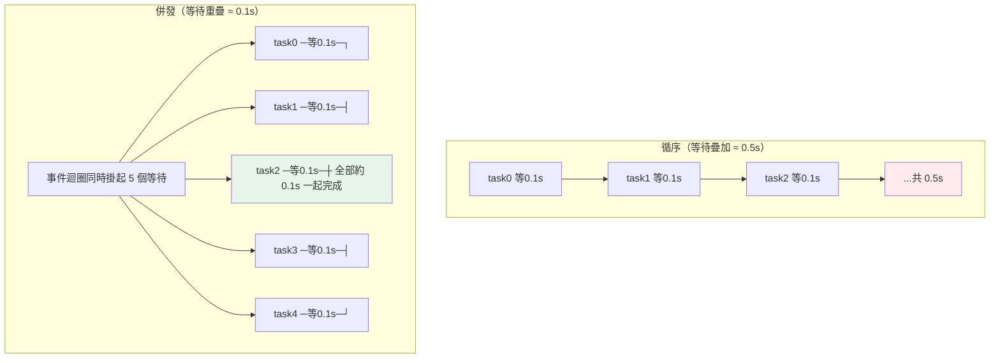

# 非同步效能

> 如果你的程式大部分時間在「等」——等資料庫回應、等 API、等檔案 I/O——那 CPU 其實閒著。非同步（async）讓這些等待**重疊**進行：一個請求在等時，去處理下一個。這章講 async 為何能大幅提升 I/O-bound 的吞吐、為何對 CPU-bound 沒用，以及非同步程式的效能陷阱。

## 💡 白話導讀（建議先讀）

你的 API 處理一個請求要 200ms——其中 195ms 在**等**:等資料庫回、等外部 API。
CPU 其實在發呆。這種程式再怎麼優化計算都沒用,該優化的是「**等**」這件事。

回想 [Part 9 的單人服務生](../09-concurrency/README.md):
一個服務生（單執行緒 event loop）送單進廚房後**不站著等菜**,
轉身去接別桌的單;哪桌的菜好了（I/O 完成）再回去送。
一個人就能同時照看幾百桌——前提是**每件事大部分時間都在等**。

所以第一步永遠是分辨負載類型:

- **I/O-bound（等居多）**:async 大放異彩——等待重疊起來,吞吐量翻倍。
- **CPU-bound（算居多）**:async **完全沒用**（單執行緒,GIL 也擋著）,
  要用多行程（multiprocessing）或[原生編譯](05-cython-numba.md)。

async 效能的頭號殺手,也用服務生講:**在協程裡呼叫同步阻塞函式**
（`requests.get`、`time.sleep`）＝服務生站在廚房前發呆——
event loop 整個卡住,**全店停擺**。解法:用 async 版本（`httpx`、`asyncio.sleep`）,
真躲不掉就丟給 `run_in_executor`（請個臨時工去等）。

這章實測:順序 vs `gather` 併發的差距、`Semaphore` 限流（別把下游打掛）、
以及怎麼用 profiler 抓出 event loop 裡的阻塞點。

## Why（為什麼）

想像一個 API 要向 5 個外部服務各拿一份資料，每個要等 100ms。同步寫法：

```python
for url in urls:
    data = fetch(url)   # 等 100ms，這期間 CPU 完全閒置
```

總共 500ms——但這 500ms 裡 CPU 幾乎沒做事，全在**空等網路回應**。這就是 **I/O-bound（I/O 密集）** 工作的特徵：瓶頸不是計算，是等待。

非同步的洞見：**既然在等 A 回應時 CPU 閒著，何不同時發出 B、C、D、E 的請求，讓所有等待重疊？** 用 `asyncio.gather` 併發：

```python
async def main() -> None:
    data = await asyncio.gather(*[fetch(url) for url in urls])   # 5 個一起等
```

總時間降到約 **100ms**（5 個等待重疊成一個）——快 5 倍。這不是把計算變快，而是**把閒置的等待時間利用起來**。

對 I/O-bound 服務（Web API、爬蟲、資料庫存取），async 帶來的吞吐提升是數量級的，且比多執行緒更輕量（單執行緒、無執行緒切換開銷）。但要注意：**async 對 CPU-bound 完全沒用**，甚至因 GIL 而幫倒忙。這章講清楚 async 的效能適用邊界與實務陷阱。基礎機制見 [asyncio](../09-concurrency/README.md)。

## Theory（理論：I/O-bound vs CPU-bound）

工作負載分兩類，決定該用什麼並發手段：

- **I/O-bound（I/O 密集）**：大部分時間在**等外部**（網路、磁碟、資料庫）。CPU 閒置。→ **async 或多執行緒**能重疊等待、大幅提升吞吐。
- **CPU-bound（CPU 密集）**：大部分時間在**算**（數值運算、加密、影像處理）。CPU 忙滿。→ async 與多執行緒都**無效**（受 GIL 限制，見 [GIL](../09-concurrency/README.md)），要用**多行程**（multiprocessing）或[原生編譯](05-cython-numba.md)。

**async 為何能加速 I/O-bound**：`asyncio` 是**單執行緒 + 事件迴圈（event loop）** 的協作式並發。當一個協程 `await` 一個 I/O 操作，它**主動讓出**控制權給事件迴圈，迴圈就去跑別的協程；等 I/O 完成，再回來繼續。於是「多個等待」在單一執行緒裡**重疊**——沒有真正的平行計算，只是把等待時間填滿。

**async 為何對 CPU-bound 無用**：協程只在 `await` 時讓出。一個純計算的協程沒有 `await` 點，會**霸佔事件迴圈**直到算完，其他協程全被卡住——單執行緒也無法平行計算。而且 GIL 讓多執行緒也無法平行跑 Python 計算。CPU-bound 要真正平行只能靠多行程。

**一句話**：**async 把「等待」重疊，不把「計算」加速**。

## Specification（規範：併發 async 的工具）

**併發執行多個協程**：

```python
import asyncio

async def main() -> None:
    # gather：併發跑多個、全部完成後回傳結果 list（順序對應）
    results = await asyncio.gather(fetch(a), fetch(b), fetch(c))

    # TaskGroup（3.11+，推薦）：結構化併發，一個失敗會妥善取消其他
    async with asyncio.TaskGroup() as tg:
        t1 = tg.create_task(fetch(a))
        t2 = tg.create_task(fetch(b))

    # as_completed：誰先完成先處理
    for coro in asyncio.as_completed([fetch(a), fetch(b)]):
        result = await coro

    # 限流：用 Semaphore 控制同時併發數（避免壓垮對方）
    sem = asyncio.Semaphore(10)
    async def limited_fetch(url):
        async with sem:
            return await fetch(url)
```

**逾時控制**：

```python
async def main() -> None:
    async with asyncio.timeout(5):   # 3.11+
        await slow_operation()
```

**把阻塞操作丟到執行緒**（別在事件迴圈裡跑阻塞呼叫）：

```python
async def main() -> None:
    result = await asyncio.to_thread(blocking_io_function, arg)
```

## Implementation（底層：事件迴圈與「別阻塞」）

**事件迴圈怎麼重疊等待**：`asyncio` 底層用作業系統的 I/O 多工機制（如 `epoll`/`kqueue`/IOCP）。當協程 `await` 一個網路讀取，asyncio 向 OS 註冊「這個 socket 有資料時通知我」，然後**讓出**去跑別的協程。OS 通知哪個 socket 就緒，事件迴圈就喚醒對應協程繼續。所以單一執行緒能同時「掛著」成千上萬個等待中的連線，記憶體開銷遠小於「一連線一執行緒」——這是 async 高並發的根源。

**最大的效能陷阱——在事件迴圈裡做阻塞操作**：事件迴圈是單執行緒的。如果某個協程呼叫了**同步阻塞**的函式（`time.sleep()`、同步的 `requests.get()`、重 CPU 計算、同步 DB driver），它**不會讓出**，整個事件迴圈就被卡死——所有其他協程都停擺。這會讓 async 的優勢瞬間歸零。解法：

- I/O 用 **async 版函式庫**（`aiohttp` 而非 `requests`、async DB driver）。
- 不得已的阻塞呼叫用 **`asyncio.to_thread`** 丟到執行緒池，不擋事件迴圈。
- CPU 密集用 **多行程**（`ProcessPoolExecutor`），別放事件迴圈。

**併發不是無限好**：同時開幾萬個連線可能壓垮對方或耗盡本地資源，用 **`Semaphore`** 限流。事件迴圈本身也有排程開銷，極輕量任務時 async 未必划算。

下面範例用 `asyncio.sleep`（可讓出的非阻塞等待）模擬 I/O，對比循序與併發。

## Code Example（可執行的 Python 範例）

```python
# async_perf_demo.py — 循序 vs 併發的 I/O-bound 對比（需要標準庫）
import asyncio
import time


async def fetch(name: str, delay: float) -> str:
    """模擬一次 I/O 等待（await sleep 會讓出事件迴圈，非阻塞）。"""
    await asyncio.sleep(delay)
    return f"{name} done"


async def run_sequential() -> list[str]:
    """循序：一個等完才下一個 → 延遲疊加。"""
    results = []
    for i in range(5):
        results.append(await fetch(f"task{i}", 0.1))
    return results


async def run_concurrent() -> list[str]:
    """併發：5 個一起等 → 等待重疊。"""
    tasks = [fetch(f"task{i}", 0.1) for i in range(5)]
    return await asyncio.gather(*tasks)


async def main() -> None:
    t0 = time.perf_counter()
    await run_sequential()
    seq = time.perf_counter() - t0

    t0 = time.perf_counter()
    results = await run_concurrent()
    con = time.perf_counter() - t0

    print("結果數:", len(results))
    print(f"循序約 {seq:.2f}s（5 × 0.1s 疊加）")
    print(f"併發約 {con:.2f}s（等待重疊，約單一延遲）")
    print(f"併發比循序快約 {seq / con:.1f} 倍")
    print("重點：async 重疊 I/O 等待，不加速計算；CPU-bound 用多行程")


if __name__ == "__main__":
    asyncio.run(main())
```

**預期輸出**（時間為近似值，比例穩定）：

```pycon
$ python async_perf_demo.py
結果數: 5
循序約 0.50s（5 × 0.1s 疊加）
併發約 0.10s（等待重疊，約單一延遲）
併發比循序快約 5.0 倍
```

逐段解說：

- **`fetch`**：用 `await asyncio.sleep(delay)` 模擬 I/O 等待。關鍵是 `await` 會**讓出**事件迴圈，讓別的協程趁機執行——這是非阻塞的等待。
- **`run_sequential`**：`for` 迴圈裡逐個 `await`，一個等完（0.1s）才發下一個，5 個疊加成約 0.5s——等待沒有重疊。
- **`run_concurrent`**：先建立 5 個協程，用 `asyncio.gather` 一起跑。5 個等待同時進行、重疊成約 0.1s——**這就是 async 對 I/O-bound 的威力**。
- **5 倍加速**：來自「把 5 段閒置等待重疊」，不是計算變快。若把 `asyncio.sleep` 換成**同步**的 `time.sleep`（阻塞），併發版會退回 0.5s——因為阻塞呼叫卡死事件迴圈，這正是最常見的陷阱。
- **比例穩定**：循序/併發約 5:1，因為由 sleep 主導；絕對值略有排程誤差。

## Diagram（圖解：循序 vs 併發的等待）



## Best Practice（最佳實踐）

- **I/O-bound 用 async 併發**（`gather`/`TaskGroup`）：重疊等待、大幅提升吞吐。
- **CPU-bound 別用 async**：用多行程（`ProcessPoolExecutor`）或[原生編譯](05-cython-numba.md)；async/執行緒受 GIL 無益。
- **事件迴圈裡絕不做阻塞呼叫**：用 async 函式庫（`aiohttp`、async DB driver）；不得已的阻塞用 `asyncio.to_thread`。
- **併發要限流**：用 `Semaphore` 控制同時連線數，別壓垮下游或耗盡資源。
- **用 `TaskGroup`（3.11+）取代裸 `gather`**：結構化併發，錯誤處理與取消更妥當。
- **設逾時**：`asyncio.timeout`，避免單一慢請求拖垮整體。
- **重用連線（connection pool）**：別每次請求都建新連線（見 [連線池](../15-database/README.md)）。
- **先判斷負載型態（I/O vs CPU）再選並發模型**：選錯模型再怎麼調都沒用。

## Common Mistakes（常見誤解）

- **對 CPU-bound 用 async 期待加速**：沒有 `await` 讓出點，協程霸佔事件迴圈，反而更糟；該用多行程。
- **在協程裡呼叫同步阻塞函式**（`time.sleep`、`requests.get`、同步 DB）：卡死事件迴圈，所有協程停擺，async 優勢歸零。
- **循序 `await` 而非併發**：`for url: await fetch(url)` 等於沒併發；要 `gather` 才重疊。
- **無限併發壓垮下游**：一次開幾萬連線；用 `Semaphore` 限流。
- **混用 async 與阻塞而不 `to_thread`**：偶發卡頓難查。
- **以為 async = 平行**：它是單執行緒協作式並發，重疊等待而非平行計算。
- **每次請求建新連線**：浪費握手成本；用連線池。
- **忘了設逾時**：一個永遠不回的請求卡住整批。

## Interview Notes（面試重點）

- **能區分 I/O-bound 與 CPU-bound**，並說明各該用什麼：async/執行緒 vs 多行程。
- **能解釋 async 為何加速 I/O-bound**：單執行緒事件迴圈重疊等待（`await` 讓出、OS I/O 多工），而非平行計算。
- **能說出 async 對 CPU-bound 無效的原因**：無 `await` 讓出點會霸佔迴圈、GIL 限制。
- **知道最大陷阱是「事件迴圈裡的阻塞呼叫」**，以及解法（async 函式庫 / `to_thread` / 多行程）。
- **會用 `gather`/`TaskGroup` 併發、`Semaphore` 限流、`timeout` 逾時**。
- **能量化「循序疊加 vs 併發重疊」的差異**，並知道換成阻塞 sleep 就會退化。

---

⬅️ 這是 Part 18 的最後一章。

[⬆️ 回 Part 18 索引](README.md) ｜ [下一 Part：雲原生與部署 ➡️](../19-cloud-native/README.md)
