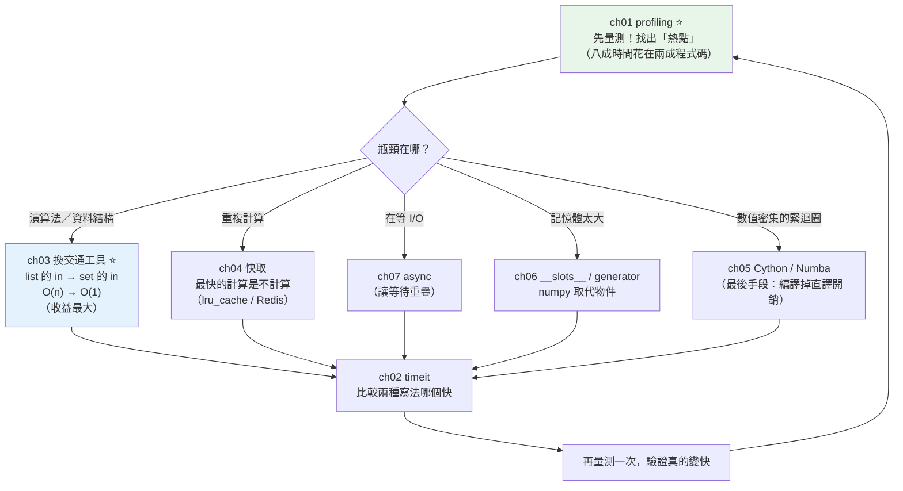

# Part 18 統整：效能優化全貌

> 把這 7 章串成一張圖——第一守則只有四個字：**先量測，別猜。**

## 🗺️ 知識地圖（這 7 章怎麼串起來）

Part 18 有一條**嚴格的順序**，跳過任何一步都是浪費力氣：



**一句話串起來**：

**[量測](01-profiling.md)（ch01）永遠是第一步**——
工程師對「哪裡慢」的直覺**出錯率高得驚人**
（就像家裡電費暴增，你以為是冷氣，元兇卻是老冰箱）。
`cProfile` 是你的分電表，看 **`tottime`** 找熱點。

找到熱點之後，**依收益排序**選武器：

1. **[換演算法／資料結構](03-optimization-strategies.md)（ch03）——收益最大。**
   把 `list` 的 `in`（O(n)）換成 `set` 的 `in`（O(1)）——
   **一行改動，快幾百倍**（下面的小實作會證明）。
   台北到高雄，**機車騎再快也贏不了高鐵**。
2. **[快取](04-caching.md)（ch04）** —— 最快的計算是**不計算**。
3. **[async](07-async-performance.md)（ch07）** —— 如果是在「等」，讓等待重疊。
4. **[省記憶體](06-memory-optimization.md)（ch06）** —— `__slots__`、generator。
5. **[原生編譯](05-cython-numba.md)（ch05）—— 最後手段。**
   前面都做完了，數值緊迴圈還是慢，才輪到 Cython/Numba。

**最後：再量測一次**（[timeit](02-timeit.md)，ch02），**驗證你真的改快了**。

## ⚡ 速查表（什麼情境用什麼）

| 情境 | 怎麼做 | 章節 |
|------|--------|------|
| **「程式很慢」的第一步** | **`cProfile`** → 看 **`tottime`** 排行找熱點——**別猜** | [ch01](01-profiling.md) |
| 想比較「兩種寫法哪個快」 | **`timeit`**（多輪取 **min**，因為干擾只會讓程式變慢） | [ch02](02-timeit.md) |
| 正式環境要 profiling | **取樣式 profiler**（`py-spy`）——開銷低，可掛在線上 | [ch01](01-profiling.md) |
| **迴圈裡反覆檢查「在不在裡面」** | **先轉成 `set`**（O(n) → O(1)）——**最高 CP 值的一行優化** | [ch03](03-optimization-strategies.md) |
| 巢狀迴圈找配對（O(n²)） | 用 **dict 建索引**降成 O(n) | [ch03](03-optimization-strategies.md) |
| 取前 K 大 | `heapq.nlargest(k, xs)`（勝過 `sorted(xs)[:k]`） | [ch03](03-optimization-strategies.md) |
| **同樣的輸入被算很多次** | **`@functools.lru_cache`**（前提：**純函式**） | [ch04](04-caching.md) |
| 跨行程／跨服務共用快取 | **Redis**（見 [Part 15](../15-database/18-redis.md)） | [ch04](04-caching.md) |
| **程式大部分時間在「等」** | **async**（讓等待重疊）——見 [Part 9](../09-concurrency/README.md) | [ch07](07-async-performance.md) |
| async 裡不小心呼叫阻塞函式 | 🔴 **event loop 全停擺**——用 `asyncio.to_thread` | [ch07](07-async-performance.md) |
| **幾百萬個小物件太吃記憶體** | **`__slots__`**（拿掉 `__dict__`） | [ch06](06-memory-optimization.md) |
| 處理大檔案／大資料 | **generator**（別一次載進 list） | [ch06](06-memory-optimization.md) |
| 一堆數字的運算 | **numpy**（見 [Part 17](../17-data-science/01-numpy-basics.md)） | [ch06](06-memory-optimization.md) |
| 記憶體洩漏 | `tracemalloc`；找**循環引用**與**沒清的快取**（見 [Part 10](../10-cpython-internals/04-garbage-collection.md)） | [ch06](06-memory-optimization.md) |
| **數值緊迴圈，前面都優化完還是慢** | **Numba**（加 `@njit`，幾乎零改寫）／**Cython**（要發佈的函式庫） | [ch05](05-cython-numba.md) |
| CPU 密集要用多核 | **multiprocessing**（GIL 擋住執行緒——見 [Part 9](../09-concurrency/02-gil.md)） | [ch07](07-async-performance.md) |

## 🔑 核心心智模型（帶得走的幾句話）

- **先量測，別猜。** 這是整個 Part 18 唯一必須記住的一句。
  你對「哪裡慢」的直覺**大概率是錯的**——
  下面的小實作裡，那個「看起來很忙」的排序函式**根本不是瓶頸**。
- **80/20：八成時間花在兩成程式碼上。** 所以**只優化那個熱點**就好，
  其他地方動了也是白動（還會讓程式變難讀）。
- **選對交通工具，勝過猛踩油門。** 把 `O(n²)` 改成 `O(n)`，
  勝過任何微優化。**n = 100 萬時，O(n) 和 O(n²) 差一百萬倍**——
  再怎麼把迴圈寫緊都追不回來。
- **最快的計算，是不計算。** 快取（`lru_cache`）——但前提是**純函式**
  （同輸入同輸出、無副作用），否則你會拿到**過時的錯誤答案**。
- **優化有順序**：量測 → 換演算法 → 快取 → 善用內建/numpy → **最後才是編譯**。
  **跳過量測直接優化，是新手最常見的浪費。**
- **過早優化是萬惡之源，但「過早」不等於「永遠不做」。**
  先讓它正確、清楚；**等 profiler 指出瓶頸，再動手**。

## 🛠️ 小實作：profiler 打臉直覺 + 一行改動快 279 倍

```python
# performance_demo.py —— Part 18 主線：先量測，別猜
from __future__ import annotations

import cProfile
import io
import pstats
import sys
import time
from collections.abc import Callable
from functools import lru_cache


def membership_slow(items: list[int], queries: list[int]) -> int:
    """🔴 真正的瓶頸：list 的 in 是 O(n)——每次都從頭掃到尾。"""
    return sum(1 for q in queries if q in items)


def membership_fast(items: list[int], queries: list[int]) -> int:
    """✅ 換資料結構：set 的 in 是 O(1)。"""
    lookup = set(items)                    # 一行——就這樣
    return sum(1 for q in queries if q in lookup)


def tidy(items: list[int]) -> list[int]:
    """一個「看起來很花時間」的無辜函式——直覺常誤判它是瓶頸。"""
    return sorted({x for x in items})


@lru_cache(maxsize=None)
def fib(n: int) -> int:
    return n if n < 2 else fib(n - 1) + fib(n - 2)


class Point:
    def __init__(self, x: int, y: int) -> None:
        self.x, self.y = x, y


class SlottedPoint:
    __slots__ = ("x", "y")                 # ch06：不要 __dict__

    def __init__(self, x: int, y: int) -> None:
        self.x, self.y = x, y


ITEMS = list(range(20_000))
QUERIES = list(range(0, 20_000, 2))


def workload() -> None:
    tidy(ITEMS)                            # 看起來很忙
    membership_slow(ITEMS, QUERIES)        # 實際的兇手


def timeit(label: str, func: Callable[[], object]) -> float:
    start = time.perf_counter()
    func()
    elapsed = (time.perf_counter() - start) * 1000
    print(f"    {label:30s} {elapsed:8.1f} ms")
    return elapsed


def demo() -> None:
    print("【ch01 profiling】先量測——別猜瓶頸在哪")
    profiler = cProfile.Profile()
    profiler.enable()
    workload()
    profiler.disable()

    buf = io.StringIO()
    pstats.Stats(profiler, stream=buf).sort_stats("tottime").print_stats(3)
    lines = [ln for ln in buf.getvalue().splitlines() if ln.strip()]
    header = next(i for i, ln in enumerate(lines) if "tottime" in ln)
    for line in lines[header : header + 4]:
        print(f"      {line.strip()[:70]}")
    print("    → 瓶頸是 membership_slow（tottime 最大），不是看似很忙的 tidy")

    print("\n【ch03 換演算法／資料結構】——收益最大的一招")
    slow = timeit("list 的 in   O(n)", lambda: membership_slow(ITEMS, QUERIES))
    fast = timeit("set  的 in   O(1)", lambda: membership_fast(ITEMS, QUERIES))
    print(f"    → 快了 {slow / fast:.0f} 倍 —— 只是換了一個資料結構")

    print("\n【ch04 快取】最快的計算，是不計算")
    fib.cache_clear()
    timeit("fib(90) 第一次", lambda: fib(90))
    timeit("fib(90) 第二次（快取命中）", lambda: fib(90))
    print(f"    cache_info(): {fib.cache_info()}")

    print("\n【ch06 記憶體】__slots__ 拿掉每個實例的 __dict__")
    plain = sys.getsizeof(Point(1, 2)) + sys.getsizeof(Point(1, 2).__dict__)
    slotted = sys.getsizeof(SlottedPoint(1, 2))
    print(f"    一般類別 : {plain:3d} bytes（實例 + __dict__）")
    print(f"    __slots__: {slotted:3d} bytes")
    print(f"    → 100 萬個實例可省 {(plain - slotted) * 1_000_000 / 1024 / 1024:.0f} MB")


if __name__ == "__main__":
    demo()
```

**預期輸出**（數字依機器而異，但**量級差距很穩定**）：

```pycon
$ python performance_demo.py
【ch01 profiling】先量測——別猜瓶頸在哪
      ncalls  tottime  percall  cumtime  percall filename:lineno(function)
      10001    0.358    0.000    0.358    0.000 performance_demo.py:15(<genexpr>)
      1    0.001    0.001    0.359    0.359 {built-in method builtins.sum}
      1    0.001    0.001    0.001    0.001 performance_demo.py:25(tidy)
    → 瓶頸是 membership_slow（tottime 最大），不是看似很忙的 tidy

【ch03 換演算法／資料結構】——收益最大的一招
    list 的 in   O(n)                     350.5 ms
    set  的 in   O(1)                       1.4 ms
    → 快了 279 倍 —— 只是換了一個資料結構

【ch04 快取】最快的計算，是不計算
    fib(90) 第一次                            0.1 ms
    fib(90) 第二次（快取命中）                    0.0 ms
    cache_info(): CacheInfo(hits=89, misses=91, maxsize=None, currsize=91)

【ch06 記憶體】__slots__ 拿掉每個實例的 __dict__
    一般類別 : 336 bytes（實例 + __dict__）
    __slots__:  48 bytes
    → 100 萬個實例可省 275 MB
```

**三件事，說完整個 Part 18**：

**① profiler 打臉直覺。**
`tidy()`（排序 + 去重）**看起來很花時間**——但 profiler 說它只花了 **0.001 秒**。
真正的兇手是 `membership_slow`：**0.358 秒，佔了 99%**。
**如果你憑直覺去優化 `tidy`，會白忙一場。**

**② 一行改動，快 279 倍。**

```text
lookup = set(items)      # 就這一行
```

`list` 的 `in` 要**從頭掃到尾**（O(n)）；`set` 的 `in` **算一次雜湊就到**（O(1)，
見 [Part 3](../03-data-structures/05-set-frozenset.md)）。
**沒有任何微優化能比得上換對資料結構**——這就是「選對交通工具」。

**③ `__slots__` 省下 275 MB。**
每個普通實例都背著一個 `__dict__`（讓你能動態加屬性）——
**一百萬個實例，光是這個包袱就吃掉 275 MB**。
`__slots__` 把它換成固定的工具腰帶（見 [Part 10 物件模型](../10-cpython-internals/02-object-model.md)）。

## ✅ 自測清單（答不出來就回去讀）

- [ ] 優化的第一步是什麼？為什麼不能憑直覺？（[ch01](01-profiling.md)）
- [ ] `cProfile` 的 `tottime` 和 `cumtime` 差在哪？找瓶頸該看哪個？（[ch01](01-profiling.md)）
- [ ] 確定性 profiler 和取樣式 profiler 各適合什麼場景？（[ch01](01-profiling.md)）
- [ ] `timeit` 為什麼多輪取「最小值」而不是平均？（[ch02](02-timeit.md)）
- [ ] 為什麼說「換演算法勝過微優化」？（[ch03](03-optimization-strategies.md)）
- [ ] `x in list` 和 `x in set` 的複雜度各是什麼？（[ch03](03-optimization-strategies.md)）
- [ ] `lru_cache` 能用在什麼函式上？什麼函式**絕對不能**用？（[ch04](04-caching.md)）
- [ ] LRU 的淘汰策略是什麼？為什麼快取要有上限？（[ch04](04-caching.md)）
- [ ] `__slots__` 省了什麼？代價是什麼？（[ch06](06-memory-optimization.md)）
- [ ] 什麼時候該用 Cython / Numba？什麼時候**輪不到**它們？（[ch05](05-cython-numba.md)）
- [ ] async 只對哪一類任務有效？在協程裡呼叫 `time.sleep` 會怎樣？（[ch07](07-async-performance.md)）
- [ ] 優化的正確順序是什麼？（[ch03](03-optimization-strategies.md)）

## 🎯 面試速查

| 考點 | 面試官想聽到什麼 | 章節 |
|------|------------------|------|
| **「這個服務很慢」，你怎麼查？** | 「**先量測，別猜**。用 **`cProfile`**（開發）或 **`py-spy`**（正式環境，取樣式、開銷低）找出**熱點**——看 **`tottime`**（函式自己花的時間）。通常是 80/20：**八成時間花在兩成程式碼**。找到熱點才動手，否則是浪費。」 | [ch01](01-profiling.md) |
| **優化的優先順序？** | 「① **量測**找熱點；② **換演算法／資料結構**（收益最大——`O(n²)` → `O(n)`）；③ **快取**（最快的計算是不計算）；④ 善用**內建函式／numpy**（C 層迴圈）；⑤ **最後**才是 Cython/Numba。**跳過量測直接優化是最常見的浪費。**」 | [ch03](03-optimization-strategies.md) |
| **最常見的一行優化？** | 「**迴圈裡反覆查成員 → 先把 list 轉成 set**。`in` 從 **O(n)** 變 **O(1)**。我實測過：2 萬筆資料、1 萬次查詢，**350 ms → 1.4 ms，快 279 倍**——而改動只有一行。」 | [ch03](03-optimization-strategies.md) |
| **`lru_cache` 的前提？** | 「函式必須是**純函式**：① **確定性**（同輸入永遠同輸出，不依賴時間／隨機／外部狀態）；② **無副作用**。否則會回傳**過時的錯誤結果**。另外參數必須 **hashable**，快取也要設 `maxsize` 避免無限成長。」 | [ch04](04-caching.md) |
| **`__slots__` 的作用與代價？** | 「拿掉每個實例的 **`__dict__`**，屬性改存在類別預先配置的**固定槽位**。實測：一個普通實例 336 bytes（含 `__dict__`），`__slots__` 版只要 48 bytes——**一百萬個實例省下 275 MB**。代價是**失去動態加屬性的彈性**。適合『大量小物件』的資料類。」 | [ch06](06-memory-optimization.md) |
| **什麼時候用 Cython / Numba？** | 「**最後手段**。前提是：已經量測過、瓶頸確實是**數值密集的緊迴圈**、而且**無法向量化**（numpy 解決不了）。因為 Python 慢的根源是**動態型別 + 直譯開銷**——編譯後可以確定型別、直接生成機器碼、甚至釋放 GIL。**但如果瓶頸在 I/O 或演算法，編譯完全幫不上忙。**」 | [ch05](05-cython-numba.md) |

---

🎉 **恭喜完成 Part 18！** 你不再「憑感覺優化」——
**先量測，找熱點，選對武器，再驗證。**

到這裡，**你的服務又對、又好改、又夠快**。
接下來 [Part 19 雲原生](../19-cloud-native/README.md) 要解決最後一哩：
**怎麼把它可靠地送到伺服器上，並且知道它活得好不好？**
——「在我機器上明明能跑」這句話，該終結了。

➡️ 下一 Part：[雲原生與部署 Cloud Native](../19-cloud-native/README.md)

[⬆️ 回 Part 18 索引](README.md)
