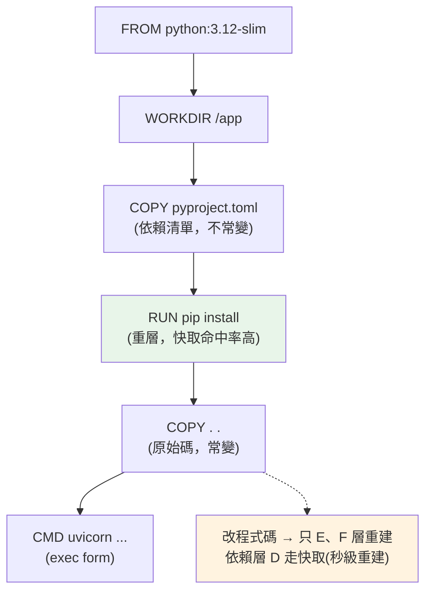

# Docker 化 Python 應用

> 「在我機器上明明能跑」——這句話是部署的惡夢。Docker 把應用程式和它的整個執行環境（Python 版本、依賴、系統函式庫）打包成一個可攜的映像檔（image），到哪都跑得一樣。這章講怎麼把 Python 應用容器化，以及寫出正確、精簡的 Dockerfile。

## Why（為什麼）

你的 FastAPI 服務在本機跑得好好的：Python 3.12、裝了特定版本的套件、某個系統函式庫。交給同事或部署到伺服器，卻到處出錯——對方是 Python 3.10、少裝了某個 C 函式庫、環境變數不對。這就是**環境不一致**的經典痛點：程式碼一樣，環境不同，行為就不同。

**Docker（容器化）** 解決這個問題：把「應用程式 + 它需要的一切」（特定 Python 版本、所有依賴、系統套件、設定）打包成一個**映像檔（image）**。這個映像檔在任何裝了 Docker 的機器上，都以**完全相同**的環境執行——本機、CI、測試機、正式環境無差異。「在我機器上能跑」變成「在任何地方都能跑」。

容器化還帶來：**隔離**（每個容器有自己的檔案系統、網路，互不干擾）、**可攜**（一個映像檔跑遍雲端/地端）、**輕量**（比虛擬機小得多、秒級啟動）、**可組合**（微服務各自容器化、用 [Kubernetes](06-kubernetes.md) 編排）。它是雲原生部署的基石，也是 12-factor（見 [12-factor](04-12-factor.md)）「build/release/run 分離」的落地方式。這章教你把 Python 應用正確地 Docker 化。

## Theory（理論：image、container、layer）

Docker 的三個核心概念：

- **映像檔（image）**：一個唯讀的「應用 + 環境」快照範本。由 `Dockerfile` 建置而成。像「類別」。
- **容器（container）**：映像檔的一個執行實例。像「物件」——同一個映像檔可跑出多個容器。
- **層（layer）**：映像檔由一疊唯讀層堆成，`Dockerfile` 的每個指令（`FROM`/`RUN`/`COPY`…）產生一層。層可被**快取與共享**——沒變的層重建時直接重用，這是建置效能的關鍵。

**容器 vs 虛擬機（VM）**：VM 虛擬化整個作業系統（含自己的 kernel），肥重、啟動慢。容器**共享宿主機的 kernel**，只隔離行程與檔案系統——輕量、秒啟、密度高。所以微服務用容器而非 VM。

**分層與快取的意義**：Docker 建置時逐層執行，若某層的輸入沒變（如依賴清單沒改），就直接用快取的層。**這決定了 Dockerfile 指令的順序**——把「不常變的」（安裝依賴）放前面、「常變的」（複製原始碼）放後面，就能最大化快取命中，讓每次改程式碼的重建又快又省。

## Specification（規範：Dockerfile 指令）

一個 Python 應用的典型 `Dockerfile`：

```dockerfile
FROM python:3.12-slim              # 基底映像（slim：精簡版，較小）

WORKDIR /app                        # 設定工作目錄

# 先複製依賴清單並安裝（這層只在依賴變動時重建 → 善用快取）
COPY pyproject.toml ./
RUN pip install --no-cache-dir .

# 再複製原始碼（常變，放後面）
COPY . .

# 用非 root 使用者執行（安全）
RUN useradd --create-home appuser
USER appuser

EXPOSE 8000                         # 宣告服務埠（文件用途）

# 啟動指令（用 exec form，讓訊號正確傳遞，見 graceful shutdown）
CMD ["uvicorn", "app.main:app", "--host", "0.0.0.0", "--port", "8000"]
```

**關鍵指令**：

- `FROM`：基底映像。`python:3.12-slim` 兼顧體積與相容；`-alpine` 更小但常有 C 編譯問題（musl libc），Python 專案通常用 `slim` 較穩。
- `WORKDIR`：設定並建立工作目錄。
- `COPY` / `ADD`：複製檔案進映像（優先 `COPY`，`ADD` 有額外解壓/URL 行為易誤用）。
- `RUN`：建置時執行指令（裝套件等），產生新層。
- `CMD` / `ENTRYPOINT`：容器啟動時執行的指令（用 **exec form** `["...", "..."]`）。
- `EXPOSE`：宣告埠（僅文件，實際發布靠 `-p`）。
- `USER`：切換執行使用者（別用 root）。

搭配 **`.dockerignore`**（排除 `.venv`、`__pycache__`、`.git`、測試等）避免把無關檔案塞進映像。

## Implementation（底層：層快取與映像大小）

**層快取如何運作**：Docker 為每個指令計算一個快取鍵（基於指令內容 + 前一層 + `COPY` 的檔案內容）。建置時逐層檢查：鍵沒變就用快取層、跳過執行；一旦某層變了，**它與其後的所有層都要重建**（快取失效會往下傳染）。

這推導出**黃金順序**：**依賴安裝放在原始碼複製之前**。因為：

- 你改程式碼的頻率遠高於改依賴。
- 若先 `COPY . .` 再 `pip install`，每次改一行程式碼都會讓 `COPY` 層失效 → 連帶 `pip install` 層重跑 → 每次重建都重裝所有套件，慢死。
- 若先 `COPY pyproject.toml` + `pip install`，再 `COPY . .`，改程式碼只讓最後的 `COPY` 層失效，依賴層仍走快取 → 重建幾秒完成。

**映像大小的重要性**：小映像 = 快拉取、快部署、少攻擊面。縮小手段：

- 用 `slim` 基底（`python:3.12-slim` 約 130MB，完整版 `python:3.12` 近 1GB）。
- `pip install --no-cache-dir`（不留 pip 快取）。
- 用 `.dockerignore` 排除無關檔案。
- 用 [多階段建置](02-multistage-build.md)（build 階段編譯、final 階段只留執行所需）——這是縮小映像最有效的方法。

**exec form vs shell form**：`CMD ["uvicorn", ...]`（exec form）讓應用成為 PID 1 直接收到訊號；`CMD uvicorn ...`（shell form）會包一層 shell，**訊號傳不進去**，導致 [graceful shutdown](07-graceful-shutdown.md) 失效。務必用 exec form。

## Code Example（可執行的 Python 範例）

Dockerfile 本身不是 Python，但容器化的應用是。以下是一個可獨立執行的最小 ASGI 應用與「健康檢查」邏輯（容器編排會用到，見 [健康檢查](../21-microservices/06-health-checks.md)），不需框架即可跑：

```python
# app_health.py — 容器化應用的健康檢查邏輯（純標準庫，可獨立執行/測試）
from __future__ import annotations

import os
import sys


def get_config() -> dict[str, str]:
    """從環境變數讀設定（12-factor：設定注入自環境，見 12-factor 章）。"""
    return {
        "port": os.getenv("PORT", "8000"),
        "env": os.getenv("APP_ENV", "development"),
    }


def health_check(db_ok: bool, cache_ok: bool) -> tuple[int, dict[str, object]]:
    """回傳 (HTTP 狀態碼, body)。所有依賴健康才回 200，否則 503。"""
    checks = {"database": db_ok, "cache": cache_ok}
    healthy = all(checks.values())
    status = 200 if healthy else 503
    return status, {"status": "healthy" if healthy else "unhealthy", "checks": checks}


def main() -> None:
    config = get_config()
    print(f"啟動於 port={config['port']} env={config['env']}")
    print(f"Python: {sys.version.split()[0]}")

    # 模擬健康檢查
    ok_status, ok_body = health_check(db_ok=True, cache_ok=True)
    print(f"全健康: {ok_status} {ok_body}")

    bad_status, bad_body = health_check(db_ok=True, cache_ok=False)
    print(f"快取掛掉: {bad_status} {bad_body}")


if __name__ == "__main__":
    main()
```

**預期輸出**（Python 版本依環境）：

```pycon
$ APP_ENV=production PORT=8080 python app_health.py
啟動於 port=8080 env=production
Python: 3.12.10
全健康: 200 {'status': 'healthy', 'checks': {'database': True, 'cache': True}}
快取掛掉: 503 {'status': 'unhealthy', 'checks': {'database': True, 'cache': False}}
```

逐段解說：

- **`get_config`**：從環境變數讀設定——容器化應用的設定應注入自環境（`docker run -e PORT=8080`），而非寫死（見 [12-factor](04-12-factor.md)）。
- **`health_check`**：回傳狀態碼 + 各依賴的健康狀態。容器編排（[Kubernetes](06-kubernetes.md)）會定期打這個端點：健康（200）才把流量導進來、才不重啟。
- **輸出**：全依賴健康回 200；快取掛掉回 503——編排器據此判斷容器是否就緒。這段純邏輯可測試，是容器化服務的必備配件。

## Diagram（圖解：Dockerfile 分層與快取）



## Best Practice（最佳實踐）

- **依賴安裝放在原始碼複製之前**：最大化層快取，改程式碼時秒級重建。
- **用 `slim` 基底 + `--no-cache-dir`**：精簡映像；需編譯的依賴考慮 [多階段建置](02-multistage-build.md)。
- **釘住基底映像版本**（`python:3.12-slim`，甚至 digest）：避免「今天能建、明天壞」。
- **用 `.dockerignore`**：排除 `.venv`/`__pycache__`/`.git`/測試，映像更小更乾淨。
- **用非 root 使用者執行**：降低容器逃逸的風險（見 [資安](../20-security-system-design/README.md)）。
- **`CMD` 用 exec form**（`["...", ...]`）：讓應用收得到訊號，[graceful shutdown](07-graceful-shutdown.md) 才有效。
- **一個容器一個行程/職責**：別在容器裡塞多個服務；微服務各自容器化。
- **設定用環境變數注入**（見 [12-factor](04-12-factor.md)）：同一映像跑遍所有環境。

## Common Mistakes（常見誤解）

- **先 `COPY . .` 再裝依賴**：每次改程式碼都重裝所有套件，建置極慢。
- **用完整版 `python:3.12` 基底**：映像近 1GB；`slim` 通常就夠。
- **用 root 執行容器**：安全風險；建非 root 使用者。
- **`CMD` 用 shell form**：訊號傳不進應用，關閉時被硬殺、無法優雅收尾。
- **把密鑰寫進映像/Dockerfile**：映像分層可被抽出，密鑰外洩；用執行期環境變數/secrets（見 [密鑰管理](../20-security-system-design/05-secrets-management.md)）。
- **沒有 `.dockerignore`**：把 `.venv`、`.git`、快取塞進映像，又肥又可能洩漏東西。
- **不釘版本用 `python:latest`**：基底一升級行為就變，破壞可重現性。
- **在容器裡跑多個行程**：違反單一職責，難監控與擴縮。

## Interview Notes（面試重點）

- **能說出 Docker 解決什麼**：環境一致性（「在我機器上能跑」）、隔離、可攜、輕量。
- **能區分 image / container / layer**，以及容器 vs VM（共享 kernel、輕量）。
- **能解釋層快取與「依賴放前、原始碼放後」的順序原則**及其效能理由。
- **知道縮小映像的手段**：slim 基底、`--no-cache-dir`、`.dockerignore`、多階段建置。
- **知道 exec form vs shell form 對訊號（graceful shutdown）的影響**。
- **知道容器安全要點**：非 root、別把密鑰進映像、釘版本。

---

➡️ 下一章：[多階段建置](02-multistage-build.md)

[⬆️ 回 Part 19 索引](README.md)
