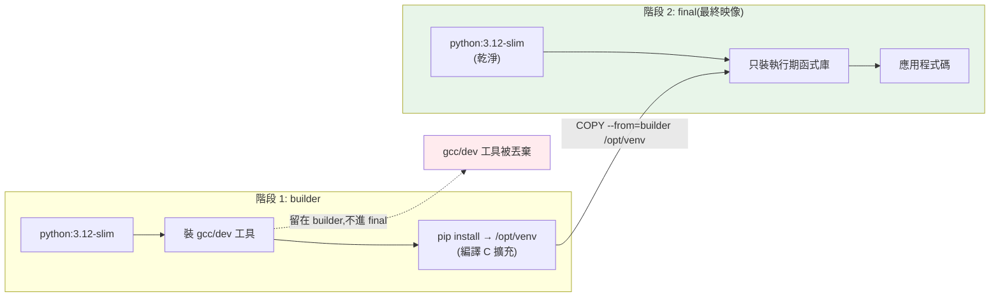

# 多階段建置

> 你的映像檔裡有 gcc 編譯器、build 工具、開發標頭檔——但正式環境只需要跑應用，這些全是肥肉與攻擊面。**多階段建置（multi-stage build）** 讓你「用一個階段編譯、只把成品搬進最終映像」，做出又小又安全的映像。這章講它的原理與 Python 的實務寫法。

## Why（為什麼）

很多 Python 套件（`psycopg2`、`numpy`、`cryptography`…）安裝時要**編譯 C 擴充**，需要 gcc、make、開發標頭檔（`-dev` 套件）。於是你的 Dockerfile 裝了一堆 build 工具：

```dockerfile
RUN apt-get install -y gcc python3-dev libpq-dev   # 為了編譯
RUN pip install psycopg2 numpy
```

問題是：**這些 build 工具在應用「執行」時完全用不到**，卻永遠留在映像裡。結果映像肥大（多幾百 MB）、攻擊面變大（多裝的每個工具都是潛在漏洞）、也違反「映像只該包含執行所需」的原則。

**多階段建置**是解法：把 Dockerfile 分成多個 `FROM` 階段——**build 階段**裝滿 build 工具、編譯依賴；**final 階段**用乾淨的基底，只**從 build 階段複製編譯好的成品**，完全不含 build 工具。最終映像小、乾淨、安全，卻仍能跑需要編譯的依賴。這是縮小 Python 映像**最有效**的手段，也是生產級 Dockerfile 的標配。這章教你正確寫出來。

## Theory（理論：build-time vs run-time 依賴）

核心區分兩種依賴：

- **build-time 依賴（建置期）**：只在「安裝/編譯」時需要——gcc、make、`-dev` 標頭檔、build backend。應用跑起來後就沒用了。
- **run-time 依賴（執行期）**：應用「執行」時需要——Python 直譯器、編譯好的 `.so` 套件、執行期共享函式庫（如 `libpq` 而非 `libpq-dev`）。

單階段建置把兩者混在一起，build-time 依賴被永久留下。**多階段建置的本質**：讓 build-time 依賴只存在於前面的階段，最終階段只保留 run-time 依賴與應用成品。

**多階段的機制**：一個 Dockerfile 可有多個 `FROM`，每個 `FROM` 開啟一個新階段（可命名 `AS builder`）。後面的階段能用 `COPY --from=builder /path ...` **從前面階段複製檔案**。最終映像**只由最後一個階段構成**——前面階段的所有東西（除了被複製出來的）都被丟棄。於是 gcc 留在 builder、不進 final。

## Specification（規範：多階段 Dockerfile）

Python 的典型多階段建置（把依賴裝進虛擬環境再搬走）：

```dockerfile
# ===== 階段 1：builder（裝滿 build 工具、編譯依賴）=====
FROM python:3.12-slim AS builder

# 安裝編譯 C 擴充所需的 build 工具
RUN apt-get update && apt-get install -y --no-install-recommends \
    gcc python3-dev libpq-dev && rm -rf /var/lib/apt/lists/*

# 建一個獨立虛擬環境，把依賴裝進去（方便整包搬走）
RUN python -m venv /opt/venv
ENV PATH="/opt/venv/bin:$PATH"

COPY pyproject.toml ./
RUN pip install --no-cache-dir .

# ===== 階段 2：final（乾淨基底，只搬成品）=====
FROM python:3.12-slim

# 只裝「執行期」需要的共享函式庫（libpq 而非 libpq-dev）
RUN apt-get update && apt-get install -y --no-install-recommends \
    libpq5 && rm -rf /var/lib/apt/lists/*

# 從 builder 複製編譯好的虛擬環境（不含 gcc 等 build 工具）
COPY --from=builder /opt/venv /opt/venv
ENV PATH="/opt/venv/bin:$PATH"

WORKDIR /app
COPY . .

RUN useradd --create-home appuser
USER appuser

EXPOSE 8000
CMD ["uvicorn", "app.main:app", "--host", "0.0.0.0", "--port", "8000"]
```

**關鍵語法**：

- `FROM ... AS builder`：命名階段。
- `COPY --from=builder /src /dst`：從指定階段複製。
- 也可 `COPY --from=python:3.12` 從外部映像複製。

**成果**：final 映像沒有 gcc、python3-dev、libpq-dev，只有直譯器 + 編譯好的套件（在 `/opt/venv`）+ 執行期函式庫 + 應用——通常比單階段小數百 MB。

## Implementation（底層：為何 final 不含 build 工具）

Docker 建置多階段時，**每個階段獨立建置成自己的一疊層**。當你 `COPY --from=builder /opt/venv`，Docker 只把 builder 那疊層裡的**指定路徑**內容，複製成 final 階段的一個新層。builder 階段其餘的層（含 gcc、apt 快取、標頭檔）**不會進入 final 映像**——因為最終映像只保留「最後一個 `FROM` 之後」的層。

這就是為何 final 乾淨：gcc 是在 builder 的 `RUN apt-get install gcc` 那層裝的，那層屬於 builder、不屬於 final。final 只拿到 `/opt/venv`（編譯好的 `.so` 與 Python 套件），不含編譯它們的工具。

**用 venv 搬運的技巧**：把依賴裝進 `/opt/venv` 這個獨立目錄，複製時整包搬走最乾淨——不必去猜 `site-packages` 散落哪裡。final 階段設 `PATH` 指向這個 venv 即可使用。

**build-time vs run-time 系統套件**：注意 builder 裝 `libpq-dev`（含標頭檔，編譯用），final 只裝 `libpq5`（執行期共享函式庫）。編譯好的 `psycopg2.so` 在執行時仍需 `libpq5` 動態連結，但不需要標頭檔——這是常被忽略的細節（漏裝執行期函式庫會 `ImportError: libpq.so.5: cannot open`）。

## Code Example（可執行的 Python 範例）

多階段建置的效益是「映像大小」，我們用 Python 模擬計算與比較，說明省下多少（純標準庫，可執行）：

```python
# image_size_demo.py — 估算單階段 vs 多階段映像大小（純標準庫，示意）
from __future__ import annotations

from dataclasses import dataclass


@dataclass(frozen=True)
class Component:
    name: str
    size_mb: int
    build_only: bool  # 是否只在建置期需要


COMPONENTS = [
    Component("python:3.12-slim 基底", 130, build_only=False),
    Component("gcc + python3-dev (build 工具)", 250, build_only=True),
    Component("libpq-dev (標頭檔)", 20, build_only=True),
    Component("libpq5 (執行期函式庫)", 5, build_only=False),
    Component("編譯好的 Python 依賴", 80, build_only=False),
    Component("應用程式碼", 5, build_only=False),
]


def single_stage_size() -> int:
    """單階段：所有東西都留在映像。"""
    return sum(c.size_mb for c in COMPONENTS)


def multi_stage_size() -> int:
    """多階段：build-only 的元件不進 final 映像。"""
    return sum(c.size_mb for c in COMPONENTS if not c.build_only)


def main() -> None:
    single = single_stage_size()
    multi = multi_stage_size()
    saved = single - multi
    print(f"單階段映像:  {single} MB")
    print(f"多階段映像:  {multi} MB")
    print(f"省下:        {saved} MB（{saved / single * 100:.0f}%）")
    print("\n被排除的 build-only 元件:")
    for c in COMPONENTS:
        if c.build_only:
            print(f"  - {c.name} ({c.size_mb} MB)")


if __name__ == "__main__":
    main()
```

**預期輸出**：

```pycon
$ python image_size_demo.py
單階段映像:  490 MB
多階段映像:  220 MB
省下:        270 MB（55%）
```

（後續還會印出被排除的 build-only 元件清單。）

逐段解說：

- **`Component`**：每個元件標記大小與「是否只建置期需要」（`build_only`）。
- **`single_stage_size`**：單階段把所有元件加總——包含 gcc、標頭檔等 build 工具，共 490MB。
- **`multi_stage_size`**：多階段只算 `build_only=False` 的——排除 gcc（250MB）與 libpq-dev（20MB），降到 220MB。
- **成果**：省下 270MB（約 55%）——這正是多階段建置的價值：build 工具留在 builder 階段、不進 final。數字是示意，真實專案視依賴而定，但方向與比例貼近實況。

## Diagram（圖解：兩階段建置）



## Best Practice（最佳實踐）

- **需要編譯 C 擴充的專案一律用多階段**：build 工具留在 builder，final 乾淨精簡。
- **依賴裝進獨立 venv（`/opt/venv`）再整包複製**：搬運乾淨、final 設 `PATH` 即用。
- **final 只裝執行期系統函式庫**（`libpq5` 而非 `libpq-dev`）：漏裝會執行期 `ImportError`。
- **兩階段都用同一基底版本**（`python:3.12-slim`）：避免 ABI/glibc 不相容。
- **`apt-get install` 後清 `/var/lib/apt/lists/*`**、加 `--no-install-recommends`：減少層大小。
- **善用 build 快取順序**（依賴先、原始碼後，見 [Docker](01-docker.md)）：多階段一樣適用。
- **考慮 distroless / alpine 作 final 基底**（進階）：更小，但注意相容性。

## Common Mistakes（常見誤解）

- **單階段留下 build 工具**：映像肥大、攻擊面大——多階段可省數百 MB。
- **final 漏裝執行期共享函式庫**：`COPY` 了編譯好的 `.so` 卻沒裝 `libpq5` → 執行期 `cannot open shared object`。
- **兩階段基底不一致**：builder 用 alpine、final 用 slim，編譯出的二進位不相容。
- **忘了在 final 設 `PATH` 指向 venv**：複製了 venv 卻用到系統 Python，套件找不到。
- **把整個 builder 檔案系統複製過來**：`COPY --from=builder /` 等於沒分階段；只複製必要路徑。
- **忽略 `.dockerignore`**：多階段也需要，避免把垃圾複製進 build context。
- **在 builder 才裝、final 忘了裝執行期依賴**：`ImportError` 到執行才爆。

## Interview Notes（面試重點）

- **能區分 build-time 與 run-time 依賴**，並說明多階段建置為何能只保留後者。
- **能解釋多階段機制**：多個 `FROM`、`COPY --from=stage`、最終映像只由最後階段構成、前階段其餘被丟棄。
- **知道「用 venv 搬運依賴」的技巧**與在 final 設 `PATH`。
- **知道執行期系統函式庫的坑**（`libpq5` vs `libpq-dev`），漏裝會 `ImportError`。
- **能量化多階段的效益**（省數百 MB）與好處（小、快拉取、少攻擊面）。
- **知道兩階段基底要一致**、清 apt 快取等細節。

---

➡️ 下一章：[Gunicorn 與 Uvicorn](03-gunicorn-uvicorn.md)

[⬆️ 回 Part 19 索引](README.md)
