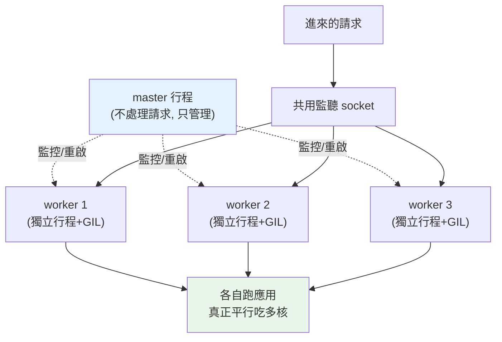

# Gunicorn 與 Uvicorn

> 你不會用 `python app.py` 把服務推上正式環境——那只跑單一行程、單執行緒，一個請求卡住全部人排隊。正式環境需要**應用伺服器（application server）**：Gunicorn / Uvicorn 管理多個 worker 行程、承受並發流量、優雅重啟。這章講 WSGI vs ASGI、worker 模型，以及怎麼配置。

## Why（為什麼）

FastAPI/Flask 開發時你可能跑 `uvicorn app:app --reload` 或 `flask run`——這些是**開發伺服器**：單行程、功能陽春、效能與穩定性都不為正式環境設計。直接拿去上線會出事：

- **無法利用多核**：Python 有 [GIL](../09-concurrency/README.md)，單一行程的 CPU-bound 只能用一個核。8 核機器跑單行程 = 浪費 7 核。
- **一個請求卡住全部**：單 worker 處理某個慢請求時，其他請求全在排隊。
- **沒有行程管理**：worker crash 了沒人重啟、無法優雅重載、無法控制並發。

**正式環境需要應用伺服器**：**Gunicorn**（WSGI）、**Uvicorn**（ASGI），它們：**開多個 worker 行程**（繞過 GIL、吃滿多核）、**管理 worker 生命週期**（crash 自動重啟、優雅重載）、**承受並發**（多 worker 分攤流量）。理解 WSGI/ASGI 的差異與 worker 模型，才能正確配置——配錯（worker 數、worker 類型）會讓服務效能低落或耗盡資源。這章講清楚。

## Theory（理論：WSGI vs ASGI）

Python Web 應用與伺服器之間有標準介面（見 [WSGI/ASGI](../14-web/README.md)）：

- **WSGI（Web Server Gateway Interface）**：**同步**介面。一個 worker 一次處理一個請求，處理完才接下一個。傳統框架（Flask、Django 傳統模式）用它。簡單、成熟，但同步——遇到 I/O 等待時 worker 就閒置阻塞。
- **ASGI（Asynchronous Server Gateway Interface）**：**非同步**介面，WSGI 的後繼。支援 `async`/`await`、WebSocket、長連線。一個 worker 能用事件迴圈**並發**處理大量 I/O-bound 請求（見 [非同步效能](../18-performance/07-async-performance.md)）。FastAPI、Starlette 用它。

**伺服器對應**：

- **Gunicorn**：成熟的 **WSGI** 伺服器（也能透過 worker class 跑 ASGI）。強在**行程管理**（pre-fork、優雅重載、worker 監控）。
- **Uvicorn**：輕量高效的 **ASGI** 伺服器，基於 `uvloop`/`httptools`。強在 async 效能。

**黃金組合**：**Gunicorn 管理 + Uvicorn worker**——`gunicorn -k uvicorn.workers.UvicornWorker`。這樣兼得 Gunicorn 成熟的行程管理（多 worker、優雅重載、監控）與 Uvicorn 的 ASGI 非同步效能。這是 FastAPI 生產部署的常見標準。

## Specification（規範：worker 配置）

**啟動指令**：

```bash
# 純 Uvicorn（開發 / 簡單場景）
uvicorn app.main:app --host 0.0.0.0 --port 8000 --workers 4

# Gunicorn 管理 + Uvicorn worker（FastAPI 生產標準）
gunicorn app.main:app \
  --worker-class uvicorn.workers.UvicornWorker \
  --workers 4 \
  --bind 0.0.0.0:8000 \
  --timeout 30 \
  --graceful-timeout 30
```

**關鍵參數**：

- **`--workers N`**：worker 行程數。每個是獨立行程（各有自己的 GIL），一起吃多核。
- **`--worker-class`**：worker 類型。`sync`（預設，WSGI）、`uvicorn.workers.UvicornWorker`（ASGI）、`gthread`（多執行緒）。
- **`--timeout`**：worker 處理單一請求的逾時（超過就殺該 worker 重啟）。
- **`--graceful-timeout`**：收到重啟/關閉訊號後，等 worker 收尾的寬限時間（見 [graceful shutdown](07-graceful-shutdown.md)）。
- **`--max-requests`**：每個 worker 處理 N 個請求後自動重啟（緩解記憶體洩漏）。

**worker 數的經驗公式**：

- **CPU-bound / 同步（WSGI）**：`workers = (2 × CPU 核心數) + 1`。這個經驗值讓 CPU 在某 worker 等 I/O 時仍有其他 worker 可跑。
- **I/O-bound / 非同步（ASGI）**：worker 數可較少（如 = CPU 核心數），因為每個 async worker 本身就能並發處理大量請求，靠的是事件迴圈而非多 worker。

## Implementation（底層：pre-fork worker 模型）

**Gunicorn 的 pre-fork 模型**：Gunicorn 啟動一個 **master 行程**，它 `fork()` 出 N 個 **worker 子行程**。master 不處理請求，只**管理 worker**（監控存活、重啟 crash 的、處理訊號做優雅重載）。所有 worker **共用同一個監聽 socket**——OS 負責把進來的連線分派給某個空閒 worker（kernel-level load balancing）。

這個模型的好處：

- **繞過 GIL 吃多核**：每個 worker 是獨立行程、獨立 GIL、獨立記憶體。N 個 worker 能在 N 個核上**真正平行**跑 Python（見 [multiprocessing](../09-concurrency/README.md)）——這是單行程做不到的。
- **隔離與韌性**：一個 worker crash（記憶體錯誤、未捕捉例外）只影響它自己，master 立刻 fork 一個新的補上，服務不中斷。
- **優雅重載**：部署新版時，master 逐一用新程式碼替換 worker（先起新的、排空舊的），達成**零停機部署**。

**為何 async worker 數可較少**：一個同步 worker 一次只能處理一個請求（處理慢請求時就佔著）。一個 ASGI（Uvicorn）worker 內有事件迴圈，能同時「掛著」成百上千個等待 I/O 的請求——所以少數 async worker 就能撐高並發。但注意：**async worker 裡若有阻塞呼叫或 CPU 密集運算，會卡死該 worker 的事件迴圈**（見 [非同步效能](../18-performance/07-async-performance.md)），這時仍需多 worker 分攤。

**worker 數與記憶體**：每個 worker 是完整的 Python 行程，各自載入應用、佔一份記憶體。worker 開太多會吃光記憶體。所以不是越多越好——依 CPU 核心、記憶體、負載型態調。

## Code Example（可執行的 Python 範例）

以下用 Python 實作「worker 數建議」與「pre-fork 分派」的邏輯（純標準庫，可執行）：

```python
# worker_config_demo.py — worker 數建議與請求分派模型（純標準庫）
from __future__ import annotations

import os


def recommend_workers(cpu_count: int, io_bound: bool) -> int:
    """依負載型態建議 worker 數。
    - CPU-bound/同步(WSGI): 2*cpu + 1
    - I/O-bound/非同步(ASGI): 約 = cpu（每個 worker 自身能並發）
    """
    if io_bound:
        return max(2, cpu_count)
    return 2 * cpu_count + 1


class PreforkPool:
    """模擬 Gunicorn 的 master 分派請求給空閒 worker。"""

    def __init__(self, num_workers: int) -> None:
        self.handled: list[int] = [0] * num_workers  # 每個 worker 處理的請求數

    def dispatch(self, num_requests: int) -> None:
        """OS 把連線輪流分派給 worker（此處用 round-robin 模擬）。"""
        for i in range(num_requests):
            worker = i % len(self.handled)
            self.handled[worker] += 1

    def balance_ratio(self) -> float:
        """負載均衡度：min/max（越接近 1 越平均）。"""
        return min(self.handled) / max(self.handled)


def main() -> None:
    cpu = os.cpu_count() or 4
    print(f"偵測到 CPU 核心數: {cpu}")
    print(f"同步/CPU-bound 建議 worker: {recommend_workers(cpu, io_bound=False)}")
    print(f"非同步/I-O-bound 建議 worker: {recommend_workers(cpu, io_bound=True)}")

    pool = PreforkPool(num_workers=4)
    pool.dispatch(num_requests=100)
    print(f"\n4 個 worker 分派 100 請求: {pool.handled}")
    print(f"負載均衡度(min/max): {pool.balance_ratio():.2f}")


if __name__ == "__main__":
    main()
```

**預期輸出**（CPU 數依機器）：

```pycon
$ python worker_config_demo.py
偵測到 CPU 核心數: 8
同步/CPU-bound 建議 worker: 17
非同步/I-O-bound 建議 worker: 8

4 個 worker 分派 100 請求: [25, 25, 25, 25]
負載均衡度(min/max): 1.00
```

逐段解說：

- **`recommend_workers`**：把 `2*cpu+1`（同步）與 `~cpu`（非同步）的經驗公式寫成程式碼。8 核 → 同步建議 17、非同步建議 8。
- **`PreforkPool.dispatch`**：模擬 master/OS 把請求分派給多個 worker（round-robin）。100 個請求平均分給 4 個 worker，各 25 個。
- **`balance_ratio`**：均衡度 1.00 代表完美平均——真實環境 OS 分派會依 worker 忙碌狀態動態調整，此處示意理想情況。
- **要點**：多 worker 分攤流量（吃多核、抗 crash），worker 數依 CPU 與負載型態決定——這正是設定 `--workers` 的依據。

## Diagram（圖解：Gunicorn pre-fork 模型）



## Best Practice（最佳實踐）

- **正式環境用應用伺服器**（Gunicorn/Uvicorn），別用開發伺服器（`--reload`、`flask run`）。
- **FastAPI 生產用 Gunicorn + UvicornWorker**：兼得行程管理與 async 效能。
- **worker 數依公式與負載型態**：同步 `2*cpu+1`、非同步約 `cpu`；再依實測與記憶體調整。
- **設 `--timeout` 與 `--graceful-timeout`**：卡住的 worker 會被重啟；關閉時給收尾寬限（見 [graceful shutdown](07-graceful-shutdown.md)）。
- **用 `--max-requests`（加 jitter）**：定期重啟 worker，緩解記憶體洩漏。
- **async worker 內避免阻塞/CPU 密集**：否則卡死事件迴圈；重活丟執行緒/行程。
- **容器裡通常一個容器一個 Gunicorn**，水平擴縮交給 [Kubernetes](06-kubernetes.md)（調 replica）而非無限加 worker。
- **監控 worker 數、請求延遲、記憶體**（見 [可觀測性](08-observability.md)）：據實調參。

## Common Mistakes（常見誤解）

- **拿開發伺服器上正式環境**：單行程、不穩、效能差、無行程管理。
- **worker 開太多耗盡記憶體**：每個 worker 是完整行程各佔記憶體；不是越多越好。
- **同步框架卻期待單 worker 高並發**：WSGI 一 worker 一次一請求，慢請求塞住全部。
- **async worker 裡跑阻塞/CPU 密集**：卡死事件迴圈，async 優勢歸零。
- **不設 timeout**：卡住的 worker 永遠佔著，逐漸耗盡處理能力。
- **用錯 worker class**：拿 sync worker 跑 FastAPI（async），或反之，效能與行為都不對。
- **在容器裡狂加 worker 取代水平擴縮**：該用 K8s 調 replica，讓每容器 worker 適量。

## Interview Notes（面試重點）

- **能區分 WSGI（同步）與 ASGI（非同步）**，以及 Gunicorn / Uvicorn 各屬哪類、為何常組合使用。
- **能解釋 pre-fork worker 模型**：master 管理、多 worker 共用 socket、繞過 GIL 吃多核、crash 隔離、優雅重載。
- **知道 worker 數的經驗公式**（同步 `2*cpu+1`、非同步約 cpu）及背後理由。
- **知道 async worker 數可較少的原因**，以及「阻塞/CPU 密集會卡死事件迴圈」的陷阱。
- **知道關鍵參數**（timeout、graceful-timeout、max-requests）的用途。
- **知道生產部署常「一容器一 Gunicorn、水平擴縮交給 K8s」**。

---

➡️ 下一章：[12-factor app](04-12-factor.md)

[⬆️ 回 Part 19 索引](README.md)
