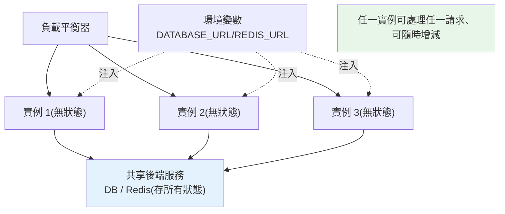

# 12-factor app

> 為什麼有些應用能輕鬆部署到雲端、自動擴縮、零停機更新，有些卻一搬環境就爆炸？**12-factor app** 是一套建構「雲原生、可擴展、可維護」服務的方法論。這章講這 12 條原則的精神，聚焦對 Python 服務最關鍵的幾條，以及怎麼落實。

## Why（為什麼）

你把服務部署上雲，結果狀況百出：設定寫死在程式裡、換環境要改 code；session 存在單一伺服器的記憶體裡、一擴成多台就掉登入；log 寫進本地檔案、容器一重啟就消失；啟動要手動跑一堆初始化步驟。這些問題的共通點是——**應用不是為「雲端的動態、可拋棄、可水平擴展」而設計的**。

**12-factor app**（由 Heroku 提出）是一套經驗法則，教你把應用建成**雲原生（cloud-native）** 的樣子：可以被任意數量地複製（水平擴展）、可以隨時被殺掉重建（容器化）、設定與程式分離（一份 build 跑遍所有環境）、無狀態（不依賴本地檔案/記憶體）。遵循它，你的應用就能順利地：容器化（[Docker](01-docker.md)）、被 [Kubernetes](06-kubernetes.md) 編排、自動擴縮、零停機部署。

不必死背 12 條，但要理解其**核心精神**：**無狀態、設定外置、可拋棄、環境對等**。這章帶你掌握對 Python 後端最關鍵的幾條，並用程式碼示範落實。

## Theory（理論：12 條原則）

12 條原則（附一句話精華）：

1. **Codebase（程式庫）**：一份程式庫、多份部署（dev/staging/prod 同源）。
2. **Dependencies（依賴）**：明確宣告並隔離依賴（`pyproject.toml` + venv，見 [打包](../13-tooling-packaging/README.md)）。
3. **Config（設定）**：設定存在**環境變數**，與程式分離（見 [設定管理](../16-architecture/11-config-management.md)）。
4. **Backing services（後端服務）**：把資料庫、快取、佇列當**可抽換的附加資源**（用 URL/連線字串指定）。
5. **Build, release, run（建置、發布、執行）**：三階段嚴格分離（build 出 image、release 綁設定、run 執行）。
6. **Processes（行程）**：應用是**無狀態**行程，狀態存到後端服務（DB/Redis）。
7. **Port binding（埠綁定）**：應用自帶伺服器、綁定一個埠對外服務（不依賴外部 web server 注入）。
8. **Concurrency（並發）**：靠**水平複製行程**擴展（多開幾個實例），而非單行程長大。
9. **Disposability（可拋棄）**：快速啟動、優雅關閉（見 [graceful shutdown](07-graceful-shutdown.md)）、可隨時被殺。
10. **Dev/prod parity（環境對等）**：開發與正式盡量一致（同版本、同後端服務，靠容器達成）。
11. **Logs（日誌）**：把 log 當**事件串流**寫到 stdout，別自己管理檔案（見 [可觀測性](08-observability.md)）。
12. **Admin processes（管理行程）**：一次性管理任務（migration、腳本）當獨立行程跑。

**貫穿的四大精神**：**無狀態（6, 8）、設定外置（3, 4）、可拋棄（9, 10）、對等（1, 5, 10）**。

## Specification（規範：對 Python 最關鍵的落實）

**Config（第 3 條）——設定從環境變數讀**：

```python
import os
DATABASE_URL = os.environ["DATABASE_URL"]   # 必填，缺就啟動失敗
DEBUG = os.getenv("DEBUG", "false").lower() == "true"
```

用 `pydantic-settings` 做型別化、會驗證的設定（見 [設定管理](../16-architecture/11-config-management.md)）。**絕不把設定/密鑰寫死在程式**。

**Backing services（第 4 條）——後端服務用 URL 指定、可抽換**：

```python
# 用連線字串指定，換 DB/Redis 只改環境變數，不動程式
db = connect(os.environ["DATABASE_URL"])       # postgres://... 或 sqlite://...
cache = redis.from_url(os.environ["REDIS_URL"])
```

**Processes（第 6 條）——無狀態**：

```python
# 🔴 錯：狀態存在行程記憶體，一擴成多實例就不一致
sessions = {}   # 這台記得、那台不記得

# ✅ 對：狀態存到共享的後端服務
cache.set(f"session:{sid}", data)   # 所有實例都讀得到
```

**Logs（第 11 條）——寫 stdout**：

```python
import logging, sys
logging.basicConfig(stream=sys.stdout, level=logging.INFO)
# 別 logging.FileHandler("app.log")：容器重啟就沒了；交給平台收集
```

## Implementation（底層：為何無狀態能水平擴展）

**無狀態為何是水平擴展的前提**：水平擴展 = 多開幾個相同的應用實例，用負載平衡器把請求分散過去。如果應用**有狀態**（session 存在某實例的記憶體、上傳檔案存在某實例的磁碟），那：

- 使用者第一個請求打到實例 A（登入資訊存 A 的記憶體），下一個請求被負載平衡導到實例 B——B 不認得他，登入掉了。
- 縮容殺掉實例 A，它記憶體裡的狀態全沒了。

**無狀態**則讓每個實例都是**可互換的**：狀態全存在共享後端（DB、Redis、物件儲存），任何實例都能處理任何請求、任何實例都能被隨時殺掉重建。這才能自由地水平擴縮、零停機滾動更新、容器隨時汰換——**雲原生彈性的根基**。

**設定外置為何重要**：同一個 build 出來的 image，靠注入不同的環境變數（`DATABASE_URL` 等）就能跑遍 dev/staging/prod——這是「build 一次、run 多處」的關鍵（第 5 條 build/release/run 分離）。若設定寫死在程式，每個環境就得建不同的 image，破壞對等性、也埋下「測試的不是上線的那份」的風險。

**log 寫 stdout 為何正確**：容器是可拋棄的，寫本地檔案的 log 會隨容器消失、且多實例的檔案散落各處無法匯總。把 log 當事件串流寫到 stdout，交給平台（Docker/K8s/log 收集器如 Fluentd）統一捕捉、匯集、查詢——應用不該操心 log 的儲存與輪替。

## Code Example（可執行的 Python 範例）

以下對照「違反 vs 遵循」12-factor 的無狀態設計（純標準庫，可執行）：

```python
# twelve_factor_demo.py — 有狀態 vs 無狀態的水平擴展（純標準庫）
from __future__ import annotations


class SharedStore:
    """模擬共享後端服務（Redis/DB）：所有實例都讀得到。"""

    def __init__(self) -> None:
        self._data: dict[str, str] = {}

    def set(self, key: str, value: str) -> None:
        self._data[key] = value

    def get(self, key: str) -> str | None:
        return self._data.get(key)


class StatefulInstance:
    """🔴 違反第 6 條：session 存在實例自己的記憶體。"""

    def __init__(self, name: str) -> None:
        self.name = name
        self._sessions: dict[str, str] = {}

    def login(self, sid: str, user: str) -> None:
        self._sessions[sid] = user

    def whoami(self, sid: str) -> str | None:
        return self._sessions.get(sid)  # 只有登入那台記得


class StatelessInstance:
    """✅ 遵循第 6 條：session 存共享後端，任何實例都能處理。"""

    def __init__(self, name: str, store: SharedStore) -> None:
        self.name = name
        self._store = store

    def login(self, sid: str, user: str) -> None:
        self._store.set(f"session:{sid}", user)

    def whoami(self, sid: str) -> str | None:
        return self._store.get(f"session:{sid}")


def main() -> None:
    # 有狀態：在 A 登入，請求被負載平衡導到 B → 掉登入
    a = StatefulInstance("A")
    b = StatefulInstance("B")
    a.login("sid-1", "alice")
    print(f"[有狀態] 在 A 登入，A 認得: {a.whoami('sid-1')}")
    print(f"[有狀態] 下個請求到 B，B 認得: {b.whoami('sid-1')}  ← 掉登入！")

    # 無狀態：狀態在共享後端，A 登入 B 也認得
    store = SharedStore()
    a2 = StatelessInstance("A", store)
    b2 = StatelessInstance("B", store)
    a2.login("sid-2", "bob")
    print(f"[無狀態] 在 A 登入，B 也認得: {b2.whoami('sid-2')}  ← 可自由擴縮")


if __name__ == "__main__":
    main()
```

**預期輸出**：

```pycon
$ python twelve_factor_demo.py
[有狀態] 在 A 登入，A 認得: alice
[有狀態] 下個請求到 B，B 認得: None  ← 掉登入！
[無狀態] 在 A 登入，B 也認得: bob  ← 可自由擴縮
```

逐段解說：

- **`StatefulInstance`**：session 存在實例自己的 `_sessions`。在 A 登入後，若下一個請求被負載平衡導到 B，B 的記憶體沒有這筆 session → `whoami` 回 `None`，使用者掉登入。這就是有狀態應用無法水平擴展的原因。
- **`StatelessInstance` + `SharedStore`**：session 存進共享後端（模擬 Redis）。A 登入寫進共享儲存，B 也讀得到 → 任何實例都能處理任何請求，可自由增減實例。
- **要點**：無狀態 + 狀態外置，是水平擴展、零停機、容器可拋棄的前提——這是 12-factor 最核心的一條。

## Diagram（圖解：無狀態實現水平擴展）



## Best Practice（最佳實踐）

- **設定與密鑰全走環境變數**（第 3 條）：一份 image 跑遍所有環境（見 [設定管理](../16-architecture/11-config-management.md)）。
- **應用無狀態、狀態外置到 DB/Redis/物件儲存**（第 6 條）：才能水平擴縮、零停機。
- **後端服務用 URL 指定、可抽換**（第 4 條）：換 DB/快取只改環境變數。
- **log 寫 stdout 當事件串流**（第 11 條）：交給平台收集，別自己管檔案（見 [可觀測性](08-observability.md)）。
- **快速啟動 + 優雅關閉**（第 9 條）：容器可隨時被汰換（見 [graceful shutdown](07-graceful-shutdown.md)）。
- **dev/prod 對等**（第 10 條）：用容器讓開發與正式同版本、同後端服務。
- **migration 等當一次性管理行程跑**（第 12 條）：與長駐服務分離。
- **靠水平複製擴展**（第 8 條）：多開實例，而非把單行程養大。

## Common Mistakes（常見誤解）

- **把設定/密鑰寫死在程式或 config 檔進版控**：換環境要改 code、密鑰外洩。
- **狀態存本地記憶體/磁碟**（session、上傳檔、快取）：一擴成多實例就不一致、容器重啟就丟。
- **log 寫本地檔案**：容器重啟消失、多實例散落無法匯總。
- **依賴啟動順序或手動初始化步驟**：違反可拋棄與快速啟動，難自動化。
- **每個環境建不同的 image**：破壞 build/release/run 分離與對等，「測的不是上線的」。
- **用單行程硬撐高並發**：該水平複製多實例（第 8 條）。
- **把 migration 綁進應用啟動流程**：多實例同時啟動會重複跑 migration；當獨立一次性行程。

## Interview Notes（面試重點）

- **能講 12-factor 的核心精神**：無狀態、設定外置、可拋棄、環境對等（不必背 12 條，要懂精神）。
- **能解釋「無狀態為何是水平擴展的前提」**：實例可互換、狀態外置到共享後端。
- **能說明設定走環境變數的好處**（build 一次跑多處、對等、不洩漏密鑰）。
- **知道 log 寫 stdout 而非檔案的理由**（容器可拋棄、平台統一收集）。
- **能連結 12-factor 與容器化/K8s**：這些原則讓應用能被編排、擴縮、零停機。
- **知道後端服務可抽換、管理行程獨立、快速啟動+優雅關閉** 等落實要點。

---

➡️ 下一章：[CI/CD](05-ci-cd.md)

[⬆️ 回 Part 19 索引](README.md)
