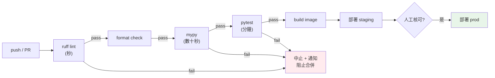

# CI/CD

> 手動測試、手動部署，靠一個人記得所有步驟——這是災難的配方。**CI/CD** 把「測試、建置、部署」自動化：每次 push 自動跑測試與檢查（CI），通過就自動發布（CD）。這章講 CI/CD 的觀念與 Python 專案的 pipeline 設計。

## 💡 白話導讀（建議先讀）

手動測試、手動部署、步驟全記在某個資深工程師腦中——
這叫「**老師傅的祕方**」:人一休假,全廠停擺;人一手滑,正式環境爆炸。

CI/CD 把祕方寫成**工廠流水線**:

```text
push → lint → 型別檢查 → 測試 → 建 image → 部署 staging → (人工核可) → 部署 prod
```

- **CI（持續整合）**:每次 push,機器自動跑檢查與測試——壞的程式碼**過不了關卡**,
  根本進不了 main。
- **CD（持續部署/交付）**:通過的東西自動建置、自動部署——部署從「重大儀式」
  變成「每天發生的平常事」。

流水線的排站哲學只有一條:**fail fast——便宜又常抓到錯的檢查放最前面**。
lint 三秒、型別檢查半分鐘、測試三分鐘、建 image 五分鐘:
讓打錯字的 PR 在第三秒被踢回,而不是烤完五分鐘的 image 才發現。

還有一個隱藏福利:CI 在**乾淨容器**裡從零安裝、從零跑——
等於每次 push 都免費驗證一次「不在我機器上也能跑」,
把上一章 Docker 對付的「環境漂移」在源頭就掐死。

這章用 GitHub Actions 寫出這條流水線（本書 repo 自己就在用:ruff + mypy + pytest）,
講 cache 加速、matrix 多版本測試、以及 secrets 管理。

## Why（為什麼）

沒有 CI/CD 的團隊長這樣：有人 push 了壞掉的程式碼進主線，別人拉下來全爆；部署靠某位工程師手動 SSH 上機器跑一串指令，他請假就沒人會；「上線前記得跑測試」全靠自律，總有人忘記；每次發布都提心吊膽，因為手動步驟一多就會出錯。

**CI/CD** 用自動化根除這些問題：

- **CI（Continuous Integration，持續整合）**：每次 push / PR，**自動**跑測試、lint、型別檢查、建置。**壞的程式碼在合併前就被擋下**，主線永遠保持綠燈可用。
- **CD（Continuous Delivery/Deployment，持續交付/部署）**：CI 通過後，**自動**建置 image、發布到環境。交付（Delivery）指自動到「可一鍵部署」；部署（Deployment）指連按鈕都省了、自動上線。

好處：**及早發現問題**（push 幾分鐘內就知道壞了）、**主線永遠可部署**、**部署可重複且可靠**（同一套 pipeline，不靠人記步驟）、**快速迭代**（放心頻繁發布）。對 Python 專案，一條標準 CI pipeline 就是：`ruff` + `mypy` + `pytest`（本書 [CI](../13-tooling-packaging/README.md) 用的正是這套）。這章教你理解並設計它。

## Theory（理論：pipeline 與 fail fast）

**pipeline（流水線）**：一連串自動化階段，程式碼從提交流到部署，每個階段是一道關卡：

```text
push/PR → lint → 型別檢查 → 測試 → 建置 image → 部署 staging → (人工核可) → 部署 prod
```

核心原則：

- **fail fast（早失敗）**：把**快又常失敗**的檢查放前面（lint 幾秒、型別檢查次之、測試較久、建置更久）。前面關卡擋下就不必浪費後面的時間與資源。
- **自動化把關**：任一階段失敗，pipeline 中止、通知、**阻止合併/部署**。不讓壞東西往下流。
- **一致的環境**：CI 在**乾淨的容器**裡從頭安裝依賴、跑檢查——確保「在 CI 綠 = 在別人機器也綠」，根除「在我機器上能跑」。

**分支策略配合**：常見「PR 觸發 CI（測試 + 檢查），合併到 main 觸發 CD（部署）」。PR 必須 CI 全綠才能合併（branch protection），保證 main 永遠健康。

**測試金字塔在 CI 的體現**：CI 先跑大量快速的單元測試，再跑較慢的整合測試，最後（或另建 pipeline）跑端對端測試——快的先跑，快速回饋。

## Specification（規範：GitHub Actions pipeline）

一個 Python 專案的 CI（GitHub Actions，`.github/workflows/ci.yml`）：

```yaml
name: CI
on:
  push:
    branches: [main]
  pull_request:
    branches: [main]

jobs:
  quality:
    runs-on: ubuntu-latest
    strategy:
      matrix:
        python-version: ["3.12", "3.13"]   # 多版本矩陣測試
    steps:
      - uses: actions/checkout@v4
      - uses: actions/setup-python@v5
        with:
          python-version: ${{ matrix.python-version }}
          cache: pip
      - run: pip install -e ".[dev]"
      - run: ruff check .          # 1. lint（最快）
      - run: ruff format --check . # 2. 格式
      - run: mypy .                # 3. 型別檢查
      - run: pytest                # 4. 測試（最慢）
```

CD（部署，通常另一個 workflow，`on: push: tags:` 或合併 main 後）：

```yaml
  deploy:
    needs: quality            # 必須 CI 通過
    if: github.ref == 'refs/heads/main'
    steps:
      - run: docker build -t myapp:${{ github.sha }} .
      - run: docker push ...          # 推到 registry
      - run: kubectl set image ...    # 部署到 K8s（見 Kubernetes 章）
```

**關鍵概念**：`on`（觸發條件）、`jobs`/`steps`（階段）、`matrix`（多版本並行）、`needs`（依賴前一 job 成功）、`cache`（快取依賴加速）、secrets（部署憑證用 GitHub Secrets 注入，別寫進 YAML）。

## Implementation（底層：CI runner 與快取）

**CI runner 怎麼運作**：每次觸發，CI 平台（GitHub Actions）派一個**乾淨的虛擬機/容器**，從零開始：checkout 程式碼 → 裝 Python → 裝依賴 → 跑各步驟。**每次都是全新環境**，這正是它可信的原因——沒有殘留狀態、沒有「上次裝的東西」，綠燈代表「在乾淨環境從頭來過也能通過」。

**為何要 fail fast 排序**：runner 時間就是成本（金錢 + 等待）。`ruff check` 幾秒、`mypy` 數十秒、`pytest` 數分鐘、`docker build` 更久。把快的放前面，一旦 lint 就掛掉，立刻回饋、不浪費後面幾分鐘。這也讓開發者更快拿到「哪裡錯了」。

**依賴快取**：每次全新環境要重裝依賴很慢。`cache: pip` 讓 runner 快取下載過的套件，下次命中就跳過下載——大幅縮短 pipeline 時間。快取鍵通常基於依賴清單的 hash（清單沒變就命中）。

**矩陣測試（matrix）**：`python-version: ["3.12", "3.13"]` 讓 CI **並行**在多個 Python 版本跑同一套檢查——確保你的程式碼在支援的所有版本都正常，及早抓出版本相容問題。

**secrets 管理**：部署需要 registry 密碼、K8s 憑證等。這些**絕不寫進 YAML**（會進版控外洩），而是存在 CI 平台的加密 secrets（GitHub Secrets），執行時以環境變數注入（見 [密鑰管理](../20-security-system-design/05-secrets-management.md)）。

## Code Example（可執行的 Python 範例）

以下用 Python 模擬 CI pipeline 的「fail fast 逐階段執行」邏輯（純標準庫，可執行）：

```python
# ci_pipeline_demo.py — CI pipeline 的 fail-fast 執行模型（純標準庫）
from __future__ import annotations

from collections.abc import Callable
from dataclasses import dataclass


@dataclass
class Stage:
    name: str
    check: Callable[[], bool]  # 回傳是否通過


def run_pipeline(stages: list[Stage]) -> tuple[bool, str]:
    """依序執行各階段，任一失敗即中止（fail fast）。
    回傳 (整體是否通過, 停在哪個階段)。
    """
    for stage in stages:
        passed = stage.check()
        status = "✓ 通過" if passed else "✗ 失敗"
        print(f"  [{stage.name}] {status}")
        if not passed:
            return False, stage.name
    return True, "全部通過"


def main() -> None:
    # 情境 1：型別檢查失敗 → 後面的測試不會跑（fail fast）
    print("情境 1（mypy 失敗）:")
    stages_fail = [
        Stage("ruff lint", lambda: True),
        Stage("ruff format", lambda: True),
        Stage("mypy 型別檢查", lambda: False),  # 失敗！
        Stage("pytest 測試", lambda: True),  # 不會執行到
    ]
    ok, stopped = run_pipeline(stages_fail)
    print(f"  → pipeline {'通過' if ok else '中止於 ' + stopped}，不部署\n")

    # 情境 2：全部通過 → 可部署
    print("情境 2（全通過）:")
    stages_pass = [
        Stage("ruff lint", lambda: True),
        Stage("ruff format", lambda: True),
        Stage("mypy 型別檢查", lambda: True),
        Stage("pytest 測試", lambda: True),
    ]
    ok, _ = run_pipeline(stages_pass)
    print(f"  → pipeline {'通過 → 觸發 CD 部署' if ok else '中止'}")


if __name__ == "__main__":
    main()
```

**預期輸出**：

```pycon
$ python ci_pipeline_demo.py
情境 1（mypy 失敗）:
  [ruff lint] ✓ 通過
  [ruff format] ✓ 通過
  [mypy 型別檢查] ✗ 失敗
  → pipeline 中止於 mypy 型別檢查，不部署

情境 2（全通過）:
  [ruff lint] ✓ 通過
  [ruff format] ✓ 通過
  [mypy 型別檢查] ✓ 通過
  [pytest 測試] ✓ 通過
  → pipeline 通過 → 觸發 CD 部署
```

逐段解說：

- **`run_pipeline`**：逐階段執行，**任一失敗立即 `return`**——這就是 fail fast，後面的階段不再跑。
- **情境 1**：`mypy` 失敗，pipeline 中止在型別檢查，`pytest` 根本沒跑到——省下測試時間、立刻回饋、**阻止部署**（壞的東西進不了 prod）。
- **情境 2**：全部通過 → 才觸發 CD 部署。
- **要點**：CI 是自動化把關，任一關卡失敗就擋下合併/部署；階段順序遵循 fail fast（快的先跑）。這正是本書 [CI](../13-tooling-packaging/README.md) 用 `ruff → mypy → pytest` 的邏輯。

## Diagram（圖解：CI/CD pipeline）



## Best Practice（最佳實踐）

- **每次 push/PR 自動跑 CI**（lint + 型別 + 測試）：主線永遠綠燈可部署。
- **fail fast 排序**：快又常掛的檢查放前面（ruff → mypy → pytest），快速回饋、省資源。
- **PR 必須 CI 全綠才能合併**（branch protection）：擋下壞程式碼進 main。
- **CI 在乾淨環境從頭安裝**：確保「CI 綠 = 到處綠」。
- **矩陣測試多 Python 版本**：及早抓版本相容問題。
- **快取依賴**（`cache: pip`）：縮短 pipeline 時間。
- **密鑰用 CI Secrets 注入，絕不寫進 YAML**（見 [密鑰管理](../20-security-system-design/05-secrets-management.md)）。
- **CD 用不可變 image tag（如 git sha）**：可追溯、可回滾（見 [Docker](01-docker.md)）。
- **prod 部署可加人工核可關卡**：關鍵環境保留一道人為確認。

## Common Mistakes（常見誤解）

- **沒有 CI，靠人記得跑測試**：總有人忘記，壞程式碼進主線。
- **CI 慢的檢查放前面**：build 幾分鐘後才發現 lint 錯，浪費時間。
- **PR 不強制 CI 通過就能合併**：把關形同虛設。
- **手動部署**：靠某人記步驟，易錯、不可重複、他請假就卡住。
- **把密鑰寫進 workflow YAML**：進版控外洩；用 Secrets。
- **CI 依賴殘留狀態**（非乾淨環境）：綠燈不可信，換環境就壞。
- **只測一個 Python 版本卻宣稱支援多版本**：使用者在別版本上炸。
- **CD 用可變 tag（如 `latest`）**：無法追溯部署的是哪版、難回滾。

## Interview Notes（面試重點）

- **能區分 CI 與 CD**：CI 自動測試/檢查擋壞碼、CD 自動建置/部署；以及 delivery vs deployment。
- **能說明 fail fast 的 pipeline 排序**（快的先跑）與理由。
- **知道 CI 在乾淨環境從頭跑的意義**（可信、根除「我機器上能跑」）。
- **知道 branch protection（PR 需 CI 綠才能合併）** 保護主線。
- **知道矩陣測試、依賴快取、Secrets 注入** 等實務。
- **能描述一條 Python CI pipeline**（ruff + mypy + pytest）與 CD（build image → push → 部署 K8s）。
- **知道用不可變 tag（git sha）便於追溯與回滾**。

---

➡️ 下一章：[Kubernetes 部署](06-kubernetes.md)

[⬆️ 回 Part 19 索引](README.md)
