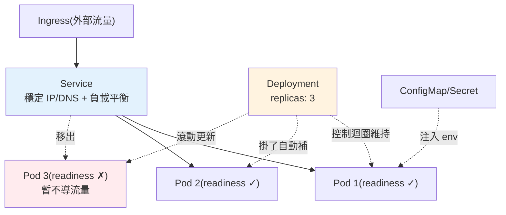

# Kubernetes 部署

> 你有 20 個容器要跑，其中一個掛了要自動重啟、流量大時要自動加副本、部署新版要零停機——手動管理是不可能的。**Kubernetes（K8s）** 是容器編排系統，替你管理容器的部署、擴縮、自我修復。這章講 K8s 的核心概念與部署 Python 服務的要點。

## 💡 白話導讀（建議先讀）

你是餐飲集團老闆,旗下 20 個攤位:半夜一攤倒了要有人補、人潮來了要加開、
換新菜單不能讓客人吃閉門羹。你不會自己盯——你設一個**總部**,只下一句話:
「**我要 3 家分店隨時營業**」,剩下的總部自己搞定。

這就是 Kubernetes（K8s）,重點全在「**宣告式**」三個字:
你不下「開一家、再開一家」的命令（命令式）,你只宣告**期望狀態**,
K8s 的 controller 無限迴圈地「比對現況與期望,不符就修正」（reconciliation）——
掛一個補一個、多一個砍一個。自癒不是魔法,是**盯著看＋自動修正**。

核心物件用集團比喻對號入座:

- **Pod ＝攤位**:最小部署單位（包著你的容器）。**短命、可拋棄**——
  倒了就換新的,位置（IP）會變,所以別記攤位地址。
- **Deployment ＝「我要 N 家分店」那句話**:宣告副本數與 image 版本;
  換新版時**逐攤替換**（滾動更新,零停機）,出事一鍵回滾。
- **Service ＝總機號碼**:攤位會搬家,但總機號碼永遠不變——
  給一組 Pod 一個穩定入口＋負載平衡,其他服務一律打總機。
- **ConfigMap / Secret ＝配方與保險箱**:設定與機密從外部注入,
  呼應 [12-factor](04-12-factor.md) 的 Config 原則。

這章帶你讀懂 YAML 清單、跑起一個 FastAPI Deployment + Service,
並理解探針（liveness/readiness）怎麼配合[優雅關閉](07-graceful-shutdown.md)。

## Why（為什麼）

[Docker](01-docker.md) 把應用打包成容器，但**在正式環境跑容器**還有一堆問題沒解決：容器掛了誰重啟？流量暴增要多開幾個容器、由誰決定與執行？部署新版怎麼做到零停機？20 個微服務容器散在多台機器上，怎麼讓它們互相找到對方、怎麼做負載平衡？機器壞了，上面的容器怎麼自動搬到別台？

手動處理這些 = 全職工作且必出錯。**Kubernetes** 就是解決這些的**容器編排（orchestration）系統**：你用宣告式的 YAML **描述「想要的狀態」**（我要 3 個這個服務的副本、用這個 image、開這個埠），K8s 就**持續維持**這個狀態——容器掛了自動重啟、機器壞了自動搬移、你調整副本數它自動擴縮、部署新版它滾動更新達成零停機。

對 Python 後端工程師，你不一定要成為 K8s 專家，但要懂**核心概念與部署自己服務的要點**：Pod、Deployment、Service、探針（probe）、資源限制、設定/密鑰注入。這章聚焦這些，讓你能把容器化的 Python 服務正確地部署上 K8s。

## Theory（理論：K8s 核心物件）

K8s 用一組**宣告式物件**描述系統，最核心的幾個：

- **Pod**：K8s 的最小部署單位，包一個（或少數緊密相關的）容器。**Pod 是短暫、可拋棄的**——它有生就有死，掛了就換一個新的（新 IP）。你通常不直接管 Pod，而是透過 Deployment。
- **Deployment**：宣告「我要 N 個某 Pod 的副本，用這個 image」。K8s 的 controller 持續確保實際副本數 = 宣告數（掛一個補一個），並負責**滾動更新**（部署新版時逐一替換，零停機）與**回滾**。
- **Service**：給一組會變動的 Pod 一個**穩定的存取入口**（固定虛擬 IP / DNS 名）與**負載平衡**。因為 Pod IP 會變，其他服務透過 Service 名找它，而非直接連 Pod IP。
- **ConfigMap / Secret**：注入設定（ConfigMap）與密鑰（Secret）到容器的環境變數或檔案（呼應 [12-factor](04-12-factor.md) 設定外置）。
- **Ingress**：把外部 HTTP 流量路由到叢集內的 Service（對外入口 + 路由規則）。

**宣告式 vs 命令式**：你不是下「開一個容器」這種命令，而是宣告「期望狀態」，K8s 的**控制迴圈（control loop）** 持續比對「實際 vs 期望」並修正差異——這是 K8s 自我修復的根本。

## Specification（規範：Deployment 與探針）

一個 Python 服務的 Deployment（`deployment.yaml`）：

```yaml
apiVersion: apps/v1
kind: Deployment
metadata:
  name: myapp
spec:
  replicas: 3                       # 要 3 個副本
  selector:
    matchLabels: { app: myapp }
  template:
    metadata:
      labels: { app: myapp }
    spec:
      containers:
        - name: myapp
          image: myregistry/myapp:abc123   # 不可變 tag（git sha）
          ports:
            - containerPort: 8000
          # 資源請求與上限（排程與防止吃垮節點）
          resources:
            requests: { cpu: "100m", memory: "128Mi" }
            limits: { cpu: "500m", memory: "512Mi" }
          # 設定與密鑰注入（見 12-factor）
          env:
            - name: DATABASE_URL
              valueFrom:
                secretKeyRef: { name: myapp-secrets, key: database-url }
          # 探針：K8s 據此判斷 Pod 健康與就緒
          livenessProbe:            # 活著嗎？不活就重啟
            httpGet: { path: /healthz, port: 8000 }
            initialDelaySeconds: 5
            periodSeconds: 10
          readinessProbe:           # 準備好收流量了嗎？沒好就不導流量
            httpGet: { path: /readyz, port: 8000 }
            periodSeconds: 5
```

**三種探針（probe）**：

- **livenessProbe（存活）**：Pod 還活著嗎？失敗 → K8s **重啟**該容器（用於偵測死鎖/卡死）。
- **readinessProbe（就緒）**：Pod 準備好接流量了嗎？失敗 → K8s **把它移出 Service 的負載平衡**（不導流量進來），但不重啟。用於「啟動中還沒暖好」或「暫時無法服務（如 DB 斷線）」。
- **startupProbe（啟動）**：慢啟動的應用用它，給足啟動時間再開始跑 liveness。

**Service**（`service.yaml`）給這 3 個副本一個穩定入口：

```yaml
apiVersion: v1
kind: Service
metadata: { name: myapp }
spec:
  selector: { app: myapp }
  ports: [{ port: 80, targetPort: 8000 }]
```

## Implementation（底層：控制迴圈與探針語意）

**控制迴圈（reconciliation loop）**：K8s 的每個 controller 不斷執行「觀察實際狀態 → 比對期望狀態 → 採取行動縮小差距」。你宣告 `replicas: 3`，Deployment controller 就持續數「現在有幾個健康 Pod」：只有 2 個（一個掛了）→ 建一個新的；有 4 個（縮容）→ 殺一個。**這個迴圈永不停歇**，所以 K8s 能自我修復——你不用管「怎麼達成」，只宣告「要什麼」。

**滾動更新如何零停機**：改了 image tag 重新 apply，Deployment 不是一次換掉全部，而是**逐步**：起一個新版 Pod → 等它 readiness 通過 → 把一個舊版 Pod 移出 → 重複，直到全換新。過程中永遠有足夠的健康 Pod 服務流量（由 `maxSurge`/`maxUnavailable` 控制），達成零停機。若新版 readiness 一直不過，更新會卡住而非把服務換壞——這就是 readinessProbe 保護部署的價值。

**liveness vs readiness 的關鍵區別**（常考、常配錯）：

- **readiness 失敗 → 移出流量、不重啟**。適合「暫時無法服務」（啟動中、下游依賴短暫不可用）——你不想重啟它，只想暫時別導流量。
- **liveness 失敗 → 重啟容器**。適合「真的壞死了」（死鎖、無法恢復）——重啟才能救。
- **配錯的後果**：把「DB 短暫斷線」做成 liveness 失敗 → K8s 一直重啟你的 Pod（但重啟救不了 DB），造成重啟風暴。正確做法：DB 依賴放 readiness（暫時移出流量、等 DB 回來），liveness 只檢查「行程本身活著」。

**資源 requests/limits**：`requests` 是排程依據（K8s 據此決定 Pod 放哪個節點）；`limits` 是硬上限（超過記憶體 limit 會被 OOMKilled，超過 CPU limit 會被限流）。設定它們避免一個失控的 Pod 吃垮整個節點。

## Code Example（可執行的 Python 範例）

以下用 Python 實作「就緒探針」與「控制迴圈維持副本數」的邏輯（純標準庫，可執行）：

```python
# k8s_probes_demo.py — readiness 探針與副本控制迴圈（純標準庫）
from __future__ import annotations


class AppState:
    """應用的健康/就緒狀態。"""

    def __init__(self) -> None:
        self.started = False
        self.db_connected = False

    def liveness(self) -> bool:
        """存活：行程本身有回應就算活著（不檢查外部依賴）。"""
        return True

    def readiness(self) -> bool:
        """就緒：啟動完成且依賴可用，才適合接流量。"""
        return self.started and self.db_connected


def reconcile(desired: int, healthy_pods: list[str]) -> list[str]:
    """控制迴圈：讓實際副本數趨近期望值（掛的補、多的殺）。"""
    actual = len(healthy_pods)
    result = list(healthy_pods)
    if actual < desired:  # 補足
        for i in range(actual, desired):
            result.append(f"pod-new-{i}")
    elif actual > desired:  # 縮減
        result = result[:desired]
    return result


def main() -> None:
    app = AppState()
    # 剛啟動：還沒就緒 → 不該導流量進來
    print(f"啟動中: liveness={app.liveness()} readiness={app.readiness()}")

    app.started = True
    app.db_connected = True
    print(f"就緒後: liveness={app.liveness()} readiness={app.readiness()}")

    # DB 短暫斷線：readiness 失敗(移出流量)，但 liveness 仍 True(不重啟)
    app.db_connected = False
    print(f"DB 斷線: liveness={app.liveness()} readiness={app.readiness()}  ← 移出流量而非重啟")

    # 控制迴圈：期望 3 副本，目前只剩 1 個健康 → 自動補到 3
    healthy = ["pod-a"]
    after = reconcile(desired=3, healthy_pods=healthy)
    print(f"\n期望 3 副本，現有 {healthy} → 調整後 {after}")


if __name__ == "__main__":
    main()
```

**預期輸出**：

```pycon
$ python k8s_probes_demo.py
啟動中: liveness=True readiness=False
就緒後: liveness=True readiness=True
DB 斷線: liveness=True readiness=False  ← 移出流量而非重啟
期望 3 副本，現有 ['pod-a'] → 調整後 ['pod-a', 'pod-new-1', 'pod-new-2']
```

逐段解說：

- **`liveness` vs `readiness`**：liveness 只看「行程活著」（永遠 True，除非卡死）；readiness 看「啟動完成 + 依賴可用」。
- **啟動中**：readiness=False → K8s 不把流量導進來，等它就緒（避免把請求送給還沒暖好的 Pod）。
- **DB 斷線**：readiness 變 False（移出流量）、但 liveness 仍 True（**不重啟**）——這正是「DB 依賴放 readiness 而非 liveness」的正確設計，避免重啟風暴。
- **`reconcile`**：控制迴圈把實際副本數（1）補到期望（3）——這就是 K8s 自我修復的核心邏輯。
- **要點**：探針語意配對、控制迴圈維持期望狀態，是 K8s 部署的兩大關鍵。

## Diagram（圖解：Deployment / Service / Pod）



## Best Practice（最佳實踐）

- **用 Deployment 管理 Pod，別直接建 Pod**：獲得自我修復、滾動更新、回滾。
- **正確配對探針語意**：liveness 只檢查「行程活著」；外部依賴（DB）放 readiness（移出流量而非重啟）。
- **一定設 resources requests/limits**：避免失控 Pod 吃垮節點；作為排程依據。
- **設定/密鑰用 ConfigMap/Secret 注入**（見 [12-factor](04-12-factor.md)、[密鑰管理](../20-security-system-design/05-secrets-management.md)）：別寫進 image。
- **用不可變 image tag（git sha）**：可追溯、可精確回滾（見 [CI/CD](05-ci-cd.md)）。
- **應用要無狀態 + 優雅關閉**：才能安全地被滾動更新/擴縮（見 [graceful shutdown](07-graceful-shutdown.md)）。
- **設 readiness 讓滾動更新等新版真正就緒**才切流量：保障零停機。
- **用 HPA（Horizontal Pod Autoscaler）依 CPU/自訂指標自動擴縮**：而非手動調 replica。

## Common Mistakes（常見誤解）

- **把外部依賴檢查放 liveness**：DB 短暫斷線 → K8s 狂重啟 Pod（重啟救不了 DB），造成重啟風暴。
- **不設 resources limits**：一個 Pod 記憶體暴衝吃垮節點、拖累鄰居。
- **應用有狀態卻上 K8s**：Pod 隨時被殺/搬移，本地狀態全丟（見 [12-factor](04-12-factor.md)）。
- **沒設 readinessProbe 就滾動更新**：流量被導進還沒暖好的新 Pod，出現短暫錯誤。
- **應用不處理 SIGTERM**：滾動更新殺舊 Pod 時被硬砍，斷掉進行中請求（見 [graceful shutdown](07-graceful-shutdown.md)）。
- **把密鑰寫進 image 或 YAML 明文**：用 Secret（且注意 Secret 預設只是 base64，需搭配加密）。
- **用可變 tag `latest`**：無法確定跑的是哪版、難回滾。
- **直接建 Pod 而非 Deployment**：Pod 掛了沒人補、無法滾動更新。

## Interview Notes（面試重點）

- **能說出 K8s 解決什麼**：容器編排——自動重啟、擴縮、滾動更新零停機、自我修復。
- **能解釋核心物件**：Pod（最小可拋棄單位）、Deployment（維持副本+滾動更新）、Service（穩定入口+負載平衡）、ConfigMap/Secret。
- **能清楚區分 liveness 與 readiness**：失敗各自「重啟 vs 移出流量」，並知道外部依賴該放 readiness。
- **能解釋控制迴圈與宣告式模型**：宣告期望狀態、K8s 持續 reconcile 達成自我修復。
- **知道滾動更新如何零停機**（逐步替換 + readiness 把關）。
- **知道 resources requests/limits、無狀態 + 優雅關閉、不可變 tag** 等部署要點。

---

➡️ 下一章：[graceful shutdown](07-graceful-shutdown.md)

[⬆️ 回 Part 19 索引](README.md)
