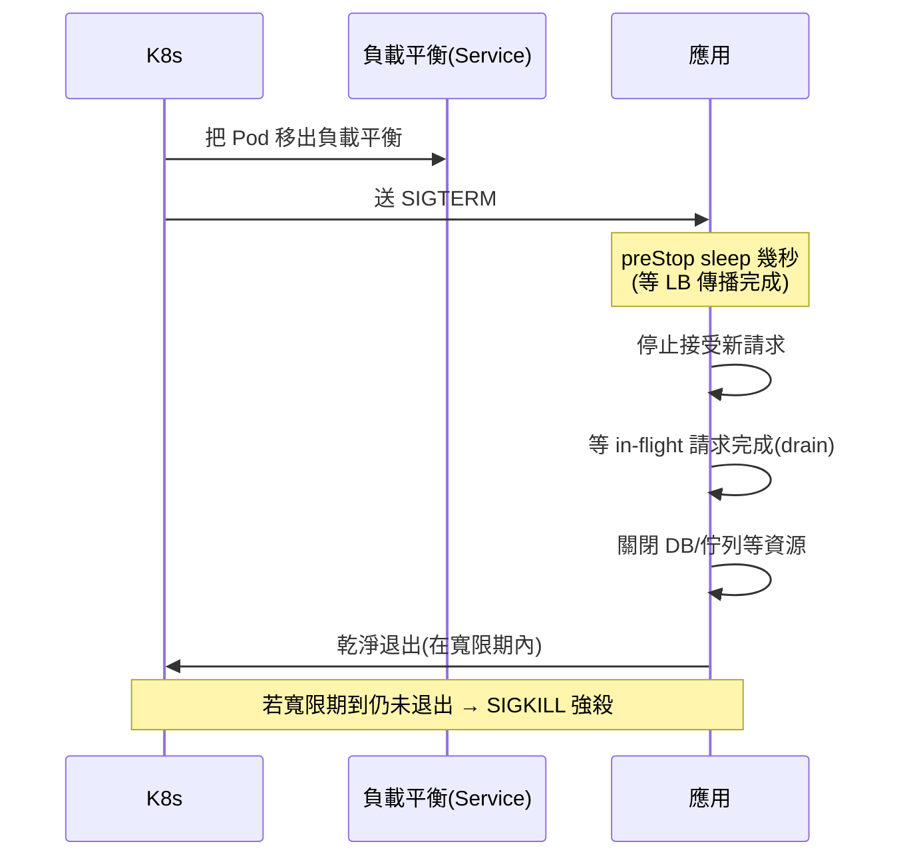

# graceful shutdown

> 部署新版時，K8s 送出訊號要舊容器關閉——如果應用直接死掉，正在處理的請求會被硬生生切斷，使用者看到錯誤、資料可能不一致。**graceful shutdown（優雅關閉）** 讓應用「收到關閉訊號後，先處理完手上的請求、關好資源，再退出」。這章講訊號機制與正確的收尾流程。

## Why（為什麼）

在雲原生環境，容器**經常被關閉**：滾動更新（[K8s](06-kubernetes.md) 逐一替換舊 Pod）、縮容（流量小了殺掉多餘實例）、節點維護、自動擴縮。這是**正常運作**，不是異常。問題在於——**關閉的方式**。

如果應用被關閉時「說死就死」：

- **正在處理的請求被切斷**：使用者的付款請求做到一半、連線突然斷掉，看到 500 錯誤，甚至扣了款沒建立訂單。
- **資源沒關好**：資料庫連線、檔案 handle 沒釋放，可能留下鎖或半完成的交易。
- **背景任務被中斷**：正在寫入的資料、正在發送的訊息戛然而止。

**graceful shutdown** 讓關閉變得優雅：應用收到「請關閉」的訊號後，**停止接受新請求**、**等現有請求處理完**（給一個寬限時間）、**關閉資源**（DB 連線、佇列消費者）、然後才退出。使用者無感、資料一致、資源乾淨。這是 [12-factor](04-12-factor.md) 第 9 條「可拋棄（disposability）」的核心，也是零停機部署的必要條件。這章教你正確實作。

## Theory（理論：訊號與關閉流程）

**訊號（signal）** 是作業系統通知行程的機制。關閉相關的關鍵訊號：

- **`SIGTERM`（terminate）**：**「請優雅地關閉」**——這是 K8s/Docker 關閉容器時**首先**送出的訊號。應用**應該攔截它**，開始收尾流程。這是可以、也應該被處理的。
- **`SIGKILL`（kill）**：**「立刻強制終止」**——**無法被攔截或忽略**，行程當場死亡。K8s 在送出 SIGTERM 後，若應用在**寬限期（grace period，預設 30 秒）** 內還沒退出，才送 SIGKILL 強殺。
- **`SIGINT`（interrupt）**：Ctrl+C，開發時常見，通常也觸發優雅關閉。

**K8s 的關閉流程**（理解這個才知道要做什麼）：

1. K8s 決定關閉一個 Pod（滾動更新/縮容）。
2. 把該 Pod **從 Service 的負載平衡移除**（停止導入新流量）。
3. 送 **SIGTERM** 給容器的主行程。
4. 應用收到 SIGTERM → **開始優雅關閉**：停收新請求、等現有請求完成、關資源。
5. 應用退出（在寬限期內）→ 完成。
6. 若寬限期到了還沒退出 → 送 **SIGKILL** 強殺。

**應用要做的**：**攔截 SIGTERM**，執行「排空（drain）」——不再接新請求、等 in-flight 請求跑完、關閉連線，然後乾淨退出。關鍵是**要趕在寬限期內完成**。

## Specification（規範：訊號處理）

**攔截訊號**（標準庫 `signal`）：

```python
import signal

def handle_shutdown(signum, frame):
    print(f"收到訊號 {signum}，開始優雅關閉…")
    # 設旗標、觸發收尾
    ...

signal.signal(signal.SIGTERM, handle_shutdown)
signal.signal(signal.SIGINT, handle_shutdown)
```

**asyncio 的優雅關閉**（見 [asyncio](../09-concurrency/README.md)）：

```python
loop = asyncio.get_running_loop()
for sig in (signal.SIGTERM, signal.SIGINT):
    loop.add_signal_handler(sig, shutdown_event.set)
```

**框架/伺服器層級**：Uvicorn/Gunicorn **已內建**優雅關閉——收到 SIGTERM 會停止接受新連線、等現有請求完成（受 `--graceful-timeout` 控制，見 [Gunicorn/Uvicorn](03-gunicorn-uvicorn.md)）。FastAPI 用 **lifespan** 事件做啟動/關閉的資源管理：

```python
from contextlib import asynccontextmanager

@asynccontextmanager
async def lifespan(app):
    db = await connect_db()          # 啟動：開資源
    yield
    await db.close()                 # 關閉：優雅釋放資源
```

**K8s 配合**：

- `terminationGracePeriodSeconds`：寬限期（給應用收尾的時間，預設 30s）。
- `preStop` hook：SIGTERM 前執行的鉤子（常用 `sleep` 幾秒，等負載平衡完全把此 Pod 移出再開始關）。

## Implementation（底層：drain 與寬限期競賽）

**為何「先停收新請求、再等舊請求」**：優雅關閉的本質是**排空（drain）**——像關閉一家店，先鎖上大門不讓新客人進來（停止接受新連線），但讓店內的客人結完帳再走（處理完 in-flight 請求）。若順序反了（還在收新請求就開始關），會一直有新請求進來、永遠排不空。

**「移出負載平衡」與「SIGTERM」的競態**：K8s 把 Pod 移出 Service 和送 SIGTERM 幾乎同時發生，但**負載平衡的更新有傳播延遲**——可能 SIGTERM 已送到、應用開始關，但負載平衡器還在往這個 Pod 送新請求（因為還沒更新完）。這會導致「關閉中的 Pod 收到新請求 → 被拒 → 使用者看到錯誤」。解法：用 **`preStop` hook 睡幾秒**，讓應用在收 SIGTERM 前先等負載平衡完全把自己移出，再開始關——這是生產環境常見的細節。

**寬限期競賽**：從 SIGTERM 到 SIGKILL 只有寬限期（如 30 秒）。應用必須在這段時間內排空完成。若你的請求可能跑很久（超過寬限期），要嘛調大 `terminationGracePeriodSeconds`，要嘛設請求逾時讓長請求有上限——否則寬限期到了會被 SIGKILL 硬砍，前功盡棄。

**exec form 的關鍵**：如前述（見 [Docker](01-docker.md)），`CMD` 必須用 exec form（`["uvicorn", ...]`），否則應用被 shell 包住、收不到 SIGTERM，優雅關閉根本沒機會啟動——直接等 SIGKILL 被硬殺。這是最常見的「我明明寫了 shutdown handler 卻沒作用」的原因。

## Code Example（可執行的 Python 範例）

以下模擬「收到關閉訊號後排空 in-flight 請求」的邏輯（純標準庫，可執行、確定性）：

```python
# graceful_shutdown_demo.py — 排空 in-flight 請求的優雅關閉（純標準庫）
from __future__ import annotations


class Server:
    """模擬一個會排空請求再關閉的伺服器。"""

    def __init__(self) -> None:
        self.accepting = True  # 是否接受新請求
        self.in_flight = 0  # 進行中的請求數
        self.completed = 0
        self.rejected = 0

    def handle_request(self, req_id: int) -> str:
        if not self.accepting:
            self.rejected += 1
            return f"req{req_id}: 已拒絕（關閉中）"
        self.in_flight += 1
        return f"req{req_id}: 處理中"

    def finish_request(self) -> None:
        if self.in_flight > 0:
            self.in_flight -= 1
            self.completed += 1

    def on_sigterm(self) -> None:
        """收到 SIGTERM：先停收新請求（drain 的第一步）。"""
        self.accepting = False
        print("收到 SIGTERM → 停止接受新請求，開始排空")

    def drain_and_shutdown(self) -> bool:
        """等 in-flight 請求全部完成，才算優雅關閉成功。"""
        while self.in_flight > 0:
            self.finish_request()  # 模擬現有請求陸續完成
        print(f"排空完成：完成 {self.completed} 個、拒絕新請求 {self.rejected} 個")
        return self.in_flight == 0


def main() -> None:
    server = Server()
    # 正常收 3 個請求（都還沒完成）
    for i in range(3):
        print("  " + server.handle_request(i))
    print(f"in-flight = {server.in_flight}")

    # 收到關閉訊號：停收新請求
    server.on_sigterm()

    # 關閉中又來新請求 → 被拒（該由負載平衡移出，這裡示範保護）
    print("  " + server.handle_request(99))

    # 排空現有請求後乾淨退出
    ok = server.drain_and_shutdown()
    print(f"優雅關閉{'成功' if ok else '失敗'}，可安全退出")


if __name__ == "__main__":
    main()
```

**預期輸出**：

```pycon
$ python graceful_shutdown_demo.py
  req0: 處理中
  req1: 處理中
  req2: 處理中
in-flight = 3
收到 SIGTERM → 停止接受新請求，開始排空
  req99: 已拒絕（關閉中）
排空完成：完成 3 個、拒絕新請求 1 個
優雅關閉成功，可安全退出
```

逐段解說：

- **`handle_request`**：只在 `accepting` 時受理；關閉中則拒絕新請求。
- **`on_sigterm`**：收到 SIGTERM 的第一件事是**停止接受新請求**（`accepting = False`）——drain 的第一步，先鎖門。
- **關閉中的新請求（req99）**：被拒絕。實務上負載平衡應已把此 Pod 移出（用 `preStop` sleep 確保），這裡示範應用層的保護。
- **`drain_and_shutdown`**：等所有 in-flight 請求（3 個）完成，才回報成功、安全退出——這保證了「不切斷進行中的請求」。
- **要點**：優雅關閉 = 停收新的 → 排空舊的 → 關資源 → 退出，且要在寬限期內完成。

## Diagram（圖解：K8s 優雅關閉流程）



## Best Practice（最佳實踐）

- **攔截 SIGTERM 觸發優雅關閉**：停收新請求 → 排空 in-flight → 關資源 → 退出。
- **`CMD` 用 exec form**：否則應用收不到 SIGTERM，優雅關閉失效（見 [Docker](01-docker.md)）。
- **善用框架內建**：Uvicorn/Gunicorn 已支援優雅關閉，設好 `--graceful-timeout`；FastAPI 用 lifespan 管資源。
- **用 `preStop` hook 睡幾秒**：等負載平衡把 Pod 完全移出，避免關閉中還收到新請求。
- **確保排空能在寬限期內完成**：調大 `terminationGracePeriodSeconds` 或給請求設逾時。
- **在 lifespan/shutdown 關閉所有資源**：DB 連線池、佇列消費者、背景任務。
- **背景任務要能被取消/等待完成**：別讓長任務被硬砍（見 [asyncio](../09-concurrency/README.md)）。
- **測試優雅關閉**：本機送 SIGTERM 驗證行為，別假設它有效。

## Common Mistakes（常見誤解）

- **`CMD` 用 shell form**：應用被 shell 包住收不到 SIGTERM——「寫了 handler 卻沒反應」的頭號原因。
- **收到 SIGTERM 立刻硬退**：切斷進行中的請求，使用者看到錯誤、資料可能不一致。
- **順序反了：還在收新請求就開始關**：永遠排不空。
- **沒有 preStop 緩衝**：負載平衡還沒移出就開始關，關閉中的 Pod 收到新請求被拒。
- **請求比寬限期還長**：寬限期到被 SIGKILL 硬砍，優雅關閉白做；要設逾時或調大寬限期。
- **忘了關資源**：DB 連線、佇列消費者沒關，留下洩漏或未確認的訊息。
- **以為 SIGKILL 可以攔截**：SIGKILL 無法被捕捉，只能靠在它之前（SIGTERM 寬限期內）收好尾。
- **不測試關閉行為**：假設有效，實際部署才發現請求被切斷。

## Interview Notes（面試重點）

- **能區分 SIGTERM 與 SIGKILL**：前者可攔截、應觸發優雅關閉；後者無法攔截、強制終止。
- **能描述 K8s 的關閉流程**：移出負載平衡 → SIGTERM → 應用排空 → 退出 → （超時才）SIGKILL。
- **能說明優雅關閉的正確順序**：停收新請求 → 排空 in-flight → 關資源 → 退出。
- **知道 exec form 對收訊號的關鍵性**（shell form 收不到 SIGTERM）。
- **知道負載平衡傳播延遲的競態與 `preStop` sleep 的解法**。
- **知道寬限期（terminationGracePeriodSeconds）與長請求逾時的關係**。
- **能連結到 12-factor 可拋棄性與零停機部署**。

---

➡️ 下一章：[可觀測性 logging / metrics / tracing](08-observability.md)

[⬆️ 回 Part 19 索引](README.md)
